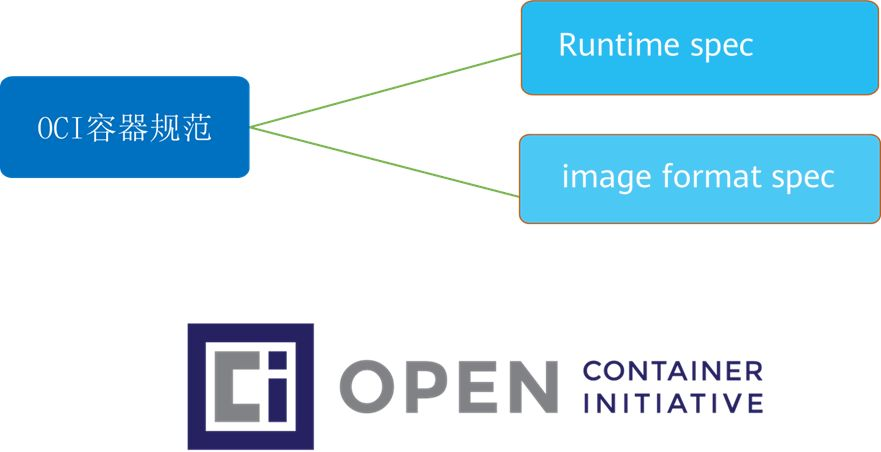

带着疑问学习，在学习之前，

containerd是什么？

containerd是从docker中移植出来的。

github.com/docker/docker/client

containerd 是一个工业级标准的容器运行时，它强调**简单性**、**健壮性**和**可移植性**，适合干以下事情：

- 管理容器的生命周期（从创建容器到销毁容器）

- 拉取/推送容器镜像
- 存储管理（管理镜像及容器数据的存储）
- 调用 runc 运行容器（与 runc 等容器运行时交互）
- 管理容器网络接口及网络

runc是什么？

dockershim是什么？起到什么作用？

containerd-shim作用是什么？

容器运行时标准

容器镜像标准

引入容器管理器

低级容器运行时

​	runc

​	runv

从docker到containerd的转变，是什么样子的？

从k8s的角度看，选择containerd作为运行时的组件，它调用链更短，组件更少，更稳定，占用节点资源更少。

containerd的api是什么样子的？

参考博客链接

https://www.ianlewis.org/en/container-runtimes-part-1-introduction-container-r

https://www.ianlewis.org/en/container-runtimes-part-2-anatomy-low-level-contai

https://www.ianlewis.org/en/container-runtimes-part-3-high-level-runtimes

https://www.ianlewis.org/en/container-runtimes-part-4-kubernetes-container-run