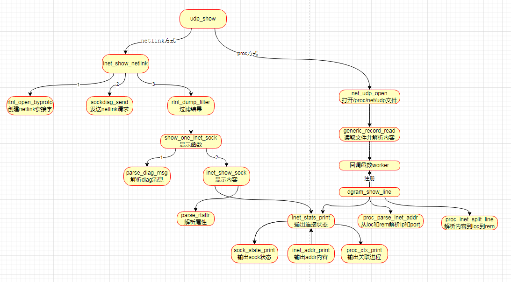

netlink学习资料

https://blog.birost.com/a?ID=00100-608e84ea-20d9-4e17-b1e5-429d0e0026c6


# Linux内核 | Netlink机制分析与使用

https://mp.weixin.qq.com/s?src=11&timestamp=1654913607&ver=3853&signature=4tPT2*DvZVqQK75Neg09g2CCjupsj1eK6qXPUxjyrDvfdPPfVBlOI4gCm8s*c1uwP1RPBm4Dq*YYvaF4MzBlxDLWTj0wRLOA**Nx6ptdF7-MJT1tBVONdEURN9d5QXuW&new=1


https://blog.spoock.com/2019/07/06/ss-learn/


官网代码地址

https://github.com/shemminger/iproute2


以源代码编译后进行gdb调试，已搞定。


# 一、实验内容

服务器

nc -ul 9998


客户端

nc -u 192.168.101.97 9998

然后不断的输入字符串，在服务器的console上会有显示


查看udp连接状态的命令为

```
ss -anup | grep 9998
```

-p: 查看


以上代码我全部gdb过，流程上是绝对保证没问题的。

# 二、ss命令获取udp/tcp连接状态




显示udp状态的入口函数为udp_show

```c

static int udp_show(struct filter *f)
{
	FILE *fp = NULL;

	if (!filter_af_get(f, AF_INET) && !filter_af_get(f, AF_INET6))
		return 0;

	dg_proto = UDP_PROTO;

	//优先采用netlink方式
	if (!getenv("PROC_NET_UDP") && !getenv("PROC_ROOT")
	    && inet_show_netlink(f, NULL, IPPROTO_UDP) == 0)
		return 0;

    //netlink方式失败，才会走下面流程
	//proc文件系统，打开/proc/net/udp文件，解析内容（在连接多时，性能相对netlink比较差）
	if (f->families&FAMILY_MASK(AF_INET)) {
		if ((fp = net_udp_open()) == NULL)
			goto outerr;
		if (generic_record_read(fp, dgram_show_line, f, AF_INET))
			goto outerr;
		fclose(fp);
	}

	return 0;
}
```

获取PROC_NET_UDP和PROC_ROOT环境变量，然后调用inet_show_netlink。当通过netlink方式获取网络链接信息失败时，才会去采用proc文件系统的方式来获取。


## 2、1 netlink方式

netlink方式则调用inet_show_netlink函数，成功则会返回。

```

static int inet_show_netlink(struct filter *f, FILE *dump_fp, int protocol)
{
	int err = 0;
	struct rtnl_handle rth;
	int family = PF_INET;
	struct inet_diag_arg arg = { .f = f, .protocol = protocol };

	//1.重点函数
	if (rtnl_open_byproto(&rth, 0, NETLINK_SOCK_DIAG))
		return -1;

	rth.dump = MAGIC_SEQ;
	rth.dump_fp = dump_fp;

again:
	//2.重点函数
	if ((err = sockdiag_send(family, rth.fd, protocol, f)))
		goto Exit;

	//3.重点函数
	if ((err = rtnl_dump_filter(&rth, show_one_inet_sock, &arg))) {
		if (family != PF_UNSPEC) {
			family = PF_UNSPEC;
			goto again;
		}
		goto Exit;
	}

Exit:
	rtnl_close(&rth);
	if (arg.rth)
		rtnl_close(arg.rth);
	return err;
}
```

主要步骤如下：

1、rtnl_open_byproto根据协议类型创建netlink socket

2、sockdiag_send函数，发送netlink请求

3、rtnl_dump_filter函数，根据过滤器filter来显示消息内容


### 1） rtnl_open_byproto函数

```

int rtnl_open_byproto(struct rtnl_handle *rth, unsigned int subscriptions,
		      int protocol)
{
	socklen_t addr_len;
	int sndbuf = 32768;
	int one = 1;

	memset(rth, 0, sizeof(*rth));

	rth->proto = protocol;
	rth->fd = socket(AF_NETLINK, SOCK_RAW | SOCK_CLOEXEC, protocol);
	if (rth->fd < 0) {
		perror("Cannot open netlink socket");
		return -1;
	}

	//socket的发送缓冲区大小 32768
	if (setsockopt(rth->fd, SOL_SOCKET, SO_SNDBUF,&sndbuf, sizeof(sndbuf)) < 0)

	//socket的接收缓冲区大小 1024 * 1024
	if (setsockopt(rth->fd, SOL_SOCKET, SO_RCVBUF,&rcvbuf, sizeof(rcvbuf)) < 0)

	/* Older kernels may no support extended ACK reporting */
	setsockopt(rth->fd, SOL_NETLINK, NETLINK_EXT_ACK,
		   &one, sizeof(one));

	memset(&rth->local, 0, sizeof(rth->local));
	rth->local.nl_family = AF_NETLINK;
	rth->local.nl_groups = subscriptions; //为NETLINK_SOCK_DIAG

	//绑定操作
	if (bind(rth->fd, (struct sockaddr *)&rth->local, sizeof(rth->local)) < 0)
	
	addr_len = sizeof(rth->local);
	if (getsockname(rth->fd, (struct sockaddr *)&rth->local,
			&addr_len) < 0) {
		perror("Cannot getsockname");
		goto err;
	}
	
	//参数的校验
	if (addr_len != sizeof(rth->local)) {
		fprintf(stderr, "Wrong address length %d\n", addr_len);
		goto err;
	}
	if (rth->local.nl_family != AF_NETLINK) {
		fprintf(stderr, "Wrong address family %d\n",
			rth->local.nl_family);
		goto err;
	}
	rth->seq = time(NULL);
	return 0;
err:
	rtnl_close(rth);
	return -1;
}
```

输出内容赋值给rth指针参数。


### 2） sockdiag_send函数

```

static int sockdiag_send(int family, int fd, int protocol, struct filter *f)
{
	struct sockaddr_nl nladdr = { .nl_family = AF_NETLINK };
	DIAG_REQUEST(req, struct inet_diag_req_v2 r);
	char    *bc = NULL;
	int	bclen;
	__u32	proto;
	struct msghdr msg;
	struct rtattr rta_bc;
	struct rtattr rta_proto;
	struct iovec iov[5];
	int iovlen = 1;

	//构造req请求结构体
	memset(&req.r, 0, sizeof(req.r));
	req.r.sdiag_family = family;
	req.r.sdiag_protocol = protocol;
	req.r.idiag_states = f->states;

	iov[0] = (struct iovec){
		.iov_base = &req,
		.iov_len = sizeof(req)
	};
	
	//构造msg头信息
	msg = (struct msghdr) {
		.msg_name = (void *)&nladdr,
		.msg_namelen = sizeof(nladdr),
		.msg_iov = iov,
		.msg_iovlen = iovlen,
	};

	//发送消息
	if (sendmsg(fd, &msg, 0) < 0) {
		close(fd);
		return -1;
	}

	return 0;
}
```

发送完netlink请求后，大家可能会疑惑返回数据在哪里？

### 3） rtnl_dump_filter过滤函数

返回结构在nlmsghdr结构体变量中，rtnl_dump_filter调用回调函数show_one_inet_sock

```

static int show_one_inet_sock(struct nlmsghdr *h, void *arg)
{
	int err;
	struct inet_diag_arg *diag_arg = arg;
	struct inet_diag_msg *r = NLMSG_DATA(h);
	struct sockstat s = {};
	
	//将netlink消息解析到sockstat变量中
	parse_diag_msg(h, &s);
	s.type = diag_arg->protocol;

	//显示sock信息
	err = inet_show_sock(h, &s);

	return 0;
}
```


继续看下parse_diag_msg函数，将nlmsghdr结构体中内容解析到sockstat结构体变量中

```
static void parse_diag_msg(struct nlmsghdr *nlh, struct sockstat *s)
{
	struct rtattr *tb[INET_DIAG_MAX+1];
	struct inet_diag_msg *r = NLMSG_DATA(nlh);

	parse_rtattr(tb, INET_DIAG_MAX, (struct rtattr *)(r+1),
		     nlh->nlmsg_len - NLMSG_LENGTH(sizeof(*r)));

	s->state	= r->idiag_state;//状态
	s->local.family	= s->remote.family = r->idiag_family;
	s->lport	= ntohs(r->id.idiag_sport);//本地端口
	s->rport	= ntohs(r->id.idiag_dport);//远程端口
	s->wq		= r->idiag_wqueue;
	s->rq		= r->idiag_rqueue;
	s->ino		= r->idiag_inode;
	s->uid		= r->idiag_uid;
	s->iface	= r->id.idiag_if;
	s->sk		= cookie_sk_get(&r->id.idiag_cookie[0]);

	s->mark = 0;

	if (s->local.family == AF_INET)
		s->local.bytelen = s->remote.bytelen = 4;
	else
		s->local.bytelen = s->remote.bytelen = 16;

	//本地地址
	memcpy(s->local.data, r->id.idiag_src, s->local.bytelen);
	//远程地址
	memcpy(s->remote.data, r->id.idiag_dst, s->local.bytelen);
}
```

inet_show_sock函数

```

static int inet_show_sock(struct nlmsghdr *nlh,
			  struct sockstat *s)
{
	struct rtattr *tb[INET_DIAG_MAX+1];
	struct inet_diag_msg *r = NLMSG_DATA(nlh);
	unsigned char v6only = 0;

	parse_rtattr(tb, INET_DIAG_MAX, (struct rtattr *)(r+1),
		     nlh->nlmsg_len - NLMSG_LENGTH(sizeof(*r)));

	if (tb[INET_DIAG_PROTOCOL])
		s->type = rta_getattr_u8(tb[INET_DIAG_PROTOCOL]);

	inet_stats_print(s, v6only);

	sctp_ino = s->ino;

	return 0;
}
```

核心函数为inet_stats_print函数

```
static void inet_stats_print(struct sockstat *s, bool v6only)
{
	//输出sock的状态
	sock_state_print(s);

	//解析addr地址信息
	inet_addr_print(&s->local, s->lport, s->iface, v6only);
	inet_addr_print(&s->remote, s->rport, 0, v6only);

	//网络行为关联的进程
	proc_ctx_print(s);
}
```


inet_addr_print函数

```

static void inet_addr_print(const inet_prefix *a, int port,
			    unsigned int ifindex, bool v6only)
{
	char buf[1024];
	const char *ap = buf;
	const char *ifname = NULL;

	if (a->family == AF_INET) {
		ap = format_host(AF_INET, 4, a->data);
	}

	if (ifindex)
		ifname = ll_index_to_name(ifindex);

	sock_addr_print(ap, ":", resolve_service(port), ifname);
}
```


int整型变量转ip类型

```
const char *format_host(int af, int len, const void *addr)
{
	static char buf[256];

	return format_host_r(af, len, addr, buf, 256);
}
```

比如我的ip是192.168.101.97


## 2、2 读取proc文件

### 1） 打开proc文件(/proc/net/udp)

net_udp_open宏

#define net_udp_open()		generic_proc_open("PROC_NET_UDP", "net/udp")

```
static FILE *generic_proc_open(const char *env, const char *name)
{
	const char *p = getenv(env);
	char store[128];

	if (!p) {
		p = getenv("PROC_ROOT") ? : "/proc";
		snprintf(store, sizeof(store)-1, "%s/%s", p, name);
		p = store;
	}

	return fopen(p, "r");
}
```

其实就是打开/proc/net/udp文件，并返回文件描述符。

### 2） generic_record_read读取文件内容并进行解析

```

static int generic_record_read(FILE *fp,
			       int (*worker)(char*, const struct filter *, int),
			       const struct filter *f, int fam)
{
	char line[256];

	/* skip header */
	if (fgets(line, sizeof(line), fp) == NULL)
		goto outerr;

	//一行行来读取文件，然后调用worker回调函数
	while (fgets(line, sizeof(line), fp) != NULL) {
		int n = strlen(line);

		if (n == 0 || line[n-1] != '\n') {
			errno = -EINVAL;
			return -1;
		}
		line[n-1] = 0;

		if (worker(line, f, fam) < 0)
			return 0;
	}
outerr:

	return ferror(fp) ? -1 : 0;
}
```


### 3） 解析函数dgram_show_line

woker回调函数为dgram_show_line

```

static int dgram_show_line(char *line, const struct filter *f, int family)
{
	struct sockstat s = {};
	char *loc, *rem, *data;
	char opt[256];
	int n;

	//解析出loc和rem
	if (proc_inet_split_line(line, &loc, &rem, &data))
		return -1;

	int state = (data[1] >= 'A') ? (data[1] - 'A' + 10) : (data[1] - '0');

	if (!(f->states & (1 << state)))
		return 0;
		
	//通过loc和rem解析内容到sockstat
	proc_parse_inet_addr(loc, rem, family, &s);

	opt[0] = 0;
	n = sscanf(data, "%x %x:%x %*x:%*x %*x %d %*d %u %d %llx %[^\n]\n",
	       &s.state, &s.wq, &s.rq,
	       &s.uid, &s.ino,
	       &s.refcnt, &s.sk, opt);

	if (n < 9)
		opt[0] = 0;

	s.type = dg_proto == UDP_PROTO ? IPPROTO_UDP : 0;
	inet_stats_print(&s, false);

	if (show_details && opt[0])
		out(" opt:\"%s\"", opt);

	return 0;
}
```


proc_parse_inet_addr 重要

```
static int proc_parse_inet_addr(char *loc, char *rem, int family, struct
		sockstat * s)
{
	s->local.family = s->remote.family = family;
	if (family == AF_INET) {
		sscanf(loc, "%x:%x", s->local.data, (unsigned *)&s->lport);
		sscanf(rem, "%x:%x", s->remote.data, (unsigned *)&s->rport);
		s->local.bytelen = s->remote.bytelen = 4;
		return 0;
	}
	return -1;
}
```


关联知识：

getsockname

https://www.cnblogs.com/zl-graduate/p/5934192.html


sscanf函数

