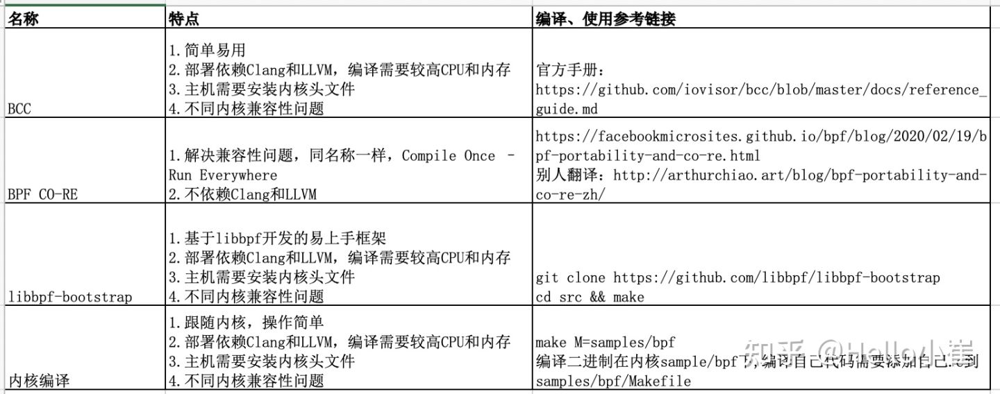

# 一、Golang工程化实践（优先级最高）

多看effective go编程规范

https://go.dev/doc/effective_go

## 1、1 整洁架构设计文档

https://github.com/bxcodec/go-clean-arch

构建在框架之上的业务层是如何组织实现的

## 1、2 并发编程实战（极客时间）

https://time.geekbang.org/column/intro/100061801

## 1、3 Go 语言项目开发实战（极客时间）

https://time.geekbang.org/column/intro/100061801

| 章节 | 名称                                                      | 是否完成 |
| ---- | --------------------------------------------------------- | -------- |
| 1    | IAM系统概述：我们要实现什么样的 Go 项目？                 |          |
| 2    | 环境准备：如何安装和配置一个基本的 Go 开发环境？          |          |
| 3    | 项目部署：如何快速部署 IAM 系统？                         |          |
| 4    | 规范设计（上）：项目开发杂乱无章，如何规范？              |          |
| 5    | 规范设计（下）：commit 信息风格迥异、难以阅读，如何规范？ |          |
| 6    | 目录结构设计：如何组织一个可维护、可扩展的代码目录？      |          |
| 7    | 工作流设计：如何设计合理的多人开发模式？                  |          |
| 8    | 研发流程设计（上）：如何设计Go项目的开发流程？            |          |
| 9    | 研发流程设计（下）：如何管理应用的生命周期？              |          |
| 10   | 设计方法：怎么写出优雅的Go项目？                          |          |
| 11   | 设计模式：Go常用设计模式概述                              |          |
| 12   | API风格（上）：如何设计RESTfulAPI？                       |          |
| 13   | API风格（下）：RPCAPI介绍                                 |          |
| 14   | 项目管理：如何编写高质量的Makefile？                      |          |
| 15   | 研发流程实战：IAM项目是如何进行研发流程管理的？           |          |
| 16   | 代码检查：如何进行静态代码检查？                          |          |
| 17   | API文档：如何生成SwaggerAPI文档？                         |          |
| 18   | 错误处理（上）：如何设计一套科学的错误码？                |          |
| 19   | 错误处理（下）：如何设计错误包？                          |          |
| 20   | 日志处理（上）：如何设计日志包并记录日志？                |          |
| 21   | 日志处理（下）：手把手教你从0编写一个日志包               |          |
| 22   | 应用构建三剑客：Pflag、Viper、Cobra核心功能介绍           |          |
| 23   | 应用构建实战：如何构建一个优秀的企业应用框架？            |          |
|      |                                                           |          |
|      |                                                           |          |

未完待续

## 1、4 Go组件设计和实现(掘金小册)

| 章节 | 名称                                     | 是否完成 |
| ---- | ---------------------------------------- | -------- |
| 1    | **厚积薄发，积累Go组件设计经验**         |          |
| 2    | 网络库基础知识                           |          |
| 3    | Netpoll网络库的详细设计                  |          |
| 4    | 网络库性能优化-poller调度优化            |          |
| 5    | 网络库性能优化-Nocopy LinkBuffer设计优化 |          |
| 6    | Go微服务框架演进的痛点                   |          |
| 7    | Kitex可扩展性设计                        |          |
| 8    | Kitex扩展实践介绍                        |          |
| 9    | GORM诞生的背景和工作原理                 |          |
| 10   | GORM的设计和实现                         |          |
| 11   | 推荐配置与企业级封装与扩展应用           |          |
| 12   | Sonic JSON与JSON的基本知识               |          |
| 13   | Sonic使用介绍和最佳实践                  |          |
| 14   | Sonic的设计和实现                        |          |
| 15   | 高性能JSON的未来规划和展望               |          |

## 1、5 Go工程实践(掘金小册)

| 章节 | 名称                               | 是否完成 |
| ---- | ---------------------------------- | -------- |
| 1    | **摩拳擦掌，攻克Go工程实践难题**   |          |
| 2    | 工程和依赖管理基本机制             |          |
| 3    | 工程和依赖管理中经典案例与剖析     |          |
| 4    | Go代码规范                         |          |
| 5    | Linter实践和实现原理               |          |
| 6    | Go单元测试概念、用法及CI           |          |
| 7    | 团队落地案例分析                   |          |
| 8    | PPof采集性能指标的应用             |          |
| 9    | PPof排查代码中的性能炸弹实践       |          |
| 10   | PPof指标采样的流程和原理           |          |
| 11   | 一次反序列化引起的线上事故归因演练 |          |
| 12   | 业务缓存的基本概念和整体设计思路   |          |
| 13   | 业务缓存基础库选型和回源           |          |

# 二、云安全实战

标黑的地方，代表现在自己正在学习的章节。

## 2、1 kubernetes安全原理与实践（掘金小册）

| 章节 | 名称                                          | 是否完成 |
| ---- | --------------------------------------------- | -------- |
| 1    | **云原生不仅要灵活，更要安全！**              |          |
| 2    | 一切的基础：从Linux的权限和能力模型说起       |          |
| 3    | 容器技术的基石：cgroup如何进行资源限制？      |          |
| 4    | 容器技术的基石：namespace如何提供隔离性保证？ |          |
| 5    | 应用实践：动手实现一个容器环境                |          |
| 6    | 安全防护：容器运行时安全                      |          |
| 7    | 从源头治理：镜像和容器安全                    |          |
| 8    | 更安全的容器：关于安全容器知多少              |          |
| 9    | 权限控制：基于角色的权限控制                  |          |
| 10   | 准入控制：更灵活的安全机制                    |          |
| 11   | 配置安全：如何保护我的私密信息？              |          |
| 12   | 网络安全：如何给服务设置边界？                |          |
| 13   | 资源安全：我的资源还好吗？                    |          |
| 14   | 组件安全：我的Kubernetes集群安全吗？          |          |
| 15   | 运行时安全：谁动了我的Kubernetes？            |          |
| 16   | 追根究底：审计日志的作用                      |          |
| 17   | 应用安全及DevSecOps                           |          |
| 18   | 更多的Kubernetes应用场景及扩展                |          |
| 19   | 一起构建更安全可靠的云原生环境                |          |

## 2、2 #todo 百晓项目开发

要求起码能看懂内核底层收集的数据。

# 三、项目实战，就是干

## 3、1 手写网络协议栈

### 1、 从零实现网络协议栈

分为PartA和PartB两个部分：

**Part A：**

https://www.udemy.com/course/tcpipstack/

**Part B：**

https://www.udemy.com/course/tcpipstack_b/

这是一门 100% 基于 C 语言编码的课程，我们将从头开始开发 TCP/IP 堆栈，其中包含数据链路层、网络层和应用程序层。

这是一个大项目，分为6个小项目。

| 项目名称                                                     | 是否完成 |
| ------------------------------------------------------------ | -------- |
| **Project 1 : Build a MultiNode Topology Emulation of Routers and Switches** | 否       |
| Project 2 : Implement DataLink Layer (L2 routing), including ARP |          |
| Project 3 : Implement L2 Switching (Mac-based Learning and Forwarding) |          |
| Project 4 : Implement Vlan Based Mac learning and Forwarding |          |
| Project 5 : Implement Network Layer (L3 routing)             |          |
| Project 6 : Case Study : Implement IP-Tunnelling (Optional)  |          |

### 2、Let's code a TCP/IP stack

https://www.saminiir.com/lets-code-tcp-ip-stack-1-ethernet-arp/

### 3、DPDK实现网络协议栈（零声学院）

| 章节 | 名称                              | 重要 | 是否完成 |
| ---- | --------------------------------- | ---- | -------- |
| 1    | dpdk网络协议栈之arp/icmp的实现    | 高   |          |
| 2    | dpdk网络协议栈之udp/tcp的实现     | 高   |          |
| 3    | dpdk网络协议栈之tcp的实现         | 高   |          |
| 4    | dpdk基础组件                      | 高   |          |
| 5    | 可扩展的矢量数据包处理框架VPP实战 |      |          |
| 6    | 可扩展的矢量数据包处理框架VPP源码 |      |          |
| 7    | golang的网络开发框架 nff-go       |      |          |
| 8    | 轻量级的switch框架 snabb(lua)     |      |          |
| 9    | 高效磁盘io读写 spdk               |      |          |
| 10   | DPDK的虚拟交换机框架 OVS          |      |          |
| 11   | dpdk源码-内存                     | 高   |          |
| 12   | dpdk源码-协议                     | 高   |          |
| 13   | dpdk源码-虚拟化                   | 高   |          |
| 14   | dpdk源码-cpu                      | 高   |          |
| 15   | dpdk源码-安全                     | 高   |          |

分布式 kv数据库实战项目（付费课程）

在《硬核知识课堂》报名学习的。

# 四、eBPF学习

## 4、1 eBPF学习路线整理

eBPF学习二：eBPF介绍

https://zhuanlan.zhihu.com/p/463705919

eBPF学习二：eBPF编译方法

https://zhuanlan.zhihu.com/p/463706611

这块主要是整理下eBPF的学习路线图。

## 4、2 eBPF核心技术和实战

| 章节 | 名称                                         | 是否完成 |
| ---- | -------------------------------------------- | -------- |
| 1    | **eBPF的发展历程及工作原理**                 | 否       |
| 2    | 先利其器：如何高效学习eBPF？                 |          |
| 3    | 初窥门径：开发并运行你的第一个eBPF程序       |          |
| 4    | 运行原理：eBPF是一个新的虚拟机吗？           |          |
| 5    | 编程接口：eBPF程序是怎么跟内核进行交互的？   |          |
| 6    | 事件触发：各种eBPF程序的触发机制及其应用场景 |          |
| 7    | 内核跟踪(上)：如何查询内核中的跟踪点？       |          |
| 8    | 内核跟踪(下)：开发内核跟踪程序的进阶方法     |          |
| 9    | 用户态跟踪：如何使用eBPF排查应用程序？       |          |
| 10   | 网络跟踪：如何使用eBPF排查网络问题？         |          |
| 11   | 容器安全：如何使用eBPF增强容器安全？         |          |
| 12   | 高性能网络实战(上)：如何开发一个负载均衡器？ |          |
| 13   | 高性能网络实战(下)：如何完善负载均衡器？     |          |
| 14   | 阶段总结：实用eBPF工具及最新开源项目总结     |          |
| 15   | 未来可期：邀你与eBPF共赴一场技术革新之约     |          |

## 4、3 视频教程

1） 高效入门eBPF

https://www.bilibili.com/video/BV1LX4y157Gp?spm_id_from=333.337.search-card.all.click

2） 基于eBPF小工具演示

https://www.bilibili.com/video/BV1W3411W7CY/?spm_id_from=333.788.recommend_more_video.3

3） Linux Tracing System浅析 & eBPF开发经验分享

https://www.bilibili.com/video/BV17t4y1x7kV?spm_id_from=333.337.search-card.all.click

4） 操作系统与Linux内核 & eBPF演示学习 - 直播回放

https://www.bilibili.com/video/BV1vL4y1G7R2/?spm_id_from=333.788.recommend_more_video.4

参考链接：

https://time.geekbang.org/column/article/f818a00f2b3ec62921ac1b38dda65fdc/share?code=t60UqNtGaVvf9cuDYtSdHj10IFzJzGRuUlhth-3k-Mo%3D&source=app_share