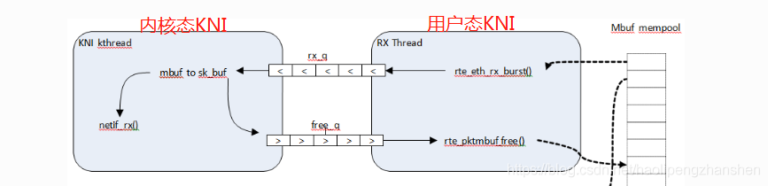

#dpdk/kni
#todo kni

misc设备是什么？
iova模式是什么？不太懂

不管在用户态还是内核态，如何申请连续的物理内存呢？


 学习kni前，首先问自己四个问题

- kni是什么？
- 使用kni能解决什么问题？使用场景？优缺点？
- 走读dpdk kni example例子，有哪些相关api？
- 探究dpdk kni原理剖析？


kni_init

rte_kni_alloc 对应RTE_KNI_IOCTL_CREATE

rte_kni_release 对应RTE_KNI_IOCTL_RELEASE


5个ring是什么关系

tx ring

rx ring

alloc ring

free ring

request ring

kni_run_thread

rte_kni_rx_burst 函数底层逻辑

rte_kni_tx_burst 函数底层逻辑

lcore：logic core逻辑核心


# 一、KNI

**KNI全称：**Kernel NIC Interface，内核网卡接口，允许用户态程序访问linux控制平面。

在DPDK报文处理中，有些报文需要发送到内核协议栈进行处理，如GTP-C控制报文

如果报文数量较少，可以使用内核提供的TAP/TUN设备，但是鉴于这种设备使用的系统调用的方式，还涉及到`copy_to_user()`和`copy_from_user()`的开销，因此，提供了KNI接口用于改善用户态和内核态间报文的处理效率。


**kni的功能也是分为用户态KNI和内核态KNI两部分的**

**用户态的KNI代码在lib\librte_kni目录下**

**内核态的KNI代码在kernel/linux/kni目录下**


# 二、使用KNI的优势

比 Linux TUN/TAP interfaces的操作快(通过取消系统调用`copy_to_user()/copy_from_user()`)。

可使用Linux标准网络工具ethtool, ifconfig和tcpdump管理DPDK端口。

允许端口使用内核网络协议栈。


# 三、kni例子分析

## 3、1 加载kni内核模块

小伙伴们可能疑问，这里的single和multiple模式是什么意思

参考官网链接：https://doc.dpdk.org/guides/prog_guide/kernel_nic_interface.html

在加载kni模块时，可以设置它的内核线程模式

```shell
insmod kmod/rte_kni.ko kthread_mode=single
insmod kmod/rte_kni.ko kthread_mode=multiple
```

**single模式**：只在内核侧创建一个内核线程，来接收所有kni设备上的数据包，一个线程 vs 所有kni设备

**multiple模式**：每个kni接口创建一个内核线程，用来接收数据包，一个线程 vs 一个kni设备

dpdk在加载kni模块时，默认是采用的single模式，同时还可以为此内核线程设置cpu亲和性


例子程序位于examples/kni目录

## 3、1 初始化流程

```
main(int argc, char** argv)
{
	/* eal初始化 */
	ret = rte_eal_init(argc, argv);

	/* 创建mbuf内存池*/
	pktmbuf_pool = rte_pktmbuf_pool_create("mbuf_pool", NB_MBUF,
		MEMPOOL_CACHE_SZ, 0, MBUF_DATA_SZ, rte_socket_id());

	/* 初始化KNI子系统*/
	init_kni();

	/* 初始化端口port，并调用kni_alloc */
	RTE_ETH_FOREACH_DEV(port) {
		init_port(port);//初始化端口
		kni_alloc(port);//kni申请资源
	}

	/* Launch per-lcore function on every lcore */
	// 每个lcore逻辑核心上运行一个函数main_loop,CALL_MASTER表示在master core上运行
	rte_eal_mp_remote_launch(main_loop, NULL, CALL_MASTER);

	/* 释放资源 */
	RTE_ETH_FOREACH_DEV(port) {
		kni_free_kni(port);
	}
	return 0;
}
```

其中重要的是

init_kni函数中仅仅调用rte_kni_init。DPDK在初始化阶段会调用rte_kni_init，打开kni设备。

```
rte_kni_init(unsigned int max_kni_ifaces __rte_unused)
{
	if (rte_eal_iova_mode() != RTE_IOVA_PA) {
		RTE_LOG(ERR, KNI, "KNI requires IOVA as PA\n");
		return -1;
	}

	/* Check FD and open */
	if (kni_fd < 0) {
		kni_fd = open("/dev/" KNI_DEVICE, O_RDWR);//打开/dev/kni设备
	}

	return 0;
}
```


kni_alloc主要调用了rte_kni_alloc函数

```
struct rte_kni_conf {
	/*
	 * KNI name which will be used in relevant network device.
	 * Let the name as short as possible, as it will be part of
	 * memzone name.
	 */
	char name[RTE_KNI_NAMESIZE];
	uint32_t core_id;   /* Core ID to bind kernel thread on */
	uint16_t group_id;  /* Group ID */
	unsigned mbuf_size; /* mbuf size */
	struct rte_pci_addr addr; /* depreciated */
	struct rte_pci_id id; /* depreciated */

	__extension__
	uint8_t force_bind : 1; /* Flag to bind kernel thread */
	uint8_t mac_addr[RTE_ETHER_ADDR_LEN]; /* MAC address assigned to KNI */
	uint16_t mtu;
};

```


kni_free_kni

这三个函数


## 3.2 主逻辑函数main_loop

定位到main_loop逻辑处理函数

```cpp
static int
main_loop(__rte_unused void *arg)
{
	uint16_t i;
	int32_t f_stop;
	const unsigned lcore_id = rte_lcore_id();
	enum lcore_rxtx {
		LCORE_NONE,
		LCORE_RX,
		LCORE_TX,
		LCORE_MAX
	};
	enum lcore_rxtx flag = LCORE_NONE;

    //遍历设备列表，判断当前的lcore逻辑核心是负责rx还是tx
	RTE_ETH_FOREACH_DEV(i) {
		if (kni_port_params_array[i]->lcore_rx == (uint8_t)lcore_id) {
			flag = LCORE_RX;
			break;
		} else if (kni_port_params_array[i]->lcore_tx == lcore_id) {
			flag = LCORE_TX;
			break;
		}
	}

    //如果是接收数据，则循环调用kni_ingress，直到f_stop被设置为true跳出循环
	if (flag == LCORE_RX) {
		while (1) {
			kni_ingress(kni_port_params_array[i]);
		}
	} 
    //如果是发送数据，则循环调用kni_egress，直到f_stop被设置为true跳出循环
    else if (flag == LCORE_TX) {
		while (1) {
			kni_egress(kni_port_params_array[i]);
		}
	}

	return 0;
}
```


步骤如下：

获取配置，判断当前lcore是负责rx还是tx

如果lcore负责rx，则死循环调用接口`kni_ingress`进行报文的收取。

如果lcore负责tx，则死循环调用接口`kni_egress`进行报文的发送。

因为一个lcore只能负责一个死循环，所以最好给rx和tx都分配一个lcore去执行，不然容易出问题


## 3.2 通过KNI网口发送数据包给内核协议栈

疑惑1：数据如何从dpdk网口通过KNI网口发送给内核协议栈？

```cpp
/**
 * Interface to burst rx and enqueue mbufs into rx_q
 */
static void
kni_ingress(struct kni_port_params *p)
{
	uint8_t i;
	uint16_t port_id;
	unsigned nb_rx, num;
	uint32_t nb_kni;
	struct rte_mbuf *pkts_burst[PKT_BURST_SZ];

	if (p == NULL)
		return;

	nb_kni = p->nb_kni;
	port_id = p->port_id;
	for (i = 0; i < nb_kni; i++) {
		/* Burst rx from eth */
		nb_rx = rte_eth_rx_burst(port_id, 0, pkts_burst, PKT_BURST_SZ);
		if (unlikely(nb_rx > PKT_BURST_SZ)) {
			RTE_LOG(ERR, APP, "Error receiving from eth\n");
			return;
		}
		/* Burst tx to kni */
		num = rte_kni_tx_burst(p->kni[i], pkts_burst, nb_rx);
		kni_stats[port_id].rx_packets += num;

		rte_kni_handle_request(p->kni[i]);
		if (unlikely(num < nb_rx)) {
			/* Free mbufs not tx to kni interface */
			kni_burst_free_mbufs(&pkts_burst[num], nb_rx - num);
			kni_stats[port_id].rx_dropped += nb_rx - num;
		}
	}
}
```


nb_rx = rte_eth_rx_burst(port_id, 0, pkts_burst, PKT_BURST_SZ);

从dpdk网口批量读取数据到mbuf数组中，示例中是pkts_burst


# 四、KNI原理剖析

发送数据 TODO

接收数据 TODO


**用户态KNI处理流程**

num = rte_kni_tx_burst(p->kni[i], pkts_burst, nb_rx);

将pkts_burst中的mbuf报文批量发送给kni接口

```
unsigned
rte_kni_tx_burst(struct rte_kni *kni, struct rte_mbuf **mbufs, unsigned num)
{
	void *phy_mbufs[num];
	unsigned int ret;
	unsigned int i;
    //记住这里传递的都是指向mbuf的指针

    //指向mubuf的地址是虚拟地址，将虚拟地址全部转为物理地址
	for (i = 0; i < num; i++)
		phy_mbufs[i] = va2pa(mbufs[i]);

    //将物理地址投递到kni->rx_q队列上
	ret = kni_fifo_put(kni->rx_q, phy_mbufs, num);

	/* Get mbufs from free_q and then free them */
	kni_free_mbufs(kni);

	return ret;
}
```


```cpp
static void
kni_free_mbufs(struct rte_kni *kni)
{
	int i, ret;
	struct rte_mbuf *pkts[MAX_MBUF_BURST_NUM];

	ret = kni_fifo_get(kni->free_q, (void **)pkts, MAX_MBUF_BURST_NUM);
	if (likely(ret > 0)) {
		for (i = 0; i < ret; i++)
			rte_pktmbuf_free(pkts[i]);
	}
}
```


 kni_free_mbufs函数从kni->free_q队列上获取要释放的元素，然后调用rte_pktmbuf_free函数进行释放内存资源

如果有点懵逼的话，我们来看图说话

编辑

在用户态KNI做了两件事
 1.将mbuf投递到kni->rx_q接收队列上

2.批量从kni->free_q队列上取元素，将内存归还给内存池


**内核态KNI处理流程**

我们已经将数据mbuf投递到kni->rx_q队列中，那么谁来将kni->rx_q队列上的数据写入内核网络协议栈上呢？

kni_ioctl -> kni_ioctl_create 

在kni_ioctl_create函数中会创建struct kni_dev结构体变量，并给它的成员赋值

```
   kni = netdev_priv(net_dev);

   kni->net_dev = net_dev;
   kni->group_id = dev_info.group_id;
   kni->core_id = dev_info.core_id;
   strncpy(kni->name, dev_info.name, RTE_KNI_NAMESIZE);

   /* Translate user space info into kernel space info */
   kni->tx_q = phys_to_virt(dev_info.tx_phys);
   kni->rx_q = phys_to_virt(dev_info.rx_phys);
   kni->alloc_q = phys_to_virt(dev_info.alloc_phys);
   kni->free_q = phys_to_virt(dev_info.free_phys);

   kni->req_q = phys_to_virt(dev_info.req_phys);
   kni->resp_q = phys_to_virt(dev_info.resp_phys);
   kni->sync_va = dev_info.sync_va;
   kni->sync_kva = phys_to_virt(dev_info.sync_phys);

   kni->mbuf_size = dev_info.mbuf_size;
```

然后调用ret = kni_run_thread(knet, kni, dev_info.force_bind);


**kni_run_thread是内核态要开启内核线程来接收所有kni设备上的数据**

kni_run_thread函数如下

```cpp
static int
kni_run_thread(struct kni_net *knet, struct kni_dev *kni, uint8_t force_bind)
{
	/**
	 * Create a new kernel thread for multiple mode, set its core affinity,
	 * and finally wake it up.
	 */
	if (multiple_kthread_on) {
		kni->pthread = kthread_create(kni_thread_multiple,
			(void *)kni, "kni_%s", kni->name);
		if (IS_ERR(kni->pthread)) {
			kni_dev_remove(kni);
			return -ECANCELED;
		}

		if (force_bind)
			kthread_bind(kni->pthread, kni->core_id);
		wake_up_process(kni->pthread);
	} else {
        //加mutex锁
		mutex_lock(&knet->kni_kthread_lock);

		if (knet->kni_kthread == NULL) {
            //创建内核线程
			knet->kni_kthread = kthread_create(kni_thread_single,
				(void *)knet, "kni_single");
			if (IS_ERR(knet->kni_kthread)) {
				mutex_unlock(&knet->kni_kthread_lock);
				kni_dev_remove(kni);
				return -ECANCELED;
			}
            
            //设置内核线程的亲和性
			if (force_bind)
				kthread_bind(knet->kni_kthread, kni->core_id);
            //唤醒内核线程
			wake_up_process(knet->kni_kthread);
		}
        
        //解mutex锁
		mutex_unlock(&knet->kni_kthread_lock);
	}

	return 0;
}
```


kni_thread_single线程函数

```cpp
static int
kni_thread_single(void *data)
{
	struct kni_net *knet = data;
	int j;
	struct kni_dev *dev;

	while (!kthread_should_stop()) {
		down_read(&knet->kni_list_lock);
		for (j = 0; j < KNI_RX_LOOP_NUM; j++) {
			list_for_each_entry(dev, &knet->kni_list_head, list) {
                //调用kni_net_rx将数据发往内核
				kni_net_rx(dev);
				kni_net_poll_resp(dev);
			}
		}
		up_read(&knet->kni_list_lock);
#ifdef RTE_KNI_PREEMPT_DEFAULT
		/* reschedule out for a while */
		schedule_timeout_interruptible(
			usecs_to_jiffies(KNI_KTHREAD_RESCHEDULE_INTERVAL));
#endif
	}

	return 0;
}
```


 转到kni_net_rx函数

```
/* rx interface */
void
kni_net_rx(struct kni_dev *kni)
{
	/**
	 * It doesn't need to check if it is NULL pointer,
	 * as it has a default value
	 */
	(*kni_net_rx_func)(kni);
}
```


 内部调用回调函数kni_net_rx_func

/* kni rx function pointer, with default to normal rx */
 static kni_net_rx_t kni_net_rx_func = kni_net_rx_normal;

默认情况下kni_net_rx_func回调函数注册为kni_net_rx_normal

```cpp
/*
 * RX: normal working mode
 */
static void
kni_net_rx_normal(struct kni_dev *kni)
{
	uint32_t ret;
	uint32_t len;
	uint32_t i, num_rx, num_fq;
	struct rte_kni_mbuf *kva;
	void *data_kva;
	struct sk_buff *skb;
	struct net_device *dev = kni->net_dev;

	/* Get the number of free entries in free_q */
    /*获取kni->free_q队列上有无空闲位置，如果已满则丢弃数据包*/
	num_fq = kni_fifo_free_count(kni->free_q);
	if (num_fq == 0) {
		/* No room on the free_q, bail out */
		return;
	}

	/* Calculate the number of entries to dequeue from rx_q */
	num_rx = min_t(uint32_t, num_fq, MBUF_BURST_SZ);

	/* Burst dequeue from rx_q */
    /* 从kni->rx_q中弹出元素*/
	num_rx = kni_fifo_get(kni->rx_q, kni->pa, num_rx);
	if (num_rx == 0)
		return;

	/* Transfer received packets to netif */
	for (i = 0; i < num_rx; i++) {
		kva = pa2kva(kni->pa[i]);
		len = kva->pkt_len;
		data_kva = kva2data_kva(kva);
		kni->va[i] = pa2va(kni->pa[i], kva);

        /* 从内存申请skb */
		skb = dev_alloc_skb(len + 2);
		if (!skb) {
			/* Update statistics */
			kni->stats.rx_dropped++;
			continue;
		}

		/* Align IP on 16B boundary */
		skb_reserve(skb, 2);

        /* 如果只有一个mbuf segment段，则直接拷贝，如果是多个segment段，则分批拷贝*/
		if (kva->nb_segs == 1) {
			memcpy(skb_put(skb, len), data_kva, len);
		} else {
			int nb_segs;
			int kva_nb_segs = kva->nb_segs;

			for (nb_segs = 0; nb_segs < kva_nb_segs; nb_segs++) {
				memcpy(skb_put(skb, kva->data_len),
					data_kva, kva->data_len);

				if (!kva->next)
					break;

				kva = pa2kva(va2pa(kva->next, kva));
				data_kva = kva2data_kva(kva);
			}
		}

        /*skb结构体的赋值*/
		skb->dev = dev;
		skb->protocol = eth_type_trans(skb, dev);
		skb->ip_summed = CHECKSUM_UNNECESSARY;

		/* Call netif interface 重点*/
		netif_rx_ni(skb);

		/* Update statistics */
		kni->stats.rx_bytes += len;
		kni->stats.rx_packets++;
	}

	/* Burst enqueue mbufs into free_q */
    /*将使用后的mbuf指针加入到kni->free_q队列中，等待用户态KNI来进行释放*/
	ret = kni_fifo_put(kni->free_q, kni->va, num_rx);
	if (ret != num_rx)
		/* Failing should not happen */
		pr_err("Fail to enqueue entries into free_q\n");
}
```


流程如下

1.从kni->free_q队列上获取空闲位置为num_fq，队列已满，则丢弃该数据包

2.从kni->rx_q上取得num_rx个元素

3.内核申请skb，将mbuf指针指向的数据内容拷贝到skb中，并对skb结构体成员进行赋值操作

4.调用netif_rx_ni将skb传递到内核网络协议栈中

5.将使用后的kni->va投递到kni->free_q队列中，等待用户态KNI进行释放


而最前面的`rte_kni_handle_request是什么作用呢？`

`rte_kni_handle_request`从`kni->req_q`拿到request，然后根据修改mtu或者设置接口的命令做相应的操作，最后将response放回`kni->resp_q`。


## 3.3 kni_egress函数

```
kni_egress(struct kni_port_params *p)
{
	uint8_t i;
	uint16_t port_id;
	unsigned nb_tx, num;
	uint32_t nb_kni;
	struct rte_mbuf *pkts_burst[PKT_BURST_SZ];//存放数据包mbuf

	nb_kni = p->nb_kni;
	port_id = p->port_id;
	for (i = 0; i < nb_kni; i++) {
		/* Burst rx from kni 从kni接口批量接收*/
		num = rte_kni_rx_burst(p->kni[i], pkts_burst, PKT_BURST_SZ);

		/* Burst tx to eth 批量发送到dpdk接口*/
		nb_tx = rte_eth_tx_burst(port_id, 0, pkts_burst, (uint16_t)num);
	}
}
```


kni_egress函数中调用rte_kni_rx_burst从KNI网口中批量读取数据包，然后调用rte_eth_tx_burst批量发送给dpdk网口

```cpp
unsigned
rte_kni_rx_burst(struct rte_kni *kni, struct rte_mbuf **mbufs, unsigned num)
{
	unsigned ret = kni_fifo_get(kni->tx_q, (void **)mbufs, num);

	/* If buffers removed, allocate mbufs and then put them into alloc_q */
	if (ret)
		kni_allocate_mbufs(kni);

	return ret;
}
```


从kni->tx_q队列取元素到mbufs指向的数组中，如果能够取到元素，则调用kni_allocate_mbufs

```cpp
static void
kni_allocate_mbufs(struct rte_kni *kni)
{
	int i, ret;
	struct rte_mbuf *pkts[MAX_MBUF_BURST_NUM];
	void *phys[MAX_MBUF_BURST_NUM];
	int allocq_free;

	RTE_BUILD_BUG_ON(offsetof(struct rte_mbuf, pool) !=
			 offsetof(struct rte_kni_mbuf, pool));
	RTE_BUILD_BUG_ON(offsetof(struct rte_mbuf, buf_addr) !=
			 offsetof(struct rte_kni_mbuf, buf_addr));
	RTE_BUILD_BUG_ON(offsetof(struct rte_mbuf, next) !=
			 offsetof(struct rte_kni_mbuf, next));
	RTE_BUILD_BUG_ON(offsetof(struct rte_mbuf, data_off) !=
			 offsetof(struct rte_kni_mbuf, data_off));
	RTE_BUILD_BUG_ON(offsetof(struct rte_mbuf, data_len) !=
			 offsetof(struct rte_kni_mbuf, data_len));
	RTE_BUILD_BUG_ON(offsetof(struct rte_mbuf, pkt_len) !=
			 offsetof(struct rte_kni_mbuf, pkt_len));
	RTE_BUILD_BUG_ON(offsetof(struct rte_mbuf, ol_flags) !=
			 offsetof(struct rte_kni_mbuf, ol_flags));

	/* Check if pktmbuf pool has been configured */
	/*检测kni->pktmbuf_pool是否已经配置*/
	if (kni->pktmbuf_pool == NULL) {
		RTE_LOG(ERR, KNI, "No valid mempool for allocating mbufs\n");
		return;
	}

	//判断kni->alloc_q队列上还需要申请多少内存资源
	allocq_free = (kni->alloc_q->read - kni->alloc_q->write - 1) \
			& (MAX_MBUF_BURST_NUM - 1);
	for (i = 0; i < allocq_free; i++) {
		/*从内存池申请内存资源*/
		pkts[i] = rte_pktmbuf_alloc(kni->pktmbuf_pool);
		if (unlikely(pkts[i] == NULL)) {
			/* Out of memory */
			RTE_LOG(ERR, KNI, "Out of memory\n");
			break;
		}
		//申请到的内存是虚拟地址，将其转换为物理地址，内核才能进行操作
		phys[i] = va2pa(pkts[i]);
	}

	/* No pkt mbuf allocated */
	if (i <= 0)
		return;

	//将申请的内存投递到kni->alloc_q队列中
	ret = kni_fifo_put(kni->alloc_q, phys, i);

	/* Check if any mbufs not put into alloc_q, and then free them */
	if (ret >= 0 && ret < i && ret < MAX_MBUF_BURST_NUM) {
		int j;

		for (j = ret; j < i; j++)
			rte_pktmbuf_free(pkts[j]);
	}
}
```


上面是从kni->tx_q队列取数据，那么谁王kni->tx_q投递数据呢？

net_device_ops结构体的ndo_start_xmit回调函数注册为kni_net_tx

```cpp
static int
kni_net_tx(struct sk_buff *skb, struct net_device *dev)
{
	//检测tx_q队列中空闲位置，和alloc_q队列中的元素
	if (kni_fifo_free_count(kni->tx_q) == 0 ||
			kni_fifo_count(kni->alloc_q) == 0) {
		/**
		 * If no free entry in tx_q or no entry in alloc_q,
		 * drops skb and goes out.
		 */
		goto drop;
	}

	/* dequeue a mbuf from alloc_q */
	/* 从alloc_q队列取出一个mbuf到pkt_pa*/
	ret = kni_fifo_get(kni->alloc_q, &pkt_pa, 1);
	if (likely(ret == 1)) {
		void *data_kva;

		pkt_kva = pa2kva(pkt_pa);
		data_kva = kva2data_kva(pkt_kva);
		pkt_va = pa2va(pkt_pa, pkt_kva);

		/*skb -> mbuf*/
		len = skb->len;
		memcpy(data_kva, skb->data, len);
		if (unlikely(len < ETH_ZLEN)) {
			memset(data_kva + len, 0, ETH_ZLEN - len);
			len = ETH_ZLEN;
		}
		pkt_kva->pkt_len = len;
		pkt_kva->data_len = len;

		/* enqueue mbuf into tx_q */
		ret = kni_fifo_put(kni->tx_q, &pkt_va, 1);
		if (unlikely(ret != 1)) {
			/* Failing should not happen */
			pr_err("Fail to enqueue mbuf into tx_q\n");
			goto drop;
		}
	} else {
		/* Failing should not happen */
		pr_err("Fail to dequeue mbuf from alloc_q\n");
		goto drop;
	}

	/* Free skb and update statistics */
	dev_kfree_skb(skb);
	kni->stats.tx_bytes += len;
	kni->stats.tx_packets++;

	return NETDEV_TX_OK;

drop:
	/* Free skb and update statistics */
	dev_kfree_skb(skb);
	kni->stats.tx_dropped++;

	return NETDEV_TX_OK;
}
```


# 五、参考链接

https://cloud.tencent.com/developer/article/1418603