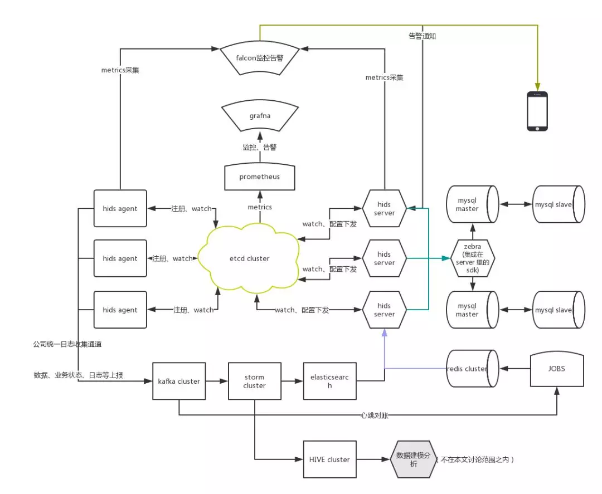

# 一、需求分析

为了方便描述功能，将功能模块划分为server端和agent端

## 1、1 agent端亟待解决的问题

迫切需要解决的问题，也是我们需要赶紧做的。

### 1、如何保证客户端的id唯一性呢？

答：采用Txn分布式事务API配合Compare API来确定主机上线的Key唯一性。（已写demo进行验证，分布式唯一性id）

### 2、agent上线

### 3、agent正常下线

### 4、agent异常下线

技术上：异常下线，会有1/3的keepalive时间延迟。

还有以下优点：

## 1、2 server端亟待解决的问题

1、server和agent之间通信的数据种类有哪些呢？

server端下发的数据有以下几种：

1、任务

2、配置变更

3、策略（或规则）

2、agent客户端异常下线，server如何感知到呢？

Lease租约机制，过期Key释放，更好的感知主机信息。

1、3 配置下发

- Watch机制来实现配置变更下发，任务下发的实时获取机制。
- Key存储的数据结构支持范围性的Key操作。
- User、Role权限设定不同读写权限，来控制Key操作，避免其他客户端修改其他Key的信息。
- TLS来保证通道信息传递安全。
- Lease租约机制，过期Key释放，更好的感知主机下线信息。
- Txn分布式事务API配合Compare API来确定主机上线的Key唯一性。

# 二、架构设计

## 2、1 总体架构图

数据上报通道

server端和agent端是分为控制面和数据面的

控制面功能

数据面功能

​	数据上报

​	文件上传等等

## 2、2 通信方案

etcd + arpc 的通信方案，这种方案是什么样的应用场景。

server是属于整合数据的地方，数据整合以后，如何进行分析呢？关联分析。

对于实时性要求低的业务，流程如下：

1、agent客户端监听etcd的某些key是否变化

2、server将key对应数据写入etcd数据库中

3、agent会收到数据变更通知，然后读取key对应的数值

对于实时性要求很高的业务，流程如下：

1、server和agent客户端之间建立网络连接的通道

2、server通过arpc通道发下任务、配置变更、策略等数据到agent客户端

3、agent收到数据后，根据数据类型的不同，解析成对应的详情数据

支持加密通信

加密通信的概念是为何

好好的看完一个文章是这么难吗

参考链接

美团

https://tech.meituan.com/2019/01/17/distributed-hids-cluster-architecture-design.html

腾讯