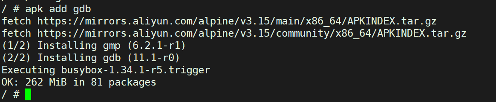

一、agent调试

默认模式下，agent的自保护模式会kill掉可疑进程，包括进入容器后常输入的一些命令。

**dlv监听的命令**

dlv --headless=true --listen=:2345 --api-version=2 --accept-multiclient exec /usr/local/bin/agent -- -j 192.168.101.97

agent是否可以单独部署，dp是否可以单步部署？其他组件是否可以单独部署呢？

注意：agent和controller单独部署时，不能部署在同一台机器上。

拷贝容器内文件系统到本地

docker cp allinone_5.0.0:/usr/local/bin  /root/neuvector_5.0.0/bin

alpine系统安装gdb调试dp

采用国内阿里云的源，文件内容为：

https://mirrors.aliyun.com/alpine/v3.6/main/

https://mirrors.aliyun.com/alpine/v3.6/community/

命令：

sed -i 's/dl-cdn.alpinelinux.org/mirrors.aliyun.com/g' /etc/apk/repositories

安装go语言环境
go install github.com/go-delve/delve/cmd/dlv@v1.7.3

是/bin/sh不是/bin/bash
两者之间的区别是什么？

docker exec -it allinone /bin/sh

https://github.com/vishvananda/netlink 

neuvector单机调试
netlink还是需要好好的熟悉下。

二、dp调试环境搭建

dp和agent在allinone模式下，都是在谷歌的alpine操作系统中进行运行的。