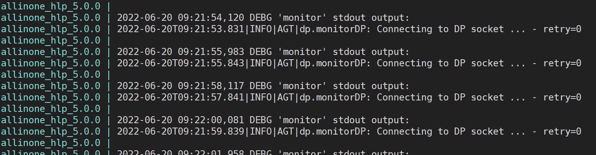

准备工作：

```
docker cp allinone_5.0.0:/usr/local/bin /root/neuvector_5.0.0/bin
```

将容器中的

# 一、远程调试agent

默认模式下，agent的自保护模式会检测dp的健康状态，不健康则会kill掉dp进程，

Neuvector的enforcer容器中默认会处于NVProtect模式，用户进入容器后输入一些敏感命令，也会导致进程被杀。所以想用dlv来调试agent，或者启动gdb或gdbserver来调试dp，则必须保证其进程不会被Neuvector杀掉。


## 1、1 重新编译agent

编译参数修改
go build -gcflags='-N -l'


对agent代码进行修改，删除所有调用syscall.Kill的代码片段。

涉及到的文件有：

### 1） agent删除调用syscall.Kill


### 2） agent删除对dp的健康检查

在agent的cbKeepAlive函数。


### 3）monitor删除对dp监控

删除monitor中监控dp的代码，并注释掉stop_proc(PROC_DP, SIGSEGV, false);函数


neuvector/allinone:haolp_5.0.0

|ERRO|AGT|dp.dpSendMsgExSilent: Read error - error=read unixgram /tmp/dp_client.23546->/tmp/dp_listen.sock: i/o timeout


allinone_haolp_5.0.0 | 2022-06-21T10:17:43.917|ERRO|AGT|dp.dpSendMsgExSilent: Data path not connected

是报的连接通道的异常错误吗？


为啥一直在报这个错误呢？#todo


# 二、远程调试dp

2、1 步骤


下面是远程 GDB/LLDB 调试步骤的简要说明。

1、准备带有调试信息的二进制文件。

在远程 LLDB 的情况下，调试器不会自动下载任何调试符号或系统库，因此它们应该存在于本地机器上。

对于从 macOS 到 Linux 或从 Linux 到 macOS 的跨平台调试，请使用通过 musl（或替代方案）进行的交叉编译，它将与所需的库一起提供。

2、确保将二进制文件放到远程机器上，并将符号文件放在本地机器上

由于Remote Debug配置不会同步您的文件，因此您需要跟踪二进制文件或符号文件，并在有更改时**手动同步**它们。


3、在Clion中，创建Remote Debug配置。


4、在远程机器上使用gdbserver/lldb-server启动程序


5、返回clion，开始您在步骤 3 中创建的调试配置。

是/bin/sh不是/bin/bash
两者之间的区别是什么？



```
gdbserver --attach localhost:1234 16924
```


# 三、镜像定制化推送和保存

## 1、go语言环境


从宿主机映射go安装包路径到容器中，并通过环境变量修改容器中**PATH,GOPATH,GO111MODULE,GOPROXY**

golang采用的版本是go version go1.14.15 linux/amd64

volumes挂载

```
- /usr/local/go:/usr/local/go
```


## 2、安装dlv(调试agent)

进入容器命令

docker exec -it allinone_hlp_5.0.0 /bin/sh

其中allinone_hlp_5.0.0 是容器的名称。


go get github.com/go-delve/delve/cmd/dlv@v1.6.1

如果此种方式安装dlv失败，可从github.com/go-delve/delve下载源代码进行go install安装

之所以采用1.6.1版本的dlv，是为了更好的搭配1.14.15版本的golang。


## 3、更换alpine系统源为阿里源

采用国内阿里云的源，文件内容为：

https://mirrors.aliyun.com/alpine/v3.6/main/

https://mirrors.aliyun.com/alpine/v3.6/community/

执行命令如下：

```bash
sed -i 's/dl-cdn.alpinelinux.org/mirrors.aliyun.com/g' /etc/apk/repositories
```


## 4、安装vim，gdb, whereis命令

**alpine系统安装vim**

```
apk add vim
```


**alpine系统安装gdb(调试dp)**


```
apk add gdb
```


**alpine安装whereis命令**

```bash
apk add --update util-linux
```


## 5、推送镜像到dockerhub

登录自己的dockerhub。#todo

docker tag neuvector/allinone:haolp_5.0.0 haolipeng/neuvector/allinone:debug_5.0.0

docker push haolipeng/neuvector/allinone:debug_5.0.0


agent是否可以单独部署，dp是否可以单步部署？其他组件是否可以单独部署呢？

注意：agent和controller单独部署时，不能部署在同一台机器上。


# 四、启动docker-compose脚本

## 1、准备待调试文件

**备份容器中文件到宿主机本地**

将容器中Neuvector相关文件拷贝到宿主机本地目录，将编译好的文件替换相应的文件，比如替换agent和dp可执行文件。


**拷贝容器内文件系统到本地**

docker cp allinone_5.0.0:/usr/local/bin  /root/neuvector_5.0.0/bin


## 2、dlv方式来启动agent进程

修改agent的makefile中编译参数为

dlv --headless=true --listen=:2345 --api-version=2 --accept-multiclient exec /usr/local/bin/agent -- -j 192.168.101.97


## 3、配置Goland IDE

在remote debug configuration中设置dlv的端口，然后就可以开始调试了。


## 4、gdb或gdbserver方式来启动dp进程

allinone容器启动Neuvector的方式是，利用supervisor来启动monitor进程，


## 5、配置clion IDE


https://github.com/vishvananda/netlink
netlink还是需要好好的熟悉下。linux上很多的命令和工具都是采用netlink来实现的。