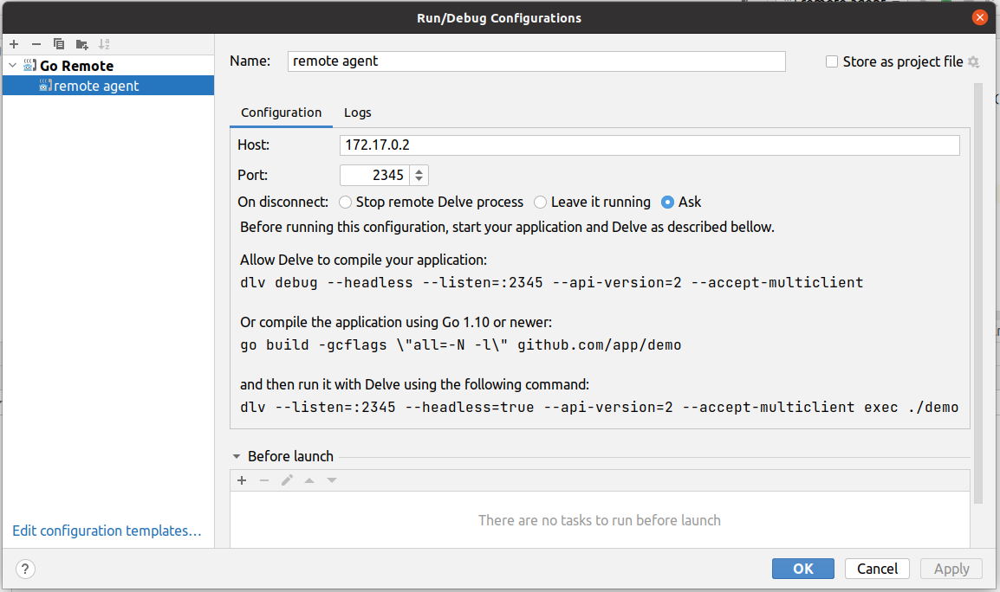
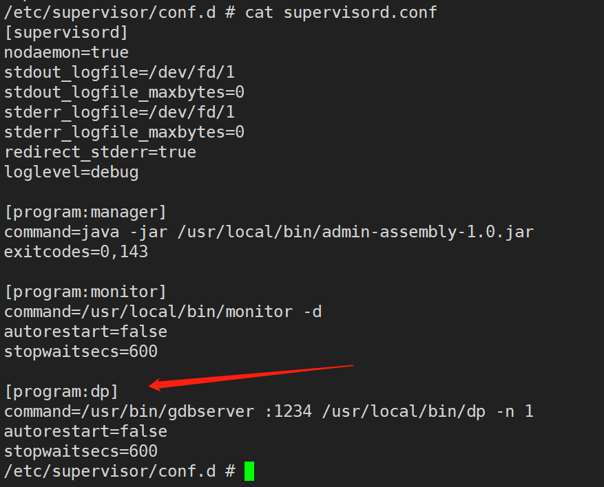

准备工作：

```
docker cp allinone_5.0.0:/usr/local/bin /root/neuvector_5.0.0/bin
```

将allinone容器启动。


```shell
kubectl create clusterrole neuvector-binding-app --verb=get,list,watch,update --resource=nodes,pods,services,namespaces
kubectl create clusterrole neuvector-binding-rbac --verb=get,list,watch --resource=rolebindings.rbac.authorization.k8s.io,roles.rbac.authorization.k8s.io,clusterrolebindings.rbac.authorization.k8s.io,clusterroles.rbac.authorization.k8s.io
kubectl create clusterrolebinding neuvector-binding-app --clusterrole=neuvector-binding-app --serviceaccount=neuvector:default
kubectl create clusterrolebinding neuvector-binding-rbac --clusterrole=neuvector-binding-rbac --serviceaccount=neuvector:default
kubectl create clusterrole neuvector-binding-admission --verb=get,list,watch,create,update,delete --resource=validatingwebhookconfigurations,mutatingwebhookconfigurations
kubectl create clusterrolebinding neuvector-binding-admission --clusterrole=neuvector-binding-admission --serviceaccount=neuvector:default
kubectl create clusterrole neuvector-binding-customresourcedefinition --verb=watch,create,get,update --resource=customresourcedefinitions
kubectl create clusterrolebinding  neuvector-binding-customresourcedefinition --clusterrole=neuvector-binding-customresourcedefinition --serviceaccount=neuvector:default
kubectl create clusterrole neuvector-binding-nvsecurityrules --verb=list,delete --resource=nvsecurityrules,nvclustersecurityrules
kubectl create clusterrolebinding neuvector-binding-nvsecurityrules --clusterrole=neuvector-binding-nvsecurityrules --serviceaccount=neuvector:default
kubectl create clusterrolebinding neuvector-binding-view --clusterrole=view --serviceaccount=neuvector:default
kubectl create rolebinding neuvector-admin --clusterrole=admin --serviceaccount=neuvector:default -n neuvector
kubectl create clusterrole neuvector-binding-nvwafsecurityrules --verb=list,delete --resource=nvwafsecurityrules
kubectl create clusterrolebinding neuvector-binding-nvwafsecurityrules --clusterrole=neuvector-binding-nvwafsecurityrules --serviceaccount=neuvector:default
kubectl create clusterrole neuvector-binding-nvadmissioncontrolsecurityrules --verb=list,delete --resource=nvadmissioncontrolsecurityrules
kubectl create clusterrolebinding neuvector-binding-nvadmissioncontrolsecurityrules --clusterrole=neuvector-binding-nvadmissioncontrolsecurityrules --serviceaccount=neuvector:default
kubectl create clusterrole neuvector-binding-nvdlpsecurityrules --verb=list,delete --resource=nvdlpsecurityrules
kubectl create clusterrolebinding neuvector-binding-nvdlpsecurityrules --clusterrole=neuvector-binding-nvdlpsecurityrules --serviceaccount=neuvector:default
```

注意事项：

 neuvector.yaml 文件中指定的 nodeport 服务，将在所有 kubernetes 节点打开一个随机端口，作为 NeuVector 管理 Web 控制台端口。


# 一、远程调试agent

默认模式下，agent的自保护模式会检测dp的健康状态，不健康则会kill掉dp进程，

Neuvector的enforcer容器中默认会处于NVProtect模式，用户进入容器后输入一些敏感命令，也会导致进程被杀。所以想用dlv来调试agent，或者启动gdb或gdbserver来调试dp，则必须保证其进程不会被Neuvector杀掉。


## 1、1 重新编译agent

对agent代码进行修改，删除所有调用syscall.Kill的代码片段。涉及的文件如下：

### 1） agent删除调用syscall.Kill


具体的代码修改，参见git的提交记录。

### 2） agent删除对dp的健康检查

在agent的cbKeepAlive函数，直接在函数的开始处返回true，标明检查一直是成功的。


### 3）monitor删除对dp监控

将PROC_DP变量所在的代码行删除。（删除的行对应的程序，monitor不会自启动）

删除monitor中监控dp的代码，并注释掉stop_proc(PROC_DP, SIGSEGV, false);函数


### 4）修改go构建标志gcflags

**修改agent的makefile中编译参数为 go build -gcflags='-N -l'**

然后重新执行make命令。


## 1、2 dlv启动agent和controller

**agent的命令行参数如下：**

```
/usr/local/bin/agent -c
```


**dlv调试命令如下：**

```shell
dlv --headless=true --listen=:2345 --api-version=2 --accept-multiclient exec /usr/local/bin/agent -- -c
```

-c 选项是Coexist controller and ranger，默认情况下，agent也是这么启动的。


**dlv attach命令如下：**

```
dlv attach 12306 --headless --listen=:2345 --api-version=2 --accept-multiclient
```

其中12306是agent程序的pid。

备注：和上面的dlv命令相比，dlv attach命令无需额外添加 -c命令行参数，因为agent启动时已经添加了参数。


## 1、3 配置Goland IDE

在remote debug configuration中设置dlv的端口，然后就可以开始调试了。




neuvector/allinone:haolp_5.0.0

|ERRO|AGT|dp.dpSendMsgExSilent: Read error - error=read unixgram /tmp/dp_client.23546->/tmp/dp_listen.sock: i/o timeout


allinone_haolp_5.0.0 | 2022-06-21T10:17:43.917|ERRO|AGT|dp.dpSendMsgExSilent: Data path not connected

是报的连接通道的异常错误吗？


为啥一直在报这个错误呢？#todo


# 二、远程调试dp

## 2、1 步骤


下面是远程 GDB/LLDB 调试步骤的简要说明。

1、准备带有调试信息的二进制文件。

在远程 LLDB 的情况下，调试器不会自动下载任何调试符号或系统库，因此它们应该存在于本地机器上。

对于从 macOS 到 Linux 或从 Linux 到 macOS 的跨平台调试，请使用通过 musl（或替代方案）进行的交叉编译，它将与所需的库一起提供。

2、确保将二进制文件放到远程机器上，并将符号文件放在本地机器上

由于Remote Debug配置不会同步您的文件，因此您需要跟踪二进制文件或符号文件，并在有更改时**手动同步**它们。


3、在Clion中，创建Remote Debug配置。


4、在远程机器上使用gdbserver/lldb-server启动程序


5、返回clion，开始您在步骤 3 中创建的调试配置。

是/bin/sh不是/bin/bash
两者之间的区别是什么？


```
gdbserver --attach localhost:1234 16924
```


# 三、镜像定制化推送和保存

## 1、go语言环境


从宿主机映射go安装包路径到容器中，并通过环境变量修改容器中**PATH,GOPATH,GO111MODULE,GOPROXY**

golang采用的版本是go version go1.14.15 linux/amd64

volumes挂载

```
- /usr/local/go:/usr/local/go
```


## 2、安装dlv(调试agent)

进入容器命令

docker exec -it allinone_hlp_5.0.0 /bin/sh

其中allinone_hlp_5.0.0 是容器的名称。


go get github.com/go-delve/delve/cmd/dlv@v1.6.1

如果此种方式安装dlv失败，可从github.com/go-delve/delve下载源代码进行go install安装

之所以采用1.6.1版本的dlv，是为了更好的搭配1.14.15版本的golang。


## 3、更换alpine系统源为阿里源

采用国内阿里云的源，文件内容为：

https://mirrors.aliyun.com/alpine/v3.6/main/

https://mirrors.aliyun.com/alpine/v3.6/community/

执行命令如下：

```bash
sed -i 's/dl-cdn.alpinelinux.org/mirrors.aliyun.com/g' /etc/apk/repositories
```


## 4、安装vim，gdb, whereis命令

**alpine系统安装vim**

```
apk add vim
```


**alpine系统安装gdb(调试dp)**

```
apk add gdb
```


**alpine安装whereis命令**

```bash
apk add --update util-linux
```


## 5、推送镜像到dockerhub

登录自己的dockerhub。#todo

docker tag neuvector/allinone:haolp_5.0.0 haolipeng/neuvector/allinone:debug_5.0.0

docker push haolipeng/neuvector/allinone:debug_5.0.0


agent是否可以单独部署，dp是否可以单步部署？其他组件是否可以单独部署呢？

注意：agent和controller单独部署时，不能部署在同一台机器上。


# 四、启动docker-compose脚本

## 1、准备待调试文件

**备份容器中文件到宿主机本地**

将容器中Neuvector相关文件拷贝到宿主机本地目录，将编译好的文件替换相应的文件，比如替换agent和dp可执行文件。


**拷贝容器内文件系统到本地**

docker cp allinone_5.0.0:/usr/local/bin  /root/neuvector_5.0.0/bin


## 3、gdb或gdbserver方式来启动dp进程

allinone容器启动Neuvector的方式是，利用supervisor来启动monitor进程，




## 4、配置clion IDE

https://github.com/vishvananda/netlink
netlink还是需要好好的熟悉下。linux上很多的命令和工具都是采用netlink来实现的。


修改/etc/profile的内容，用于调试。

# 五、远程调试controller

**在ubuntu下编译的controller可以在alpine系统中运行；**

**在centos下编译的controller可以在alpine系统中运行不起来；**


**controller的命令行参数如下：**

```
/ # ps -ef | grep "/usr/local"
root       26003   25951 15 06:35 ?        00:00:07 java -jar /usr/local/bin/admin-assembly-1.0.jar
root       26004   25951  0 06:35 ?        00:00:00 /usr/local/bin/monitor -d
root       26017   26004  2 06:35 ?        00:00:01 /usr/local/bin/controller -j 10.240.19.222
root       26018   26004  4 06:35 ?        00:00:01 /usr/local/bin/dp -n 1
root       26019   26004 12 06:35 ?        00:00:06 /usr/local/bin/agent -c
root       26085   26017  3 06:35 ?        00:00:01 /usr/local/bin/consul agent -datacenter neuvector -data-dir /tmp/neuvector -server -bootstrap -config-file /tmp/consul.json -bind 172.17.0.2 -advertise 10.240.19.222 -node 10.240.19.222 -node-id 805d2ee2-e8d8-eb7a-164d-08c83916a840 -raft-protocol 3
```

疑惑：最后一行consul的启动和controller是否有关。

**dlv调试命令如下：**

```
dlv --headless=true --listen=:2345 --api-version=2 --accept-multiclient exec /usr/local/bin/controller -- -j 10.240.19.222
```


**疑问点：consul程序是controller连带启动的吗？**

从上述角度来说，调试时采用dlv还能更好点。


# 六、Helm部署

helm install neuvector --namespace neuvector neuvector/core  --set registry=docker.io  --set tag=5.0.0-preview.1 --set=controller.image.repository=neuvector/controller.preview -- set=enforcer.image.repository=neuvector/enforcer.preview --set  manager.image.repository=neuvector/manager.preview --set  cve.scanner.image.repository=neuvector/scanner.preview --set cve.updater.image.repository=neuvector/updater.preview


```
Get the NeuVector URL by running these commands:
  NODE_PORT=$(kubectl get --namespace neuvector -o jsonpath="{.spec.ports[0].nodePort}" services neuvector-service-webui)
  NODE_IP=$(kubectl get nodes --namespace neuvector -o jsonpath="{.items[0].status.addresses[0].address}")
  echo https://$NODE_IP:$NODE_PORT
```


参考链接

https://github.com/neuvector/neuvector-helm

# 


