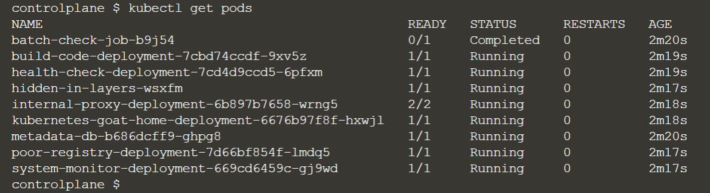

将一些重点的操作图片进行截图。




#### What is docker-security-checker?

docker-security-checker scenario uses OPA (open policy agent) rego rules to perform security liniting on `Dockerfiles` using conftest.

使用conftest对Dockerfile执行安全限制

## What is Conftest?

Conftest is a utility to help you write tests against structured configuration data. For instance you could write tests for your Kubernetes configurations, or Tekton pipeline definitions, Terraform code, Serverless configs or any other structured data.

Conftest relies on the Rego language from Open Policy Agent for writing the assertions. You can read more about Rego in How do I write policies in the Open Policy Agent documentation.

## What is OPA?

The Open Policy Agent (OPA, pronounced “oh-pa”) is an open source, general-purpose policy engine that unifies policy enforcement across the stack. OPA provides a high-level declarative language that let's you specify policy as code and simple APIs to offload policy decision-making from your software.

下载实验材料

git clone https://github.com/madhuakula/docker-security-checker.git


执行conftest test Dockerfile命令

```shell
$ conftest test Dockerfile 
WARN - Dockerfile - Do not use latest tag with image: ["ubuntu:latest"]
FAIL - Dockerfile - Suspicious ENV key found: ["SECRET", "AKIGG23244GN2344GHG"]
FAIL - Dockerfile - Use COPY instead of ADD: app /app
FAIL - Dockerfile - Use COPY instead of ADD: code /tmp/code
FAIL - Dockerfile - Avoid using 'sudo' command: sudo apt-get udpate
--------------------------------------------------------------------------------
PASS: 0/5
WARN: 1/5
FAIL: 4/5
```

第四步

通过docker-security-checker/policy/security.rego，看OPA repo的策略。

- Now you can see the below sample rego policy for using COPY instead of ADD in Dockerfile

```
deny[msg] {
    input[i].Cmd == "add"
    val := concat(" ", input[i].Value)
    msg = sprintf("Use COPY instead of ADD: %s", [val])
}
```


参考链接https://www.conftest.dev/


实验三 kubernetes-network-security-boundaries

Step 2 of 6

## Welcome to Kubernetes Network Security Boundaries

kubernetes网络安全边界

### https://github.com/madhuakula/kubernetes-network-security-boundaries

```
cd kubernetes-network-security-boundaries/

获取所有pod的状态
kubectl get pods -A
NAMESPACE     NAME                                       READY   STATUS    RESTARTS   AGE
kube-system   coredns-66bff467f8-wj6lp                   1/1     Running   0          88s
kube-system   coredns-66bff467f8-xcp58                   1/1     Running   0          88s
kube-system   etcd-controlplane                          1/1     Running   0          96s
kube-system   katacoda-cloud-provider-7557c6c877-lpgk5   1/1     Running   0          88s
kube-system   kube-apiserver-controlplane                1/1     Running   0          96s
kube-system   kube-controller-manager-controlplane       1/1     Running   0          96s
kube-system   kube-flannel-ds-amd64-6v7bk                1/1     Running   0          87s
kube-system   kube-flannel-ds-amd64-wbhmp                1/1     Running   0          74s
kube-system   kube-keepalived-vip-fj249                  1/1     Running   0          54s
kube-system   kube-proxy-5844c                           1/1     Running   0          74s
kube-system   kube-proxy-dspwh                           1/1     Running   0          87s
kube-system   kube-scheduler-controlplane                1/1     Running   0          96s
```


Step 2 of 6

#### No NSP by Default K8S

# No NSP by default in Kubernetes

By default, Kubernetes has a flat networking schema, which means any pod/service within the cluster can talk to other without any restrictions. The namespaces within the cluster don't have any network security restrictions by default, anyone in the namespace can talk to other namespaces.

集群内的命令空间默认没有任何网络安全限制。

## Deploying simple services into Kubernetes

We are going to deploy two different services (cache-db and count-app) and different namespaces.

- Run the following command to deploy the `cache-db` service in `cache-db-ns` namespace

```
kubectl apply -f sample-services/manifests/cache.yaml
```

- Run the following command to deploy the `count-app` service in `count-app-ns` namespace

```
kubectl apply -f sample-services/manifests/count.yaml
```

- Check if the pods are running

```
kubectl get pods -A
```

- Run the following command to expose the count application locally

```
kubectl -n count-app-ns port-forward service/count-app-service --address 0.0.0.0 3000:3000 > /dev/null 2>&1 &
```

- Access the application in the custom-port `3000`

    访问自定义端口3000的应用程序。

## Gaining access to the `cache-db` service from `default` namespace

从默认命名空间访问cache-db服务

- Run the hacker-container in `default` namespace

```
kubectl run -it hacker-container --image=madhuakula/hacker-container -- sh
```

- As we already know the `cache-db-service` name and namespace `cache-db-ns` we can use the below command to connect to cache-db

```bash
redis-cli -h cache-db-service.cache-db-ns
KEYS *
```

> NOTE: Due to no default NSP (network security policy) in Kubernetes, we can access the different service in different namespace from the default namespace from `hacker-container`.


Step 3 of 6

#### Monitoring using Cilium Hubble

# Monitoring using Cilium Hubble

Hubble is a fully distributed networking and security observability platform. It is built on top of Cilium and eBPF to enable deep visibility into the communication and behavior of services as well as the networking infrastructure in a completely transparent manner.

只有花费足够多的时间，才可能把事情做好。

More details: https://github.com/cilium/hubble

- First, let's deploy the Cilium network plugin into Kubernetes

```
kubectl create -f https://raw.githubusercontent.com/cilium/cilium/v1.9/install/kubernetes/quick-install.yaml
```

- It might take sometime to get all the pods running, so let's wait and watch

```
kubectl -n kube-system get pods --watch
```

- Let's deploy Cilium Hubble now

```
export CILIUM_NAMESPACE=kube-system
kubectl apply -f https://raw.githubusercontent.com/cilium/cilium/v1.9/install/kubernetes/quick-hubble-install.yaml
```

- Again check for the pods running status

```
kubectl -n kube-system get pods --watch
```

- We can expose the hubble and monitor the traffic using UI

```
kubectl port-forward -n $CILIUM_NAMESPACE svc/hubble-ui --address 0.0.0.0 --address :: 12000:80 > /dev/null 2>&1 &
```

- Navigate to the custom port `12000` and check the traffic and flow in the dashboard

> Even we can use the local binary to interact and talk to Cilium hubble

```bash
export CILIUM_NAMESPACE=kube-system
kubectl port-forward -n $CILIUM_NAMESPACE svc/hubble-relay --address 0.0.0.0 --address :: 4245:80 > /dev/null 2>&1 &
hubble --server localhost:4245 status
```

参考资料
https://github.com/madhuakula/kubernetes-goat