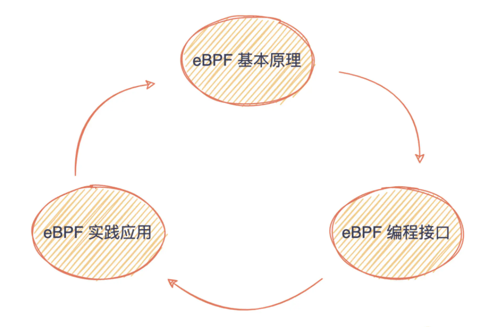

# 一、eBPF学习

## 1、1 eBPF学习路线整理

eBPF学习二：eBPF介绍

https://zhuanlan.zhihu.com/p/463705919

eBPF学习二：eBPF编译方法

https://zhuanlan.zhihu.com/p/463706611

这块主要是整理下eBPF的学习路线图。

## 1、2 eBPF核心技术和实战

| 章节 | 名称                                         | 是否完成 |
| ---- | -------------------------------------------- | -------- |
| 1    | **eBPF的发展历程及工作原理**                 | 否       |
| 2    | 先利其器：如何高效学习eBPF？                 |          |
| 3    | 初窥门径：开发并运行你的第一个eBPF程序       |          |
| 4    | 运行原理：eBPF是一个新的虚拟机吗？           |          |
| 5    | 编程接口：eBPF程序是怎么跟内核进行交互的？   |          |
| 6    | 事件触发：各种eBPF程序的触发机制及其应用场景 |          |
| 7    | 内核跟踪(上)：如何查询内核中的跟踪点？       |          |
| 8    | 内核跟踪(下)：开发内核跟踪程序的进阶方法     |          |
| 9    | 用户态跟踪：如何使用eBPF排查应用程序？       |          |
| 10   | 网络跟踪：如何使用eBPF排查网络问题？         |          |
| 11   | 容器安全：如何使用eBPF增强容器安全？         |          |
| 12   | 高性能网络实战(上)：如何开发一个负载均衡器？ |          |
| 13   | 高性能网络实战(下)：如何完善负载均衡器？     |          |
| 14   | 阶段总结：实用eBPF工具及最新开源项目总结     |          |
| 15   | 未来可期：邀你与eBPF共赴一场技术革新之约     |          |
|      |                                              |          |

学习笔记在这里

学习ebpf最快的方法就是理解原理的同时，配合大量的实践。

ebpf的开发和执行过程分为5步

## 1、3 视频教程

1） 高效入门eBPF

https://www.bilibili.com/video/BV1LX4y157Gp?spm_id_from=333.337.search-card.all.click

2） 基于eBPF小工具演示

https://www.bilibili.com/video/BV1W3411W7CY/?spm_id_from=333.788.recommend_more_video.3

3） Linux Tracing System浅析 & eBPF开发经验分享

https://www.bilibili.com/video/BV17t4y1x7kV?spm_id_from=333.337.search-card.all.click

4） 操作系统与Linux内核 & eBPF演示学习 - 直播回放

https://www.bilibili.com/video/BV1vL4y1G7R2/?spm_id_from=333.788.recommend_more_video.4

参考链接：

https://time.geekbang.org/column/article/f818a00f2b3ec62921ac1b38dda65fdc/share?code=t60UqNtGaVvf9cuDYtSdHj10IFzJzGRuUlhth-3k-Mo%3D&source=app_share