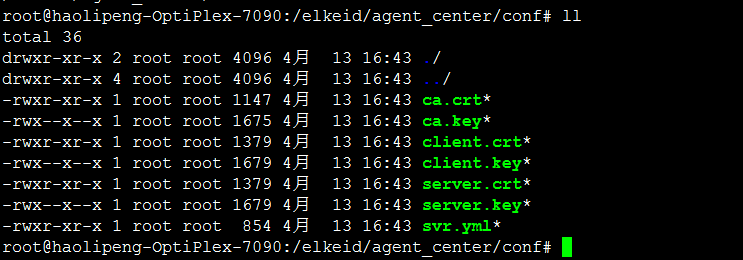
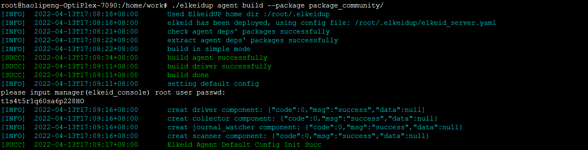
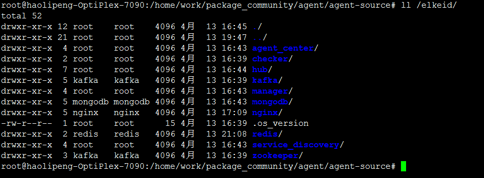
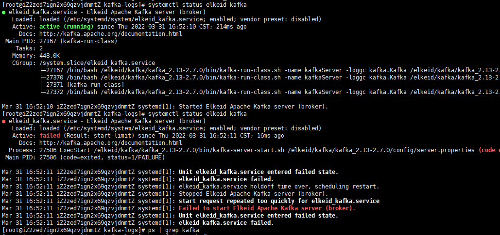

Elkied单机部署文档

进行单机部署，有利于更好的理解各个组件。

本人环境

| 操作系统 | Ubuntu 20.04      |
| -------- | ----------------- |
| 内核版本 | 5.13.0-35-generic |
| go版本   | 1.18              |
| ip地址   | 192.168.101.97    |

你在部署时，需将ip替换成自己的ip地址。


# 一、配置ssh免密登录

## 1、生成密钥

```
ssh-keygen -t rsa
```


执行上面的命令时，我们直接按三次回车，之后会在用户的根目录下生成一个 .ssh 的文件夹，我们进入该文件夹下面并查看有哪些内容。


我们看到有三个文件，下面分别解释下每个文件是干什么用的。

id_rsa: 生成的私钥文件

id_rsa.pub: 生成的公钥文件

known_hosts: 已知的主机公钥清单

## 2、拷贝密钥

```shell
scp -p ~/.ssh/id_rsa.pub root@:/root/.ssh/authorized_keys
```

以上步骤，我们就完成了免密钥登录.


# 二、下载安装包和部署脚本

## 1、下载部署脚本elkeidup

```
wget https://github.com/bytedance/Elkeid/releases/download/v1.7/elkeidup
chmod a+x ./elkeidup
```


## 2、下载package_community安装包

```
wget https://github.com/bytedance/Elkeid/releases/download/v1.7/package_community.tar.gz
tar -zxf package_community.tar.gz
```

这个脚本下载的比较慢，大家耐心等待下，可以开启下梯子啥的各种办法。


## 3、修改脚本（重要！）

修改agent_center的install.sh脚本，在其末尾处添加sleep 60s


修改mongodb的install.sh脚本，在其末尾处添加sleep 80s


初始化配置并替换ip为本机ip

```
#生成默认的配置文件
./elkeidup init


#由于是单机部署，所以将elkeid_server.yaml中的ip替换成127.0.0.1
sed 's/10.225.117.18/127.0.0.1/g' elkeid_server.yaml >> elkeid_server.yaml
```


## 4、开始部署

```
#执行部署命令
root@haolipeng-OptiPlex-7090:/home/work#./elkeidup deploy --package package_community/ --config ./elkeid_server.yaml

[INFO]	2022-04-13T16:39:11+08:00	Used ElkeidUP home dir :/root/.elkeidup
[INFO]	2022-04-13T16:39:11+08:00	use config file: ./elkeid_server.yaml
[INFO]	2022-04-13T16:39:11+08:00	Start to check the Checker configuration
[SUCC]	2022-04-13T16:39:11+08:00	The Checker pass the test.
[INFO]	2022-04-13T16:39:11+08:00	Start to check the Redis configuration
[INFO]	2022-04-13T16:39:12+08:00	create random redis password: bndlk8q9447tm3745h
[SUCC]	2022-04-13T16:39:14+08:00	The Redis pass the test.
[INFO]	2022-04-13T16:39:14+08:00	Start to check the Kafka configuration
[SUCC]	2022-04-13T16:39:14+08:00	The Kafka pass the test.
[INFO]	2022-04-13T16:39:14+08:00	Start to check the Mongodb configuration
[SUCC]	2022-04-13T16:39:14+08:00	The Mongodb pass the test.
[INFO]	2022-04-13T16:39:14+08:00	Start to check the Service Discovery configuration
[SUCC]	2022-04-13T16:39:14+08:00	The Service Discovery pass the test.
[INFO]	2022-04-13T16:39:14+08:00	Start to check the Manager configuration
[SUCC]	2022-04-13T16:39:14+08:00	The Manager pass the test.
[INFO]	2022-04-13T16:39:14+08:00	Start to check the Agent Center configuration
[SUCC]	2022-04-13T16:39:14+08:00	The Agent Center pass the test.
[INFO]	2022-04-13T16:39:14+08:00	Start to check the HUB configuration
[SUCC]	2022-04-13T16:39:14+08:00	The HUB pass the test.
[INFO]	2022-04-13T16:39:14+08:00	Start to check the Nginx configuration
[SUCC]	2022-04-13T16:39:14+08:00	The Nginx pass the test.
[INFO]	2022-04-13T16:39:14+08:00	Start to prepare the Checker extra configuration
[SUCC]	2022-04-13T16:39:14+08:00	The Checker pass the test.
[INFO]	2022-04-13T16:39:14+08:00	Start to prepare the Redis extra configuration
[SUCC]	2022-04-13T16:39:14+08:00	The Redis pass the test.
[INFO]	2022-04-13T16:39:14+08:00	Start to prepare the Kafka extra configuration
[SUCC]	2022-04-13T16:39:14+08:00	The Kafka pass the test.
[INFO]	2022-04-13T16:39:14+08:00	Start to prepare the Mongodb extra configuration
[INFO]	2022-04-13T16:39:15+08:00	Create Random 'admin' user Mongodb Password: k01i13051i6ko7l0is
[INFO]	2022-04-13T16:39:16+08:00	Create Random 'elkeid' user Mongodb Password: i1420l0n2nlr97bfi5
[SUCC]	2022-04-13T16:39:16+08:00	The Mongodb pass the test.
[INFO]	2022-04-13T16:39:16+08:00	Start to prepare the Service Discovery extra configuration
[INFO]	2022-04-13T16:39:16+08:00	Generate random AcKeys: 1d7lprc10tsfmo2b, mocckil7ei5eihp4ovqt68ocnkhsyai1
[INFO]	2022-04-13T16:39:16+08:00	Generate random MgKeys: l04mjf7eakdm43le, y9vwtb2x4gj0txcm69he9ooa5a3yzck1
[INFO]	2022-04-13T16:39:16+08:00	Generate random LeaderKeys: ye5kgu2fzczprsti, sxdz09fk0my0ybibcoxti6fdsko4jvf3
[SUCC]	2022-04-13T16:39:16+08:00	The Service Discovery pass the test.
[INFO]	2022-04-13T16:39:16+08:00	Start to prepare the Manager extra configuration
[INFO]	2022-04-13T16:39:17+08:00	Create Random Manger 'root' Password: t1s4t5r1q60sa6p228HO
[SUCC]	2022-04-13T16:39:17+08:00	The Manager pass the test.
[INFO]	2022-04-13T16:39:17+08:00	Start to prepare the Agent Center extra configuration
[SUCC]	2022-04-13T16:39:17+08:00	The Agent Center pass the test.
[INFO]	2022-04-13T16:39:17+08:00	Start to prepare the HUB extra configuration
[SUCC]	2022-04-13T16:39:17+08:00	The HUB pass the test.
[INFO]	2022-04-13T16:39:17+08:00	Start to prepare the Nginx extra configuration
[SUCC]	2022-04-13T16:39:17+08:00	The Nginx pass the test.
[INFO]	2022-04-13T16:39:17+08:00	Start PingCheck. This will take several minutes.
[INFO]	2022-04-13T16:39:17+08:00	--- Start to deploy Elkeid Backend ---
[INFO]	2022-04-13T16:39:17+08:00	Start to deploy the Checker 
[INFO]	2022-04-13T16:39:18+08:00	pre check success in host: 127.0.0.1
[INFO]	2022-04-13T16:39:18+08:00	2022/04/13 16:39:18 /elkeid not exist, mkdir or make link
2022/04/13 16:39:18 fetch max mount point, mount at /, size 128G
2022/04/13 16:39:18 disk check done, mount at /, size is 128G, avail is 91.9G
[SUCC]	2022-04-13T16:39:21+08:00	Checker installation is complete.
[INFO]	2022-04-13T16:39:21+08:00	Start to deploy the Redis 
[INFO]	2022-04-13T16:39:21+08:00	Redis will be installed at: 
[INFO]	2022-04-13T16:39:21+08:00		127.0.0.1
[SUCC]	2022-04-13T16:39:27+08:00	Redis installation is complete.
[INFO]	2022-04-13T16:39:27+08:00	Start to deploy the Kafka 
[INFO]	2022-04-13T16:39:27+08:00	Kafka will be installed at:
[INFO]	2022-04-13T16:39:27+08:00		127.0.0.1
[INFO]	2022-04-13T16:39:27+08:00	Create 'admin' for Kafka, Password: 'elkeid'
[SUCC]	2022-04-13T16:39:47+08:00	Kafka installation is complete.
[INFO]	2022-04-13T16:39:47+08:00	Start to deploy the Mongodb 
[INFO]	2022-04-13T16:39:47+08:00	Mongodb will be installed at:
[INFO]	2022-04-13T16:39:47+08:00		127.0.0.1
[INFO]	2022-04-13T16:43:09+08:00	Now start restore DB, this will take several minutes.
[SUCC]	2022-04-13T16:43:10+08:00	Mongodb installation is complete.
[INFO]	2022-04-13T16:43:10+08:00	Start to deploy the Service Discovery 
[INFO]	2022-04-13T16:43:10+08:00	Service Discovery will be installed at:
[INFO]	2022-04-13T16:43:10+08:00		127.0.0.1
[SUCC]	2022-04-13T16:43:17+08:00	Service Discovery installation is complete.
[INFO]	2022-04-13T16:43:17+08:00	Start to deploy the Manager 
[INFO]	2022-04-13T16:43:17+08:00	Manager will be installed at:
[INFO]	2022-04-13T16:43:17+08:00		127.0.0.1
[SUCC]	2022-04-13T16:43:30+08:00	Manager installation is complete.
[INFO]	2022-04-13T16:43:30+08:00	Start to deploy the Agent Center 
[INFO]	2022-04-13T16:43:30+08:00	Agent Center will be installed at:
[INFO]	2022-04-13T16:43:30+08:00		127.0.0.1
[SUCC]	2022-04-13T16:44:38+08:00	Agent Center installation is complete.
[INFO]	2022-04-13T16:44:38+08:00	Start to deploy the HUB 
[INFO]	2022-04-13T16:44:38+08:00		127.0.0.1
[SUCC]	2022-04-13T16:45:05+08:00	HUB installation is complete.
[INFO]	2022-04-13T16:45:05+08:00	Start to deploy the Nginx 
[INFO]	2022-04-13T16:45:05+08:00	Nginx will be installed at: 127.0.0.1
[INFO]	2022-04-13T16:45:19+08:00	Ngixn connect test successfully.
[SUCC]	2022-04-13T16:45:19+08:00	Nginx installation is complete.
[INFO]	2022-04-13T16:45:19+08:00	--- Elkeid Backend installation is complete ---
[WARN]	2022-04-13T16:45:19+08:00	The password file is in /root/.elkeidup/elkeid_passwd, please be sure to transfer, save and delete the file!
```

当你看到上述信息输出时，代表以下组件部署成功。

- Redis
- Mongodb
- Kafka
- Zookeeper
- Nginx
- Elkeid Agent Center
- Elkeid Manager
- Elkeid Console
- Elkeid Service Discovery
- Elkeid HUB Community Version

## 5、验证部署是否成功

如何查看是否部署成功呢？

```
root@haolipeng-OptiPlex-7090:/home/work# ./elkeidup status
[INFO]	2022-04-13T20:42:51+08:00	Used ElkeidUP home dir :/root/.elkeidup
[INFO]	2022-04-13T20:42:51+08:00	elkeid has been deployed, using config file: /root/.elkeidup/elkeid_server.yaml
[INFO]	2022-04-13T20:42:51+08:00	Start to check the Checker configuration
[SUCC]	2022-04-13T20:42:51+08:00	The Checker pass the test.
[INFO]	2022-04-13T20:42:51+08:00	Start to check the Redis configuration
[INFO]	2022-04-13T20:42:52+08:00	create random redis password: f9bd3tabl1h6sm54f0
[SUCC]	2022-04-13T20:42:54+08:00	The Redis pass the test.
[INFO]	2022-04-13T20:42:54+08:00	Start to check the Kafka configuration
[SUCC]	2022-04-13T20:42:54+08:00	The Kafka pass the test.
[INFO]	2022-04-13T20:42:54+08:00	Start to check the Mongodb configuration
[SUCC]	2022-04-13T20:42:54+08:00	The Mongodb pass the test.
[INFO]	2022-04-13T20:42:54+08:00	Start to check the Service Discovery configuration
[SUCC]	2022-04-13T20:42:54+08:00	The Service Discovery pass the test.
[INFO]	2022-04-13T20:42:54+08:00	Start to check the Manager configuration
[SUCC]	2022-04-13T20:42:54+08:00	The Manager pass the test.
[INFO]	2022-04-13T20:42:54+08:00	Start to check the Agent Center configuration
[SUCC]	2022-04-13T20:42:54+08:00	The Agent Center pass the test.
[INFO]	2022-04-13T20:42:54+08:00	Start to check the HUB configuration
[SUCC]	2022-04-13T20:42:54+08:00	The HUB pass the test.
[INFO]	2022-04-13T20:42:54+08:00	Start to check the Nginx configuration
[SUCC]	2022-04-13T20:42:54+08:00	The Nginx pass the test.
[WARN]	2022-04-13T20:42:54+08:00	The password file is in /root/.elkeidup/elkeid_passwd, please be sure to transfer, save and delete the file!
[INFO]	2022-04-13T20:42:54+08:00	Redis:
[SUCC]	2022-04-13T20:42:55+08:00		127.0.0.1 elkeid_redis active
[INFO]	2022-04-13T20:42:55+08:00	Mongodb:
[SUCC]	2022-04-13T20:42:55+08:00		127.0.0.1 elkeid_mongodb active
[INFO]	2022-04-13T20:42:55+08:00	Zookeeper:
[SUCC]	2022-04-13T20:42:55+08:00		127.0.0.1 elkeid_zk active
[INFO]	2022-04-13T20:42:55+08:00	Kafka:
[SUCC]	2022-04-13T20:42:56+08:00		127.0.0.1 elkeid_kafka active
[INFO]	2022-04-13T20:42:56+08:00	Nginx:
[SUCC]	2022-04-13T20:42:56+08:00		127.0.0.1 elkeid_nginx active
[INFO]	2022-04-13T20:42:56+08:00	Agent Center:
[SUCC]	2022-04-13T20:42:56+08:00		127.0.0.1 elkeid_ac active
[INFO]	2022-04-13T20:42:56+08:00	Agent Center:
[SUCC]	2022-04-13T20:42:56+08:00		127.0.0.1 elkeid_manager active
[INFO]	2022-04-13T20:42:56+08:00	Service Discovery:
[SUCC]	2022-04-13T20:42:57+08:00		127.0.0.1 elkeid_sd active
[SUCC]	2022-04-13T20:42:57+08:00		127.0.0.1 elkeid_hub active
[INFO]	2022-04-13T20:42:57+08:00	Nginx:
[SUCC]	2022-04-13T20:42:57+08:00		127.0.0.1 elkeid_nginx active
```

从上述信息得出，以下服务皆是active状态，此时除agent和driver外，其他组件都已部署完成。


查看部署过程成功后的用户名和密码

```
root@haolipeng-OptiPlex-7090:/home/work#cat /root/.elkeidup/elkeid_passwd

Redis:  bndlk8q9447tm3745h
Mongodb: admin k01i13051i6ko7l0is
Mongodb: elkeid i1420l0n2nlr97bfi5
elkeid_console: root t1s4t5r1q60sa6p228HO
elkeid_kafka: 127.0.0.1:9092; 
elkeid_console: http://127.0.0.1:8082   //重要！！！
kafka admin: elkeid 
elkeid_service_discovery: 127.0.0.1:8089
```

其中elkeid_console: root t1s4t5r1q60sa6p228HO很有用，稍后在登录web页面时会用到。

打开浏览器，访问 http://127.0.0.1:8082地址

通过查看你的elkeid_console的用户名和密码(本人的用户名为root，密码为t1s4t5r1q60sa6p228HO)

登录进去后web页面分为安全概览、资产中心、告警处理、任务管理、用户管理、部署帮助板块。

**安全概览：**


**资产中心：**


**插件列表：**


# 四、编译构建agent

我的ubuntu 20.04操作是不受支持的内核版本，所以我需要自己手动编译驱动。

查看自己的操作系统和内核版本是否被支持，请访问https://github.com/bytedance/Elkeid/blob/main/driver/ko_list.md

## 0、编译Driver驱动

```
#下载代码后编译驱动
git clone https://github.com/bytedance/Elkeid.git
cd Elkeid/driver/LKM/
make clean && make

#加载驱动
insmod hids_driver.ko

#查看是否加载成功
dmesg | tail -n 20

#卸载驱动
rmmod hids_driver
```


## 1、调试模式启动agent

为保证代码版本一致，请务必采用package_community目录下的agent源代码进行调试运行！

为保证代码版本一致，请务必采用package_community目录下的agent源代码进行调试运行！

为保证代码版本一致，请务必采用package_community目录下的agent源代码进行调试运行！

重要的话说三遍。


从build.sh文件中可知，其agent源代码的构建命令为

```
go build -tags product -ldflags "-X ${AGENT_PACKAGE}.Version=${BUILD_VERSION}" -o build/elkeid-agent
```

本人是采用jetbrains Goland启动并调试agent，所以需要设置下go build -tags product -ldflags参数。


使用elkeid_up安装部署后的证书位于/elkeid/agent_center/conf目录



将/elkeid/agent_center/conf目录的ca.crt、client.crt、client.key，复制到agent的/home/work/package_community/agent/agent-source/transport/connection,替换掉证书即可。


然后你就可以愉快的debug 单步调试了，哈哈。


## 2、服务方式启动agent

```
./elkeidup agent build --package package_community/ 
```

中间需要输出elkeid_console的密码！



上述表示成功。

根据web页面的提示


```shell
bash -c "if (command -v curl); then (curl -sS 127.0.0.1:8080/agent/install.sh | bash);else (wget -q -O - 127.0.0.1:8080/agent/install.sh | bash); fi"
```

查看agent运行状态

```shell
systemctl status elkeid-agent
```


# 五、常见问题汇总

1、采用elkeidup安装后的目录是哪里？

答：/elkeid



2、日志报错 transfer will shutdown because of no avaliable connections: no available region

修复方式：采用go build -tags product来构建agent程序


3、kafka启动后就挂了



看下 /elkeid/kafka/elkeid_kafka.service 文件里的 Xmx 和Xms, 如果数值太小, 改成个合理数值然后daemon-reload,restart重启服务。

4、ERROR	transport/transfer.go:153	rpc error: code = Unknown desc = agentID conflict

一台机器上只能安装一个agent程序
