# **wazuh 分析**

## 1. **介绍**

Wazuh 是一个免费、开源和企业级的安全监控解决方案，用于威胁检测、完整性监控、事件响应和合规性。它诞生于OSSEC HIDS的分支，后来与Elastic Stack和OpenSCAP集成，演变成更全面的解决方案。

OSSEC用户在过去十年中没有看到许多新功能。该项目已经处于维护模式很长时间了，很少进行开发工作。没有活动的路线图，最新版本主要包含偶尔的贡献者报告的错误修复。这就是为什么早在2015年，Wazuh团队决定分叉该项目的原因。结果是一个更加全面，易于使用，可靠和可扩展的解决方案,

wazuh做的工作如下：

\1. 可扩展性和可靠性

\2. 安装和配置管理

\3. 入侵检测引擎完善

\4. 集成云

\5. 集成ELK

\6. 集成virustotal

\7. 集成OpenScap

github地址：

https://github.com/wazuh

## 2. **环境搭建:*

参考文档:

https://documentation.wazuh.com/current/installation-guide/open-distro/all-in-one-deployment/all-in-one.html

官方文档, 使用包进行安装,安装方便. 也可以源码安装:直接运行 bash install.sh即可.

安装ELK全家桶

## 3. **功能介绍**

#### 3.1. **日志数据收集(Log collector)**

日志数据收集是从服务器或设备生成的记录中收集的实时过程。此组件可以通过文本文件或Windows事件日志接收日志。它还可以通过远程syslog直接接收日志，这对防火墙和其他此类设备非常有用。

此过程的目的是识别应用程序或系统程序错误，配置错误，入侵威胁，触发策略或安全问题。

Wazuh aegnt 的内存和CPU要求是，因为它的非常低的，主要作用是将事件转发给管理器。但是，在Wazuh管理器上，CPU和内存消耗可能会迅速增加，具体取决于管理器每秒事件数分析数量（EPS）。

 

这个模块可以读取日志信息和Windows事件

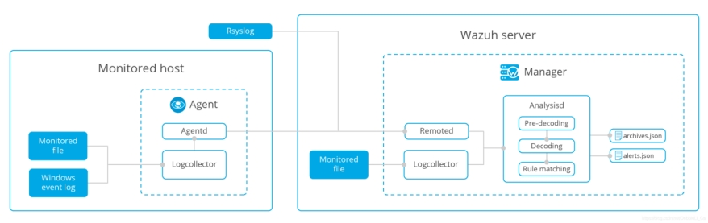 

包含的logcollector模块收集信息后将数据收集起来送到server端进行分析这里实现了远程接收系统日志：（自定义端口接受和存储在纯文本文件里）

运行周期： 实时

实现自定义端口的代码里表明了

l manager会接收从网络传来的系统日志信息

l 定义wazuh需要监听检索日志的端口为空闲端口513

l 定义了传输协议

l 定义日志来源IP

##### 3.1.1. **日志文件**

可以将日志分析引擎配置为监控服务器上的特定文件

示例配置：

Linux：

<localfile>

  <location>/var/log/example.log</location>

  <log_format>syslog</log_format>

</localfile>

windows：

<localfile>

  <location>C:\myapp\example.log</location>

  <log_format>syslog</log_format>

</localfile>

##### 3.1.2. **Windows事件日志**

Wazuh可以监控典型的Windows事件日志以及较新的Windows事件通道

示例配置：

事件日志：

<localfile>

 <location>Security</location>

 <log_format>eventlog</log_format>

</localfile>

事件通道：

<localfile>

 <location>Microsoft-Windows-PrintService/Operational</location>

 <log_format>eventchannel</log_format>

</localfile>

##### 3.1.3. **远程系统日志**

例如，在其他设备（如防火墙）上，可以将代理日志分析组件配置为通过syslog接收日志事件。

示例配置：

<ossec_config>

 <remote>

  <connection>syslog</connection>

  <allowed-ips>192.168.2.0/24</allowed-ips>

 </remote>

<ossec_config>

<connection>syslog</connection>

表示管理器将接受来自网络的传入的系统日志信息，<allowed-ips>192.168.2.0/24</allowed-ips>

表示定义将接受系统日志信息的网络范围。

记录示例：

2016-03-15T15:22:10.078830+01:00 tron su:pam_unix(su-l:auth):authentication failure;logname=tm uid=500 euid=0 tty=pts/0 ruser=tm rhost= user=root

1265939281.764 1 172.16.167.228 TCP_DENIED /403 734 POST http://lbcore1.metacafe.com/test/SystemInfoManager.php - NONE/- text/html

[Sun Mar 06 08:52:16 2016] [error] [client 187.172.181.57] Invalid URI in request GET: index.php HTTP/1.0

 

##### 3.1.4. **分析**

###### 3.1.4.1. **预解码**

在分析的预解码阶段，来自大多数静态信息的字段都是从日志中提取的。

Feb 14 12:19:04 localhost sshd[25474]: Accepted password for rromero from 192.168.1.133 port 49765 ssh2

提取的信息：

l 主机名：'localhost'

l 应用名：'sshd'

###### 3.1.4.2. **解码**

在解码阶段，评估日志信息以识别它是什么类型的日志，然后提取该特定日志类型的已知字段。

示例日志及其提取的信息：

Feb 14 12:19:04 localhost sshd[25474]: Accepted password for rromero from 192.168.1.133 port 49765 ssh2

提取的信息：

l 应用名：sshd

l 关键字：rromero

l 源IP：192.168.1.133

###### 3.1.4.3. **规则匹配**

在下一阶段，将提取的日志信息与规则集进行比较以查找匹配项：

对于前面的示例，规则5715匹配：

<rule id="5715" level="3">

 <if_sid>5700</if_sid>

 <match>^Accepted|authenticated.$</match>

 <description>sshd: authentication success.</description>

 <group>authentication_success,pci_dss_10.2.5,</group>

</rule>

注意：有关更多信息，请参阅[Wazuh规则集](#ruleset)

##### 3.1.5. **告警**

匹配规则后，管理器将创建如下告警：

** Alert 1487103546.21448: - syslog,sshd,authentication_success,pci_dss_10.2.5,

2017 Feb 14 12:19:06 localhost->/var/log/secure

Rule: 5715 (level 3) -> 'sshd: authentication success.'

Src IP: 192.168.1.133

User: rromero

Feb 14 12:19:04 localhost sshd[25474]: Accepted password for rromero from 192.168.1.133 port 49765 ssh2

 默认情况下，将在重要或安全相关的事件上生成告警。要存储所有事件，即使它们与规则不匹配，请启用该<log_all>选项。

告警将存储在/var/ossec/logs/alerts/alerts.(json|log)和事件存储在/var/ossec/logs/archives/archives.(json|log)。系统会自动为每个月和每年创建单个目录。

注意：默认情况下，不会自动删除存储日志。您可以根据自己的当地法律和法规要求选择何时手动或自动（例如cron计划任务自动删除）删除日志。

 

##### 3.1.6. **配置**

###### 3.1.6.1. **基本用法**

日志数据收集主要对[ossec.conf](#reference-ossec-conf)文件中的l[ocalfile](#reference-ossec-localfile)，[remote](#reference-ossec-remote)和[global](#reference-ossec-global)进行配置。还可以在[agent.conf](#reference-agent-conf)文件中完成日志数据收集的配置，以将这些设置的集中分发到相关代理上。

与此基本用法示例一样，需要提供要监控的文件名称和格式：

<localfile>

  <location>/var/log/messages</location>

  <log_format>syslog</log_format>

</localfile>

###### 3.1.6.2. **使用文件名的正则表达式监控日志**

Wazuh支持posix正则表达式。例如，要分析以/var/log目录中的.log结尾的每个文件，请使用以下配置：

<localfile>

  <location>/var/log/*.log</location>

  <log_format>syslog</log_format>

</localfile>

###### 3.1.6.3. **基于日期的日志监控**

对于根据日期更改的日志文件，您还可以指定strftime格式来自定义日，月，年等。例如，要监控日志文件，例如C:\Windows\app\log-08-12-15.log，其中08是年份，12是月份，15是当月天数（并且每天自动增加），配置如下：

<localfile>

  <location>C:\Windows\app\log-%y-%m-%d.log</location>

  <log_format>syslog</log_format>

</localfile>

###### 3.1.6.4. **从Windows事件日志中读取日志**

要监控Windows事件日志，您需要提供格式为“eventlog”，并将location参数作为事件日志的名称

<localfile>

  <location>Security</location>

  <log_format>eventlog</log_format>

</localfile>

###### 3.1.6.5. **从Windows事件通道中读取事件**

您还可以监控特定的Windows事件通道。该location是事件通道的名称。这是监控应用程序和服务日志的唯一方法。如果文件名包含“％”，请将其替换为“/”：

<localfile>

  <location>Microsoft-Windows-PrintService/Operational</location>

  <log_format>eventchannel</log_format>

</localfile>

通过event  channel新的事件数据处理，Wazuh v3.8.0增强了日志格式，保留了旧的功能和配置。它允许监控任何Windows代理生成的每个事件，以JSON格式显示每个通道的信息。作为旧的event channel，使用此log_format可以查询通道，按事件ID，进程，登录类型或生成的事件中包含的任何其他字段进行过滤，从而可以检索所需的事件。

这个新功能使用JSON解码器处理事件字段，确保比以前更容易添加新方法的规则。Wazuh规则集中包含的默认通道是应用程序，安全性，系统，Microsoft-Windows-Sysmon / Operational，Microsoft反恶意软件（Microsoft Security Essentials），Microsoft-Windows-Windows Defender / Operational和Microsoft-Windows-Eventlog。

Windows事件通道中的一些示例事件显示如下：

 

下图显示了每个频道的事件数，按时间进行过滤agent: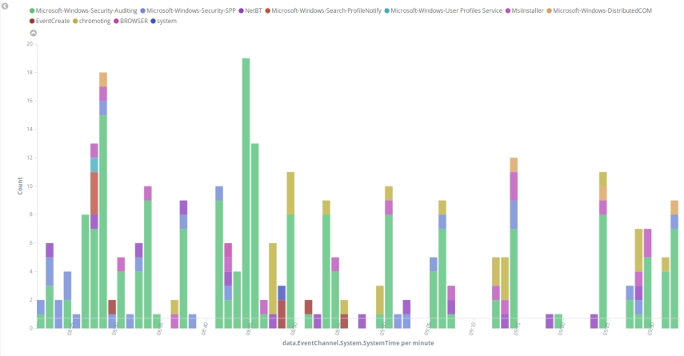

###### 3.1.6.6. **使用查询过滤Windows事件通道中的事件**

Windows事件通道中的事件可以按如下方式过滤：

<localfile>

 <location>System</location>

 <log_format>eventchannel</log_format>

 <query>Event/System[EventID=7040]</query>

</localfile>

###### 3.1.6.7. **使用环境变量**

像环境变量一样%WinDir%可以在location中使用。以下是从IIS服务器读取日志的示例：

<localfile>

  <location>%WinDir%\System32\LogFiles\W3SVC3\ex%y%m%d.log</location>

  <log_format>iis</log_format>

</localfile>

###### 3.1.6.8. **使用多个输出**

默认情况下，日志数据通过agent socket 发送，但也可以将其他 agent socket 指定为输出。ossec-logcollector使用UNIX类型socket 进行通信，允许TCP或UDP协议。要添加新的output socket ，我们需要使用<socket>标记来指定，如下示例配置：

<socket>

  <name>custom_socket</name>

  <location>/var/run/custom.sock</location>

  <mode>tcp</mode>

  <prefix>custom_syslog: </prefix>

</socket>

 

<socket>

  <name>test_socket</name>

  <location>/var/run/test.sock</location>

</socket>

注意：有关定义socket的更多信息

(https://documentation.wazuh.com/current/user-manual/reference/ossec-conf/socket.html#reference-ossec-socket)

定义socket后，可以为每个location添加目标socket：

<localfile>

  <log_format>syslog</log_format>

  <location>/var/log/messages</location>

  <target>agent,test_socket</target>

</localfile>

 

<localfile>

  <log_format>syslog</log_format>

  <location>/var/log/messages</location>

  <target>custom_socket,test_socket</target>

</localfile>

 

注意：要将输出保持为默认socket，我们需要使用“agent”作为目标来指定它。否则，输出将仅重定向到指定的目标。

#### 3.2. **文件完整性监控****FIM(****File integrity monitoring****)**

Wazuh的文件完整性监控（FIM）系统所选文件，在修改这些文件时触发告警。负责此任务的组件称为syscheck。此组件存储加密校验以及已知正常文件或Windows注册表项的修改监控，并定期将其与系统使用的当前文件进行比较，以查看更改。该模块定期扫描，把受监视的文件与之前对比是否存在修改、删除、新增然后将结果同步到数据库并且输送到manager。如果存在差别便会生成报警。
kibana中可以实时看到可视化结果

默认运行周期： 6h

本模块提供监控文件变换的功能

##### 3.2.1. **流程处理**

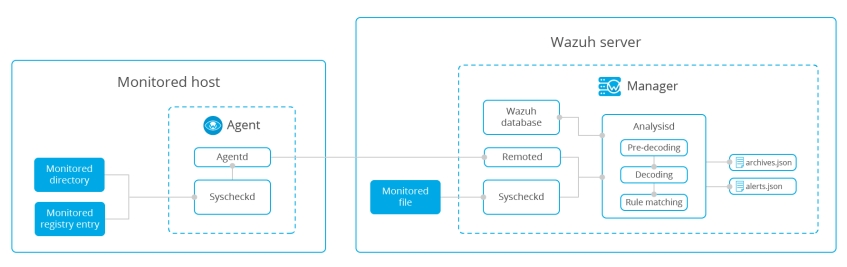 

\1. Wazuh代理扫描系统并将对监视文件和Windows注册表项的校验和以及属性发送给Wazuh管理器。以下选项是可配置的：

频率：默认情况下，syscheck每12小时运行一次。

实时监控：Wazuh支持在运行Windows或Linux的服务器上进行实时文件完整性监控（Solaris不支持Inotify，因此不适用于此系统）。请注意，实时选项只能用于目录而不能用于单个文件。

Whodata：此功能与实时功能类似，另外还提供有关谁触发事件的信息。

\2. Wazuh管理器存储受监视文件的校验和以及属性，并通过将新值与旧值进行比较来查找修改。

\3. 只要在受监视的文件或注册表项中检测到修改，就会生成告警。可以使用ignore配置选项或通过创建列出要从FIM告警中排除的文件的规则来解决误报。

由FIM生成告警示例：

** Alert 1540815355.847397: - ossec,syscheck,pci_dss_11.5,gpg13_4.11,gdpr_II_5.1.f,

2018 Oct 29 13:15:55 (ubuntu) 10.0.0.144->syscheck

Rule: 550 (level 7) -> 'Integrity checksum changed.'

File '/test/hello' checksum changed.

Old md5sum was: '2a4732b1de5db823e94d662d207b8fb2'

New md5sum is : '146c07ef2479cedcd54c7c2af5cf3a80'

Old sha1sum was: 'b89f4786dcf00fb1c4ddc6ad282ca0feb3e18e1b'

New sha1sum is : 'e1efc99729beb17560e02d1f5c15a42a985fe42c'

Old sha256sum was: 'a8a3ea3ddbea6b521e4c0e8f2cca8405e75c042b2a7ed848baaa03e867355bc2'

New sha256sum is : 'a7998f247bd965694ff227fa325c81169a07471a8b6808d3e002a486c4e65975'

Old modification time was: 'Mon Oct 29 13:15:19 2018', now it is 'Mon Oct 29 13:15:54 2018'

(Audit) User: 'root (0)'

(Audit) Login user: 'test (1000)'

(Audit) Effective user: 'root (0)'

(Audit) Group: 'root (0)'

(Audit) Process id: '26089'

(Audit) Process name: '/bin/nano'

 

Attributes:

\- Size: 4

\- Permissions: 100644

\- Date: Mon Oct 29 13:15:54 2018

\- Inode: 537259

\- User: root (0)

\- Group: root (0)

\- MD5: 146c07ef2479cedcd54c7c2af5cf3a80

\- SHA1: e1efc99729beb17560e02d1f5c15a42a985fe42c

\- SHA256: a7998f247bd965694ff227fa325c81169a07471a8b6808d3e002a486c4e65975

 

 

##### 3.2.2. **配置**

###### 3.2.2.1. **基本用法**

Syscheck在[ossec.conf](#reference-ossec-conf)文件中配置。通常，此配置使用以下部分设置：

[频率](#reference-ossec-syscheck-frequency)

[目录](#reference-ossec-syscheck-directories)

[忽略](#reference-ossec-syscheck-ignore)

[alert_new_files](#reference-ossec-syscheck-alert-new-files)

有关详细的配置选项，请转至[Syscheck](#reference-ossec-syscheck)。

要配置syscheck，必须标识指定文件和目录列表。该check_all选项检查文件大小，权限，所有者，上次修改日期，inode和所有哈希值（MD5，SHA1和SHA256）。

注意：如果目录路径相同，则从[集中配置](#reference-agent-conf)推送的目录将覆盖ossec.conf文件。

<syscheck>

 <directories check_all="yes">/etc,/usr/bin,/usr/sbin</directories>

 <directories check_all="yes">/root/users.txt,/bsd,/root/db.html</directories>

</syscheck>

###### 3.2.2.2. **配置预定扫描**

Syscheck可以选择配置frequency系统扫描。在此示例中，syscheck配置为每10小时运行一次。

<syscheck>

 <frequency>36000</frequency>

 <directories>/etc,/usr/bin,/usr/sbin</directories>

 <directories>/bin,/sbin</directories>

</syscheck>

###### 3.2.2.3. **配置实时监控**

使用realtime选项配置实时监控。此选项仅适用于目录而不适用于单个文件。在定期syscheck扫描期间暂停实时更改检测，并在这些扫描完成后立即重新激活。

<syscheck>

 <directories check_all="yes" realtime="yes">c:/tmp</directories>

</syscheck>

###### 3.2.2.4. **配置who-data监控**

版本3.4.0中的新功能。

使用whodata选项配置who-data监控。此选项代替了realtime选项，这意味着whodata进行实时监控，但添加了who-data信息。此功能使用Linux Audit子系统和Microsoft Windows SACL，因此可能需要其他配置。检查[审核  who-data](#auditing-whodata)以获取更多信息。

<syscheck>

 <directories check_all="yes" whodata="yes">/etc</directories>

</syscheck>

###### 3.2.2.5. **配置报告更改**

使用report_changes选项，我们可以看到文本文件中的具体更改。 请注意您设置为report_changes的文件夹，因为为了执行此操作，Wazuh会将您要监视的每个文件复制到私有位置。

<syscheck>

 <directories check_all="yes" realtime="yes" report_changes="yes">/test</directories>

</syscheck>

###### 3.2.2.6. **配置忽略文件**

使用ignore选项（Windows注册表项的registry_ignore）可以忽略文件和目录。为了避免误报，可以将syscheck配置为忽略某些不需要监视的文件。

<syscheck>

 <ignore>/etc/random-seed</ignore>

 <ignore>/root/dir</ignore>

 <ignore type="sregex">.log$|.tmp</ignore>

</syscheck>

###### 3.2.2.7. **配置允许最大等级级别**

版本3.6.0中的新功能。

通过设置recursion_level选项，可以配置特定目录允许的最大等级级别。此选项必须是0到320之间的整数。使用示例：

<syscheck>

 <directories check_all="yes">/etc,/usr/bin,/usr/sbin</directories>

 <directories check_all="yes">/root/users.txt,/bsd,/root/db.html</directories>

 <directories check_all="yes" recursion_level="3">folder_test</directories>

</syscheck>

使用以下目录结构和recursion_level="3"：

folder_test 

├──file_0.txt 

└──level_1 

├──file_1.txt 

└──level_2 

├──file_2.txt 

└──level_3 

├──file_3.txt 

└──level_4 

├──file_4.txt 

└──level_5 

└──file_5.txt

我们将收到所有文件的告警（folder_test/level_1/level_2/level_3/），但我们不会从其他目录中收到level_3警报。

如果我们不想要任何递等级（只是从受监视文件夹中的文件获取警报），我们必须设置recursion_level为0。

注意：如果recursion_level未指定，则它会被设置为自定义的默认值，syscheck.default_max_depth中[内部选](#reference-internal-options)配置文件。

###### 3.2.2.8. **通过规则忽略文件**

也可以使用规则忽略文件，如下例所示：

<rule id="100345" level="0">

 <if_group>syscheck</if_group>

 <match>/var/www/htdocs</match>

 <description>Ignore changes to /var/www/htdocs</description>

</rule>

###### 3.2.2.9. **更改重要性**

使用自定义规则，可以在检测到对特定文件或文件格式的更改触发警告的等级级别

<rule id="100345" level="12">

 <if_group>syscheck</if_group>

 <match>/var/www/htdocs</match>

 <description>Changes to /var/www/htdocs - Critical file!</description>

</rule>

 

#### 3.3. **异常和恶意软件检测****(****Anomaly and malware detection)**

异常检测是指在系统中查找与预期行为不匹配的模式的动作。一旦在系统上安装了恶意软件（例如rootkit),它就会修改系统以将其自身隐藏起来。尽管恶意软件使用各种技术来实现这一目标，但Wazuh使广范的方法来查找攻击者的特殊入侵模式。

负责此任务的主要组件是rootcheck，但是Syscheck也扮演着重要的角色。

 

这个模块主要包含功能有

l 文件监控

l 监控注册表

l 系统调用

l rootkit签名

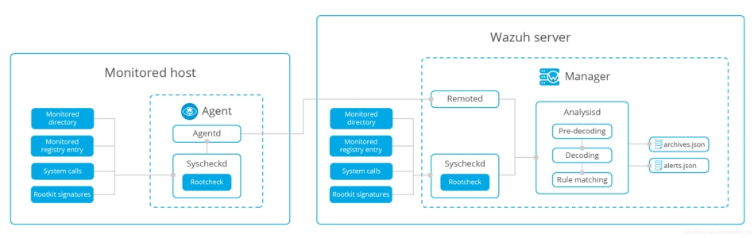 

##### 3.3.1. **文件完整性监控**

恶意软件可以替换其主机系统上的文件,目录和命令。对系统的主目录执行文件进行完整性检查。更多信息：

https://documentation.wazuh.com/current/user-manual/capabilities/file-integrity/index.html#manual-file-integrity

 

** Alert 1460948255.25442: mail  - ossec,syscheck,pci_dss_11.5,

2016 Apr 17 19:57:35 (ubuntu) 10.0.0.144->syscheck

Rule: 550 (level 7) -> 'Integrity checksum changed.'

Integrity checksum changed for: '/test/hello'

Size changed from '12' to '17'

Old md5sum was: 'e59ff97941044f85df5297e1c302d260'

New md5sum is : '7947eba5d9cc58d440fb06912e302949'

Old sha1sum was: '648a6a6ffffdaa0badb23b8baf90b6168dd16b3a'

New sha1sum is : '379b74ac9b2d2b09ff6ad7fa876c79f914a755e1'

 

##### 3.3.2. **检查运行进程**

恶意进程可以防止在系统的进程列表显示自己的真实进程（ps命令的木马版本，这里替换了系统命令）。Rootcheck检查所有进程ID（PID），查找不同系统调用的差异（getsid，getpgid）。

Diamorphine是一个内核模式的rootkit，能够隐藏自己和ps命令的其他进程。如果我们安装此软件包并隐藏进程，我们将收到如下警告：

** Alert 1460225922.841535: mail  - ossec,rootcheck

2017 Feb 15 10:00:42 (localhost) 192.168.1.240->rootcheck

Rule: 510 (level 7) -> 'Host-based anomaly detection event (rootcheck).'

Process '495' hidden from /proc. Possible kernel level rootkit.

##### 3.3.3. **检查隐藏的端口**

恶意软件可以使用隐藏端口与攻击者通信。Rootcheck使用bind()函数来检查系统中的每个端口。如果它无法绑定到端口并且该端口不在netstat输出中，则可能存在恶意软件。

##### 3.3.4. **检查异常文件和权限**

Wazuh扫描整个文件系统，寻找不正常的文件和权限。拥有root权限的文件以及其他用户（如suid文件，隐藏目录和文件）的写权限都将被检查。

##### 3.3.5. **使用系统调用检查隐藏文件**

当使用fopen + read调用时，Wazuh扫描整个系统并比较统计大小和文件大小之间的差异。每个目录中的节点数也与opendir + readdir的输出进行比较。如果所有结果都不匹配，则可能存在恶意软件。

** Alert 1460225922.51190: mail  - ossec,rootcheck

2017 Feb 15 10:30:42 (localhost) 192.168.1.240->rootcheck

Rule: 510 (level 7) -> 'Host-based anomaly detection event (rootcheck).'

Files hidden inside directory '/etc'. Link count does not match number of files (128,129)

##### 3.3.6. **扫描dev目录**

在dev目录应该只包含设备的特殊文件。应检该目录的其他文件，因为恶意软件使用此分区来隐藏文件。

如果您创建一个隐藏文件/dev，Wazuh应该发出警报，因为目录中有一个隐藏文件，该文件应该只包括特殊的设备文件。以下是该案例中生成的警报：

** Alert 1487182293.37491: - ossec,rootcheck,

2017 Feb 15 10:11:33 localhost->rootcheck

Rule: 510 (level 7) -> 'Host-based anomaly detection event (rootcheck).'

File '/dev/.hiddenfile' present on /dev. Possible hidden file.

title: File present on /dev.

file: /dev/.hiddenfile

 

##### 3.3.7. **扫描网络接口**

Wazuh扫描系统上启用了混杂模式的网络接口。如果该接口处于混杂模式，则ifconfig命令的输出将可以显示出来。这可能是恶意软件存在的特点。

##### 3.3.8. **Rootkit检查**

Rootcheck使用自己的rootkit签名数据库执行多项检查：rootkit_files.txt，rootkit_trojans.txt和win_malware_rcl.txt。可是，这些签名已过时了。

##### 3.3.9. **配置**

###### 3.3.9.1. **基本的例子**

要配置syscheck和rootcheck的选项，请转到[ossec.conf](#reference-ossec-conf)。如果您想了解有关可用准确的配置选项的更多信息，请转到[Syscheck部分](#reference-ossec-syscheck)和[Rootcheck部分](#reference-ossec-rootcheck)。另请参阅以下部分：[frequency](#reference-ossec-rootcheck-frequency)，[rootkit_files](#reference-ossec-rootcheck-rootkit-files)和[rootkit_trojans](#reference-ossec-rootcheck-rootkit-trojans)。

以下是如何为rootkit（文件和特洛伊木马）配置数据库的基本示例：

<rootcheck>

 <rootkit_files>/var/ossec/etc/shared/rootkit_files.txt</rootkit_files>

 <rootkit_trojans>/var/ossec/etc/shared/rootkit_trojans.txt</rootkit_trojans>

</rootcheck>

###### 3.3.9.2. **忽略误报**

<rule id="100100" level="0">

  <if_group>rootcheck</if_group>

  <match>/dev/.blkid.tab</match>

  <description>Ignore false positive for /dev/.blkid.tab</description>

</rule>

#### 3.4. **监控安全策略(Monitoring security policies——>Rootcheck)**

策略监视是验证所有系统是否符合有关配置设置和已规定的应用程序使用的一组预定义规则的过程。

Wazuh使用三个组件来执行此任务：Rootcheck，OpenSCAP和CIS-CAT。

默认运行周期：2h

本模块根据系统活动匹配设定的规则或指纹识别出异常

##### 3.4.1. **Rootcheck**

###### 3.4.1.1. **处理流程**

通过根检查引擎查看：

l 检查进程是否正在运行

l 检查文件是否存在

l 检查文件的内容是否包含模式，或者Windows注册表项是否包含字符串或仅存在。

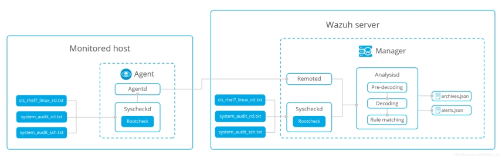 

使用这些检查，已经有如下策略：

| 策略                     | 描述                                                         |
| ------------------------ | ------------------------------------------------------------ |
| cis_debian_linux_rcl.txt | 基于[CIS Benchmark for Debian Linux v1.0](https://benchmarks.cisecurity.org/tools2/linux/CIS_Debian_Benchmark_v1.0.pdf) |
| cis_rhel5_linux_rcl.txt  | 基于[CIS Benchmark for Red Hat Enterprise Linux 5 v2.1.0](https://benchmarks.cisecurity.org/tools2/linux/CIS_Red_Hat_Enterprise_Linux_5_Benchmark_v2.1.0.pdf) |
| cis_rhel6_linux_rcl.txt  | 基于[CIS Benchmark for Red Hat Enterprise Linux 6 v1.3.0](https://benchmarks.cisecurity.org/tools2/linux/CIS_Red_Hat_Enterprise_Linux_6_Benchmark_v1.3.0.pdf) |
| cis_rhel7_linux_rcl.txt  | 基于[CIS Benchmark for Red Hat Enterprise Linux 7 v1.1.0](https://benchmarks.cisecurity.org/tools2/linux/CIS_Red_Hat_Enterprise_Linux_7_Benchmark_v1.1.0.pdf) |
| cis_rhel_linux_rcl.txt   | 基于[CIS Benchmark for Red Hat Enterprise Linux v1.0.5](https://benchmarks.cisecurity.org/tools2/linux/CIS_RHLinux_Benchmark_v1.0.5.pdf) |
| cis_sles11_linux_rcl.txt | 基于[CIS Benchmark for SUSE Linux Enterprise Server 11 v1.1.0](https://benchmarks.cisecurity.org/tools2/linux/CIS_SUSE_Linux_Enterprise_Server_11_Benchmark_v1.1.0.pdf) |
| cis_sles12_linux_rcl.txt | 基于[CIS Benchmark for SUSE Linux Enterprise Server 12 v1.0.0](https://benchmarks.cisecurity.org/tools2/linux/CIS_SUSE_Linux_Enterprise_Server_12_Benchmark_v1.0.0.pdf) |
| system_audit_rcl.txt     | Web漏洞和漏洞利用                                            |
| win_audit_rcl.txt        | 检查注册表值                                                 |
| system_audit_ssh.txt     | SSH检查                                                      |
| win_applications_rcl.txt | 检查是否安装了恶意应用程序                                   |

与策略监测相关的告警：

n 512：Windows审核

n 514：Windows应用程序

n 516：Unix审计

策略和合规性监视数据库通常在管理器上维护，管理器将它们分发给所有代理。

现有策略规则的示例：

\# PermitRootLogin not allowed

\# PermitRootLogin indicates if the root user can log in via ssh.

$sshd_file=/etc/ssh/sshd_config;

 

[SSH Configuration - 1: Root can log in] [any] [1]

f:$sshd_file -> !r:^# && r:PermitRootLogin\.+yes;

f:$sshd_file -> r:^#\s*PermitRootLogin

告警示例：

** Alert 1487185712.51190: - ossec,rootcheck,

2017 Feb 15 11:08:32 localhost->rootcheck

Rule: 516 (level 3) -> 'System Audit event.'

System Audit: CIS - RHEL7 - 6.2.9 - SSH Configuration - Empty passwords permitted {CIS: 6.2.9 RHEL7} {PCI_DSS: 4.1}. File: /etc/ssh/sshd_config. Reference: https://benchmarks.cisecurity.org/tools2/linux/CIS_Red_Hat_Enterprise_Linux_7_Benchmark_v1.1.0.pdf .

title: CIS - RHEL7 - 6.2.9 - SSH Configuration - Empty passwords permitted

file: /etc/ssh/sshd_config

###### 3.4.1.2. **配置**

3.4.1.3. **基本用法**

要配置rootcheck的选项，进入[Rootcheck](#reference-ossec-rootcheck)中[ossec.conf](#reference-ossec-conf)。最常见的配置选项是：[频率](#reference-ossec-rootcheck-frequency)和[系统审计](#reference-ossec-rootcheck-audit)

配置审计策略的基本示例：

<rootcheck>

 <system_audit>./db/system_audit_rcl.txt</system_audit>

 <system_audit>./db/cis_debian_linux_rcl.txt</system_audit>

 <system_audit>./db/cis_rhel_linux_rcl.txt</system_audit>

</rootcheck>

3.4.1.4. **配置定期扫描**

这是每10小时运行一次扫描的基本配置：

<rootcheck>

  <frequency>36000</frequency>

  <system_audit>/var/ossec/etc/shared/system_audit_rcl.txt</system_audit>

  <system_audit>/var/ossec/etc/shared/cis_debian_linux_rcl.txt</system_audit>

  <system_audit>/var/ossec/etc/shared/cis_rhel_linux_rcl.txt</system_audit>

  <system_audit>/var/ossec/etc/shared/cis_rhel5_linux_rcl.txt</system_audit>

 </rootcheck>

3.4.1.5. **Root访问SSH**

1.首先，您需要创建自定义审计文件（audit_test.txt）：

\# PermitRootLogin not allowed

\# PermitRootLogin indicates if the root user can log in by ssh.

$sshd_file=/etc/ssh/sshd_config;

 

[SSH Configuration - 1: Root can log in] [any] [1]

f:$sshd_file -> !r:^# && r:PermitRootLogin\.+yes;

f:$sshd_file -> r:^#\s*PermitRootLogin;

2.在rootcheck选项中引用我们的新文件：

<rootcheck>

  <system_audit>/var/ossec/etc/shared/audit_test.txt</system_audit>

</rootcheck>

##### 3.4.2. **OpenSCAP**

OpenSCAP wodle是OpenSCAP与Wazuh HIDS的集成，可提供执行配置的功能。它主要用于：

l 验证安全合规性：OpenSCAP策略定义组织中所有系统必须满足的要求，以符合适用的安全策略和安全基线。

l 执行漏洞评估：OpenSCAP可识别系统中的漏洞并对其进行分类。

l 执行专门的评估：OpenSCAP可以执行特定的自定义系统检查（即检查可疑文件名和可疑文件位置）

3.4.2.1. **工作原理**

[安全内容自动化协议（SCAP）](https://scap.nist.gov/)是用于以标准化方式表达和操纵安全数据的规范。SCAP使用几种规格，以自动连续监测，漏洞管理和报告安全合规性扫描的结果。

安全合规性评估过程的组成部分：

l SCAP扫描程序：这是一个读取SCAP策略并检查系统是否符合它的应用程序。 有许多工具可以根据SCAP策略扫描您的系统。 此Wodle与NIST认证的OpenSCAP集成扫描程序。

l 安全策略（SCAP内容）：这些决定了系统必须如何设置以及检查的内容。 这些策略包含系统将要遵循的主机可读描述规则

l 配置文件：每个安全策略都可以包含多个配置文件，这些配置文件提供符合特定安全基准的规则和值集。 您可以将配置文件视为策略中特定的规则子集; 配置文件确定实际使用的策略中定义的规则以及评估期间将使用的值。

l 评估（扫描）：这是OpenSCAP扫描程序根据特定安全策略和配置文件在代理上执行的过程。通常只需几分钟，具体取决于配置文件中选择的规则数量。

3.4.2.2. **要求**

此wodle程序在代理上执行，因此每个代理必须满足以下要求：

OpenSCAP为了执行SCAP评估，我们需要扫描。如上所述，我们使用OpenSCAP。您可以使用以下命令安装它：

对于基于RPM的发行版：

\# yum install openscap-scanner

对于基于Debian的发行版：

\# apt-get install libopenscap8 xsltproc

Python 2.6+ Python是这个问题的核心部分。目前所有Linux发行版都附带python。

3.4.2.3. **默认策略**

这些是Wazuh默认包含的安全策略：

| SO                  | Version             | File name              | Main profiles | Vulnerability assessment |
| ------------------- | ------------------- | ---------------------- | ------------- | ------------------------ |
| CentOS              | 6                   | ssg-centos-6-ds.xml    | Server, PCI   | N/A                      |
| 7                   | ssg-centos-7-ds.xml | Common, PCI            | N/A           |                          |
| RedHat              | 6                   | ssg-rhel-6-ds.xml      | Server, PCI   | N/A                      |
| cve-redhat-6-ds.xml | N/A                 | Y                      |               |                          |
| 7                   | ssg-rhel-7-ds.xml   | Common , PCI           | N/A           |                          |
| cve-redhat-7-ds.xml | N/A                 | Y                      |               |                          |
| Debian              | 8                   | ssg-debian-8-ds.xml    | Common        | N/A                      |
| Ubuntu              | xenial              | ssg-ubuntu-1604-ds.xml | Common        | N/A                      |
| trusty              | cve-debian-oval.xml | N/A                    | Y             |                          |
| precise             | cve-debian-oval.xml | N/A                    | Y             |                          |
| Fedora              | 24                  | ssg-fedora-ds.xml      | Common        | N/A                      |

每个代理都必须有自己的策略(/var/ossec/wodles/oscap/content)

Wodle处理流程

 

代理将根据配置定期运行openscap-scanner。扫描的每个结果都将发送到Manager，如果扫描结果的状态是失败，它将生成警报。可以调整规则以发送传输结果。

{

  "timestamp": "2017-03-20T15:59:43-0700",

  "rule": {

   "level": 7,

   "description": "OpenSCAP: Set Lockout Time For Failed Password Attempts (not passed)",

   "id": "81530",

   "firedtimes": 5,

   "groups": [

​    "oscap",

​    "oscap-result"

   ],

   "pci_dss": [

​    "2.2"

   ]

  },

  "agent": {

   "id": "1040",

   "name": "ip-10-0-0-76",

   "ip": "10.0.0.76"

  },

  "manager": {

   "name": "vpc-ossec-manager"

  },

  "full_log": "oscap: msg: \"xccdf-result\", scan-id: \"10401490050781\", content: \"ssg-centos-7-ds.xml\", title: \"Set Lockout Time For Failed Password Attempts\", id: \"xccdf_org.ssgproject.content_rule_accounts_passwords_pam_faillock_unlock_time\", result: \"fail\", severity: \"medium\", description: \"To configure the system to lock out accounts after a number of incorrect login attempts and require an administrator to unlock the account using pam_faillock.so, modify the content of both /etc/pam.d/system-auth and /etc/pam.d/password-auth as follows: add the following line immediately before the pam_unix.so statement in the AUTH section: auth required pam_faillock.so preauth silent deny= unlock_time= fail_interval= add the following line immediately after the pam_unix.so statement in the AUTH section: auth [default=die] pam_faillock.so authfail deny= unlock_time= fail_interval= add the following line immediately before the pam_unix.so statement in the ACCOUNT section: account required pam_faillock.so\", rationale: \"Locking out user accounts after a number of incorrect attempts prevents direct password guessing attacks. Ensuring that an administrator is involved in unlocking locked accounts draws appropriate attention to such situations.\" references: \"AC-7(b) (http://nvlpubs.nist.gov/nistpubs/SpecialPublications/NIST.SP.800-53r4.pdf), 47 (http://iase.disa.mil/stigs/cci/Pages/index.aspx)\", identifiers: \"CCE-26884-7 (http://cce.mitre.org)\", oval-id: \"oval:ssg:def:166\", benchmark-id: \"xccdf_org.ssgproject.content_benchmark_RHEL-7\", profile-id: \"xccdf_org.ssgproject.content_profile_pci-dss\", profile-title: \"PCI-DSS v3 Control Baseline for CentOS Linux 7\".",

  "oscap": {

   "scan": {

​    "id": "10401490050781",

​    "content": "ssg-centos-7-ds.xml",

​    "benchmark": {

​     "id": "xccdf_org.ssgproject.content_benchmark_RHEL-7"

​    },

​    "profile": {

​     "id": "xccdf_org.ssgproject.content_profile_pci-dss",

​     "title": "PCI-DSS v3 Control Baseline for CentOS Linux 7"

​    }

   },

   "check": {

​    "title": "Set Lockout Time For Failed Password Attempts",

​    "id": "xccdf_org.ssgproject.content_rule_accounts_passwords_pam_faillock_unlock_time",

​    "result": "fail",

​    "severity": "medium",

​    "description": "To configure the system to lock out accounts after a number of incorrect login attempts and require an administrator to unlock the account using pam_faillock.so, modify the content of both /etc/pam.d/system-auth and /etc/pam.d/password-auth as follows: add the following line immediately before the pam_unix.so statement in the AUTH section: auth required pam_faillock.so preauth silent deny= unlock_time= fail_interval= add the following line immediately after the pam_unix.so statement in the AUTH section: auth [default=die] pam_faillock.so authfail deny= unlock_time= fail_interval= add the following line immediately before the pam_unix.so statement in the ACCOUNT section: account required pam_faillock.so",

​    "rationale": "Locking out user accounts after a number of incorrect attempts prevents direct password guessing attacks. Ensuring that an administrator is involved in unlocking locked accounts draws appropriate attention to such situations.",

​    "references": "AC-7(b) (http://nvlpubs.nist.gov/nistpubs/SpecialPublications/NIST.SP.800-53r4.pdf), 47 (http://iase.disa.mil/stigs/cci/Pages/index.aspx)",

​    "identifiers": "CCE-26884-7 (http://cce.mitre.org)",

​    "oval": {

​     "id": "oval:ssg:def:166"

​    }

   }

  },

  "decoder": {

   "parent": "oscap",

   "name": "oscap"

  },

  "location": "wodle_open-scap"

}

扫描完成后，将发送告警事件，生成警报：

{

  "timestamp": "2017-03-20T15:59:43-0700",

  "rule": {

   "level": 5,

   "description": "OpenSCAP Report overview: Score less than 80",

   "id": "81542",

   "firedtimes": 2,

   "groups": [

​    "oscap",

​    "oscap-report"

   ],

   "pci_dss": [

​    "2.2"

   ]

  },

  "agent": {

   "id": "1040",

   "name": "ip-10-0-0-76",

   "ip": "10.0.0.76"

  },

  "manager": {

   "name": "vpc-ossec-manager"

  },

  "full_log": "oscap: msg: \"xccdf-overview\", scan-id: \"10401490050797\", content: \"ssg-centos-7-ds.xml\", benchmark-id: \"xccdf_org.ssgproject.content_benchmark_RHEL-7\", profile-id: \"xccdf_org.ssgproject.content_profile_common\", profile-title: \"Common Profile for General-Purpose Systems\", score: \"75.000000\".",

  "oscap": {

   "scan": {

​    "id": "10401490050797",

​    "content": "ssg-centos-7-ds.xml",

​    "benchmark": {

​     "id": "xccdf_org.ssgproject.content_benchmark_RHEL-7"

​    },

​    "profile": {

​     "id": "xccdf_org.ssgproject.content_profile_common",

​     "title": "Common Profile for General-Purpose Systems"

​    },

​    "score": "75.000000"

   }

  },

  "decoder": {

   "parent": "oscap",

   "name": "oscap"

  },

  "location": "wodle_open-scap"

}

 

3.4.2.4. **配置**

3.4.2.4.1. 基本用法

要配置OpenSCAP的选项，请转到[ossec.conf](#reference-ossec-conf)，或有关特定选项的更多详细信息，请参阅[OpenSCAP部分](#wodle-openscap)。

在此示例中，我们将Wazuh配置为每天运行OpenSCAP，超时时间为30分钟

<wodle name="open-scap">

 <disabled>no</disabled>

 <timeout>1800</timeout>

 <interval>1d</interval>

 <scan-on-start>yes</scan-on-start>

 

 <content type="xccdf" path="ssg-centos-7-ds.xml">

  <profile>xccdf_org.ssgproject.content_profile_pci-dss</profile>

  <profile>xccdf_org.ssgproject.content_profile_common</profile>

 </content>

</wodle>

3.4.2.4.2. 评估RHEL7上的PCI-DSS合规性

本节介绍如何评估Red Hat Enterprise Linux 7代理上的金融支付行业数据安全标准（PCI-DSS）合规性。

第1步：配置代理

必须正确识别每个代理，以便知道要执行的策略和配置文件。

agent:ossec.conf

<client>

 <server>

  <address>10.0.1.4</address>

  <port>1514</port>

  <protocol>tcp</protocol>

 </server>

 <config-profile>redhat7</config-profile>

</client>

第2步：配置管理器

我们只想在Red Hat 7服务器上执行SSG RH7策略的PCI-DSS配置文件。

manage: /var/ossec/etc/shared/default/agent.conf（假设代理在default组中）：

<agent_config profile="redhat7">

 

 <wodle name="open-scap">

  <content type="xccdf" path="ssg-rhel7-ds.xml">

   <profile>xccdf_org.ssgproject.content_profile_pci-dss</profile>

  </content>

 </wodle>

 

</agent_config>

第3步：重新启动管理器和代理

要应用新配置，请重新启动管理器：

对于Systemd：	

\# systemctl restart wazuh-manager

对于SysV Init：

\# service wazuh-manager restart

现在，重新启动所有代理：

\# /var/ossec/bin/agent_control -R -a

如果您愿意，可以使用选项-u <id>重新启动特定代理，其中id是代理的ID号.

第4步：查看警报

评估完成后，您将看到结果为OSSEC警报：

/var/ossec/logs/alerts/alerts.log

** Alert 1463752181.32768: - oscap,rule-result,pci_dss_2.2,

2016 May 20 13:49:41 (RH_Agent) 10.0.1.7->wodle_open-scap

Rule: 81529 (level 5) -> 'OpenSCAP rule failed (severity low).'

oscap: msg: "rule-result", id: "47T7_Qd08gm4y8TSoD53", policy: "ssg-rhel7-ds.xml", profile: "xccdf_org.ssgproject.content_profile_pci-dss", rule_id: "xccdf_org.ssgproject.content_rule_sshd_set_idle_timeout", result: "fail", title: "Set SSH Idle Timeout Interval", ident: "CCE-26611-4", severity: "low".

** Alert 1463752181.33254: - oscap,report-overview,pci_dss_2.2, 2016 May 20 13:49:41 (RH_Agent) 10.0.1.7->wodle_open-scap Rule: 81542 (level 4) -> 'OpenSCAP Report overview: Score less than 80' oscap: msg: "report-overview", id: "47T7_Qd08gm4y8TSoD53", policy: "ssg-rhel7-ds.xml", profile: "xccdf_org.ssgproject.content_profile_pci-dss", score: "56.835060" / "100.000000", severity of failed rules: "high": "1", "medium": "9", "low": "34", "n/a": "0".

请注意，提取每个字段以便于搜索和分析。

 

第5步：仪表图

最后，您可以使用Kibana的OpenSCAP显示结果：

 

3.4.2.4.3. 审计red hat产品的安全漏洞

红帽安全响应小组为影响红帽企业Linux 3,4,5,6和7的所有漏洞（由CVE名称标识）提供OVAL定义。这使用户能够执行漏洞扫描并诊断系统是否易受攻击。

第1步：配置代理

必须正确识别每个代理，以便知道要执行的策略和配置文件。

agent  ossec.conf

<client>

 <server-ip>10.0.1.4</server-ip>

 <config-profile>redhat7</config-profile>

</client>

第2步：配置管理器

我们只想在Red Hat 7服务器上执行RedHat安全策略。

manager  shared/agent.conf：

<agent_config profile="redhat7">

 <wodle name="open-scap">

  <content type="xccdf" path="com.redhat.rhsa-RHEL7.ds.xml"/>

 </wodle>

</agent_config>

第3步：重新启动管理器和代理

要应用新配置，请重新启动管理器：

对于Systemd：

\# systemctl restart wazuh-manager

对于SysV Init：

\# service wazuh-manager restart

现在，重新启动所有代理：

\# /var/ossec/bin/agent_control -R -a

如果您愿意，可以使用选项-u <id>重新启动特定代理，其中id是代理的ID号.

第4步：查看警报

评估完成后，您将看到结果为OSSEC警报：

/var/ossec/logs/alerts/alerts.log

** Alert 1463757700.70731: mail  - oscap,rule-result,pci_dss_2.2,

2016 May 20 15:21:40 (RH_Agent) 10.0.1.7->wodle_open-scap

Rule: 81531 (level 9) -> 'OpenSCAP rule failed (severity high).'

oscap: msg: "rule-result", id: "I0iLEGFi4iTkxjnL9LWQ", policy: "com.redhat.rhsa-RHEL7.ds.xml", profile: "no-profiles", rule_id: "xccdf_com.redhat.rhsa_rule_oval-com.redhat.rhsa-def-20160722", result: "fail", title: "RHSA-2016:0722: openssl security update (Important)", ident: "RHSA-2016-0722, CVE-2016-0799, CVE-2016-2105, CVE-2016-2106, CVE-2016-2107, CVE-2016-2108, CVE-2016-2109, CVE-2016-2842", severity: "high".

 

** Alert 1463757700.71339: - oscap,report-overview,pci_dss_2.2,

2016 May 20 15:21:40 (RH_Agent) 10.0.1.7->wodle_open-scap

Rule: 81540 (level 1) -> 'OpenSCAP Report overview.'

oscap: msg: "report-overview", id: "I0iLEGFi4iTkxjnL9LWQ", policy: "com.redhat.rhsa-RHEL7.ds.xml", profile: "no-profiles", score: "92.617447" / "100.000000", severity of failed rules: "high": "8", "medium": "14", "low": "0", "n/a": "0".

请注意，提取每个字段以便于搜索和分析。

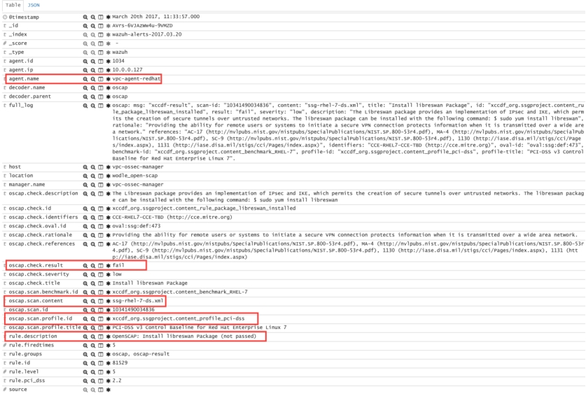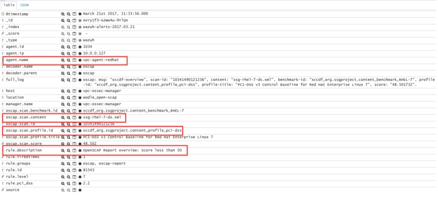 

第5步：仪表板

最后，您可以使用Kibana的OpenSCAP显示结果：

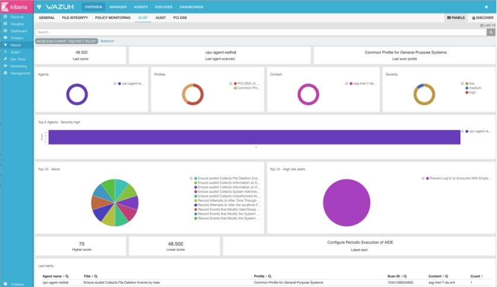 

3.4.2.4.4. 覆盖超时

可以覆盖特定评估的超时：

<wodle name="open-scap">

  <timeout>1800</timeout>

  <content type="xccdf" path="ssg-centos-7-ds.xml">

​    <timeout>120</timeout>

  </content>

  <content type="xccdf" path="ssg-centos-6-ds.xml"/>

</wodle>

3.4.2.4.5. 使用配置文件

我们可以将评估仅限于策略的特定配置文件：

<wodle name="open-scap">

  <content type="xccdf" path="ssg-centos-7-ds.xml">

​    <profile>xccdf_org.ssgproject.content_profile_standard</profile>

​    <profile>xccdf_org.ssgproject.content_profile_pci-dss</profile>

  </content>

  <content type="xccdf" path="ssg-centos-6-ds.xml"/>

</wodle>

3.4.2.4.6. 使用CPE字典

您还可以选择指定CPE字典文件，该文件用于确定哪些检查与特定平台相关。

<wodle name="open-scap">

  <content type="xccdf" path=policy="ssg-centos-7-ds.xml">

​    <cpe>file.xml</cpe>

  </content>

  <content type="xccdf" path="ssg-centos-6-ds.xml" />

</wodle>

3.4.2.4.7. 使用ID

您可以选择数据流文件的特定ID：

<wodle name="open-scap">

  <content type="xccdf" path="ssg-centos-7-ds.xml">

​    <datastream-id>id</datastream-id>

​    <xccdf-id>id</xccdf-id>

  </content>

  <content type="xccdf" path="ssg-centos-6-ds.xml" />

</wodle>

##### 3.4.3. **CIS-CAT集成**

3.1.0版中的新功能。

CIS-CAT wodle开发是为了将CIS基准评估纳入Wazu agent中。

###### 3.4.3.1. **什么是CIS-CAT**

CIS（互联网安全中心）是一个致力于保护私人和公共组织免受网络威胁的组织。该组织提供CIS基准指南，这是一个公认的全球标准和保护IT系统和数据免受网络攻击的最佳的指南。

此外，CIS-CAT Pro是一个“跨平台Java应用程序”工具，用于扫描目标系统并将系统设置与CIS基准进行比较后生成的报告。有超过80个涵盖几乎所有操作系统的CIS基准测试，根据具体需要提供不同的配置文件。

###### 3.4.3.2. **如何运行**

注意：这种集成需要CIS-CAT Pro，它是专有软件。您可以在[CIS官方网站上](https://www.cisecurity.org/cybersecurity-tools/cis-cat-pro/)了解有关此工具以及如何下载该工具的更多信息。

CIS-CAT Wazuh模块将CIS基准评估集成到Wazuh代理中，并以警报的形式报告每次扫描的结果。

CIS-CAT Pro是用Java编写的，因此需要Java Runtime Environment才能执行它。目前，CIS-CAT支持的JRE版本是JRE 6,7,8。按照以下步骤安装OpenJDK平台：

对于CentOS / RHEL / Fedora：

\# yum install java-1.8.0-openjdk

对于Debian / Ubuntu：

\# apt-get update && apt-get install openjdk-8-jre

注意：如果Java Runtime Environment的版本8不适用于该程序执行，请改用版本7或6。

要运行此集成，CIS-CAT工具必须驻留在运行扫描的本地代理上。但是，JRE可以位于可移动磁盘或网络驱动器上，以便在多个代理之间共享。

此外，在Unix系统中，可能需要为CIS-CAT脚本授予执行权限。为此，请从CIS-CAT目录运行以下命令：

\# chmod +x CIS-CAT.sh

一旦有了运行CIS评估的要求，就可以配置wodle以按您选择的时间间隔检查特定的基线。这些检查的扫描结果将发送给管理器，并在管理中以可视化显示结果：

###### 3.4.3.3. **典型案例：运行CIS评估**

以下是如何部署CIS-CAT集成的示例：

在配置文件中ossec.conf，设置如下部分：

如果您使用的是UNIX环境：

<wodle  name = “cis-cat” >

 <disabled>no</disabled>

 <timeout>1800</timeout>

 <interval>1d</interval>

 <scan-on-start>yes</scan-on-start>

 <java_path>/usr/lib/jvm/java-1.8.0-openjdk-amd64/jre/bin</java_path>

 <ciscat_path>wodles/ciscat</ciscat_path>

 <content type=“xccdf”  path=“benchmarks/CIS_Ubuntu_Linux_16.04_LTS_Benchmark_v1.0.0-xccdf.xml”>

  <profile>xccdf_org.cisecurity.benchmarks_profile_Level_2 _-_ Server</profile>

 </content>

 

</wodle>

 

如果您使用的是Windows环境：

<wodle name = “cis-cat”>

 <disabled>no</disabled>

 <timeout>1800</timeout>

 <interval>1d</interval>

 <scan-on-start>yes</scan-on-start>

 <java_path>\\server\jre\bin</java_path>

 <ciscat_path>C：\cis-cat</ciscat_path>

 <content  type = “xccdf”  path = “benchmarks \ your_windows_benchmark_file_xccdf.xml” >

  <profile>xccdf_org.cisecurity.benchmarks_profile_Level_2 _-_ Server</profile>

 </ content>

</ wodle>

确保对于Java和CIS-CAT工具的位置路径是否正确。对于这两种情况，您可以指定Wazuh安装文件夹的完整路径或相对路径。另外，在配置content部分时请考虑以下提示：

l 所选基线文件的位置必须由完整路径或CIS-CAT安装文件夹的相对路径。

l 如果未指定配置文件，则将选择通常最许可的第一个配置文件。

l 重新启动Wazuh代理后，将按指定的时间间隔执行基线检查，触发警报，如下所示。

有关已执行扫描和报告概述的信息

** Alert 1518119251.42536: - ciscat,

2018 Feb 08 11:47:31 ubuntu->wodle_cis-cat

Rule: 87411 (level 5) -> 'CIS-CAT Report overview: Score less than 80% (53%)'

{"type":"scan_info","scan_id":1701467600,"cis":{"benchmark":"CIS Ubuntu Linux 16.04 LTS Benchmark","profile":"xccdf_org.cisecurity.benchmarks_profile_Level_2_-_Server","hostname":"ubuntu","timestamp":"2018-02-08T11:47:28.066-08:00","pass":98,"fail":85,"error":0,"unknown":1,"notchecked":36,"score":"53%"}}

type: scan_info

scan_id: 1701467600

cis.benchmark: CIS Ubuntu Linux 16.04 LTS Benchmark

cis.profile: xccdf_org.cisecurity.benchmarks_profile_Level_2_-_Server

cis.hostname: ubuntu

cis.timestamp: 2018-02-08T11:47:28.066-08:00

cis.pass: 98

cis.fail: 85

cis.error: 0

cis.unknown: 1

cis.notchecked: 36

cis.score: 53%

 

自Wazuh v3.5.0起，报告摘要存储在代理DB中，目的是通过API进行查询。这允许每次用户想要知道最后一次扫描的结果。

有关特定结果的信息

** Alert 1518119251.125999: - ciscat,

2018 Feb 08 11:47:31 ubuntu->wodle_cis-cat

Rule: 87409 (level 7) -> 'CIS-CAT: Ensure login and logout events are collected (failed)'

{"type":"scan_result","scan_id":1701467600,"cis":{"rule_id":"4.1.8","rule_title":"Ensure login and logout events are collected","group":"Logging and Auditing","description":"Monitor login and logout events. The parameters below track changes to files associated with login/logout events. The file /var/log/faillog tracks failed events from login. The file /var/log/lastlog maintain records of the last time a user successfully logged in. The file /var/log/tallylog maintains records of failures via the pam_tally2 module","rationale":"Monitoring login/logout events could provide a system administrator with information associated with brute force attacks against user logins.","remediation":"Add the following lines to the /etc/audit/audit.rules file: -w /var/log/faillog -p wa -k logins-w /var/log/lastlog -p wa -k logins-w /var/log/tallylog -p wa -k logins","result":"fail"}}

type: scan_result

scan_id: 1701467600

cis.rule_id: 4.1.8

cis.rule_title: Ensure login and logout events are collected

cis.group: Logging and Auditing

cis.description: Monitor login and logout events. The parameters below track changes to files associated with login/logout events. The file /var/log/faillog tracks failed events from login. The file /var/log/lastlog maintain records of the last time a user successfully logged in. The file /var/log/tallylog maintains records of failures via the pam_tally2 module

cis.rationale: Monitoring login/logout events could provide a system administrator with information associated with brute force attacks against user logins.

cis.remediation: Add the following lines to the /etc/audit/audit.rules file: -w /var/log/faillog -p wa -k logins-w /var/log/lastlog -p wa -k logins-w /var/log/tallylog -p wa -k logins

cis.result: fail

###### 3.4.3.4. **典型案例：CIS-CAT计划执行**

版本3.5.0中的新功能。

为CIS-CAT模块添加了新的计划选项，允许用户确定何时在每个代理中启动CIS扫描。

正如参考文档的[CIS-CAT部分](https://documentation.wazuh.com/current/user-manual/reference/ossec-conf/wodle-ciscat.html)所描述的那样，我们可以使用一些新选项来预期的结果。

wodle配置的以下示例显示了在模块启动时可能性的计划。所有这些选项都与scan-on-start选项无关，该选项始终在服务启动时运行扫描。

从服务启动开始按间隔计划执行

<!-- Every 5 minutes from start -->

<interval>5m</interval>

按时间计划执行

<!-- 18:00 every day -->

<time>18:00</time>

 

<!-- 5:00 every four days -->

<time>5:00</time>

<interval>4d</interval>

按星期计划执行

<!-- 00:00 every monday -->

<wday>monday</wday>

<!-- 18:00 every monday -->

<wday>monday</monday>

<time>18:00</time>

<!-- 18:00 every monday with three weeks of frequency -->

<wday>monday</monday>

<time>18:00</time>

<interval>3w</interval>

按月的日期安排执行

<!-- 00:00 every 20th of the month -->

<day>20</day>

<!-- 18:00 every 20th of the month -->

<day>20</day>

<time>18:00</time>

<!-- 18:00,  20th every two months-->

<day>20</day>

<time>18:00</time>

<interval>2M</interval>

 

#### 3.5. **监控系统调用(Monitoring system calls)**

Linux Audit系统提供了一种跟踪计算机上安全相关信息的方法。 根据预先配置的规则，Audit可以详细记录有关系统上发生的事件的实时日志。 此信息对于计划任务关键型系统至关重要，可确定安全策略的违规者及其执行的操作。

##### 3.5.1. **如何运行**

注意：本指南基于官方[审计指南](https://access.redhat.com/documentation/en-US/Red_Hat_Enterprise_Linux/6/html/Security_Guide/sec-Defining_Audit_Rules_and_Controls.html)。

Audit使用一组规则来定义日志文件中要捕获的内容。可以指定三种类型的审核规则：

l 控制规则 允许修改审计系统的行为及其某些配置。

l 文件系统规则 （也称为文件监视）允许审核对特定文件或目录的访问。

l 系统调用规则 允许记录指定程序所进行的系统调用。

可以使用auditctl命令行实用程序以交互方式指定审计规则，但要使更改保持不变，请编辑/etc/audit/audit.rules。

注意：与Audit服务和审核日志文件交互的所有命令都需要root权限，因此您需要root或使用sudo来执行这些命令。

###### 3.5.1.1. **控制规则**

一些示例说明了如何修改Audit系统的规则：

| auditctl -b | 设置内核中现有审计缓冲区的最大数量 |
| ----------- | ---------------------------------- |
| auditctl -e | 启用/禁用审核系统或锁定其配置      |
| auditctl -s | 显示审计系统的状态                 |
| auditctl -l | 列出所有当前加载的审核规则         |
| auditctl -D | 删除所有当前加载的审核规则         |

###### 3.5.1.2. **文件系统规则**

要定义文件系统规则，请使用以下语法：

-w <path> -p <permissions> -k <key_name>

| -w <path>        | 使用<path>指定要审核的文件或目录                             |                            |
| ---------------- | ------------------------------------------------------------ | -------------------------- |
| -p <permissions> | <permissions>是要审核的权限，包括以下内容：                  |                            |
| 值               | r                                                            | 对文件或目录的读取访问权限 |
| w                | 对文件或目录的写入权限                                       |                            |
| x                | 对文件或目录的的执行权限                                     |                            |
| a                | 更改文件或目录的属性权限                                     |                            |
| -k <key_name>    | <key_name>是一个可选字符串，用于标识哪些规则/规则集生成特定日志行Wazuh需要这个设置才能更准确地分析日志 |                            |

例如，要定义记录/etc/passwd文件的所有写访问权以及每个属性更改的规则，请执行以下命令：

\# auditctl -w /etc/passwd -p wa -k passwd_changes

###### 3.5.1.3. **系统调用规则**

要定义系统调用规则，请使用以下语法::

-a action,filter -S system_call -F field=value -k key_name

| -a <action>，<filter>                            | 告诉内核的规则匹配引擎在规则列表的末尾附加规则;我们必须指定要将其附加到哪个规则列表以及触发时要采取的操作. |                                                     |
| ------------------------------------------------ | ------------------------------------------------------------ | --------------------------------------------------- |
| <action>                                         | always                                                       | 读取对文件或目录的访问权限                          |
| never                                            | 写访问文件或目录                                             |                                                     |
| <filter>值指定将哪个内核规则匹配过滤器应用于事件 |                                                              |                                                     |
| <filter>                                         | task                                                         | 只有审计事件fork或clone syscalls,这在实际中很少使用 |
| exit                                             | 将评估所有系统调用和文件系统审计请求。                       |                                                     |
| user                                             | 这用于删除来自用户空间的一些事件；默认情况下，允许所有来自用户空间的事件 |                                                     |
| exclude                                          | 这用于排除某些事件被记录；msgtype用于告诉内核要过滤掉哪条消息要更精细地控制要审核的事件：使用用户推出过滤器 |                                                     |
| -S <system_call>                                 | 这指定要审核的system_call；可以在单个规则中指定多个系统调用。可以使用该命令找到所有系统调用的列表ausyscall --dump |                                                     |
| -F <field = value>                               | 使用field = value指定其他值来缩小要审核的事件，具体取决于：架构，组ID，进程ID等...，多个-F选项可用于单个规则。 |                                                     |
| -k <key_name>                                    | <key_name>是一个可选字符串，用于标识哪些规则/规则集生成特定日志行。Wazuh需要这个参数才能更准确地分析日志 |                                                     |

例如，要定义每次由ID为500或权限更高的系统用户删除或重命名文件时创建日志条目的规则，请使用以下命令。请注意，-F auid!= 4294967295选项用于排除未设置登录UID的用户。

\# auditctl -a always,exit -S unlink -S unlinkat -S rename -S renameat -F auid>=500 -F auid!=4294967295 -k delete

还可以使用系统调用规则语法定义文件系统规则。以下命令为系统调用创建一个类似于-w /etc/shadow -F perm=wa文件系统的规则：

\# auditctl -a always,exit -F path=/etc/shadow -F perm=wa

 

##### 3.5.2. **配置**

###### 3.5.2.1. **基本用法**

管理器

Audit会生成大量事件，使用Wazuh解码器和规则很难区分这些事件是否可写权限，读权限，执行权限，属性更改或系统调用规则相对应。这就是我们在审计规则中使用关键参数来提高Wazuh处理事件的原因。如上文所述，每个审核规则都可以选择添加描述性键值，以标识生成特定审核日志条目的规则。我们将使用CDB列表来确定有fire的审计规则的类型。此列表将具有以下语法：

key_name:value

l Key_name 是您在文件系统规则或调用系统规则的参数-k 的值。

l 值有以下之一：

n write：具有-p w参数的文件系统规则

n read：具有-p r 参数的文件系统规则。

n execute:：具有-p x 参数的文件系统规则。

n attribute：具有-p a参数的文件系统规则

n command：系统调用规则

默认情况下，OSSEC包含以下键值的CDB列表：

\# cat /var/ossec/etc/lists/audit-keys

 

audit-wazuh-w:write

audit-wazuh-r:read

audit-wazuh-a:attribute

audit-wazuh-x:execute

audit-wazuh-c:command

您可以将自己的参数及其值添加到列表中，如下所示：

\# echo "my_key_write_type:write" >> /var/ossec/etc/lists/audit-keys

每次修改CDB列表时，都必须编译它：

\# /var/ossec/bin/ossec-makelists

代理

安装审核

要使用审计系统，必须在系统上安装审计软件。如果未安装此此软件，请以root用户身份执行以下命令进行安装。

Red Hat, CentOS and Fedora：

\# yum install audit

基于Debian和Ubuntu的Linux发行版：

\# apt-get install auditd

编辑ossec.conf

Wazuh必须知道要审计检测到的事件。因此，需要将其配置为读取审核日志文件：

<localfile>

 <log_format>audit</log_format>

 <location>/var/log/audit/audit.log</location>

</localfile>

重新启动Wazuh

最后，我们必须重新启动Wazuh代理才能应用更改：

对于Systemd：

\# systemctl restart wazuh-agent

对于SysV Init：

\# service wazuh-agent restart

现在一切都准备好处理审计事件了。您只需要创建适当的审核规则（通过auditctl或/etc/audit/audit.rules）

###### 3.5.2.2. **监视对目录的访问**

在此示例中，我们将监视//home目录下访问：

auditctl -w /home -p w -k audit-wazuh-w

auditctl -w /home -p a -k audit-wazuh-a

auditctl -w /home -p r -k audit-wazuh-r

auditctl -w /home -p x -k audit-wazuh-x

 

现在我们开始根据新的审核规则来接收警报：

** Alert 1487891035.24299: - audit,audit_configuration,

2017 Feb 23 15:03:55 localhost->/var/log/audit/audit.log

Rule: 80705 (level 3) -> 'Auditd: Configuration changed'

type=CONFIG_CHANGE msg=audit(1487891033.538:2936): auid=1000 ses=346 subj=unconfined_u:unconfined_r:unconfined_t:s0-s0:c0.c1023 op="add_rule" key="audit-wazuh-w" list=4 res=1

audit.type: CONFIG_CHANGE

audit.id: 2936

audit.key: audit

audit.list: 4

audit.res: 1

 

** Alert 1487891043.24730: - audit,audit_configuration,

2017 Feb 23 15:04:03 localhost->/var/log/audit/audit.log

Rule: 80705 (level 3) -> 'Auditd: Configuration changed'

type=CONFIG_CHANGE msg=audit(1487891041.427:2937): auid=1000 ses=346 subj=unconfined_u:unconfined_r:unconfined_t:s0-s0:c0.c1023 op="add_rule" key="audit-wazuh-a" list=4 res=1

audit.type: CONFIG_CHANGE

audit.id: 2937

audit.key: audit

audit.list: 4

audit.res: 1

 

** Alert 1487891047.25161: - audit,audit_configuration,

2017 Feb 23 15:04:07 localhost->/var/log/audit/audit.log

Rule: 80705 (level 3) -> 'Auditd: Configuration changed'

type=CONFIG_CHANGE msg=audit(1487891045.481:2938): auid=1000 ses=346 subj=unconfined_u:unconfined_r:unconfined_t:s0-s0:c0.c1023 op="add_rule" key="audit-wazuh-r" list=4 res=1

audit.type: CONFIG_CHANGE

audit.id: 2938

audit.key: audit

audit.list: 4

audit.res: 1

 

** Alert 1487891049.25592: - audit,audit_configuration,

2017 Feb 23 15:04:09 localhost->/var/log/audit/audit.log

Rule: 80705 (level 3) -> 'Auditd: Configuration changed'

type=CONFIG_CHANGE msg=audit(1487891049.144:2939): auid=1000 ses=346 subj=unconfined_u:unconfined_r:unconfined_t:s0-s0:c0.c1023 op="add_rule" key="audit-wazuh-x" list=4 res=1

audit.type: CONFIG_CHANGE

audit.id: 2939

audit.key: audit

audit.list: 4

audit.res: 1

注意：虽然可以将先前的规则定义为指定-p warx的单个规则，但我们有意将它们分开，因此每个规则都有自己唯一的密钥值，这对于分析很重要。

让我们看看执行以下命令时会发生什么：

新建：

 \# touch /home/malware.py

 

 ** Alert 1487891161.28457: - audit,audit_watch_write,audit_watch_create,

 2017 Feb 23 15:06:01 localhost->/var/log/audit/audit.log

 Rule: 80790 (level 3) -> 'Audit: Created: /home/malware.py'

 type=SYSCALL msg=audit(1487891161.190:2942): arch=c000003e syscall=2 success=yes exit=3 a0=7ffce677b7b7

 a1=941 a2=1b6 a3=7ffce6779690 items=2 ppid=60621 pid=60761 auid=1000 uid=0 gid=0 euid=0 suid=0

 fsuid=0 egid=0 sgid=0 fsgid=0 tty=pts0 ses=346 comm="touch" exe="/usr/bin/touch"

 subj=unconfined_u:unconfined_r:unconfined_t:s0-s0:c0.c1023 key="audit-wazuh-w" type=CWD

 msg=audit(1487891161.190:2942):  cwd="/" type=PATH msg=audit(1487891161.190:2942): item=0

 name="/home/" inode=16777403 dev=fd:00 mode=040755 ouid=0 ogid=0 rdev=00:00

 obj=system_u:object_r:home_root_t:s0 objtype=PARENT type=PATH msg=audit(1487891161.190:2942):item=1

 name="/home/malware.py" inode=18369115 dev=fd:00 mode=0100644 ouid=0 ogid=0 rdev=00:00

 obj=unconfined_u:object_r:home_root_t:s0 objtype=CREATE

 audit.type: SYSCALL

 audit.id: 2942

 audit.syscall: 2

 audit.success: yes

 audit.exit: 3

 audit.ppid: 60621

 audit.pid: 60761

 audit.auid: 1000

 audit.uid: 0

 audit.gid: 0

 audit.euid: 0

 audit.suid: 0

 audit.fsuid: 0

 audit.egid: 0

 audit.sgid: 0

 audit.fsgid: 0

 audit.tty: pts0

 audit.session: 346

 audit.command: touch

 audit.exe: /usr/bin/touch

 audit.key: audit-wazuh-w

 audit.cwd: /

 audit.directory.name: /home/

 audit.directory.inode: 16777403

 audit.directory.mode: 040755

 audit.file.name: /home/malware.py

 audit.file.inode: 18369115

 audit.file.mode: 0100644

写入：

\# nano /home/malware.py

Alert:

** Alert 1487891353.48010: - audit,audit_watch_write,

2017 Feb 23 15:09:13 localhost->/var/log/audit/audit.log

Rule: 80781 (level 3) -> 'Audit: Watch - Write access: /home/malware.py'

type=SYSCALL msg=audit(1487891353.291:2956): arch=c000003e syscall=2 success=yes exit=3 a0=9e2e80

a1=441 a2=1b6 a3=63 items=2 ppid=60621 pid=60819 auid=1000 uid=0 gid=0 euid=0 suid=0 fsuid=0 egid=0

sgid=0 fsgid=0 tty=pts0 ses=346 comm="nano" exe="/usr/bin/nano"

subj=unconfined_u:unconfined_r:unconfined_t:s0-s0:c0.c1023 key="audit-wazuh-w"

type=CWD msg=audit(1487891353.291:2956):  cwd="/" type=PATH msg=audit(1487891353.291:2956): item=0

name="/home/" inode=16777403 dev=fd:00 mode=040755 ouid=0 ogid=0 rdev=00:00

obj=system_u:object_r:home_root_t:s0 objtype=PARENT type=PATH msg=audit(1487891353.291:2956): item=1

name="/home/malware.py" inode=18369115 dev=fd:00 mode=0100644 ouid=0 ogid=0 rdev=00:00

obj=unconfined_u:object_r:home_root_t:s0 objtype=NORMAL

audit.type: SYSCALL

audit.id: 2956

audit.syscall: 2

audit.success: yes

audit.exit: 3

audit.ppid: 60621

audit.pid: 60819

audit.auid: 1000

audit.uid: 0

audit.gid: 0

audit.euid: 0

audit.suid: 0

audit.fsuid: 0

audit.egid: 0

audit.sgid: 0

audit.fsgid: 0

audit.tty: pts0

audit.session: 346

audit.command: nano

audit.exe: /usr/bin/nano

audit.key: audit-wazuh-w

audit.cwd: /

audit.directory.name: /home/

audit.directory.inode: 16777403

audit.directory.mode: 040755

audit.file.name: /home/malware.py

audit.file.inode: 18369115

audit.file.mode: 0100644

更改权限

 \# chmod u+x /home/malware.py

 

Alert::

 

 ** Alert 1487891409.49498: - audit,audit_watch_attribute,

 2017 Feb 23 15:10:09 localhost->/var/log/audit/audit.log

 Rule: 80787 (level 3) -> 'Audit: Watch - Change attribute: /home/malware.py'

 type=SYSCALL msg=audit(1487891408.563:2957): arch=c000003e syscall=268 success=yes exit=0 a0=ffffffffffffff9c

 a1=22f50f0 a2=1e4 a3=7fffe879a7d0 items=1 ppid=60621 pid=60820 auid=1000 uid=0 gid=0 euid=0

 suid=0 fsuid=0 egid=0 sgid=0 fsgid=0 tty=pts0 ses=346 comm="chmod" exe="/usr/bin/chmod"

 subj=unconfined_u:unconfined_r:unconfined_t:s0-s0:c0.c1023 key="audit-wazuh-a" type=CWD

 msg=audit(1487891408.563:2957):  cwd="/" type=PATH msg=audit(1487891408.563:2957): item=0

 name="/home/malware.py" inode=18369115 dev=fd:00 mode=0100644 ouid=0 ogid=0 rdev=00:00

 obj=unconfined_u:object_r:home_root_t:s0 objtype=NORMAL

 audit.type: SYSCALL

 audit.id: 2957

 audit.syscall: 268

 audit.success: yes

 audit.exit: 0

 audit.ppid: 60621

 audit.pid: 60820

 audit.auid: 1000

 audit.uid: 0

 audit.gid: 0

 audit.euid: 0

 audit.suid: 0

 audit.fsuid: 0

 audit.egid: 0

 audit.sgid: 0

 audit.fsgid: 0

 audit.tty: pts0

 audit.session: 346

 audit.command: chmod

 audit.exe: /usr/bin/chmod

 audit.key: audit-wazuh-a

 audit.cwd: /

 audit.file.name: /home/malware.py

 audit.file.inode: 18369115

 audit.file.mode: 0100644

读取权限

\# /home/malware.py

Alert:

** Alert 1487891459.53222: - audit,audit_watch_read, 2017 Feb 23 15:10:59 localhost->/var/log/audit/audit.log Rule: 80784 (level 3) -> 'Audit: Watch - Read access: /home/malware.py' type=SYSCALL msg=audit(1487891458.283:2960): arch=c000003e syscall=2 success=yes exit=3 a0=14d1e20 a1=0 a2=ffffffffffffff80 a3=7ffdd01083d0 items=1 ppid=60621 pid=60821 auid=1000 uid=0 gid=0 euid=0 suid=0 fsuid=0 egid=0 sgid=0 fsgid=0 tty=pts0 ses=346 comm="bash" exe="/usr/bin/bash" subj=unconfined_u:unconfined_r:unconfined_t:s0-s0:c0.c1023 key="audit-wazuh-r" type=CWD msg=audit(1487891458.283:2960): cwd="/" type=PATH msg=audit(1487891458.283:2960): item=0 name="/home/malware.py" inode=18369115 dev=fd:00 mode=0100744 ouid=0 ogid=0 rdev=00:00 obj=unconfined_u:object_r:home_root_t:s0 objtype=NORMAL audit.type: SYSCALL audit.id: 2960 audit.syscall: 2 audit.success: yes audit.exit: 3 audit.ppid: 60621 audit.pid: 60821 audit.auid: 1000 audit.uid: 0 audit.gid: 0 audit.euid: 0 audit.suid: 0 audit.fsuid: 0 audit.egid: 0 audit.sgid: 0 audit.fsgid: 0 audit.tty: pts0 audit.session: 346 audit.command: bash audit.exe: /usr/bin/bash audit.key: audit-wazuh-r audit.cwd: / audit.file.name: /home/malware.py audit.file.inode: 18369115 audit.file.mode: 0100744

 

删除文件

\# rm /home/malware.py

Alert:

** Alert 1487891497.54463: - audit,audit_watch_write,audit_watch_delete,

2017 Feb 23 15:11:37 localhost->/var/log/audit/audit.log

Rule: 80791 (level 3) -> 'Audit: Deleted: /home/malware.py'

type=SYSCALL msg=audit(1487891496.026:2961): arch=c000003e syscall=263 success=yes exit=0

a0=ffffffffffffff9c a1=13b00c0 a2=0 a3=7ffe1b582dc0 items=2 ppid=60621 pid=60824 auid=1000

uid=0 gid=0 euid=0 suid=0 fsuid=0 egid=0 sgid=0 fsgid=0 tty=pts0 ses=346 comm="rm" exe="/usr/bin/rm"

subj=unconfined_u:unconfined_r:unconfined_t:s0-s0:c0.c1023 key="audit-wazuh-w"

type=CWD msg=audit(1487891496.026:2961):  cwd="/" type=PATH msg=audit(1487891496.026:2961): item=0

name="/home/" inode=16777403 dev=fd:00 mode=040755 ouid=0 ogid=0 rdev=00:00

obj=system_u:object_r:home_root_t:s0 objtype=PARENT type=PATH msg=audit(1487891496.026:2961): item=1

name="/home/malware.py" inode=18369115 dev=fd:00 mode=0100744 ouid=0 ogid=0 rdev=00:00

obj=unconfined_u:object_r:home_root_t:s0 objtype=DELETE

audit.type: SYSCALL

audit.id: 2961

audit.syscall: 263

audit.success: yes

audit.exit: 0

audit.ppid: 60621

audit.pid: 60824

audit.auid: 1000

audit.uid: 0

audit.gid: 0

audit.euid: 0

audit.suid: 0

audit.fsuid: 0

audit.egid: 0

audit.sgid: 0

audit.fsgid: 0

audit.tty: pts0

audit.session: 346

audit.command: rm

audit.exe: /usr/bin/rm

audit.key: audit-wazuh-w

audit.cwd: /

audit.directory.name: /home/

audit.directory.inode: 16777403

audit.directory.mode: 040755

audit.file.name: /home/malware.py

audit.file.inode: 18369115

audit.file.mode: 0100744

###### 3.5.2.3. **监控用户操作**

在这里，我们选择审核具有管理员权限的用户运行的所有命令。审计配置非常简单：

\# auditctl -a exit,always -F euid=0 -F arch=b64 -S execve -k audit-wazuh-c

\# auditctl -a exit,always -F euid=0 -F arch=b32 -S execve -k audit-wazuh-c

如果root用户执行nano，则警报将如下所示：

\* Alert 1487892032.56406: - audit,audit_command,

2017 Feb 23 15:20:32 localhost->/var/log/audit/audit.log

Rule: 80792 (level 3) -> 'Audit: Command: /usr/bin/nano'

type=SYSCALL msg=audit(1487892031.893:2963): arch=c000003e syscall=59 success=yes exit=0 a0=14e4990

a1=14e4a30 a2=14d4ef0 a3=7ffdd01083d0 items=2 ppid=60621 pid=60840 auid=1000 uid=0 gid=0 euid=0

suid=0 fsuid=0 egid=0 sgid=0 fsgid=0 tty=pts0 ses=346 comm="nano" exe="/usr/bin/nano"

subj=unconfined_u:unconfined_r:unconfined_t:s0-s0:c0.c1023 key="audit-wazuh-c" type=EXECVE

msg=audit(1487892031.893:2963): argc=1 a0="nano" type=CWD msg=audit(1487892031.893:2963):

cwd="/" type=PATH msg=audit(1487892031.893:2963): item=0 name="/bin/nano" inode=18372489 dev=fd:00

mode=0100755 ouid=0 ogid=0 rdev=00:00 obj=system_u:object_r:bin_t:s0 objtype=NORMAL type=PATH

msg=audit(1487892031.893:2963): item=1 name="/lib64/ld-linux-x86-64.so.2" inode=33595530 dev=fd:00

mode=0100755 ouid=0 ogid=0 rdev=00:00 obj=system_u:object_r:ld_so_t:s0 objtype=NORMAL

audit.type: SYSCALL

audit.id: 2963

audit.syscall: 59

audit.success: yes

audit.exit: 0

audit.ppid: 60621

audit.pid: 60840

audit.auid: 1000

audit.uid: 0

audit.gid: 0

audit.euid: 0

audit.suid: 0

audit.fsuid: 0

audit.egid: 0

audit.sgid: 0

audit.fsgid: 0

audit.tty: pts0

audit.session: 346

audit.command: nano

audit.exe: /usr/bin/nano

audit.key: audit-wazuh-c

audit.cwd: /

audit.file.name: /bin/nano

audit.file.inode: 18372489

audit.file.mode: 0100755

###### 3.5.2.4. **特权升级**

默认情况下，Wazuh能够通过分析/var/log/auth.log中的相应日志来检测权限提升。以下示例显示以home的用户执行了root权限的操作。

\# homer@springfield:/# sudo ls /var/ossec/etc

Wazuh检测到该动作，在其他字段中提取srcuser，dstuser和command：

** Alert 1487892460.79075: - syslog,sudo,pci_dss_10.2.5,pci_dss_10.2.2,

2017 Feb 23 15:27:40 localhost->/var/log/secure

Rule: 5402 (level 3) -> 'Successful sudo to ROOT executed'

User: root

Feb 23 15:27:40 localhost sudo:   rromero : TTY=pts/0 ; PWD=/home/rromero ; USER=root ; COMMAND=/bin/ls /var/ossec/etc

tty: pts/0

pwd: /home/rromero

command: /bin/ls

 

但是，您可能会发现此级别的详细信息不足，在这种情况下您可以使用审核。如果您创建了一个规则来监视root操作，就像在前一个用例中一样，将记录每个带有sudo的操作，但是auid字段将不会显示实际的提权用户的账号信息。您通常想知道最初发起命令的人，无论是否提权。为了在sudo之后保持用户的跟踪，有必要配置PAM。

注意：对PAM配置要非常小心，因为错误的配置可能会使您的系统无法访问。

将以下行添加到需要它的每个PAM服务：

session required     pam_loginuid.so

常见配置应包括：login，common-session，cron和sshd：

\# grep -R "pam_loginuid.so" /etc/pam.d/

 

/etc/pam.d/login:session   required   pam_loginuid.so

/etc/pam.d/common-session:session required     pam_loginuid.so

/etc/pam.d/cron:session   required   pam_loginuid.so

/etc/pam.d/sshd:session   required   pam_loginuid.so

在配置PAM之后，如果我们使用home的用户执行上一个命令，我们将看到字段auid是1004，即用home用户的id。

** Alert 1487892803.121460: - audit,audit_command,

2017 Feb 23 15:33:23 localhost->/var/log/audit/audit.log

Rule: 80792 (level 3) -> 'Audit: Command: /usr/bin/ls'

type=SYSCALL msg=audit(1487892802.652:3054): arch=c000003e syscall=59 success=yes exit=0 a0=7f711f7d4ef8

a1=7f711f7d6358 a2=7f711f7df2e0 a3=7 items=2 ppid=60910 pid=60911 auid=1000 uid=0 gid=0 euid=0 suid=0

fsuid=0 egid=0 sgid=0 fsgid=0 tty=pts0 ses=346 comm="ls" exe="/usr/bin/ls"

subj=unconfined_u:unconfined_r:unconfined_t:s0-s0:c0.c1023 key="audit-wazuh-c" type=EXECVE

msg=audit(1487892802.652:3054): argc=2 a0="ls" a1="/var/ossec/etc" type=CWD msg=audit(1487892802.652:3054):

cwd="/home/rromero" type=PATH msg=audit(1487892802.652:3054): item=0 name="/bin/ls" inode=16912203 dev=fd:00

mode=0100755 ouid=0 ogid=0 rdev=00:00 obj=system_u:object_r:bin_t:s0 objtype=NORMAL type=PATH

msg=audit(1487892802.652:3054): item=1 name="/lib64/ld-linux-x86-64.so.2" inode=33595530 dev=fd:00

mode=0100755 ouid=0 ogid=0 rdev=00:00 obj=system_u:object_r:ld_so_t:s0 objtype=NORMAL

audit.type: SYSCALL

audit.id: 3054

audit.syscall: 59

audit.success: yes

audit.exit: 0

audit.ppid: 60910

audit.pid: 60911

audit.auid: 1000

audit.uid: 0

audit.gid: 0

audit.euid: 0

audit.suid: 0

audit.fsuid: 0

audit.egid: 0

audit.sgid: 0

audit.fsgid: 0

audit.tty: pts0

audit.session: 346

audit.command: ls

audit.exe: /usr/bin/ls

audit.key: audit-wazuh-c

audit.cwd: /home/rromero

audit.file.name: /bin/ls

audit.file.inode: 16912203

 

#### 3.6. **命令监控(Command monitoring)**

wazuh会收集Agent端特定的需要监视的命令以日志的形式发送给server。可以监视正在运行的Windows进程，磁盘空间的利用率，检查输出是否更改，平均负载和USB的存储

##### 3.6.1. **执行流程**

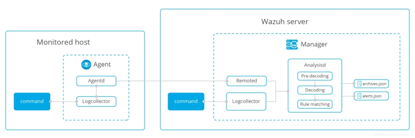 

在代理上设置特定命令输出的监控需要以下内容配置：

###### 3.6.1.1. **配置Wazuh代理以接受来自管理器的远程命令**

代理能够运行从管理器推送的命令（通过目录中的shared文件）。但是，在使用此功能之前，必须明确配置代理以接受远程命令。这可以通过在每个代理上的文件中设置[logcollector.remote_commands](#ossec-internal-logcollector)来完成，local_internal_options.conf如下所示：

\# Logcollector - Whether or not to accept remote commands from the manager

logcollector.remote_commands=1

###### 3.6.1.2. **配置要监控的命令**

可以在各个代理程序的本地[ossec.conf](#reference-ossec-conf)文件中配置要运行和监视的命令，但是，此配置的理想位置位于管理器上的[agent.conf](#reference-agent-conf)文件的相应配置中。

<localfile>

   <log_format>full_command</log_format>

   <command>.....</command>

   <frequency>120</frequency>

</localfile>

###### 3.6.1.3. **处理输出**

在配置系统以监视命令的输出（就像它是日志数据）之后，可以创建自定义规则，例如用于[日志分析](#manual-log-analysis)，以便处理输出并在满足警报条件时触发警报。

##### 3.6.2. **配置**

###### 3.6.2.1. **基本用法**

命令监视在[ossec.conf](#reference-ossec-conf)的[localfile section](#reference-ossec-localfile)中[配置](#reference-ossec-conf)。它也可以在[agent.conf中](#reference-agent-conf)集中配置。

###### 3.6.2.2. **监视运行Windows进程**

假设您希望监视正在运行的进程，并在重要进程未运行时发出警报。

使用notepad.exe作为监视的重要过程的示例：

1.在代理程序的local_internal_options.conf文件中配置代理程序以接受来自管理器的远程命令。

\# Logcollector - Whether or not to accept remote commands from the manager

logcollector.remote_commands=1

2.在manager的agent.conf文件中定义命令以列出正在运行的进程。

<localfile>

   <log_format>full_command</log_format>

   <command>tasklist</command>

   <frequency>120</frequency>

 </localfile>

该<frequency>标签定义命令将在几秒钟内运行。

3.定义规则

<rule id="100010" level="6">

 <if_sid>530</if_sid>

 <match>^ossec: output: 'tasklist'</match>

 <description>Important process not running.</description>

 <group>process_monitor,</group>

</rule>

<rule id="100011" level="0">

 <if_sid>100010</if_sid>

 <match>notepad.exe</match>

 <description>Processes running as expected</description>

 <group>process_monitor,</group>

</rule>

 

第一个规则（100010）将生成警报（“重要进程未运行”），除非它被其子命令（100011）覆盖，该子规则与命令输出中的notepad.exe匹配。您可以根据需要添加任意数量的子规则，以枚举您要监视的所有重要进程。您还可以通过<command>标签添加为tasklist列出进程的Linux命令来调整此示例以监视Linux 进程，例如命令：ps -auxw

###### 3.6.2.3. **磁盘空间利用率**

df可以在管理器的agent.conf文件或代理的ossec.conf文件中配置该命令：

<localfile>

  <log_format>command</log_format>

  <command>df -P</command>

</localfile>

Wazuh已经有规则来监控这个：

<rule id="531" level="7" ignore="7200">

 <if_sid>530</if_sid>

 <match>ossec: output: 'df -P': /dev/</match>

 <regex>100%</regex>

 <description>Partition usage reached 100% (disk space monitor).</description>

 <group>low_diskspace,pci_dss_10.6.1,</group>

</rule>

一旦任何分区上的磁盘空间使用率达到100％，系统将发出警报。

###### 3.6.2.4. **检查输出是否更改**

在这种情况下，Linux“netstat”命令与[check_diff选项一起](#rules-check-diff)用于监视侦听tcp sockets 的更改。

这可以在agent.conf文件或ossec.conf文件中配置：

<localfile>

 <log_format>full_command</log_format>

 <command>netstat -tan |grep LISTEN|grep -v 127.0.0.1</command>

</localfile>

Wazuh已经有规则来监控这个：

<rule id="533" level="7">

 <if_sid>530</if_sid>

 <match>ossec: output: 'netstat -tan</match>

 <check_diff />

 <description>Listened ports status (netstat) changed (new port opened or closed).</description>

 <group>pci_dss_10.2.7,pci_dss_10.6.1,</group>

</rule>

如果输出发生更改，系统将生成一个警报，指示网络侦听器已取消或已出现新的警报。这可能表示某些内容已损坏或已安装了后门

###### 3.6.2.5. **负载均衡值**

Wazuh可以配置为监视Linux ，uptime命令并在高于给定阈值时发出警报，例如本例中的2

这可以在agent.conf文件或ossec.conf文件中配置：

<localfile>

  <log_format>command</log_format>

  <command>uptime</command>

</localfile>

当“正常运行时间”高于2倍时，自定义规则会发出警报：

<rule id="100101" level="7" ignore="7200">

 <if_sid>530</if_sid>

 <match>ossec: output: 'uptime': </match>

 <regex>load averages: 2.</regex>

 <description>Load average reached 2..</description>

</rule>

 

###### 3.6.2.6. **检测USB存储**

Wazuh可配置为在连接USB存储设备时发出警报。此示例适用于Windows代理。

通过将以下内容添加到管理器来配置代理以监视USBSTOR注册表项 agent.conf

<agent_config os="Windows">

 <localfile>

   <log_format>full_command</log_format>

   <command>reg QUERY HKLM\SYSTEM\CurrentControlSet\Enum\USBSTOR</command>

 </localfile>

</agent_config>

 

接下来创建自定义规则：

<rule id="140125" level="7">

  <if_sid>530</if_sid>

  <match>ossec: output: 'reg QUERY</match>

  <check_diff />

  <description>New USB device connected</description>

</rule>

#### 3.7. **主动响应(Active Response)**

主动响应执行各种策略以解决受到的主动威胁，例如在满足某些规则时阻止从威胁源访问代理。

主动响应执行脚本以应答基于警报级别或规则组触发的特定警报。可以应答触发器启动任意数量的脚本，但是，应仔细考虑这些应答。规则和应答的执行不力可能会增加系统的危险性。

当使用规则触发警报时，会采取自动对策来执行对应脚本

 

##### 3.7.1. **触发主动响应**

主动响应是配置在特定警报，警报级别或规则组已被触发执行脚本。主动响应是有状态响应或无状态响应。状态响应配置为在指定的时间段后撤消操作，而无状态响应配置为一次性操作。

##### 3.7.2. **执行主动响应**

每个主动响应指定将执行其关联命令的位置包括：在触发警报的代理上，在管理器上，在另一个指定代理上或在还包括管理器的所有代理上。

##### 3.7.3. **主动响应配置**

通过修改管理器中[ossec.conf](#reference-ossec-conf)文件配置主动响应，如下所示：

 

l 创建一个命令

为了配置主动响应，必须定义一个命令，该命令将启动某个脚本以应答触发器。

要配置主动响应，请使用下面的模式定义命令的名称，然后引用要启动的脚本。接下来，定义将传递给脚本的数据类型。

能够从命令行接收参数的自定义脚本也可用于主动响应。

例如：

 

<command>

 <name>host-deny</name>

 <executable>host-deny.sh</executable>

 <expect>srcip</expect>

 <timeout_allowed>yes</timeout_allowed>

</command>

在此示例中，将调用该命令名（host-deny）并启动脚本（host-deny.sh）。数据类型定义为srcip。此命令配置为允许在指定的时间段内超时，使其成为有状态响应。

注意：有关在此处创建命令的更多信息和选项：[command](#reference-ossec-commands)

https://documentation.wazuh.com/current/user-manual/reference/ossec-conf/commands.html#reference-ossec-commands

 

 

l 定义主动响应

 

主动响应配置定义命令将在何时何处执行。当具有特定id，严重性级别或来源的特定规则与主动响应条件匹配时，将触发命令。此配置将进一步定义命令的操作将在何处启动，这意味着在执行位置：代理，管理器，本地或任何地方。

 

<active-response>

 <command>host-deny</command>

 <location>local</location>

 <level>7</level>

 <timeout>600</timeout>

</active-response>

在此示例中，主动响应配置为执行上一步中定义的命令。 操作的位置定义为本地主机，当定义为规则的级别高于6的时任何时间时。命令配置中允许的超时也在上面的示例中定义。

注意：有主动响应选项的更多信息：[主动响应](#reference-ossec-active-response)

https://documentation.wazuh.com/current/user-manual/reference/ossec-conf/active-response.html#reference-ossec-active-response

 

可以在以下位置查看主动响应日志：/var/ossec/logs/active-response.log

##### 3.7.4. **默认主动响应脚本**

Wazuh预先配置了以下Linux脚本：

| 脚本名称           | 描述                                    |
| ------------------ | --------------------------------------- |
| disable-account.sh | 通过设置禁用帐户 passwd-l               |
| firewall-drop.sh   | 将IP添加到iptables拒绝列表中            |
| firewalld-drop.sh  | 将IP添加到firewalld下拉列表中           |
| host-deny.sh       | 将IP添加到/etc/hosts.deny文件中         |
| ip-customblock.sh  | 自定义OSSEC，可轻松修改以进行自定义响应 |
| ipfw_mac.sh        | Mac OS创建的防火墙被删除的响应脚本      |
| ipfw.sh            | ipfw创建的防火墙被断开的响应脚本        |
| npf.sh             | npf创建的防火墙被删除的响应脚本         |
| ossec-slack.sh     | 在Slack上发布修改                       |
| ossec-tweeter.sh   | 在Twitter上发布修改                     |
| pf.sh              | pf创建的防火墙被删除的响应脚本          |
| restart-ossec.sh   | 更改ossec.conf时自动重启Wazuh           |
| route-null.sh      | 将IP添加到空路由                        |

以下预配置脚本适用于Windows：

| 脚本名称          | 描述              |
| ----------------- | ----------------- |
| netsh.cmd         | 使用netsh阻止ip   |
| restart-ossec.cmd | 重新启动ossec代理 |
| route-null.cmd    | 将IP添加到空路由  |

##### 3.7.5. **配置**

###### 3.7.5.1. **基本用法**

在[Active Response](#reference-ossec-active-response)和[Command](#reference-ossec-commands)部分的[ossec.conf](#reference-ossec-conf)文件中配置了主动[响应](#reference-ossec-active-response)。

在此示例中，restart-ossec命令配置为使用不带数据类型的restart-ossec.sh脚本。 主动响应配置为在ID为10005的规则触发时在本地主机上启动restart-ossec命令。 这是一个无状态响应，因为没有定义超时参数。

命令：

<command>

 <name>restart-ossec</name>

 <executable>restart-ossec.sh</executable>

 <expect></expect>

</command>

无状态主动响应：

<active-response>

 <command>restart-ossec</command>

 <location>local</location>

 <rules_id>10005</rules_id>

</active-response>

###### 3.7.5.2. **Windows自动修复**

在此示例中，该win_rout-null命令配置为脚本route-null.cmd，数据类型为脚本srcip。主动响应名称配置为win_rout-null，在规则等级高于7的警报级别时，将会在本地主机上启动该脚本命令。这是状态响应，超时设置为900秒。

命令：

<command>

 <name>win_route-null</name>

 <executable>route-null.cmd</executable>

 <expect>srcip</expect>

 <timeout_allowed>yes</timeout_allowed>

</command>

状态主动响应：

<active-response>

 <command>win_route-null</command>

 <location>local</location>

 <level>8</level>

 <timeout>900</timeout>

</active-response>

###### 3.7.5.3. **使用PF阻止IP**

在此示例中，该pf-block命令配置为脚本pf.sh，数据类型为脚本scrip，主动响应名称配置为pf-block当“authentication_failed”或“authentication_failures”规则组中的规则触发时，主动响应被配置为在agent001上启动j脚本命令。这是一个无状态响应，因为没有定义超时参数。

命令：

<command>

 <name>pf-block</name>

 <executable>pf.sh</executable>

 <expect>srcip</expect>

</command>

无状态主动响应：

<active-response>

 <command>pf-block</command>

 <location>defined-agent</location>

 <agent_id>001</agent_id>

 <rules_group>authentication_failed,authentication_failures</rules_group>

</active-response>

###### 3.7.5.4. **将IP添加到iptables列表**

在此示例中，firewall-drop命令配置为使用firewall-drop.sh脚本执行。 主动响应配置为在“authentication_failed”或“authentication_failures”规则组中的规则触发时，将在所有系统上启动firewall-drop.sh脚本命令。 这是状态响应，超时为700秒。 <repeated_offenders>标记通过特定IP地址增加每个后续攻击的超时时间。

注意：此参数以分钟而不是秒指定。

命令：

<command>

 <name>firewall-drop</command>

 <executable>firewall-drop.sh</executable>

 <expect>srcip</expect>

</command>

状态主动响应：

<active-response>

 <command>firewall-drop</command>

 <location>all</location>

 <rules_group>authentication_failed,authentication_failures</rules_group>

 <timeout>700</timeout>

 <repeated_offenders>30,60,120</repeated_offenders>

</active-response>

###### 3.7.5.5. **在指定时间段内的主动响应**

有状态响应的操作将持续指定的时间段。

在本例中，host-deny命令配置为使用数据类型scrip的host-deny.sh脚本。激活响应配置为在触发警报等级高于6的规则时将会在本地主机上启动host-deny.sh命令。

命令：

<command>

 <name>host-deny</name>

 <executable>host-deny.sh</executable>

 <expect>srcip</expect>

 <timeout_allowed>yes</timeout_allowed>

</command>

状态主动响应：

<active-response>

 <command>host-deny</command>

 <location>local</location>

 <level>7</level>

 <timeout>600</timeout>

</active-response>

更多信息：[命令](#reference-ossec-commands)

https://documentation.wazuh.com/current/user-manual/reference/ossec-conf/commands.html#reference-ossec-commands

 

###### 3.7.5.6. **不会撤消的主动响应**

无状态命令的动作是一次性动作，不会被撤消。

在本例中，mail-test命令被配置为使用不带数据元素的mail-test.sh脚本。活动响应配置为在ID为1002的规则触发时在服务器上启动邮件测试命令。

命令：

<command>

 <name>mail-test</name>

 <executable>mail-test.sh</executable>

 <timeout_allowed>no</timeout_allowed>

 <expect></expect>

</command>

不撤销的主动响应：

<active-response>

  <command>mail-test</command>

  <location>server</location>

  <rules_id>1002</rules_id>

 </active-response>

#### 3.8. **系统清单(System inventory)**

Wazuh代理能够收集有趣的系统信息并将其存储到管理器端的每个代理的SQLite数据库中。在这个模块，使用Syscollector收集信息，比如系统硬件组件的基本信息、操作系统的基本信息等等…
下面给出了它适用的操作系统以及扫描的模块：


##### 3.8.1. **工作原理**

如上所述，该模块的主要目的是从受监控系统中收集相关的信息。

代理启动后，Syscollector会定期扫描已定义的目标（硬件，操作系统，软件包等），将新收集的数据转发给管理器，管理器会更新数据库的相应表。

代理的清单是针对不同的目标而收集的。 通过查询API以从DB检索数据，可以在每个代理的Wazuh APP的清单选项卡中找到整个清单。 此外，还提供了开发工具选项卡，通过此功能，可以直接查询API，以了解能够按任何所需字段过滤的不同扫描。

此外，包清单用作[漏洞检测器模块的](https://documentation.wazuh.com/current/user-manual/capabilities/vulnerability-detection.html)订阅源。

https://documentation.wazuh.com/current/user-manual/capabilities/vulnerability-detection.html

 

此外，软件包清单用作[漏洞检测器模块的](https://documentation.wazuh.com/current/user-manual/capabilities/vulnerability-detection.html)的订阅源。

https://documentation.wazuh.com/current/user-manual/capabilities/vulnerability-detection.html

 

##### 3.8.2. **可用扫描**

来自Wazuh代理的收集信息存储在不同的SQLite表中。这里描述了每个可用表的内容。

目前，该模块适用于Linux，Windows，MacOS，OpenBS和FreeBSD。有关更多信息，请参阅[兼容性](#compatibility-matrix)选项。

https://documentation.wazuh.com/current/user-manual/capabilities/syscollector.html#compatibility-matrix

 

###### 3.8.2.1. **硬件**

版本3.2.0中的新功能。

检索有关系统硬件组件的基本信息。

| 名称         | 描述                | 参数                                        | 平台 |
| ------------ | ------------------- | ------------------------------------------- | ---- |
| SCAN_ID      | 扫描标识符          | 573872577                                   | 所有 |
| SCAN_TIME    | 扫描日期            | 2018/07/31 15:31:26                         | 所有 |
| board_serial | 主板序列号          | XDR840TUGM65E03171                          | 所有 |
| cpu_name     | CPU名称             | Intel（R）Core（TM）i7-7700HQ CPU @ 2.80GHz | 所有 |
| cpu_cores    | CPU的核心数         | 4                                           | 所有 |
| cpu_mhz      | 当前处理器频率      | 900.106                                     | 所有 |
| ram_total    | 总RAM（KB）         | 16374572                                    | 所有 |
| ram_free     | 剩余RAM（KB）       | 2111928                                     | 所有 |
| ram_usage    | 正在使用的RAM百分比 | 87                                          | 所有 |

###### 3.8.2.2. **操作系统**

版本3.2.0中的新功能。

检索有关操作系统的基本信息。

| 名称         | 描述             | 参数                                                 | 平台    |
| ------------ | ---------------- | ---------------------------------------------------- | ------- |
| SCAN_ID      | 扫描标识符       | 468455719                                            | 所有    |
| SCAN_TIME    | 扫描日期         | 2018/07/31 15:31:26                                  | 所有    |
| hostname     | 机器主机名       | AG-的ubuntu-16                                       | 所有    |
| architecture | OS arquitecture  | x86_64的                                             | 所有    |
| OS_NAME      | 操作系统名称     | Ubuntu的                                             | 所有    |
| OS_VERSION   | 操作系统版本     | 16.04.5 LTS（Xenial Xerus）                          | 所有    |
| os_codename  | 操作系统版本代号 | Xenial Xerus                                         | 所有    |
| os_major     | 主要发布版本     | 16                                                   | 所有    |
| os_minor     | 次要发布版本     | 04                                                   | 所有    |
| os_build     | 可选的特殊监听   | 14393                                                | windows |
| os_platform  | 系统平台         | Ubuntu的                                             | 所有    |
| sysname      | 系统名称         | Linux                                                | Linux   |
| release      | 发布名称         | 4.15.0-29-generic                                    | Linux   |
| version      | 发布版本         | ＃31~16.04.1-Ubuntu SMP Wed Jul 18 08:54:04 UTC 2018 | 所有    |

###### 3.8.2.3. **包**

版本3.2.0中的新功能。

每个Wazuh代理商的当前包装清单。在Linux系统上，检索到的包可以是DEB或RPM类型。

| 名称         | 描述                           | 参数                                  | 平台        |
| ------------ | ------------------------------ | ------------------------------------- | ----------- |
| SCAN_ID      | 扫描标识符                     | 1454946158                            | 所有        |
| SCAN_TIME    | 扫描日期                       | 2018/07/27 07:27:14                   | 所有        |
| format       | 包格式                         | DEB                                   | 所有        |
| name         | 包名称                         | linux-headers-generic                 | 所有        |
| priority     | 优先包                         | 可选的                                | DEB         |
| section      | 包部分                         | kernel                                | deb/rpm/pkg |
| size         | 已安装包的大小（以字节为单位） | 14                                    | deb/rpm     |
| vendor       | 供应商名称                     | Ubuntu Kernel Team                    | deb/rpm/win |
| install_time | 安装软件包日期                 | 2018/02/08 18:45:48                   | rpm/win     |
| version      | 包版本                         | 4.4.0.130.136                         | 所有        |
| architecture | 包架构                         | AMD64                                 | 所有        |
| multiarch    | 多体系结构支持                 | same                                  | DEB         |
| source       | 包来源                         | linux-meta                            | deb/rpm/pkg |
| description  | 包描述                         | Generic Linux kernel headers          | deb/rpm/pkg |
| location     | 包位置                         | C:\Program Files\VMware\VMware Tools\ | win/pkg     |

###### 3.8.2.4. **网络接口**

版本3.5.0中的新功能。

网络接口扫描检索系统现有网络接口（上下接口）及其路由配置的信息，它由三个表组成，以确保信息尽可能结构化。

sys_netiface表

| 名称       | 描述           | 参数                                 | 平台    |
| ---------- | -------------- | ------------------------------------ | ------- |
| ID         | ID             | 1                                    | 所有    |
| SCAN_ID    | 扫描标识符     | 160615720                            | 所有    |
| SCAN_TIME  | 扫描日期       | 2018/07/31 16:46:20                  | 所有    |
| name       | 接口名称       | 为eth0                               | 所有    |
| adapter    | 物理适配器名称 | 英特尔（R）PRO / 1000 MT台式机适配器 | Windows |
| type       | 网络适配器     | 以太网络                             | 所有    |
| state      | 接口状态       | 向上                                 | 所有    |
| MTU        | 最大传输单位   | 1500                                 | 所有    |
| mac        | MAC地址        | 08：00：27：C0：14：A5               | 所有    |
| tx_packets | 传输的数据包   | 30279                                | 所有    |
| rx_packets | 收到包         | 12754                                | 所有    |
| tx_bytes   | 传输的字节数   | 10034626                             | 所有    |
| rx_bytes   | 收到的字节数   | 1111175                              | 所有    |
| tx_errors  | 传输错误       | 0                                    | 所有    |
| rx_errors  | 接收错误       | 0                                    | 所有    |
| tx_dropped | 丢弃传输包     | 0                                    | 所有    |
| rx_dropped | 丢弃接收数据包 | 0                                    | 所有    |

引用sys_netiface表中描述的接口，此表显示与该接口关联的IPv4和IPv6地址

| 名称      | 描述                   | 参数          | 平台 |
| --------- | ---------------------- | ------------- | ---- |
| ID        | sys_netiface中引用的id | 1             | 所有 |
| SCAN_ID   | 扫描标识符             | 160615720     | 所有 |
| proto     | 协议名称               | IPv4的        | 所有 |
| address   | IPv4 / IPv6地址        | 192.168.1.87  | 所有 |
| netmask   | 网络掩码地址           | 255.255.255.0 | 所有 |
| broadcast | 广播地址               | 192.168.1.255 | 所有 |

sys_netproto表

引用sys_netiface表中描述的接口，该表显示了每个接口的路由配置。

| 名称    | 描述                   | 参数        | 平台            |
| ------- | ---------------------- | ----------- | --------------- |
| ID      | sys_netiface中引用的id | 1           | 所有            |
| SCAN_ID | 扫描标识符             | 160615720   | 所有            |
| iface   | 接口名称               | eth0        | 所有            |
| type    | 接口数据的协议         | IPv4        | 所有            |
| gateway | 默认网关               | 192.168.1.1 | Linux / Windows |
| DHCP    | DHCP状态               | enabled     | Linux / Windows |

###### 3.8.2.5. **端口**

版本3.5.0中的新功能。

列出系统的已开放端口。

| 名称        | 描述                 | 参数                | 平台    |
| ----------- | -------------------- | ------------------- | ------- |
| SCAN_ID     | 扫描标识符           | 1618114744          | 所有    |
| SCAN_TIME   | 扫描日期             | 2018/07/27 07:27:15 | 所有    |
| protocol    | 端口协议             | TCP                 | 所有    |
| local_ip    | 本地IP               | 0.0.0.0             | 所有    |
| LOCAL_PORT  | 本地端口             | 22                  | 所有    |
| remote_ip   | 远程IP               | 0.0.0.0             | 所有    |
| REMOTE_PORT | 远程端口             | 0                   | 所有    |
| tx_queue    | 待传输的数据包       | 0                   | Linux   |
| rx_queue    | 接收队列中的数据包   | 0                   | Linux   |
| inode       | 端口的节点           | 16974               | Linux   |
| state       | 端口的状态           | listening           | 所有    |
| PID         | 已开放端口的所有进程 | 4                   | Windows |
| process     | 进程的名称           | System              | Windows |

###### 3.8.2.6. **进****程**

版本3.5.0中的新功能。

列出系统主机中运行的当前进程。

| 名称       | 描述                              | 参数                | 平台  |
| ---------- | --------------------------------- | ------------------- | ----- |
| SCAN_ID    | 扫描标识符                        | 215303769           | 所有  |
| SCAN_TIME  | 扫描日期                          | 2018/08/03 12:57:58 | 所有  |
| PID        | 进程PID                           | 603                 | 所有  |
| name       | 流程名称                          | rsyslogd            | 所有  |
| stae       | 进程状况                          | s                   | Linux |
| PPID       | PPID值                            | 1                   | 所有  |
| UTIME      | 执行用户代码所花费的时间          | 157                 | Linux |
| STIME      | 执行系统代码所花费的时间          | 221                 | 所有  |
| CMD        | 命令已执行                        | /usr/sbin/rsyslogd  | 所有  |
| argvs      | 过程的参数                        | -n                  | Linux |
| EUSER      | 有效的用户                        | root                | Linux |
| RUSER      | 真实的用户                        | root                | Linux |
| suser      | 已保存的用户                      | root                | Linux |
| egroup     | 有效的组                          | root                | Linux |
| rgroup     | 真实的组                          | root                | linux |
| sgroup     | 保存组                            | root                | Linux |
| FGROUP     | 文件系统组名称                    | root                | Linux |
| priority   | 内核调度优先级                    | 20                  | 所有  |
| nice       | 良好的进程值                      | 0                   | Linux |
| size       | 进程的大小                        | 53030               | 所有  |
| vm_size    | 总VM大小（KB）                    | 212120              | 所有  |
| resident   | Residen的进程大小（以字节为单位） | 902                 | Linux |
| share      | 共享内存                          | 814                 | Linux |
| start_time | 进程开始的时间                    | 1893                | Linux |
| PGRP       | 流进程组                          | 603                 | Linux |
| session    | 会议进程                          | 603                 | 所有  |
| NLWP       | 轻量级进程的数量                  | 3                   | 所有  |
| TGID       | 线程组ID                          | 603                 | Linux |
| TTY        | 进程的TTY数                       | 0                   | Linux |
| processor  | 处理器的编号                      | 0                   | Linux |

##### 3.8.3. **兼容性模块**

下表显示了此模块当前支持的操作系统。

| 操作系统 | Syscollector扫描 |      |      |      |      |      |
| -------- | ---------------- | ---- | ---- | ---- | ---- | ---- |
| 硬件     | 系统             | 包   | 网络 | 端口 | 流程 |      |
| windows  | ✓                | ✓    | ✓    | ✓    | ✓    | ✓    |
| Linux    | ✓                | ✓    | ✓    | ✓    | ✓    | ✓    |
| mac      | ✓                | ✓    | ✓    | ✓    | ✗    | ✗    |
| FreeBSD  | ✓                | ✓    | ✓    | ✓    | ✗    | ✗    |
| OpenBSD  | ✓                | ✓    | ✗    | ✓    | ✗    | ✗    |

##### 3.8.4. **使用案例：在Wazuh应用程序中可视化系统清单**

默认情况下，Syscollector模块在所有兼容系统中启用，包括所有可用扫描。在这里我们可以看到默认配置块：

<!-- System inventory -->

<wodle name="syscollector">

 <disabled>no</disabled>

 <interval>1h</interval>

 <scan_on_start>yes</scan_on_start>

 <hardware>yes</hardware>

 <os>yes</os>

 <network>yes</network>

 <packages>yes</packages>

 <ports all="no">yes</ports>

 <processes>yes</processes>

</wodle>

一旦模块启动，它将定期运行扫描并以JSON事件格式将新数据发送到管理器，在那里它将被解码并存储到每个代理的特定数据库中。

可以通过不同方式查询当前清单。让我们看一个查询Debian代理中特定包的示例：

直接在位于管理器端查询数据库：$install_directory/queue/db/:agent_id.db

\# sqlite3 /var/ossec/queue/db/003.db

SQLite version 3.7.17 2013-05-20 00:56:22

Enter ".help" for instructions

Enter SQL statements terminated with a ";"

sqlite> select * from sys_programs where name="wazuh-agent";

696614220|2018/08/06 02:07:30|deb|wazuh-agent|extra|admin|105546|Wazuh, Inc <support@wazuh.com>||3.5.0-1|amd64|||Wazuh helps you to gain security visibility into your infrastructure by monitoring hosts at an operating system and application level. It provides the following capabilities: log analysis, file integrity monitoring, intrusions detection and policy and compliance monitoring||0

 

通过查询API，它以JSON格式检索嵌套数据。

\# curl -u foo:bar -X GET "http://localhost:55000/syscollector/003/packages?pretty&name=wazuh-agent"

{

 "error": 0,

 "data": {

  "totalItems": 1,

  "items": [

​    {

​     "vendor": "Wazuh, Inc <support@wazuh.com>",

​     "description": "Wazuh helps you to gain security visibility into your infrastructure by monitoring hosts at an operating system and application level. It provides the following capabilities: log analysis, file integrity monitoring, intrusions detection and policy and compliance monitoring",

​     "scan": {

​       "id": 696614220,

​       "time": "2018/08/06 02:07:30"

​     },

​     "section": "admin",

​     "format": "deb",

​     "name": "wazuh-agent",

​     "priority": "extra",

​     "version": "3.5.0-1",

​     "architecture": "amd64",

​     "size": 105546

​    }

  ]

 }

}

此外，可以在Wazuh应用程序中查阅相同的信息，其中包括每个代理的“清单”选项卡。目前，此选项卡上有可用的操作系统，硬件和软件包清单，如下面的屏幕截图所示：

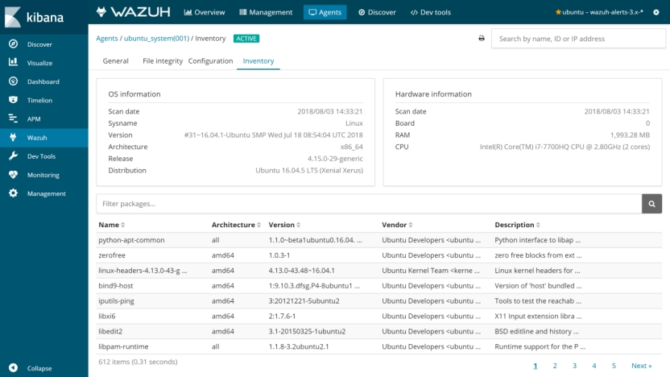 

在开发工具选项卡也可直接从Wazuh应用查询API，如下所示：

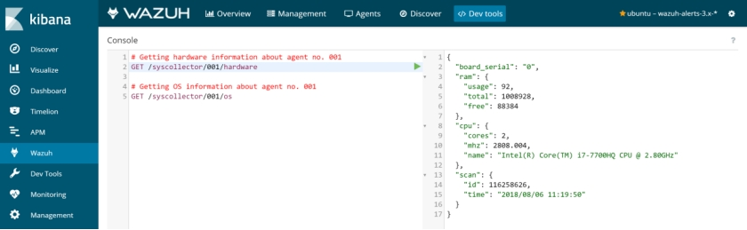 

您可以在[Syscollector配置](https://documentation.wazuh.com/current/user-manual/reference/ossec-conf/wodle-syscollector.html)参考中找到有关如何配置此功能的更多信息。

https://documentation.wazuh.com/current/user-manual/reference/ossec-conf/wodle-syscollector.html

#### 3.9. **漏洞检测(Vulnerability detection)**

可以检测agent端已安装的应用程序是否存在漏洞定期发送给server端.此功能可用于检测已知易受攻击的应用程序（受CVE影响）。

##### 3.9.1. **工作原理**

为了能够检测漏洞，现在代理能够本地收集已安装应用程序的列表，并定期将其发送给管理器（其存储在本地sqlite数据库中，每个代理一个数据库）。此外，管理器使用公共OVAL CVE库构建全局漏洞数据库，然后使用它将此信息与代理的应用程序清单数据进行关联。

全局漏洞数据库是自动创建的，目前从以下库中提取数据：

l [https://people.canonical.com](https://people.canonical.com/)：用于为Ubuntu Linux发行版提取CVE。

l [https://www.redhat.com](https://www.redhat.com/)：用于为Red Hat和CentOS Linux发行版提供CVE。

l [https://www.debian.com](https://www.debian.com/)：用于为Debian Linux发行版提取CVE。

可以将此数据库配置为定期更新，以确保解决方案将检查最新的CVE。

创建全局漏洞数据库（使用CVE）后，检测过程将在清单数据库中查找易受攻击的软件包（每个代理的哦程序唯一）。当CVE（常见漏洞和披露）影响已知安装在其中一个受监视服务器中的程序包时，将生成警报。

##### 3.9.2. **兼容性模块**

下表显示了漏洞检测程序当前支持的操作系统（我们正在支持新的操作系统）以及每个分发所需的OVAL配置：

| 系统             | 版本           | 配置Feed       |
| ---------------- | -------------- | -------------- |
| Red Hat & CentOS | 5              | 红帽安全数据库 |
| 6                |                |                |
| 7                |                |                |
| Ubuntu           | 12             | Ubuntu 12 OVAL |
| 14               | Ubuntu 14 OVAL |                |
| 16               | Ubuntu 16 OVAL |                |
| 18               | Ubuntu 18 OVAL |                |
| Debian           | 7              | Debian 7 OVAL  |
| 8                | Debian 8 OVAL  |                |
| 9                | Debian 9 OVAL  |                |
| Amazon Linux     | 1              | 红帽安全数据库 |
| 2                |                |                |

##### 3.9.3. **运行漏洞扫描使用案例**

以下示例显示如何配置运行漏洞检测过程所需的组件。

启用用于在受监视系统上收集已安装软件包的代理模块。  您可以这样做，将以下设置块添加到您的管理器配置文件中：

<wodle  name = “syscollector” >

 <disabled>no</disabled>

 <interval>1h</interval>

 <packages>yes</packages>

</wodle>

检查[Syscollector设置](https://documentation.wazuh.com/current/user-manual/reference/ossec-conf/wodle-syscollector.html)以获取更多详细信息。

2.启用用于检测漏洞的管理器模块。  您可以这样做，将以下设置块添加到管理器配置文件中：

<wodle  name = “vulnerability-detector” >

 <disabled>no</disabled>

 <interval>5m</interval>

 <run_on_start>yes</run_on_start>

 <feed name = “ubuntu-18” >

  <disabled>no</disabled>

  <update_interval>1h</update_interval>

 </feed>

</wodle>

请记住重新启动管理器以应用更改：

a.For Systemd:

\# systemctl restart wazuh-manager

b.For SysV Init:

\# service wazuh-manager restart

检查[漏洞检测器设置](https://documentation.wazuh.com/current/user-manual/reference/ossec-conf/wodle-vuln-detector.html)以获取更多详细信息。

每个警报都会捕获以下字段：

l CVE：相应漏洞的CVE标识符。

l 标题：漏洞影响的简单描述。

l 严重性：它指定漏洞在安全性方面的影响。

l 发布：漏洞被包含在官方数据库中的日期。

l 参考：官方数据库网站的URL以及该漏洞的额外信息。

l 理由：该漏洞的广泛描述。

l 状态：此字段通知是否存在漏洞（已修复）或其状态的补丁。

请参阅下面的警报示例：

** Alert 1532935655.161547: - vulnerability-detector,gdpr_IV_35.7.d,

2018 Jul 30 09:27:35 manager->vulnerability-detector

Rule: 23505 (level 10) -> 'CVE-2018-3693 on Ubuntu 18.04 LTS (bionic) - high.'

{"vulnerability":{"cve":"CVE-2018-3693","title":"CVE-2018-3693 on Ubuntu 18.04 LTS (bionic) - high.","severity":"High","published":"2018-07-10","updated":"2018-07-10","reference":"https://cve.mitre.org/cgi-bin/cvename.cgi?name=CVE-2018-3693","state":"Pending confirmation","package":{"name":"firefox","version":"61.0.1+build1-0ubuntu0.18.04.1"}}}

vulnerability.cve: CVE-2018-3693

vulnerability.title: CVE-2018-3693 on Ubuntu 18.04 LTS (bionic) - high.

vulnerability.severity: High

vulnerability.published: 2018-07-10

vulnerability.updated: 2018-07-10

vulnerability.reference: https://cve.mitre.org/cgi-bin/cvename.cgi?name=CVE-2018-3693

vulnerability.state: Pending confirmation

vulnerability.package.name: firefox

vulnerability.package.version: 61.0.1+build1-0ubuntu0.18.04.1

下图显示了Kibana上的漏洞警报：

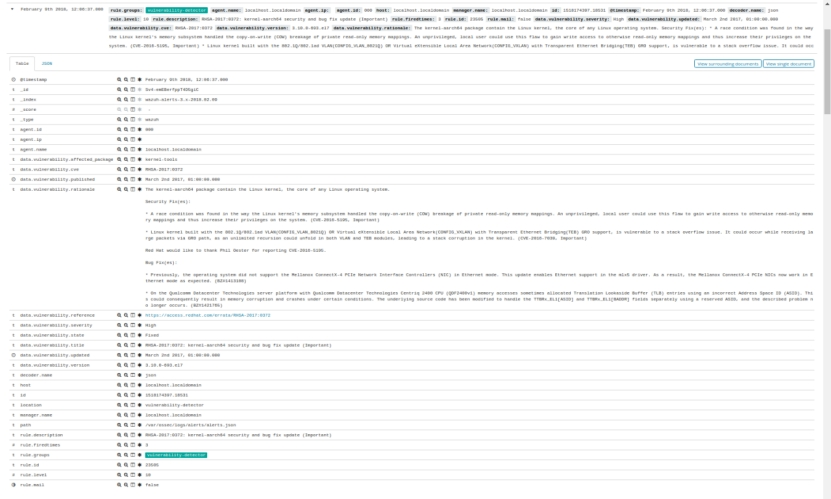 

#### 3.10. **VirusTotal集成(Vi**[**rusT**](https://so.csdn.net/so/search?q=rusT)**otal integration)**

Wazuh可以扫描受监控文件中的恶意内容。通过与VirusTotal集成，可以实现此解决方案，VirusTotal是一个功能强大的平台，可聚合多个防病毒产品以及在线扫描引擎。将此工具与我们的FIM引擎相结合，可以提供一种简单的方法来扫描受监视的文件，以检查它们是否存在恶意内容。

从3.0.0版本开始wazuh就可以集成VirusTotal扫描文件中是否包含恶意内容(病毒，蠕虫，特洛伊木马)

##### 3.10.1. **关于VirusTotal**

VirusTotal是一种在线服务，可使用防病毒引擎和网站扫描程序分析文件和URL，以检测病毒，蠕虫，特洛伊木马和其他类型的恶意内容。它还具有检测误报的能力。

VirusTotal是一项免费服务，具有众多实用功能。为了我们的目的，我们将强调以下内容：

l VirusTotal存储它执行的所有分析，允许搜索特定文件的哈希值。通过将哈希发送到VirusTotal引擎，可以知道VirusTotal是否已扫描该特定文件并分析其报告。

l Virustotal还提供了一个API，允许访问Virustotal生成的信息，而无需使用HTML网站界面。此API受其服务条款的约束，这些条款将在下面的章节中进行简要讨论。

###### 3.10.1.1. **服务条款**

VirusTotal的服务条款指定了VirusTotal API的两种使用方式：

###### 3.10.1.2. **公共API**

此方法使用具有许多VirusTotal功能的免费API，但是，它有一些重要的限制，例如：

l 请求率限制为每分钟不超过四个请求

l 此API为VirusTotal引擎执行的请求的低优先级访问。

VirusTotal文档指出，运行honeyclient，honeypot或任何其他为VirusTotal提供资源的自动化的用户在执行API调用时会获得更高的请求率配额和特权。

###### 3.10.1.3. **私有API**

VirusTotal还提供高级私有API，其中请求率和允许的查询总数仅受用户的服务条款限制。除此之外，它还为请求提供高优先级访问，以及其他优势。

要了解有关VirusTotal，其服务条款及其API的更多信息，请访问他们的[网站](https://developers.virustotal.com/v2.0/reference)。

##### 3.10.2. **工作原理**

此集成利用VirusTotal API检测由此集成利用VirusTotal API检测由文件完整性检查的监控文件中的恶意内容。 此集成的功能如下所述：

FIM会查找受监视文件夹上的任何文件添加，更改或删除。此模块存储此文件的哈希值，并在进行任何更改时触发警报。

启用VirusTotal集成后，会在发生FIM警报时触发它。从该警报中，模块提取文件的哈希字段。

模块使用VirusTotal API向VirusTotal数据库发出HTTP POST请求，以便在提取的哈希值与数据库中包含的信息之间进行比较。

接收JSON响应后，该响应是此搜索的结果，将触发以下警报之一：

l 错误：已达到公共API请求频率限制。

l 错误：检查凭据。

l 警报：VirusTotal数据库中没有记录。

l 警报：未发现未知的攻击

l 警报：X引擎检测到此文件。

触发的警报记录在integration.log文件中，并存储在alerts.log文件中，包含所有其他警报。

在下面的[VirusTotal集成警报](#virustotal-integration-alerts)部分中查找这些警报的示例。

##### 3.10.3. **扫描文件使用案例**

###### 3.10.3.1. **入门**

按照[与外部API集成中](#manual-integration)的说明启用Integrator守护程序，安装requests程序包并配置VirusTotal集成。

这是在ossec.conf文件中添加的示例配置：

<integration>

 <name>virustotal</name>

 <api_key>API_KEY</api_key> <!-- Replace with your VirusTotal API key -->

 <group>syscheck</group>

 <alert_format>json</alert_format>

</integration>

###### 3.10.3.2. **使用FIM监视目录**

对于此用例，我们将展示如何使用代理监视文件夹/media/user/software

必须将以下内容添加到配置文件的<syscheck>部分中：

<syscheck>

...

 <directories check_all="yes" realtime="yes">/media/user/software</directories>

...

</syscheck>

2.应用配置后，您必须重新启动Wazuh管理器：

对于Systemd：

\#systemctl restart wazuh-manager

对于SysV Init：

\#service wazuh-manager restart

重新启动后，FIM将应用新配置，并将实时监控指定的文件夹。将文件添加到受监视目录时，将显示以下警报：

** Alert 1510684983.55139: - ossec,syscheck,pci_dss_11.5,gpg13_4.11,

2017 Nov 14 18:43:03 PC->syscheck

Rule: 554 (level 5) -> 'File added to the system.'

New file '/media/user/software/suspicious-file.exe' added to the file system.

File: /media/user/software/suspicious-file.exe

New size: 1568509

New permissions: 100777

New user: user (1000)

New group: user (1000)

New MD5: 9519135089d69ad7ae6b00a78480bb2b

New SHA1: 68b92d885317929e5b283395400ec3322bc9db5e

New date: Tue Nov 14 18:42:41 2017

New inode: 104062

从此警报中，集成器守护程序提取哈希字段，将请求发送到VirusTotal进行比较。

注意：有关如何在[其手册中](#manual-file-integrity)使用文件完整性监控进行常规或实时目录扫描的详细信息。

###### 3.10.3.3. **VirusTotal集成警报**

当integrator 器模块发送对VirusTotal的请求时，如上所述，将根据情况触发不同的警报。以下是这些警报的示例和说明：

API认证不正确：

** Alert 1510676062.9653: - virustotal,

2017 Nov 14 16:14:22 PC->virustotal

Rule: 87102 (level 3) -> 'VirusTotal: Error: Check credentials'

{"virustotal": {"description": "Error: Check credentials", "error": 403}, "integration": "virustotal"}

virustotal.description: Error: Check credentials

virustotal.error: 403

integration: virustotal

此错误表示配置中设置的API密钥无效。

API已达到设定的频率限制：

** Alert 1510684990.60518: - virustotal,

2017 Nov 14 18:43:10 PC->virustotal

Rule: 87101 (level 3) -> 'VirusTotal: Error: Public API request rate limit reached'

{"virustotal": {"description": "Error: Public API request rate limit reached", "error": 204}, "integration": "virustotal"}

virustotal.description: Error: Public API request rate limit reached

virustotal.error: 204

integration: virustotal

达到VirusTotal设置的请求频率限制时会触发此错误。有关此限制的更多信息，请参阅[服务条款](#virustotal-tos)。

虽然之前的两个警报表示可能发生的错误，但以下是成功请求返回的警报示例：

当VirusTotal数据库中没有记录时收到的警报：

** Alert 1510684376.32386: - virustotal,

2017 Nov 14 18:32:56 PC->virustotal

Rule: 87103 (level 3) -> 'VirusTotal: Alert - No records in VirusTotal database'

{"virustotal": {"found": 0, "malicious": 0, "source": {"alert_id": "1510684374.31421", "sha1": "e4450be2f9a1a97cf0c71ce3efc802cea274fe9a", "file": "/media/user/software/my-clean-program.exe", "agent": {"id": "006", "name": "agent_centos"}, "md5": "9c8a83c9f4c39e8200661c33e188e79b"}}, "integration": "virustotal"}

virustotal.found: 0

virustotal.malicious: 0

virustotal.source.alert_id: 1510684374.31421

virustotal.source.sha1: e4450be2f9a1a97cf0c71ce3efc802cea274fe9a

virustotal.source.file: /media/user/software/my-clean-program.exe

virustotal.source.agent.id: 006

virustotal.source.agent.name: agent_centos

virustotal.source.md5: 9c8a83c9f4c39e8200661c33e188e79b

integration: virustotal

 

发现扫描文件并由数据库识别为恶意软件时收到的警报：

** Alert 1510684984.55826: mail  - virustotal,

2017 Nov 14 18:43:04 PC->virustotal

Rule: 87105 (level 12) -> 'VirusTotal: Alert - /media/user/software/suspicious-file.exe - 7 engines detected this file'

{"virustotal": {"permalink": "https://www.virustotal.com/file/8604adffc091a760deb4f4d599ab07540c300a0ccb5581de437162e940663a1e/analysis/1510680277/", "sha1": "68b92d885317929e5b283395400ec3322bc9db5e", "malicious": 1, "source": {"alert_id": "1510684983.55139", "sha1": "68b92d885317929e5b283395400ec3322bc9db5e", "file": "/media/user/software/suspicious-file.exe", "agent": {"id": "006", "name": "agent_centos"}, "md5": "9519135089d69ad7ae6b00a78480bb2b"}, "positives": 7, "found": 1, "total": 67, "scan_date": "2017-11-14 17:24:37"}, "integration": "virustotal"}

virustotal.permalink: https://www.virustotal.com/file/8604adffc091a760deb4f4d599ab07540c300a0ccb5581de437162e940663a1e/analysis/1510680277/

virustotal.sha1: 68b92d885317929e5b283395400ec3322bc9db5e

virustotal.malicious: 1

virustotal.source.alert_id: 1510684983.55139

virustotal.source.sha1: 68b92d885317929e5b283395400ec3322bc9db5e

virustotal.source.file: /media/user/software/suspicious-file.exe

virustotal.source.agent.id: 006

virustotal.source.agent.name: agent_centos

virustotal.source.md5: 9519135089d69ad7ae6b00a78480bb2b

virustotal.positives: 7

virustotal.found: 1

virustotal.total: 67

virustotal.scan_date: 2017-11-14 17:24:37

integration: virustotal

#### 3.11. **Osquery**

从3.5.0版本开始可以设置Osquery配置并收集由Osquery生成的信息以将其发送给manager，并在必要时生成相应的警报。

##### 3.11.1. **工作原理**

Osquery可用于将操作系统公开为高性能关系数据库。 这允许您编写基于SQL的查询来搜索操作系统数据。

您可以在下面看到一些可以进行查询的示例：

列出本机的所有本地用户

SELECT * FROM users;

获取进程名称，端口和PID，以获取在所有接口上侦听进程

SELECT DISTINCT processes.name, listening_ports.port, processes.pid

FROM listening_ports JOIN processes USING (pid)

WHERE listening_ports.address = '0.0.0.0';

检查具有已删除可执行文件的进程

SELECT * FROM processes WHERE on_disk = 0;

可在[此处](https://osquery.io/schema/3.2.6/)找到所有可用表的完整列表。

##### 3.11.2. **配置**

您需要在系统中安装有效的Osquery。有关详情，请参阅[下载页面](https://osquery.io/downloads/official/3.2.6/)

Red Hat, CentOS and Fedora:

\# curl -L https://pkg.osquery.io/rpm/GPG | tee /etc/pki/rpm-gpg/RPM-GPG-KEY-osquery

\# yum-config-manager --add-repo https://pkg.osquery.io/rpm/osquery-s3-rpm.repo

\# yum-config-manager --enable osquery-s3-rpm

\# yum install osquery

Debian and Ubuntu based Linux distributions:

\# export OSQUERY_KEY=1484120AC4E9F8A1A577AEEE97A80C63C9D8B80B

\# apt-key adv --keyserver keyserver.ubuntu.com --recv-keys $OSQUERY_KEY

\# add-apt-repository 'deb [arch=amd64] https://pkg.osquery.io/deb deb main'

\# apt-get update

\# apt-get install osquery

安装后，您将需要一个用于osquery的配置文件。如果没有，可以使用osquery提供的以下内容：

\# cp /usr/share/osquery/osquery.example.conf /etc/osquery/osquery.conf

或者您可以在/etc/osquery/osquery.conf中复制我们的自定义配置：

{

  "options": {

​    "config_plugin": "filesystem",

​    "logger_plugin": "filesystem",

​    "utc": "true"

  },

 

  "schedule": {

​    "system_info": {

​    "query": "SELECT hostname, cpu_brand, physical_memory FROM system_info;",

​    "interval": 3600

​    },

​    "high_load_average": {

​    "query": "SELECT period, average, '70%' AS 'threshold' FROM load_average WHERE period = '15m' AND average > '0.7';",

​    "interval": 900,

​    "description": "Report if load charge is over 70 percent."

​    },

​    "low_free_memory": {

​    "query": "SELECT memory_total, memory_free, CAST(memory_free AS real) / memory_total AS memory_free_perc, '10%' AS threshold FROM memory_info WHERE memory_free_perc < 0.1;",

​    "interval": 1800,

​    "description": "Free RAM is under 10%."

​    }

  },

 

  "packs": {

​    "osquery-monitoring": "/usr/share/osquery/packs/osquery-monitoring.conf",

​    "incident-response": "/usr/share/osquery/packs/incident-response.conf",

​    "it-compliance": "/usr/share/osquery/packs/it-compliance.conf",

​    "vuln-management": "/usr/share/osquery/packs/vuln-management.conf",

​    "hardware-monitoring": "/usr/share/osquery/packs/hardware-monitoring.conf",

​    "ossec-rootkit": "/usr/share/osquery/packs/ossec-rootkit.conf"

  }

}

正如您在此示例配置中看到的那样，system_info，high_load_average和low_free_memory查询将每小时执行一次。

此外，此配置使用一些默认包，例如osquery-monitoring，hardware-monitoring或ossec-rootkit其他。您可以定义自己的包并使用此wodle。

##### 3.11.3. **告警示例**

日志格式的示例警报：

** Alert 1532958886.437707: - osquery,

  2018 Jul 30 13:54:46 manager->osquery

  Rule: 24010 (level 3) -> 'osquery data grouped'

  {"name":"system_info","hostIdentifier":"manager","calendarTime":"Mon Jul 30 13:54:45 2018 UTC","unixTime":1532958885,"epoch":0,"counter":461,"columns":{"cgroup_namespace":"4026531835","cmdline":"","cwd":"/","disk_bytes_read":"0","disk_bytes_written":"0","egid":"0","euid":"0","gid":"0","ipc_namespace":"4026531839","mnt_namespace":"4026531840","name":"migration/0","net_namespace":"4026531957","nice":"0","on_disk":"-1","parent":"2","path":"","pgroup":"0","pid":"9","pid_namespace":"4026531836","resident_size":"","root":"/","sgid":"0","start_time":"0","state":"S","suid":"0","system_time":"2","threads":"1","total_size":"","uid":"0","user_namespace":"4026531837","user_time":"0","uts_namespace":"4026531838","wired_size":"0"},"action":"added"}

  name: system_info

  hostIdentifier: manager

  calendarTime: Mon Jul 30 13:54:45 2018 UTC

  unixTime: 1532958885

  epoch: 0

  counter: 461

  columns.cgroup_namespace: 4026531835

  columns.cmdline:

  columns.cwd: /

  columns.disk_bytes_read: 0

  columns.disk_bytes_written: 0

  columns.egid: 0

  columns.euid: 0

  columns.gid: 0

  columns.ipc_namespace: 4026531839

  columns.mnt_namespace: 4026531840

  columns.name: migration/0

  columns.net_namespace: 4026531957

  columns.nice: 0

  columns.on_disk: -1

  columns.parent: 2

  columns.path:

  columns.pgroup: 0

  columns.pid: 9

  columns.pid_namespace: 4026531836

  columns.resident_size:

  columns.root: /

  columns.sgid: 0

  columns.start_time: 0

  columns.state: S

  columns.suid: 0

  columns.system_time: 2

  columns.threads: 1

  columns.total_size:

  columns.uid: 0

  columns.user_namespace: 4026531837

  columns.user_time: 0

  columns.uts_namespace: 4026531838

  columns.wired_size: 0

和JSON格式相同的警报：

{

"timestamp": "2018-07-30T13:54:46.476+0000",

"rule": {

  "level": 3,

  "description": "osquery data grouped",

  "id": "24010",

  "firedtimes": 207,

  "mail": false,

  "groups": [

  "osquery"

  ]

},

"agent": {

  "id": "000",

  "name": "manager"

},

"manager": {

  "name": "manager"

},

"id": "1532958886.437707",

"full_log": "{\"name\":\"system_info\",\"hostIdentifier\":\"manager\",\"calendarTime\":\"Mon Jul 30 13:54:45 2018 UTC\",\"unixTime\":1532958885,\"epoch\":0,\"counter\":461,\"columns\":{\"cgroup_namespace\":\"4026531835\",\"cmdline\":\"\",\"cwd\":\"/\",\"disk_bytes_read\":\"0\",\"disk_bytes_written\":\"0\",\"egid\":\"0\",\"euid\":\"0\",\"gid\":\"0\",\"ipc_namespace\":\"4026531839\",\"mnt_namespace\":\"4026531840\",\"name\":\"migration/0\",\"net_namespace\":\"4026531957\",\"nice\":\"0\",\"on_disk\":\"-1\",\"parent\":\"2\",\"path\":\"\",\"pgroup\":\"0\",\"pid\":\"9\",\"pid_namespace\":\"4026531836\",\"resident_size\":\"\",\"root\":\"/\",\"sgid\":\"0\",\"start_time\":\"0\",\"state\":\"S\",\"suid\":\"0\",\"system_time\":\"2\",\"threads\":\"1\",\"total_size\":\"\",\"uid\":\"0\",\"user_namespace\":\"4026531837\",\"user_time\":\"0\",\"uts_namespace\":\"4026531838\",\"wired_size\":\"0\"},\"action\":\"added\"}",

"decoder": {

  "name": "json"

},

"data": {

  "action": "added",

  "name": "system_info",

  "hostIdentifier": "manager",

  "calendarTime": "Mon Jul 30 13:54:45 2018 UTC",

  "unixTime": "1532958885",

  "epoch": "0",

  "counter": "461",

  "columns": {

​    "cgroup_namespace": "4026531835",

​    "cmdline": "",

​    "cwd": "/",

​    "disk_bytes_read": "0",

​    "disk_bytes_written": "0",

​    "egid": "0",

​    "euid": "0",

​    "gid": "0",

​    "ipc_namespace": "4026531839",

​    "mnt_namespace": "4026531840",

​    "name": "migration/0",

​    "net_namespace": "4026531957",

​    "nice": "0",

​    "on_disk": "-1",

​    "parent": "2",

​    "path": "",

​    "pgroup": "0",

​    "pid": "9",

​    "pid_namespace": "4026531836",

​    "resident_size": "",

​    "root": "/",

​    "sgid": "0",

​    "start_time": "0",

​    "state": "S",

​    "suid": "0",

​    "system_time": "2",

​    "threads": "1",

​    "total_size": "",

​    "uid": "0",

​    "user_namespace": "4026531837",

​    "user_time": "0",

​    "uts_namespace": "4026531838",

​    "wired_size": "0"

  }

},

"predecoder": {

  "hostname": "manager"

},

"location": "osquery"

}

注意：如果收到多个具有相同内容的报告，则第一次仅生成一个警报。其余的将被丢弃。

#### 3.12. **Agent key轮询(Agent key polling)**

polling:轮询，由CPU定时发出询问，依序询问每一个周边设备是否需要其服务，有即给予服务，服务结束后再问下一个周边，接着不断周而复始

##### 3.12.1. **工作原理**

此模块允许从外部数据库（如MySQL或任何数据库引擎）检索代理信息，以将其注册到client.keys文件中。

为此，必须使用可以集成到数据库引擎中的任何语言创建二进制文件或脚本，从而请求代理的信息。该ossec-authd守护程序必须运行。

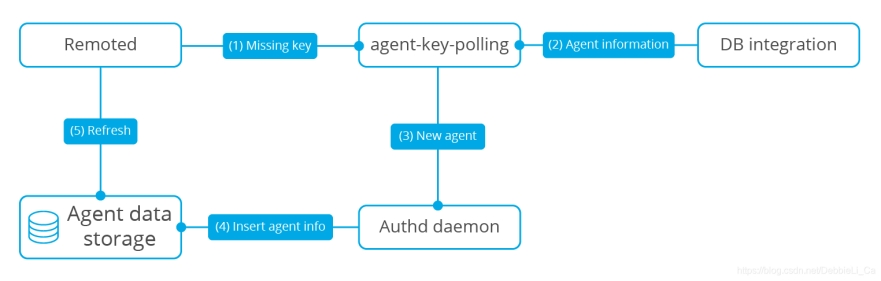 

##### 3.12.2. **输入**

如果socket未在配置块中指定标记，则密钥轮询模块将使用以下参数调用可执行文件，具体取决于轮询类型：

l Poll agent by ID

l Poll agent by IP

按Poll agent by ID时，管理器将通过查询其ID来检索代理密钥，因此程序将接收的输入参数例如：

./agent_key_pull.py id 001

通过Poll agent by IP时，管理器将通过查询其IP地址来检索代理密钥，因此程序将接收的输入参数例如：

./agent_key_pull.py ip 192.168.1.100

 

 

注意：请记住，上面的例子代表Wazuh将如何调用您的程序。

当socket指定标签模块将通过指定的套接字发送参数和读取响应。如上所述，执行程序的性能改进很重要。

程序将接收数据的格式是option:value，选项可以是id或ip取决于轮询类型。

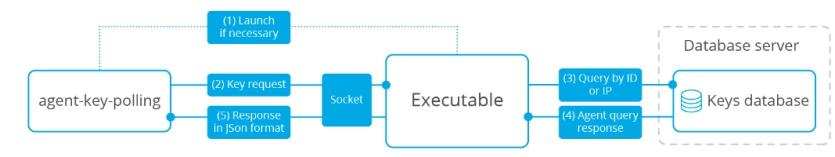 

 

必须允许空输入。 代理密钥轮询模块在启动时执行套接字运行状况检查。 如果连接成功建立，则立即关闭。

注意：如果指定了套接字选项，并且套接字不可用，则在指定的情况下将调用必须打开的程序。

##### 3.12.3. **Output**

脚本的输出必须是标准输出中的JSON对象。

成功的例子：

{

  "error": 0,

  "data": {

​    "id": "001",

​    "name": "my_agent",

​    "ip": "192.168.1.100",

​    "key": "ac575526e8bbcddf6654e5aa0a39fa60a0020e5d34ed1370916368bdaf5f0c71"

  }

}

error：错误识别号码

| 允许的字符   | 仅限数字     |
| ------------ | ------------ |
| Allowed size | 1位数        |
| Unique value | yes，必须是0 |

data：具有以下字段的json格式的数据

| 允许的字段 | id，name，ip，key |
| ---------- | ----------------- |
|            |                   |

ID：代理识别码

| 允许的字符   | 仅限数字 |
| ------------ | -------- |
| Allowed size | 3到8位数 |
| Unique value | yes      |

name：代理名称

| 允许的字符   | 字母数字字符-，_和. |
| ------------ | ------------------- |
| Allowed size | 最多128个字节       |
| Unique value | yes                 |

address：允许的源地址范围采用CIDR格式。如果指定，则管理器仅在其源IP与此地址匹配时才接受代理。

| 格式            | CIDR。网络掩码是可选的。 |
| --------------- | ------------------------ |
| Unique value    | yes                      |
| Reserved values | nothing                  |
| Aliases         | any = 0.0.0.0/0          |

key:将参与外部邮件加密的字符串

| 允许的字符   | 可打印的字符  |
| ------------ | ------------- |
| Allowed size | 最多128个字节 |
| Unique value | No            |

错误示例：

{

  "error": 1,

  "message": "Your error message"

}

error:错误识别号码

| 允许的字符   | 特殊字符 |
| ------------ | -------- |
| Unique value | yes      |

信息：将显示消息错误的字符串

| 允许的字符   | 可打印的字符 |
| ------------ | ------------ |
| Unique value | NO           |

##### 3.12.4. **示例脚本**

假设您的数据库中有一个名为agent的表，其结构如下：

| 类型      | 参数值         |
| --------- | -------------- |
| ID        | VARCHAR（8）   |
| name      | VARCHAR（128） |
| IP        | VARCHAR（19）  |
| agent_key | VARCHAR（128） |

注意：如果您的可执行文件是不包含shebang的脚本，则必须将其 interpreter包含在配置的sexec_path参数中。

下面的python脚本显示了从数据库（MySQL）检索代理密钥的示例。

import sys

import json

import mysql.connector

from mysql.connector import Error

 

def main():

 

  if len(sys.argv) < 3:

​    print json.dumps({"error": 1, "message": "Too few arguments"})

​    return

 

  try:

​    conn = mysql.connector.connect(host='localhost',

​                  database='your_database',

​                  user='user',

​                  password='secret')

  except Error as e:

​    print json.dumps({"error": 2, "message": str(e)})

​    return

 

  cursor = conn.cursor()

  data = sys.argv[2]

 

  if sys.argv[1] == "id":

​    cursor.execute("SELECT id,name,ip,`agent_key` FROM agent WHERE id = '{}'".format(data))

  elif sys.argv[1] == "ip":

​    cursor.execute("SELECT id,name,ip,`agent_key` FROM agent WHERE ip = '{}'".format(data))

  else:

​    print json.dumps({"error": 3, "message": "Bad arguments given"})

​    return

 

  row = cursor.fetchone()

 

  if row:

​    print json.dumps({"error": 0, "data": {"id" : row[0], "name": row[1], "ip": row[2], "key": row[3]}},sort_keys=False)

  else:

​    print json.dumps({"error": 4, "message": "No agent key found"},sort_keys=False)

 

if __name__ == '__main__':

  main()

下面的php脚本显示了从数据库（MySQL）中检索代理密钥的示例。

<?php

  $servername = "localhost";

  $username = "user";

  $password = "secret";

  $dbname = "your_database";

 

  if($argc < 3){

​    echo json_encode(array('error' => 1, 'message' => 'To few arguments'));

​    exit;

  }

 

  $conn = new mysqli($servername, $username, $password, $dbname);

  if ($conn->connect_error) {

​    echo json_encode(array('error' => 2, 'message' => 'Could not connect to database'));

​    exit;

  }

 

  $data = $argv[2];

 

  if($argv[1] == "id"){

​    $sql = "SELECT id,name,ip,`agent_key` FROM agent WHERE id = '$data'";

  } else if ($argv[1] == "ip") {

​    $sql = "SELECT id,name,ip,`agent_key` FROM agent WHERE ip = '$data'";

  } else {

​    echo json_encode(array('error' => 3, 'message' => 'Bad arguments given'));

​    exit;

  }

 

  $result = $conn->query($sql);

 

  if ($result->num_rows > 0) {

​    $row = $result->fetch_assoc();

​    echo json_encode(array('error' => 0, 'data' => array( "id" => $row["id"], "ip" => $row["ip"],"key" => $row["agent_key"],"name" => $row["name"])));

  } else {

​    echo json_encode(array('error' => 4, 'message' => 'No agent key found'));

  }

  $conn->close();

?>

下面的perl脚本显示了从数据库（MySQL）检索代理密钥的示例

use strict;

use warnings;

use DBI;

 

my $num_args = $#ARGV + 1;

 

if ($num_args < 2) {

  print "{\"error\": 1, \"message\": \"Too few arguments\"}\n";

  exit;

}

 

my $data = $ARGV[1];

my $dbh = DBI->connect("DBI:mysql:database=your_database;host=localhost",

​          "user", "secret",

​          {'RaiseError' => 1});

 

my $sql = "";

 

if ($ARGV[0] eq "id") {

  $sql = "SELECT * FROM agent WHERE id = '$data'";

} elsif ($ARGV[0] eq "ip") {

  $sql = "SELECT * FROM agent WHERE ip = '$data'";

}

 

my $sth = $dbh->prepare($sql);

$sth->execute();

my $rows = $sth->rows;

 

if ($rows) {

  my $row = $sth->fetchrow_hashref();

  print "{\"error\": 0, \"data\": {\"id\" : \"$row->{'id'}\", \"name\": \"$row->{'name'}\", \"ip\": \"$row->{'ip'}\", \"key\": \"$row->{'agent_key'}\"}}\n";

} else{

  print "{\"error\": 4, \"message\": \"No agent key found\"}\n";

}

 

$sth->finish();

$dbh->disconnect();

注意：请记住使用参数过滤来保护脚本或二进制文件免受SQL注入的影响。

#### 3.13. **审核who-data**

版本3.4.0中的新功能。

从版本3.4.0开始，Wazuh集成了一项新功能，可从受监控文件中获取who-data信息。

此信息包含对受监视文件进行更改的用户以及用于执行更改的程序名称或过程。

##### 3.13.1. **审核Linux中的who-data**

###### 3.13.1.1. **工作原理**	

who-data监视功能使用Linux Audit子系统获取有关在受监视目录中进行更改的相关人的信息。这些更改会生成由syscheck处理并报告给管理器的审核事件。

###### 3.13.1.2. **配置**

首先，我们需要检查我们系统中是否安装了Audit守护程序。

在基于RedHat的系统中，默认情况下通常安装Auditd。如果没有安装，我们需要使用以下命令安装它：

\# yum install audit

对于基于Debian的系统，请使用以下命令：

\# apt install auditd

下一步是配置syscheck，在ossec.conf文件中的配置以启用who-data监控：

<syscheck>

 <directories check_all="yes" whodata="yes">/etc</directories>

</syscheck>

添加此配置后，我们需要重新启动Wazuh以应用更改。我们可以检查是否应用了用于监视所选文件夹的审核规则。要检查这一点，我们需要执行以下命令

\# auditctl -l | grep wazuh_fim

并检查是否添加了规则

-w /etc -p wa -k wazuh_fim

当代理程序停止时，我们可以使用相同的命令检查添加的规则是否已成功删除。

###### 3.13.1.3. **告警字段**

启用who-data时，FIM警报中会收到以下字段：

| (Audit) User                                     | 包括启动修改受监视文件的进程的用户的标识和名称。             |
| ------------------------------------------------ | ------------------------------------------------------------ |
| audit.user.idaudit.user.name                     |                                                              |
| (Audit) Login user                               | 包括审核用户标识和名称，即登录uid和登录名。此ID在登录时分配给用户，即使用户的身份发生更改，也会被每个进程继承。 |
| audit.login_user.idaudit.login_user.name         |                                                              |
| (Audit) Effective user                           | 包括启动修改受监视文件的进程用户的有效用户标识和名称。       |
| audit.effective_user.idaudit.effective_user.name |                                                              |
| (Audit) Group                                    | 包括启动修改受监视文件进程用户的组ID和组名。                 |
| audit.group.idaudit.group.name                   |                                                              |
| (Audit) Process id(Audit) Process name           | 包括用于修改受监视文件进程的ID和名称。                       |
| audit.process.idaudit.process.name               |                                                              |
| audit.process.ppid                               | 包括用于修改受监视文件进程的父进程ID。                       |

###### 3.13.1.4. **告警示例**

在下面的示例中，我们可以看到用户Smith如何（/etc/hosts.allow）使用带有sudo权限并通过nano编辑器向文件添加新IP ：

以日志格式提醒：

** Alert 1531224328.2834462: - ossec,syscheck,pci_dss_11.5,gpg13_4.11,gdpr_II_5.1.f,

2018 Jul 10 14:05:28 (vpc-agent-debian) any->syscheck

Rule: 550 (level 7) -> 'Integrity checksum changed.'

Integrity checksum changed for: '/etc/hosts.allow'

Size changed from '421' to '433'

Old md5sum was: '4b8ee210c257bc59f2b1d4fa0cbbc3da'

New md5sum is : 'acb2289fba96e77cee0a2c3889b49643'

Old sha1sum was: 'd3452e66d5cfd3bcb5fc79fbcf583e8dec736cfd'

New sha1sum is : 'b87a0e558ca67073573861b26e3265fa0ab35d20'

Old sha256sum was: '6504e867b41a6d1b87e225cfafaef3779a3ee9558b2aeae6baa610ec884e2a81'

New sha256sum is : 'bfa1c0ec3ebfaac71378cb62101135577521eb200c64d6ee8650efe75160978c'

(Audit) User: 'root (0)'

(Audit) Login user: 'smith (1000)'

(Audit) Effective user: 'root (0)'

(Audit) Group: 'root (0)'

(Audit) Process id: '82845'

(Audit) Process name: '/bin/nano'

What changed:

10a11,12

\> 10.0.12.34

Attributes:

 \- Size: 433

 \- Permissions: 100644

 \- Date: Tue Jul 10 14:05:28 2018

 \- Inode: 268234

 \- User: root (0)

 \- Group: root (0)

 \- MD5: acb2289fba96e77cee0a2c3889b49643

 \- SHA1: b87a0e558ca67073573861b26e3265fa0ab35d20

 \- SHA256: bfa1c0ec3ebfaac71378cb62101135577521eb200c64d6ee8650efe75160978c

以JSON格式提醒：

{

 "timestamp":"2018-07-10T14:05:28.452-0800",

 "rule":{

   "level":7,

   "description":"Integrity checksum changed.",

   "id":"550",

   "firedtimes":10,

   "mail":false,

   "groups":[

​     "ossec",

​     "syscheck"

   ],

   "pci_dss":[

​     "11.5"

   ],

   "gpg13":[

​     "4.11"

   ],

   "gdpr":[

​     "II_5.1.f"

   ]

 },

 "agent":{

   "id":"058",

   "ip": "10.0.0.121",

   "name":"vpc-agent-debian"

 },

 "manager":{

   "name":"vpc-wazuh-manager"

 },

 "id":"1531224328.283446",

 "syscheck":{

   "path":"/etc/hosts.allow",

   "size_before":"421",

   "size_after":"433",

   "perm_after":"100644",

   "uid_after":"0",

   "gid_after":"0",

   "md5_before":"4b8ee210c257bc59f2b1d4fa0cbbc3da",

   "md5_after":"acb2289fba96e77cee0a2c3889b49643",

   "sha1_before":"d3452e66d5cfd3bcb5fc79fbcf583e8dec736cfd",

   "sha1_after":"b87a0e558ca67073573861b26e3265fa0ab35d20",

   "sha256_before":"6504e867b41a6d1b87e225cfafaef3779a3ee9558b2aeae6baa610ec884e2a81",

   "sha256_after":"bfa1c0ec3ebfaac71378cb62101135577521eb200c64d6ee8650efe75160978c",

   "uname_after":"root",

   "gname_after":"root",

   "mtime_before":"2018-07-10T14:04:25",

   "mtime_after":"2018-07-10T14:05:28",

   "inode_after":268234,

   "diff":"10a11,12\n> 10.0.12.34\n",

   "event":"modified",

   "audit":{

​     "user":{

​       "id":"0",

​       "name":"root"

​     },

​     "group":{

​       "id":"0",

​       "name":"root"

​     },

​     "process":{

​       "id":"82845",

​       "name":"/bin/nano",

​       "ppid":"3195"

​     },

​     "login_user":{

​       "id":"1000",

​       "name":"smith"

​     },

​     "effective_user":{

​       "id":"0",

​       "name":"root"

​     }

   }

 },

 "decoder":{

   "name":"syscheck_integrity_changed"

 },

 "location":"syscheck"

}

 

##### 3.13.2. **审核Windows中的who-data**

###### 3.13.2.1. **工作原理**

who-data监视功能使用Microsoft Windows审计系统来获取有关在受监视目录中进行更改的相关人的信息。这些更改会生成由syscheck处理并报告给管理器的审核事件。与Windows Vista以上的系统兼容。

###### 3.13.2.2. **配置**

要以who-data模式开始监视，必须正确配置要监视目录的SACL。当在ossec.conf文件配置whodata="yes"为指定目录时，Wazuh会自动执行此任务

<syscheck>

 <directories check_all="yes" whodata="yes">C:\Windows\System32\drivers\etc</directories>

</syscheck>

系统审核策略也需要正确配置。对于大多数受支持Windows的系统，此部分也会自动完成。如果您的系统高于Windows Vista，但审核策略无法自行配置，请参阅[配置本地审核策略的指南](#who-windows-policies)。

###### 3.13.2.3. **警告字段**

启用who-data时，会在警告中收到以下字段：

| (Audit) User                           | 包括启动修改受监视文件进程用户的用户标识和名称。 |
| -------------------------------------- | ------------------------------------------------ |
| audit.user.idaudit.user.name           |                                                  |
| (Audit) Process id(Audit) Process name | 包括用于修改受监视文件进程的ID和名称。           |
| audit.process.idaudit.process.name     |                                                  |

###### 3.13.2.4. **警告示例**

以日志格式提醒：

** Alert 1531323832.10357533: - ossec,syscheck,pci_dss_11.5,gpg13_4.11,gdpr_II_5.1.f,

2018 Jul 11 17:43:52 (vpc-agent-win) any->syscheck

Rule: 550 (level 7) -> 'Integrity checksum changed.'

Integrity checksum changed for: 'C:\Windows\System32\drivers\etc\hosts'

Size changed from '825' to '857'

Old md5sum was: '76eae1f63f77154db8c9dd884a47e994'

New md5sum is : 'e71b0c5cf0e3a8d1848312f1394e448f'

Old sha1sum was: '9c2abeed447447d072aec2128f296e6d3f1ad21a'

New sha1sum is : '0f89ca73534037c5cf23193d032c93cbf0fc4af4'

Old sha256sum was: 'f8d35672114862f660424d8436d621261279703a65bc8ac3146016d5b023520b'

New sha256sum is : 'b9cc339e89fc5d8890cfb8a47249b3b515f5982d8a7348e2e5eb104aec232c9f'

(Audit) User: 'Administrator (S-1-5-21-3292556202-24657078-706277677-500)'

(Audit) Process id: '1736'

(Audit) Process name: 'C:\Windows\System32\notepad.exe'

What changed:

***** QUEUE\DIFF\LOCAL\WINDOWS\SYSTEM32\DRIVERS\ETC\HOSTS\state.1531323769

***** QUEUE\DIFF\LOCAL\WINDOWS\SYSTEM32\DRIVERS\ETC\HOSTS\LAST-ENTRY

​    10.0.0.211    dns_server

*****

Attributes:

 \- Size: 857

 \- Date: Wed Jul 11 17:43:39 2018

 \- User: SYSTEM (S-1-5-18)

 \- MD5: e71b0c5cf0e3a8d1848312f1394e448f

 \- SHA1: 0f89ca73534037c5cf23193d032c93cbf0fc4af4

 \- SHA256: b9cc339e89fc5d8890cfb8a47249b3b515f5982d8a7348e2e5eb104aec232c9f

 \- File attributes: ARCHIVE, COMPRESSED, HIDDEN, NOT_CONTENT_INDEXED

 \- Permissions:

  standar_user  (DENIED) - FILE_READ_DATA, FILE_WRITE_DATA, FILE_APPEND_DATA, FILE_READ_EA

  SYSTEM  (ALLOWED) - FILE_READ_DATA, FILE_WRITE_DATA, FILE_APPEND_DATA, FILE_READ_EA, FILE_WRITE_EA, FILE_EXECUTE, FILE_READ_ATTRIBUTES, FILE_WRITE_ATTRIBUTES, FILE_DELETE, DELETE, READ_CONTROL, WRITE_DAC, WRITE_OWNER, SYNCHRONIZE

以JSON格式提醒：

{

  "timestamp":"2018-07-11T17:43:52.914+0200",

  "rule":{

​    "level":7,

​    "description":"Integrity checksum changed.",

​    "id":"550",

​    "firedtimes":24,

​    "mail":false,

​    "groups":[

​      "ossec",

​      "syscheck"

​    ],

​    "pci_dss":[

​      "11.5"

​    ],

​    "gpg13":[

​      "4.11"

​    ],

​    "gdpr":[

​      "II_5.1.f"

​    ]

  },

  "agent":{

​    "id":"005",

​    "name":"vpc-agent-win"

  },

  "manager":{

​    "name":"vpc-wazuh-manager"

  },

  "id":"1531323832.103575",

  "syscheck":{

​    "path":"C:\\Windows\\System32\\drivers\\etc\\hosts",

​    "size_before":"825",

​    "size_after":"857",

​    "win_perm_after":[

​      {

​        "name":"standar_user",

​        "denied":[

​          "FILE_READ_DATA",

​          "FILE_WRITE_DATA",

​          "FILE_APPEND_DATA",

​          "FILE_READ_EA"

​        ]

​      },

​      {

​        "name":"SYSTEM",

​        "allowed":[

​          "FILE_READ_DATA",

​          "FILE_WRITE_DATA",

​          "FILE_APPEND_DATA",

​          "FILE_READ_EA",

​          "FILE_WRITE_EA",

​          "FILE_EXECUTE",

​          "FILE_READ_ATTRIBUTES",

​          "FILE_WRITE_ATTRIBUTES",

​          "FILE_DELETE",

​          "DELETE",

​          "READ_CONTROL",

​          "WRITE_DAC",

​          "WRITE_OWNER",

​          "SYNCHRONIZE"

​        ]

​      }

​    ],

​    "uid_after":"S-1-5-18",

​    "md5_before":"76eae1f63f77154db8c9dd884a47e994",

​    "md5_after":"e71b0c5cf0e3a8d1848312f1394e448f",

​    "sha1_before":"9c2abeed447447d072aec2128f296e6d3f1ad21a",

​    "sha1_after":"0f89ca73534037c5cf23193d032c93cbf0fc4af4",

​    "sha256_before":"f8d35672114862f660424d8436d621261279703a65bc8ac3146016d5b023520b",

​    "sha256_after":"b9cc339e89fc5d8890cfb8a47249b3b515f5982d8a7348e2e5eb104aec232c9f",

​    "attrs_after":[

​      "ARCHIVE",

​      "COMPRESSED",

​      "HIDDEN",

​      "NOT_CONTENT_INDEXED"

​    ],

​    "uname_after":"SYSTEM",

​    "mtime_before":"2018-07-11T17:42:29",

​    "mtime_after":"2018-07-11T17:43:39",

​    "diff":"What changed:\n***** QUEUE\\DIFF\\LOCAL\\WINDOWS\\SYSTEM32\\DRIVERS\\ETC\\HOSTS\\state.1531323769\r\n***** QUEUE\\DIFF\\LOCAL\\WINDOWS\\SYSTEM32\\DRIVERS\\ETC\\HOSTS\\LAST-ENTRY\r\n     10.0.0.211    dns_server  \r\n*****\r\n\r\n",

​    "event":"modified",

​    "audit":{

​      "user":{

​        "id":"S-1-5-21-3292556202-24657078-706277677-500",

​        "name":"Administrator"

​      },

​      "process":{

​        "id":"1736",

​        "name":"C:\\Windows\\System32\\notepad.exe"

​      }

​    }

  },

  "decoder":{

​    "name":"syscheck_integrity_changed"

  },

  "location":"syscheck"

}

 

##### 3.13.3. **在Windows中手动配置本地审核策略**

要手动配置运行Syscheck的who-data模式所需的审核策略，必须激活成功事件。您可以使用以下命令从本地组策略编辑器执行此操作：

gpedit.msc

###### 3.13.3.1. **高级审核策略配置部分方法**

建议的配置策略选项。您必须激活以下选项：

l 对象访问 - >文件系统

l 对象访问 - >处理操作（Handle Manipulation）

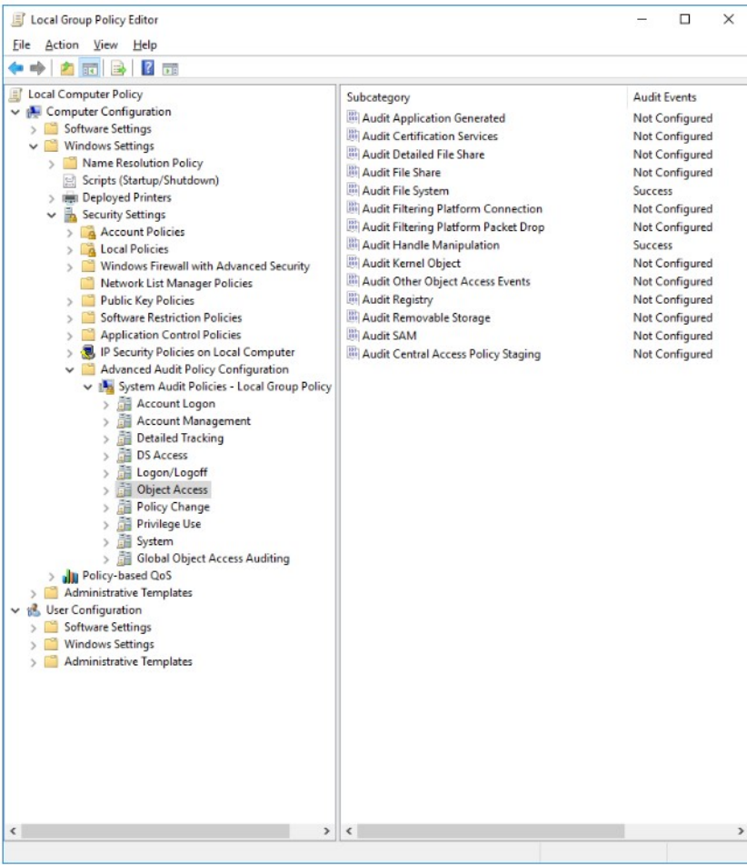 

###### 3.13.3.2. **审核策略部分方法**

如果由于您的主机是Windows Vista或Windows Server 2008而无法遵循安装上面的方法设置，则仅建议使用此选项。为此，请编辑以下策略：

安全设置 - >本地策略 - >审核策略 - >审核对象访问

 

 

#### 3.14. **无代理监控**

无代理监控允许您通过SSH监控没有agent的设备或系统，例如路由器，防火墙，交换机和linux/bsd系统。这允许具有软件安装限制的用户满足安全性和合规性要求。

当输出上的校验和发生变化时，将触发警报，并显示校验和或更改的真实的差异输出。

##### 3.14.1. **处理流程**

###### 3.14.1.1. **连接**

使用无代理监视的第一步是使用以下命令启用它：

\# /var/ossec/bin/ossec-control enable agentless

要使用SSH身份验证将管理器连接到设备，应该使用register_host.sh脚本。此脚本位于/var/ossec/agentless/目录中，有两个选项：list 和add。

使用该list选项将列出已包含的所有主机。

\# /var/ossec/agentless/register_host.sh list

使用该add选项将指定要添加到管理器的新设备。NOPASS可以使用公钥认证而不输入密码。对于Cisco设备（如路由器或防火墙），enablepass应使用它来指定启用密码。

\# /var/ossec/agentless/register_host.sh add root@example_address.com example_password [enablepass]

公钥认证可以与以下命令一起使用：

\# sudo -u ossec ssh-keygen

创建后，必须将公钥复制到远程设备中。

###### 3.14.1.2. **监控**

将设备添加到列表后，必须将管理器配置为监视。要查看该ossec.conf文件的其他配置选项，请参阅[无代理](#reference-ossec-agentless)。

https://documentation.wazuh.com/current/user-manual/reference/ossec-conf/agentless.html#reference-ossec-agentless

 

 

3.14.1.2.1. **BSD完整性检查**

对于BSD系统，请将类型设置为ssh_integrity_check_bsd，如下所述。 可以使用<arguments>标记在配置部分中引用以空格分隔的目录列表。 使用此配置，Wazuh将对远程控制端进行完整性检查。

<agentless>

 <type>ssh_integrity_check_bsd</type>

 <frequency>20000</frequency>

 <host>root@test.com</host>

 <state>periodic</state>

 <arguments>/bin /var/</arguments>

</agentless>

3.14.1.2.2. **Linux完整性检查**

对于Linux系统，请将类型设置为ssh_integrity_check_linux，如下所述。 可以使用<arguments>标记在配置部分中引用以空格分隔的目录列表。 使用此配置，Wazuh将对远程控制端进行完整性检查。

<agentless>

 <type>ssh_integrity_check_linux</type>

 <frequency>36000</frequency>

 <host>root@test.com</host>

 <state>periodic</state>

 <arguments>/bin /etc/ /sbin</arguments>

</agentless>

3.14.1.2.3. **通用差异**

还可以将一组命令配置为在远程设备上运行。 如果这些命令的输出发生变化，Wazuh会发送警告给你。 要使用此选项，请将类型设置为ssh_generic_diff，如下所示

<agentless>

 <type>ssh_generic_diff</type>

 <frequency>20000</frequency>

 <host>root@test.com</host>

 <state>periodic_diff</state>

 <arguments>ls -la /etc; cat /etc/passwd</arguments>

</agentless>

注意：要在命令中使用su作为参数，必须在主机名之前设置use_su。 在前面的示例中，这将显示为：<host> use_su root@example_address.com </ host>

3.14.1.2.4. **Pix配置**

如果Cisco PIX 或路由器配置发生变化，此选项将发出警报。 将类型设置为ssh_pixconfig_diff，如下所示。

<agentless>

 <type>ssh_pixconfig_diff</type>

 <frequency>36000</frequency>

 <host>pix@pix.fw.local</host>

 <state>periodic_diff</state>

</agentless>

###### 3.14.1.3. **检查设置**

最后，管理expect程序中必须包含此程序包才能使用此功能。

当expect程序包存在且Wazuh重新启动时，/var/ossec/logs/ossec.log文件中会显示以下内容：

ossec-agentlessd: INFO: Test passed for 'ssh_integrity_check_linux'

当Wazuh连接到远程设备时，以下内容将显示在同一日志文件中：

ossec-agentlessd: INFO: ssh_integrity_check_linux: root@example_adress.com: Starting.

ossec-agentlessd: INFO: ssh_integrity_check_linux: root@example_adress.com: Finished.

###### 3.14.1.4. **警报**

完成上述配置后，当目录中发生更改时，将触发Wazuh警报：

示例警报如下：

完整性检查BSD/Linux示例警报：

** Alert 1486811998.93230: - ossec,syscheck,pci_dss_11.5,

2017 Feb 11 03:19:58 ubuntu->(ssh_integrity_check_linux) root@192.168.1.3->syscheck

Rule: 550 (level 7) -> 'Integrity checksum changed.'

Integrity checksum changed for: '/etc/.hidden'

Size changed from '0' to '10'

Old md5sum was: 'd41d8cd98f00b204e9800998ecf8427e'

New md5sum is : 'cc7bd56aba1122d0d5f9c7ef7f96de23'

Old sha1sum was: 'da39a3ee5e6b4b0d3255bfef95601890afd80709'

New sha1sum is : 'b570fbdf7d6ad1d1e95ef57b74877926e2cdf196'

 

File: /etc/.hidden

Old size: 0

New size: 10

New permissions:  1204

New user: 0

New group: 0

Old MD5: d41d8cd98f00b204e9800998ecf8427e

New MD5: cc7bd56aba1122d0d5f9c7ef7f96de23

Old SHA1: da39a3ee5e6b4b0d3255bfef95601890afd80709

New SHA1: b570fbdf7d6ad1d1e95ef57b74877926e2cdf196

通用差异样本警报：

** Alert 1486811190.88243: - ossec,syscheck,agentless,pci_dss_11.5,pci_dss_10.6.1,

2017 Feb 11 03:06:30 ubuntu->(ssh_generic_diff) root@192.168.1.3->agentless

Rule: 555 (level 7) -> 'Integrity checksum for agentless device changed.'

ossec: agentless: Change detected:

3c3

< drwxr-xr-x. 77 root root   8192 Feb 27 10:44 .

\---

\> drwxr-xr-x. 77 root root   8192 Feb 27 10:47 .

176a177

\> -rw-r--r--.  1 root root    0 Feb 27 10:47 test

##### 3.14.2. **配置**

无代理监视在[无代理](#reference-ossec-agentless)程序部分的[ossec.conf](#reference-ossec-conf)文件中配置。

###### 3.14.2.1. **完整性检查**

此示例配置将监视/bin和/var目录：

<agentless>

 <type>ssh_integrity_check_bsd</type>

 <frequency>20000</frequency>

 <host>root@test.com</host>

 <state>periodic</state>

 <arguments>/bin /var/</arguments>

</agentless>

请注意，<arguments>标记中可能包含多个目录，并以空格分隔。

###### 3.14.2.2. **完整性检查Linux**

对于Linux系统，请将类型设置为ssh_integrity_check_linux，如下所述。 在这里，可以使用<arguments>标记在配置部分中引用以空格分隔的目录列表。 使用此配置，Wazuh将对远程控制端进行完整性检查。

示例配置将监视 /bin, /etc 和 /sbin目录

<agentless>

 <type>ssh_integrity_check_linux</type>

 <frequency>36000</frequency>

 <host>root@test.com</host>

 <state>periodic</state>

 <arguments>/bin /etc /sbin</arguments>

</agentless>

###### 3.14.2.3. **通用差异**

在此配置中，ls -la 和cat / etc / passwd命令将每20000秒执行一次。 如果命令的输出发生变化，将触发警报。

<agentless>

 <type>ssh_generic_diff</type>

 <frequency>20000</frequency>

 <host>root@test.com</host>

 <state>periodic_diff</state>

 <arguments>ls -la /etc; cat /etc/passwd</arguments>

</agentless>

请注意，可以包含<arguments>标记中的多个条目，用“;”分隔。

###### 3.14.2.4. **Pix配置**

在此配置中，Cisco PIX或路由器配置更改时将触发警报

<agentless>

 <type>ssh_pixconfig_diff</type>

 <frequency>36000</frequency>

 <host>pix@pix.fw.local</host>

 <state>periodic_diff</state>

</agentless>

 

#### 3.15. **反flooding机制**

此机制旨在防止代理上的大量突发事件对网络或管理器产生负面影响。 它使用漏桶队列来收集所有生成的事件，并以低于指定事件每秒阈值的速率将它们发送给管理器。 这有助于避免Wazuh组件断开的事件或意外事件行为。。

此外，代理模块可以配置为限制其事件生成速率，从而降低漏桶缓冲区饱和的风险。

##### 3.15.1. **为什么需要反flooding机制**

在Wazuh架构中，Wazuh代理从日志文件，命令输出，不同类型的扫描等收集信息。然后，他们将所有收集的信息发送给他们的管理器，生成单独的事件。 如果没有任何拥塞机制，代理可能会以系统物理上能够传输的速率发送事件，这可能是每秒数百或数千个事件。

由于这一事实，代理中的不正确配置可能会生成足够的事件来使网络或其管理器饱和。以下是一些可能导致此问题的错误配置方案：

n 包含不断更改的文件的目录的实时FIM（Syscheck）：

每次受Syscheck监控的目录下的文件发生更改时，都会生成事件。如果Syscheck监视一个不断变化的目录，它将生成大量事件。此外，如果受监视的目录包含Wazuh在生成事件时写入的任何文件，例如/var/ossec/queue/，它将导致无限循环。

n Windows过滤平台：

每次允许出站网络连接时，都会生成Windows防火墙事件（ID 5156）。在Windows中启用此事件，并且Wazuh配置为监视所有Windows安全日志事件时，结果是无限循环。当代理连接其管理器时，它会生成Windows防火墙事件，从而导致代理再次连接到其管理器。

没有速率限制的情况下重试错误的应用程序：

当某些应用程序遇到错误时，例如磁盘已满，可能会生成一条错误日志信息，并在每秒一遍又一遍地重试该任务数百次，从而产生大量事件。

这些场景中的每一个都可能产生如此高的事件率，使得代理，网络或管理器的功能可能受到明显的阻塞。

为了更好地处理这些情况，已部署以下控件：

n 代理到管理器反flooding机制：

这提供了具有代理端漏桶队列的事件拥塞控制，以防止代理对网络或管理器的进行阻塞。

n 内部代理防flooding控制：

此机制在代理的不同组件中使用内部控制，控制它们生成事件的速率。

##### 3.15.2. **漏桶工作原理**

如上所述，漏桶是一个位于代理中的拥塞控制，重点是代理到管理器的通信。它将在代理上生成的事件收集到指定大小的缓冲区中（默认5000个事件），并以不高于指定的每秒事件数（默认500个eps）的速率将它们发送给管理器。这些值需要考虑到特定代理、管理器和网络环境的需要。下图显示了漏桶工作原理。

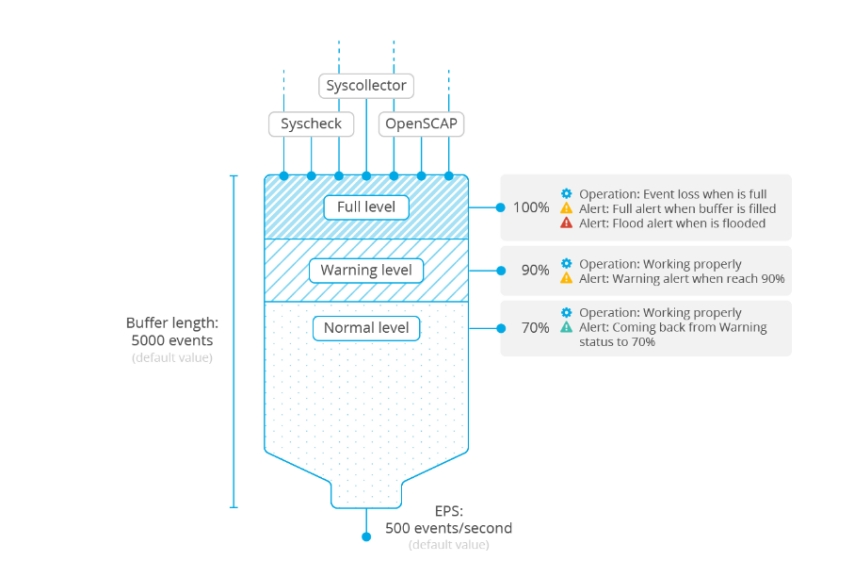 

漏桶有几个控制级别，目的是了解缓冲状态，并能够预测和解决潜在的flooding攻击情况。

n 完全警报：当缓冲区的占用容量达到某个阈值时，第一个控件将触发管理器上的警报。 默认情况下，它设置为90％。

n 泛洪警报：在第一个控件之后，如果缓冲区被填满，管理器将触发另一个警报。此新警报比警告警报更严重，因为漏桶将丢弃传入事件。

n 正常警报：生成此警报以通知先前已触发警告警报或更高警报缓冲级别已恢复正常（默认情况下<= 70％）。

漏桶完全可配置，以适应任何环境，并使用以下配置选项：

###### 3.15.2.1. **测量配置**

在[本地配置](https://documentation.wazuh.com/current/user-manual/reference/ossec-conf/index.html)<client_buffer>部分中，可以禁用缓冲区，配置缓冲区的大小（事件数），并配置以EPS或每秒事件数测量的吞吐量限制。

l 禁用缓冲区：此参数禁用漏桶的使用，从而不会限制代理向管理器传输的事件的速率。这就是代理的早期版本的设置方式。

l 队列大小：队列大小是一次可以在漏桶中保存的最大事件数。应根据代理可能生成事件的预期速率进行配置。默认情况下，此值设置为5000个事件，这对于大多数环境来说是一个很大的缓冲区大小。

l 每秒事件数：这是事件从代理缓冲区中提取并传输到其管理器的最大速率。默认值是500 EPS，但应考虑网络容量和一个管理器正在服务的代理的数量来设置。

此配置也可在集中配置中使用，这意味着可以在agent.conf中设置它，目的是从管理器端配置代理的bucke选项。 当agent.conf配置代理程序时，该配置将覆盖其自己的本地配置。为了允许代理最终决定允许传输的EPS的最小数量，不管在管理器级别通过agent.conf配置的EPS限制如何，可以在代理的内部配置中设置另一个名为agent.min_eps的变量。

###### 3.15.2.2. **阈值配置**

在[内部配置中](https://documentation.wazuh.com/current/user-manual/reference/internal-options.html)，有更多与缓冲操作相关的高级选项。具体而言，可以配置警告和正常水平阈值，以及触发洪水警报的容差时间。

##### 3.15.3. **漏桶使用案例**

在本节中，将展示当遇到极端情况时，漏桶是如何工作的。为此，下图显示了缓冲区在接收到比预期更多的事件时使用的不同阶段。以及它如何逐步处理情况。

 

 

###### 3.15.3.1. **正常状态（绿色区域）**

如左图所示，缓冲区正常工作，接收和发送事件。 在这种情况下，管理器不会触发缓冲区警报。 但是，大量事件可能会导致缓冲区使用量增加，导致其达到警告级别，此处设置为90％。

###### 3.15.3.2. **警告状态（橙色区域）**

一旦达到警告级别，管理器端就会触发如下警报：

** Alert 1501604235.59814: - wazuh,agent_flooding,

2017 Aug 01 18:17:15 (fedora) any->ossec-agent

Rule: 202 (level 7) -> 'Agent buffer queue is 90% full.'

wazuh: Agent buffer: '90%'.

level: 90%

尽管有此警报，但由于缓冲区中仍有可用空间，因此未删除任何事件。

###### 3.15.3.3. **达到100％（浅红色区域）**

当缓冲区继续接收比移除事件更快的事件时，它最终将达到其容量的100％，从而触发管理器上的另一个警报：

** Alert 1501604236.60027: - wazuh,agent_flooding,

2017 Aug 01 18:17:16 (fedora) any->ossec-agent

Rule: 203 (level 9) -> 'Agent event queue is full. Events may be lost.'

wazuh: Agent buffer: 'full'.

level: full

重要的是要了解当缓冲区已满时，所有新到达的事件都将被丢弃，直到缓冲区中的可用空间打开。例如，如果在一秒钟内，1000个事件到达满容量限制为500 EPS的完整缓冲区，则将存储500个这样的事件，其他500个将被丢弃。

当缓冲区100％满时，启动一个计时器，将其与internal_options.conf中设置的容差时间进行比较。

在这一点上，可能会发生两件事：

在计时器达到容差时间之前，缓冲区的使用降低到警告级别以下。 如果发生这种情况，管理员不会显示有关泛洪的警报。此图说明了这种情况。

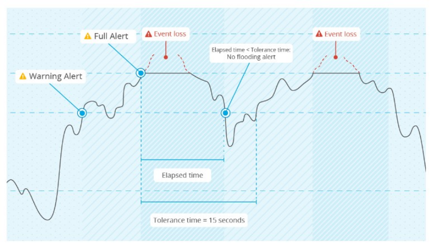 

缓冲区的使用保持在警告级别之上，直到指定的容差时间结束。 现在，似乎缓冲区本身可能无法恢复到正常状态。 因此，在管理器上触发更严重的Flooding状态警报。

###### 3.15.3.4. **flooding状态（红色区域）**

如果满足上述数字2中的条件，缓冲区将超出定义的容差时间和警告级别，则会触发Flooding状态警报。

此警报具有以下状态：

** Alert 1501604250.60248: mail  - wazuh,agent_flooding,

2017 Aug 01 18:17:30 (fedora) any->ossec-agent

Rule: 204 (level 12) -> 'Agent event queue is flooded. Check the agent configuration.'

wazuh: Agent buffer: 'flooded'.

level: flooded

注意:警报描述警告用户检查代理，因为它很可能不会自动恢复到正常状态。请记住，泛洪代理正在丢弃事件

###### 3.15.3.5. **恢复正常状态**

图形的右侧区域显示缓冲区在达到100％后恢复到正常状态的方式。这可能是因为模块因某些事情已经完成或者因违规模块被手动关闭而停止生成过多事件。

为了让管理员知道代理何时再次正常工作，当使用maxed-out缓冲区减少到低于正常水平（默认为70％）时，会触发另一个警报。 警报看起来像这样：

** Alert 1501604257.60486: - wazuh,agent_flooding,

2017 Aug 01 18:17:37 (fedora) any->ossec-agent

Rule: 205 (level 3) -> 'Agent event queue is back to normal load.'

wazuh: Agent buffer: 'normal'.

level: normal

 

当存储桶处于此状态时，不会丢弃任何事件。

##### 3.15.4. **代理模块中的反flooding**

为了避免代理缓冲区饱和，然后事件丢失，可能导致此饱和的Wazuh代理守护程序的事件生成率受到限制。

l Logcollector：如果日志文件的写入速度比日志收集器能够读取的快，这会对代理的正常运行产生负面影响。出于这个原因，代理将限制自己在每个读取周期内从同一个文件读取的最多可配置行数。

l OpenSCAP Wodle：此模块以前在扫描完成后立即发送整个扫描结果集。现在它将扫描信息以规定的速度发送给管理器，以减少缓冲区最大化的可能性。

这些是位于[内部配置的](https://documentation.wazuh.com/current/user-manual/reference/internal-options.html)高级[配置](https://documentation.wazuh.com/current/user-manual/reference/internal-options.html)。 为此目的定义的变量称为logcollector.max_lines和wazuh_modules.max_eps，在更改这些值时应特别小心。

 

#### 3.16. **agent标签**

此功能允许用户自定义来自agent的警报信息，以包括与生成警报的agent相关的特定信息。这在处理或查看警报时很有用。此外，在大型环境中，此功能可用于通过任何常见特征（如时区）来识别代理组.

##### 3.16.1. **工作原理**

配置将包含在警报中的标签是一个简单的过程。它可以使用简单的XML格式来完成，该格式将信息添加到警报中。标签可以通过将“关键”词分隔来嵌套，以包含在JSON格式的警报中。有关如何配置标签的信息可以在ossec.conf的Labels模块中找到。

代理标签也可以使用agent.conf文件进行集中管理，以便可以在管理器设置为特定代理标签。 当预先存在的标签与用户在ossec.conf或agent.conf中定义的标签相同时，第二个标签将覆盖第一个标签。有关如何集中代理配置的详细信息，请参阅“ [集中配置”](https://documentation.wazuh.com/current/user-manual/reference/centralized-configuration.html)部分。[内部配置](https://documentation.wazuh.com/current/user-manual/reference/internal-options.html)部分提供了添加配置信息。这包括有关analyzed.label_cache_maxage和analyzed.show_hidden_labels的信息。

##### 3.16.2. **用例**

下面是一个使用标签可能会有帮助的案例

让我们假设在Amazon Web Service（AWS）中部署了一个大型环境并由Wazuh监控。在这种情况下，我们希望管理员在触发警报时获得有关每个代理的以下信息：

l AWS实例ID

l AWS安全组

l 网络IP地址

l 网络MAC

l 安装日期（隐藏）

要在来自特定代理的警报中包含这些标签，必须将以下配置插入到ossec.conf文件中：

<labels>

 <label key="aws.instance-id">i-052a1838c</label>

 <label key="aws.sec-group">sg-1103</label>

 <label key="network.ip">172.17.0.0</label>

 <label key="network.mac">02:42:ac:11:00:02</label>

 <label key="installation" hidden="yes">January 1st, 2017</label>

</labels>

要在管理器级别设置标签，将在agent.conf文件中添加以下配置：

<agent_config name="92603de31548">

 <labels>

  <label key="aws.instance-id">i-052a1838c</label>

  <label key="aws.sec-group">sg-1103</label>

  <label key="network.ip">172.17.0.0</label>

  <label key="network.mac">02:42:ac:11:00:02</label>

  <label key="installation" hidden="yes">January 1st, 2017</label>

 </labels>

</agent_config>

当从管理器应用上述配置的代理触发警报时，定义的标签将向警报添加信息，如下所示：

 ** Alert 1488922301.778562: mail  - ossec,syscheck,pci_dss_11.5,

 2017 Jun 07 13:31:43 (92603de31548) 192.168.66.1->syscheck

 aws.instance-id: i-052a1838c

 aws.sec-group: sg-1103

 network.ip: 172.17.0.0

 network.mac: 02:42:ac:11:00:02

 Rule: 550 (level 7) -> 'Integrity checksum changed.'

 Integrity checksum changed for: '/var/ossec/etc/ossec.conf'

 Size changed from '3663' to '3664'

 Old md5sum was: '98b351df146410f174a967d726f9965e'

 New md5sum is : '7f4f5846dcaa0013a91bd6d3ac4a1915'

 Old sha1sum was: 'c6368b866a835b15baf20976ae5ea7ea2788a30e'

 New sha1sum is : 'c959321244bdcec824ff0a32cad6d4f1246f53e9'

JSON格式的相同警报显示了使用嵌套标签的优势：

{

 "timestamp": "2017-03-07T13:31:41-0800",

 "rule": {

  "level": 7,

  "description": "Integrity checksum changed.",

  "id": "550",

  "firedtimes": 1,

  "groups": [

   "ossec",

   "syscheck"

  ],

  "pci_dss": [

   "11.5"

  ]

 },

 "agent": {

  "id": "001",

  "name": "92603de31548",

  "ip": "192.168.66.1",

  "labels": {

   "aws": {

​    "instance-id": "i-052a1838c",

​    "sec-group": "sg-1103"

   },

   "network": {

​    "ip": "172.17.0.0",

​    "mac": "02:42:ac:11:00:02"

   }

  }

 },

 "manager": {

  "name": "ubuntu"

 },

 "full_log": "Integrity checksum changed for: '/var/ossec/etc/ossec.conf' Size changed from '3663' to '3664' Old md5sum was: '98b351df146410f174a967d726f9965e' New md5sum is : '7f4f5846dcaa0013a91bd6d3ac4a1915' Old sha1sum was: 'c6368b866a835b15baf20976ae5ea7ea2788a30e' New sha1sum is : 'c959321244bdcec824ff0a32cad6d4f1246f53e9'",

 "syscheck": {

  "path": "/var/ossec/etc/ossec.conf",

  "size_before": "3663",

  "size_after": "3664",

  "perm_after": "100640",

  "uid_after": "0",

  "gid_after": "999",

  "md5_before": "98b351df146410f174a967d726f9965e",

  "md5_after": "7f4f5846dcaa0013a91bd6d3ac4a1915",

  "sha1_before": "c6368b866a835b15baf20976ae5ea7ea2788a30e",

  "sha1_after": "c959321244bdcec824ff0a32cad6d4f1246f53e9",

  "event": "modified"

 },

 "decoder": {

  "name": "syscheck_integrity_changed"

 },

 "location": "syscheck"

}

如果已启用电子邮件报告，则会收到以下电子邮件通知：

Wazuh Notification.

2017 Mar 07 13:31:41

 

Received From: (92603de31548) 192.168.66.1->syscheck

Rule: 550 fired (level 7) -> "Integrity checksum changed."

Portion of the log(s):

 

aws.instance-id: i-052a1838c

aws.sec-group: sg-1103

network.ip: 172.17.0.0

network.mac: 02:42:ac:11:00:02

Integrity checksum changed for: '/var/ossec/etc/ossec.conf'

Old md5sum was: '98b351df146410f174a967d726f9965e'

New md5sum is : '7f4f5846dcaa0013a91bd6d3ac4a1915'

Old sha1sum was: 'c6368b866a835b15baf20976ae5ea7ea2788a30e'

New sha1sum is : 'c959321244bdcec824ff0a32cad6d4f1246f53e

 

 

 

## 4. **架构分析**

Wazuh由三部分组成：**Agent端**、**Server端**、**ES**
下图是官方给出的整体架构图

 

server端收集数据以日志形式加密后发送到manager，经过解码和规则匹配生成事件和告警通过filebeat采集送到ES之中，经过logstash进行数据处理在kibana上展示出来。

### 4.1. **AGENT分析**

agent端负责信息收集，预防威胁和检测、响应功能.
下图为官方给出的Agent端详细架构：

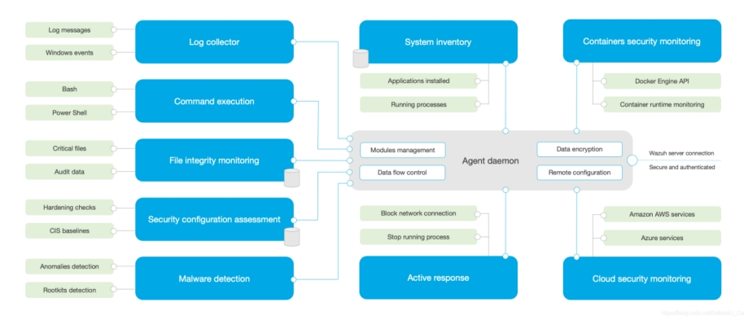 

#### 4.1.1. **运行状态**

n 未连接(Never connected)

agent已经注册, 但是还没有连接至manager

n 阻塞

中心已经收到了连接请求,但是还未有注册数据上来, 此状态只有一次

n 激活

agent已成功的连接manager, 并且可以正常通信

n 断开

中心长时间未收到心跳信息,则主动认为agent是断开状态(默认是10m)

#### 4.1.2. **运行方式**

运行 systemctl start wazuh-agent, 便可以正常运行agent所有的组件,

启动后,可以在主机上看到以下进程

l root wazuh-execd			负责执行active reponses的脚本

l ossec wazuh-agentd		agent的总代理,负责和中心进行数据通信

l root wazuh-syscheckd		检查文件的哈希,权限是否被改变

l root wazuh-logcollector	监控指定的日志采集

l root wazuh-modulesd		管理模块的各项功能

n CIS-CAT

n Syscollector

n Vulnerability

n OSQuery

n SCA

n Update

#### 4.1.3. **wazuh-agentd**

wazuh-agentd以ossec帐户运行,负责与server端进行数据传输.启动后从 /var/ossec/etc/ossec.conf里读取配置, 然后和中心进行连接通信.

 

进程: wazuh-agentd

代码位置: src/client-agent

 

wazuh-agentd

main

\- ClientConf

\- ReadConfig 读取一个xml配置文件

\- 获取是否指定user/group

\- StargSIG 开始设置信号的处理方式

\- AgentStart 开如真实的agent工作

\- sender_init 初始化了一个mutex

\- goDaemon进行一个后台运行

-设置gid

-设置uid

-启动一个队列监听 queue/sockets/queue

-Thread->state_main, 定时刷新自己的状态

-创建队列监听 queue/alerts/execq

\- start_agent 发送一个同步信息, 直到服务器回应

\- 更新agent的状态为active

-Thread->req_receiver 

-从req_pool里读取信息然后转发?

\- 循环

-采用select读取信息并转发

#### 4.1.4. **wazuh-logcollector**

wazuh-logcollector监控指定日志文件,如果有改变,则将日志经agent传送到中心

进程: wazuh-logcollector

代码位置在: src/logcollector

main

-根据参数初始化配置

\- w_msg_hash_queues_init

\- LogCollectorConfig (从ossec.conf里读取logcollector的配置)

\- StartMQ (连接此queue/sockets/queue)

\- LogCollectorStart

\- w_initialize_file_status

\- 初始化hash (files_status)

\- 读取文件(queue/logcollector/file_status.json)存到 (files_status)

\- w_logcollector_state_init 

\- thread w_logcollector_state_main

\- 循环 w_logcollector_state_generate

\- xxxx

-Thread-> w_output_thread

\- 从msg_queue里读取信息到 并发送至agent

\- Thread->w_input_thread

\- 从文件中读取日志到结构中

\- 主循环

\- 读取日志并发送到msg_queue

 

#### 4.1.5. **wazuh-syscheckd**

wazuh-syscheckd 检查指定的文件是否被改变

进程; wazuh-syscheckd

代码: src/syscheckd

main

-读取参数并初始化

\- set uid/pid

\- Read_Syscheck_Config(读取关于syscheckd的配置,　从ossec.conf里)

\- rootcheck_init

\- File_DateofChange

\- Read_Rootcheck_Config

\- rootcheck_connect (queue/sockets/queue)

\- run_rk_check

-check_rc_files

\- etc/shared/rootkit_files.txt

格式如下:

tmp/mcliZokhb  ! Bash door ::/rootkits/bashdoor.php

-check_rc_trojans

-etc/shared/rootkit_trojans.txt

格式:

ls !bash|^/bin/sh|dev/[^clu]|\.tmp/lsfile|duarawkz|/prof|/security|file\.h!

-check_rc_unixaudit

-check_rc_dev

-硬编码过滤一些,然后根据正则进行匹配

-check_rc_sys

-根据即定的文件名进行判断

-check_rc_pids

-判断是否有隐藏的进程

-check_rc_ports

-判断端口的监听是否正常,遍历

-check_rc_if

-判断所有的网卡信息是否是混杂模式

\- Thread -> syscom_main thread

-绑定"queue/sockets/syscheck"

-接收信息,分发命令 (getconfig/dbsync/restart)

\- rootcheck_connect 连接

\- StartMQ (queue/sockets/queue) write

\- fim_initialize 创建一个sqlite db 用于存一些监控的东西

\- start_daemon

\- Thread w_rootcheck_thread

\- os_check_restart_rootcheck

-开始循环

-log_realtime_status_rk

-run_rk_check

-fim_scan

-fim_send_scan_info

-fim_diff_folder_size

-fim_checker

-fim_configuration_directory

-fim_directory

-thread fim_run_realtime 只是针对windows

-thread fim_run_integrity

-thread symlink_checker_thread

-开始循环等街

-os_check_restart_syscheck

#### 4.1.6. **wazuh-execd**

wazuh-execd 执行由active reponse 下发的脚本

进程: wazuh-execd

代码: src/os-execd

main

\- 读取参数并初始化

\- set gid/uid

-ExecdConfig 从ossec读取配置

-thread  wcom_main

监听 queue/sockets/com 

wcom_dispatch (unmerge/uncompress/restart/getconfig)

确定命令并原路转回

-StartMQ  (queue/alerts/execq) read

-ExecdStart

\- OSList_Create for timeout

\- 主循环

-从列表中取出第一个执行

#### 4.1.7. **wazuh-moduled**

管理wazuh附加模块的运行

进程: wazuh-moduled

代码: src/wazuh_modules

main		

读取参数并初始化配置

-set-name

-wm_setup

-set daemon

-set group

-wm_check

-wm_children_pool_init

-循环遍历modules, 然后各启动一个joinable的线程

-wm_config

-default_modules (agent_upgrade)

-read_main_elements 从ossec.conf初始化

-wm_add(control_module)

-wm_check

-all-modules

-agent_upgrade (wm_agent_upgrade_main/wm_agent_upgrade_destroy)

-wm_agent_upgrade_main

-wm_agent_upgrade_listen_messages thread

-bind queue/tasks/upgrade

-get command (json格式)

-wm_agent_upgrade_dispatch_upgrades  thread

-wm_agent_upgrade_parse_message

-wm_agent_upgrade_free_upgrade_task

 

-cis-cat (wm_ciscat_main/wm_ciscat_destroy)

-osquery(wm_osquery_monitor_main/wm_osquery_monitor_destroy)

-syscollector(wm_sys_main/wm_sys_destroy)

-sca(wm_sca_main/wm_sca_destroy)

-control(wm_control_main/wm_control_destroy)

-wmcom_main 线程

-bind "queue/sockets/wmodules"

-select 接收事件,然后判断command类型进行响应

-wmcom_getconfig

-wmcom_sync

-wmcom_send

 

 

 

### 4.2. **Server架构分析**

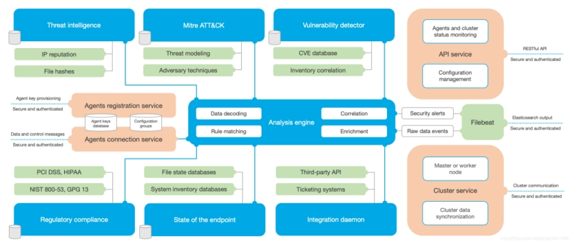 

该服务器通常在独立的物理机，虚拟机，docker容器或云实例上运行, 实现以下功能:

1 分析和接收上报的日志

2 根据当前的规则来触发报警

3 注册新的端点agent

4 将消息转发至ES

以下是主要服务器组件的列表：

#### 4.2.1. **代理注册服务****(Registration Service)**

用于通过供应和分配每个代理唯一的预共享身份验证密钥来注册新代理。此过程作为网络服务运行，并支持通过TLS / SSL证书或提供固定密码进行身份验证。

注册服务(registration service)由进程wazuh-authd来实现, 它使用端口1515来进行tcp连接, 并使用TLS证书来加密. 注册完成后,agent会根据配置文件和manager进行连接, 这时使用1514端口(此服务由进程wazuh-remoted来提供)来接收由agent收集到的数据.

进程: wazuh-authd

代码: src/os-auth

#### 4.2.2. **代理连接服务****(Wazuh manager)**

· 这是从代理接收数据的服务。它利用预共享密钥来验证每个代理身份并加密代理与Wazuh服务器之间的通信。此外，此服务用于提供集中的配置管理，能够远程推送新的代理设置。

· 进程: wazuh-remoted

· 源码位置: src/remoted

main

读取参数,初始化homedir

读取remote config, 确定连接方式, 监听端口,协议,队列大小

设置用户,组信息

w_init_shared_download 初始并确定下载目录可用

fork进程执行 HandleRemote()

绑定指定的端口进行监听, 并设超时状态

根据不同的连接方式进行收取数据(secure,syslog,tcp)

初始化队列

Thread -> update_shared_files 每秒更新共享文件信息

Thread -> AR_Forward

监听"queue/alerts/ar", 如果有消息下发到agent

Thread -> SCFGA_Forward

监听"queue/alerts/cfgarq",有消息则下发

Thread -> req_main

监听"queue/sockets/request",

Thread -> rem_state_main

按指定时间间���隔将当前的流量统计状态写到 	var/run/wazuh-remote.state文件中	

Thread -> w_key_request_thread

从队列key_request_queue中讯取数据通过	"queue/sockets/krequest"发送出去

ThreadPool 创建一个线程池,

执行 rem_handler_main

HandleSecureMessage->将信息发送至queue/sockets/queue

将监听的端口创建的socket添加到epoll中,循环读取agent传的数据,	然后放到队列中,供远端读取消费

 

 

#### 4.2.3. **分析引擎**

· 这是执行数据分析的过程。它利用解码器来识别正在处理的信息的类型（例如Windows事件，SSHD日志，Web服务器日志等），并从日志消息中提取相关的数据元素（例如源IP地址，事件ID，用户名等）。 。接下来，通过使用规则，它可以识别解码事件中的特定模式，这些特定模式可能会触发警报，甚至可能要求采取自动对策（例如，防火墙上的IP禁止）。

· 进程: wazuh-analysisd

· 源码位置: src/analysisd

main

读取参数并初始化配置

设置用户及组

初始化Active Response

设置资源的限制

读取Rules

读取Decoders

读取CDB list

Thread->asyscom_main

监听 queue/sockets/analysis

收到消息, 然后进行分析头,再转回去

-OS_ReadMSG 从 queue/sockets/queue读取消息

-RootcheckInit

-SyscollectorInit

-CiscatInit

-HostinfoInit

-WinevtInit

-SecurityConfigurationAssessmentInit

-Accumulate_init 创建一个hash

-StratMQ 创建一个unixdaemon

-Init_stats_directories

\- 先行创建一些stat目录然后创建相应的hour,week的目录

\- 创建队列:

   /* Init the archives writer queue */

  writer_queue = queue_init(getDefine_Int("analysisd", "archives_queue_size", 0, 2000000));

 

  /* Init the alerts log writer queue */

  writer_queue_log = queue_init(getDefine_Int("analysisd", "alerts_queue_size", 0, 2000000));

 

  /* Init statistical the log writer queue */

  writer_queue_log_statistical = queue_init(getDefine_Int("analysisd", "statistical_queue_size", 0, 2000000));

 

  /* Init the firewall log writer queue */

  writer_queue_log_firewall = queue_init(getDefine_Int("analysisd", "firewall_queue_size", 0, 2000000));

 

  /* Init the FTS log writer queue */

  writer_queue_log_fts = queue_init(getDefine_Int("analysisd", "fts_queue_size", 0, 2000000));

 

  /* Init the decode syscheck queue input */

  decode_queue_syscheck_input = queue_init(getDefine_Int("analysisd", "decode_syscheck_queue_size", 0, 2000000));

 

  /* Init the decode syscollector queue input */

  decode_queue_syscollector_input = queue_init(getDefine_Int("analysisd", "decode_syscollector_queue_size", 0, 2000000));

 

  /* Init the decode rootcheck queue input */

  decode_queue_rootcheck_input = queue_init(getDefine_Int("analysisd", "decode_rootcheck_queue_size", 0, 2000000));

 

  /* Init the decode rootcheck json queue input */

  decode_queue_sca_input = queue_init(getDefine_Int("analysisd", "decode_sca_queue_size", 0, 2000000));

 

  /* Init the decode hostinfo queue input */

  decode_queue_hostinfo_input = queue_init(getDefine_Int("analysisd", "decode_hostinfo_queue_size", 0, 2000000));

 

  /* Init the decode winevt queue input */

  decode_queue_winevt_input = queue_init(getDefine_Int("analysisd", "decode_winevt_queue_size", 0, 2000000));

 

  /* Init the decode event queue input */

  decode_queue_event_input = queue_init(getDefine_Int("analysisd", "decode_event_queue_size", 0, 2000000));

 

  /* Init the decode event queue output */

  decode_queue_event_output = queue_init(getDefine_Int("analysisd", "decode_output_queue_size", 0, 2000000));

 

  /* Initialize database synchronization message queue */

  dispatch_dbsync_input = queue_init(getDefine_Int("analysisd", "dbsync_queue_size", 0, 2000000));

 

  /* Initialize upgrade module message queue */

  upgrade_module_input = queue_init(getDefine_Int("analysisd", "upgrade_queue_size", 0, 2000000));

-从配置里读取一些线程的大小

-启动线程:　ad_input_main

从queue/sockets/queue读取消息然后判断类型转发至不同队列

-thread: w_writer_thread

-thread: w_writer_log_thread

-thread: w_writer_log_statistical_thread

-thread: w_writer_log_firewall_thread

-thread: w_writer_log_fts_thread

-thread: w_log_rotate_thread

-创建若干w_decode_syscheck_thread

-创建若干　w_decode_syscollector_thread

-创建若干 w_decode_hostinfo_thread

-创建若干 w_decode_rootcheck_thread

-w_decode_sca_thread

-w_decode_event_thread

-w_process_event_thread 处理所有的事件,包括规则匹配

-w_decode_winevt_thread

-w_dispatch_dbsync_thread

-w_dispatch_upgrade_module_thread

-w_analysisd_state_main

-休眠1秒,继续循环

· 

#### 4.2.4. **Wazuh RESTful API** 

· 此服务提供了与Wazuh基础结构进行交互的接口。它用于管理代理和服务器配置设置，监视基础结构状态和总体运行状况，管理和编辑Wazuh解码器和规则，以及查询受监视端点的状态。Wazuh Web用户界面（Kibana应用程序）也使用它。

#### 4.2.5. **Wazuh群集守护程序**

· 此服务用于水平扩展Wazuh服务器，将它们部署为群集。这种配置与网络负载平衡器相结合，可提供高可用性和负载平衡。Wazuh群集守护程序是Wazuh服务器用来相互通信并保持同步的服务器。

 

#### 4.2.6. **Filebeat**

· 用于将事件和警报发送到Elasticsearch。它读取Wazuh分析引擎的输出并实时发送事件。当连接到多节点Elasticsearch集群时，它还提供负载平衡。

### 4.3. **Elastic Stack**

Elastic Stack是流行的开源项目的统一套件，用于日志管理，包括Elasticsearch，Kibana，Filebeat等。与Wazuh解决方案特别相关的项目是：

#### 4.3.1. **Filebeat**

一种轻量级转发器，用于通过网络传送日志，通常将日志传送到Elasticsearch。在Wazuh服务器上使用它来将事件和警报发送到Elasticsearch。它读取Wazuh分析引擎的输出，并通过加密通道实时发送事件。当连接到多节点Elasticsearch集群时，它还提供负载平衡。

#### 4.3.2. **Elasticsearch**

高度可扩展的全文本搜索和分析引擎。Elasticsearch是分布式的，这意味着数据索引分为多个碎片，每个碎片可以具有零个或多个副本。Wazuh对警报数据，原始事件和状态监视信息使用不同的索引。

#### 4.3.3. **Kibana**

灵活，直观的Web界面，用于挖掘，分析和可视化数据。它在Elasticsearch集群中的索引内容之上运行。Wazuh Web用户界面已以插件的形式完全嵌入在Kibana中。它包括用于安全事件，法规遵从性（例如PCI DSS，GDPR，CIS，HIPAA，NIST 800-53）的现成仪表板，检测到的易受攻击的应用程序，文件完整性监控数据，配置评估结果，云基础架构监控事件， 和别的。
Wazuh与Elastic Stack集成，提供了供Elasticsearch索引的已解码消息的提要，以及用于警报和日志数据分析的实时Web控制台。此外，在Kibana之上运行的Wazuh用户界面用于管理和监视Wazuh基础结构。

Elasticsearch索引是具有相似特征（例如某些公共字段和共享数据保留要求）的文档的集合。Wazuh利用每天创建的多达三个不同的索引来存储不同的事件类型：

#### 4.3.4. **wazuh-alerts**

Wazuh服务器生成的警报的索引。每当事件触发具有足够高优先级的规则（此阈值是可配置的）时，就会创建这些规则。

#### 4.3.5. **wazuh-events**

无论是否执行规则，从代理收到的所有事件（存档数据）的索引。

#### 4.3.6. **wazuh-monitoring**

一段时间内与Wazuh代理状态相关的数据的索引。它是用来通过Web管理界面来表示，当个别代理商或已经Active，Disconnected或。Never connected
索引由文档组成。对于以上索引，文档是单个警报，已归档事件或与Wazuh代理状态相关的数据。

Elasticsearch索引分为一个或多个分片，并且每个分片可以有一个或多个副本。每个主分片和副本分片都是一个单独的Lucene索引。因此，Elasticsearch索引由许多Lucene索引组成。在Elasticsearch索引上运行搜索时，将在所有分片上并行执行搜索，并合并结果。在多节点Elasticsearch集群中使用Elasticsearch索引划分为多个分片和副本，目的是扩大搜索范围并实现高可用性。单节点Elasticsearch集群通常每个索引只有一个分片，没有副本。

## 5. **规则说明**

当前, wazuh支持超过3000条规则覆盖了以下几个方面:

(在系统里rules下有138个rules文件)

\1. Syslog

\2. Docker

\3. CISCO

\4. SonicWall

\5. Sendmail

\6. Postfix

\7. Spamd

\8. Imapd

\9. MailScanner

\10. Microsoft Exchange

\11. Courier

\12. PIX

\13. NetScreen technologies

\14. McAfee

\15. NextCloud

\16. PaloAlto v9.0

\17. VirusTotal

\18. Suricata

\19. MongoDB

\20. Jenkins

\21. Pluggable Authentication Modules (PAM)

\22. Telnet

\23. SSH

\24. Solaris Basic Security module

\25. Asterisk

\26. Microsoft Windows DHCP

\27. Arpwatch

\28. Symantec

\29. Trend Micro OSCE (Office Scan)

\30. Horde IMP

\31. Roundcube

\32. Wordpress

\33. Compaq Insight Manager (cimserver)

\34. Dovecot

\35. Vm-pop3d

\36. FTP, Proftpd, PureFTP, Vsftpd, Microsoft FTP

\37. OwlH Zeek

\38. Junos

\39. Panda Advanced Protection Service (PAPS)

\40. CheckPoint Smart-1 Firewalls

\41. MacOS SSH

\42. Google Cloud Pub/Sub

 

wazuh利用各种规则来定义报警, 它存放在安装路径的两个位置:

l /var/ossec/ruleset	

此位置为系统自带的规则,由系统自行维护

l /var/ossec/etc/rules

此位置为用户自定义的规则

 

规则等级为0-15共16级, 其中0级为最低,可忽略, 15为最高

具体的等级定义见:

https://documentation.wazuh.com/current/user-manual/ruleset/rules-classification.html

#### 5.1. **decoders**

wazuh使用decoders来识别事件的类型, 然后从其中提取相关的字段, 从而进行更深入的分析. 默认提供了13个固定的类型 (user, srcip, dstip, srcport, dstport, protocol, action, id, url, data, extra_data, status, system_name).

Decoders的语法定义:

https://documentation.wazuh.com/current/user-manual/ruleset/ruleset-xml-syntax/decoders.html

一个典型的例子如下(系统自带的 0205-pam_decoders.xml):

父级的节点

<decoder name="pam">

 <program_name>(pam_unix)$</program_name>

</decoder>

 

同样的父级, prematch是指以pam_unix或者(pam_unix)开始的

<decoder name="pam">

 <program_name></program_name>

 <prematch>^pam_unix|^\(pam_unix\)</prematch>

</decoder>

 

子节点, 用正则来匹配, 确定两个变量 srcuser,uid, 指正则表达式中带括号的部分

<decoder name="pam-user">

 <parent>pam</parent>

 <regex offset="after_regex">by (\S+)\(uid=(\d+)\)</regex>

 <order>srcuser,uid</order>

</decoder>

 

子节点, 首先匹配prematch, 匹配成功后, 再行匹配regex字段,因为regex有属性 offset=after_prematch, 所以使用prematch的匹配结果进行regex的匹配, 否则使用全文,将匹配的结果存入order指定的字段 user中.

<decoder name="pam-pass-changed">

 <parent>pam</parent>

 <prematch>password changed for</prematch>

 <regex offset="after_prematch">^ (\S+)</regex>

 <order>user</order>

</decoder>

 

子节点, 通过正则确定order中的logname的值.

<decoder name="pam-fields">

 <parent>pam</parent>

 <regex offset="after_parent">logname=(\S+)</regex>

 <order>logname</order>

</decoder>

 

#### 5.2. **rules**

wazuh使用rules来分析由端点采集的事件,当它匹配时,生成报警.

其语法说明如下:

https://documentation.wazuh.com/current/user-manual/ruleset/ruleset-xml-syntax/rules.html

一个典型的rule如下:()

<-- group标明这个事件的大类, 从这可看出此事件属于 pam或者syslog -->

<group name="pam,syslog,">

 规则定义, id为5500, level为0, 其定义为忽略的规则, 即使匹配也不会产生事件

 <rule id="5500" level="0" noalert="1">

  <decoded_as>pam</decoded_as>

  <description>Grouping of the pam_unix rules.</description>

 </rule>

 

 规则定义, id为5501, level为3, if_sid为是否匹配父ID, 如下所示, 如果区配了5500才可匹配此规则

 match 标明要匹配的项

 description 是规则的描述

 mitre 是匹配的技术

 group是更加详细的描述

 <rule id="5501" level="3">

  <if_sid>5500</if_sid>

  <match>session opened for user </match>

  <description>PAM: Login session opened.</description>

  <mitre>

   <id>T1078</id>

  </mitre>

<group>authentication_success,pci_dss_10.2.5,gpg13_7.8,gpg13_7.9,gdpr_IV_32.2,hipaa_164.312.b,nist_800_53_AU.14,nist_800_53_AC.7,tsc_CC6.8,tsc_CC7.2,tsc_CC7.3,</group>

 </rule>

 

 <rule id="5502" level="3">

  <if_sid>5500</if_sid>

  <match>session closed for user </match>

  <description>PAM: Login session closed.</description>

<group>pci_dss_10.2.5,gpg13_7.8,gpg13_7.9,gdpr_IV_32.2,hipaa_164.312.b,nist_800_53_AU.14,nist_800_53_AC.7,tsc_CC6.8,tsc_CC7.2,tsc_CC7.3,</group>

 </rule>

 </group>

 

#### 5.3. **自定义规则**

自定义的规则必须放在 /var/ossec/etc 下

如果我们需要增加对日志的解析, 可以在增加一个decoder和一个rule.

日志格式如下:

Dec 25 20:45:02 MyHost example[12345]: User 'admin' logged from '192.168.1.100'

为了解析此日志并生成事件, 我们必须创建文件

/var/ossec/etc/decoders/local_decoder.xml

其内容如下

<decoder name="example">

 <program_name>^example</program_name>

</decoder>

<decoder name="example">

 <parent>example</parent>

 <regex>User '(\w+)' logged from '(\d+.\d+.\d+.\d+)'</regex>

 <order>user, srcip</order>

</decoder>

说明: 如果进程名称为example, 并且其格式匹配 User '(\w+)' logged from '(\d+.\d+.\d+.\d+)', 从相应的日志中取出 user, srcip字段

创建rule文件

/var/ossec/etc/rules/local_rules.xml

其内容如下:

<rule id="100010" level="0">

 <program_name>example</program_name>

 <description>User logged</description>

</rule>

说明: 如果是example进程产生的, 则生成一个id为100010, level为0的事件.

我们可以使用系统提供的 wazuh-logtest命令来测试.

#### 5.4. **CDB列表**

CDB是指  (constant database). 它通常用来创建一个用户或者IP的黑白名单.

其格式为:  key:value 中间以冒号分隔

一般将其以文件的形式放在 /var/ossec/etc/lists

它可以在配置文件中指定:

```
<ossec_config>

 <ruleset>

 <list>etc/lists/list-IP</list>
```

 

也可以将其放在rule格式中:

<rule id="110700" level="10">

 <if_group>json</if_group>

 <list field="srcip" lookup="address_match_key">etc/lists/List-one</list>

 <description>IP blacklisted in LIST ONE</description>

 <group>list1,</group>

</rule>

 

#### 5.5. **mitre对照**

wazuh可以根据事件匹配来和MITRE ATT&CK进行匹配.

 <rule id="100002" level="10" frequency="8" timeframe="120" ignore="60">

  <if_matched_sid>100001</if_matched_sid>

  <description>sshd: brute force trying to get access to the system.</description>

  <same_srcip />

  <mitre>

   <id>T1110</id>

  </mitre>

 </rule>

如上所示, 如果此规则匹配, 下面则标明其匹配到了ATT&CK中的T1110战术.

#### 5.6. **json格式**

 json格式是一类特殊的decoder, 如果用户的日志是json格式, 那么可以使用json-decoder,

如下日志

{

  "timestamp": "2016-05-02T17:46:48.515262+0000",

  "flow_id": 1234,

  "in_iface": "eth0",

  "event_type": "alert",

  "src_ip": "16.10.10.10",

  "src_port": 5555,

  "dest_ip": "16.10.10.11",

  "dest_port": 80,

  "proto": "TCP",

  "alert": {

   "action": "allowed",

   "gid": 1,

   "signature_id": 2019236,

   "rev": 3,

   "signature": "ET WEB_SERVER Possible CVE-2014-6271 Attempt in HTTP Version Number",

   "category": "Attempted Administrator Privilege Gain",

   "severity": 1

  },

  "payload": "21YW5kXBtgdW5zIGRlcHJY2F0QgYWI",

  "payload_printable": "this_is_an_example",

  "stream": 0,

  "host": "suricata.com"

}

 

其对应的rule如下

<rule id="86600" level="0">

  <decoded_as>json</decoded_as>

  <field name="timestamp">\.+</field>

  <field name="event_type">\.+</field>

  <description>Suricata messages.</description>

</rule>

 

<rule id="86601" level="3">

  <if_sid>86600</if_sid>

  <field name="event_type">^alert$</field>

  <description>Suricata: Alert - $(alert.signature)</description>

</rule>

 

如果其中的 event_type为alert时, 便产生一条level为3的报警

 

## 6. **集群部署**

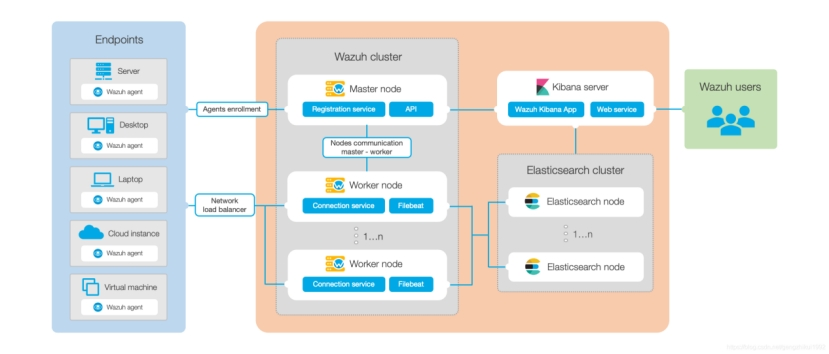 

 

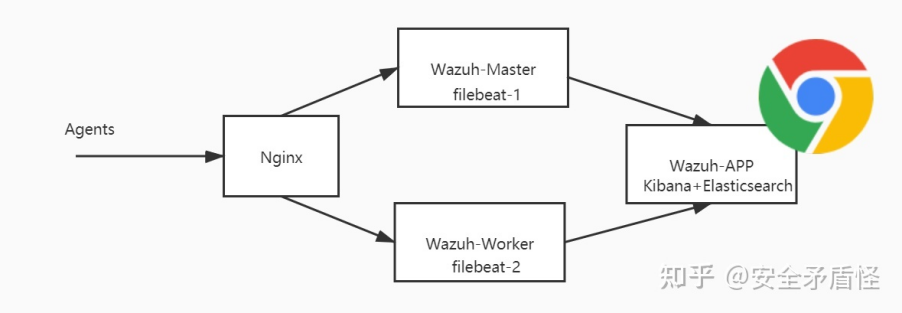 

Elasticsearch集群是一个或多个节点的集合，这些节点相互通信以对索引执行读取和写入操作。不需要处理大量数据的小型Wazuh部署可以通过单节点群集轻松处理。当有大量受监视的端点，预期有大量数据或需要高可用性时，建议使用多节点群集。

对于生产环境，建议将Wazuh服务器和Elasticsearch部署到不同的主机。在这种情况下，Filebeat用于使用TLS加密将Wazuh警报和/或存档的事件安全地转发到Elasticsearch群集（单节点或多节点）。

 

 

 

## 7. **参考:**

https://blog.csdn.net/DebbieLi_Ca/article/details/116993631

https://www.bbsmax.com/A/mo5ky3P2zw/

https://blog.csdn.net/guoguangwu/article/details/102920674

https://blog.csdn.net/MEIYOUDAO_JIUSHIDAO/article/details/120564202

https://blog.csdn.net/gengzhikui1992/article/details/108539457

https://blog.csdn.net/guoguangwu/article/details/102920674

[https://wazuh.blog.csdn.net/article/details/120880062?spm=1001.2101.3001.6650.15&utm_medium=distribute.pc_relevant.none-task-blog-2%7Edefault%7EBlogCommendFromBaidu%7ERate-15.pc_relevant_default&depth_1-utm_source=distribute.pc_relevant.none-task-blog-2%7Edefault%7EBlogCommendFromBaidu%7ERate-15.pc_relevant_default&utm_relevant_index=20](https://wazuh.blog.csdn.net/article/details/120880062?spm=1001.2101.3001.6650.15&utm_medium=distribute.pc_relevant.none-task-blog-2~default~BlogCommendFromBaidu~Rate-15.pc_relevant_default&depth_1-utm_source=distribute.pc_relevant.none-task-blog-2~default~BlogCommendFromBaidu~Rate-15.pc_relevant_default&utm_relevant_index=20)

https://blog.csdn.net/gehongzhou/article/details/103126578?utm_medium=distribute.pc_relevant.none-task-blog-2~default~baidujs_baidulandingword~default-5.pc_relevant_paycolumn_v3&spm=1001.2101.3001.4242.4&utm_relevant_index=8

https://blog.csdn.net/guoguangwu/article/details/103181830?utm_medium=distribute.pc_relevant.none-task-blog-2~default~baidujs_baidulandingword~default-8.pc_relevant_paycolumn_v3&spm=1001.2101.3001.4242.5&utm_relevant_index=11

https://www.freebuf.com/sectool/265942.html

https://www.cnblogs.com/backlion/p/10329601.html

 

 

 

 

 

 

 

 

 

 

 

 

 

 