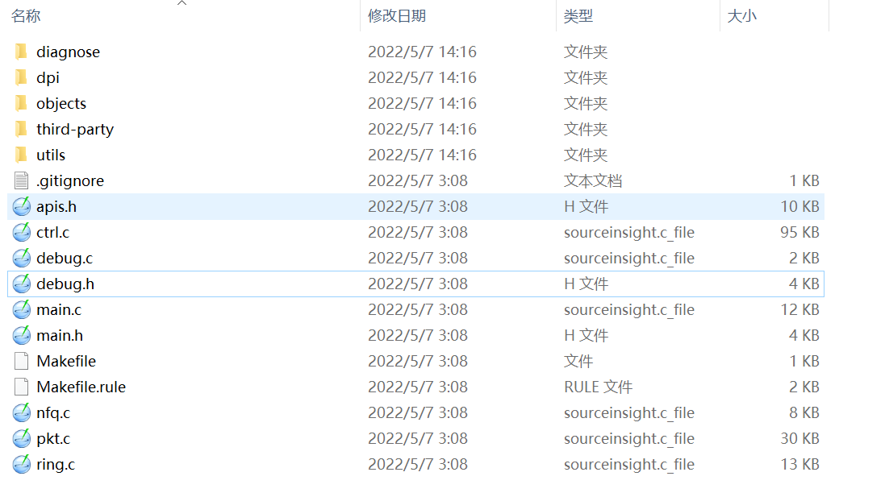

**看源代码前心中的疑问**

1、学习模式、监控模式、保护模式三种模式的区别是什么，分别是如何实现的？

子问题：学习模式是如何建立基线的？在三种不同模式之间切换，满满的都是工作量啊。


2、Neuvector支持哪些协议的解析？ok,协议识别可以加

NeuVector 深度了解应用程序行为，并将分析有效负载，以确定应用程序协议。协议包括：HTTP，HTTPS，SSL，SSH，DNS，DNCP，NTP，TFTP，ECHO，RTSP，SIP，MySQL，Redis，Zookeeper，Cassandra，MongoDB，PostgresSQL，Kafka，Couchbase，ActiveMQ，ElasticSearch，RabbitMQ，Radius，VoltDB，Consul，Syslog，Etcd，Spark，Apache，Nginx，Jetty，NodeJS，Oracle，MSSQL 和 GRPC。

3、DDOS防护是如何做到的？tcp flag 加 + 位图

4、waf和dlp数据防泄露是如何实现的？（补）

5、协议解析器的注册和使用

6、policy策略管理相关的内容

7、Neuvector的会话表是如何进行管理的？分为几种会话表

8、基于epoll的事件通知机制是贯穿于整个源代码中的，这块找一个稍微分析下。

9、tcp包重组，ip分片重组是如何实现的？重组成完整的payload负载，才能更好的进行模式匹配。


统一接口 实现->netfilter calico，cilium，xdp，ebpf，cni

calico

kube-ovn

xdp cilium


xxxxxx

tcp seg1  xxx\oxxxx\0xxx 

tcp seg2 

tcp seg3 

totoal

grpc 长连接


snort

suricata


gzip

chunk


# 零、基础概念

## 1） 架构解析


NeuVector 本身包含 Controller、Enforcer、Manager、Scanner 和 Updater 模块。 

- Controller ：整个 NeuVector 的控制模块，API 入口，包括配置下发，高可用主要考虑 Controller 的 HA ，通常建议部署 3 个 Controller 模块组成集群。
- Enforcer ：主要用于安全策略部署下发和执行，DaemonSet 类型会在每个节点部署。
- Manager：提供 web-UI(仅HTTPS) 和 CLI 控制台，供用户管理 NeuVector 。
- Scanner ：对节点、容器、Kubernetes 、镜像进行 CVE 漏洞扫描
- Updater ：cronjob ，用于定期更新 CVE 漏洞库


## 2）组 Groups


## 3） 网络策略

NeuVector 的组支持 3 种模式：学习模式、监控模式和保护模式；各个模式实现作用如下：

- 学习模式（TODO 学习了什么，什么算法）
    学习和记录容器、主机间网络连接情况和进程执行信息。
    自动构建网络规则白名单，保护应用网络正常行为。
    为每个服务的容器中运行的进程设定安全基线，并创建进程配置文件规则白名单。（TODO）
- 监控模式
    NeuVector 监视容器和主机的网络和进程运行情况，遇到非学习模式下记录的行为将在 NeuVector 中进行告警。
- 保护模式
    NeuVector 监视容器和主机的网络和进程运行情况，遇到非学习模式下记录的行为直接拒绝。

新建的容器业务被自动发现默认为学习模式，也可以通过设置将默认模式设置为监控模式或保护模式。


**生产环境最佳实践使用路径可以是：**

- 上新业务时，先学习模式运行一段时间，进行完整的功能测试和调用测试（TODO），得到实际业务环境的网络连接情况和进程执行情况的信息。
- 监控模式运行一段时间，看看有没有额外的特殊情况，进行判断，添加规则。
- 最后全部容器都切换到保护模式，确定最终形态。


# 一、dp项目简介

## 1、1 dp目录结构及文件

**目录结构概览**



**重点关注的文件列表：**

| 文件名            | 作用                                     | 重要等级 |
| ----------------- | ---------------------------------------- | -------- |
| dpi/dpi_packet.c  | 数据包解析(tcp,udp,icmp)                 | 高       |
| dpi/dpi_parser.c  | 协议解析器                               | 中       |
| dpi/dpi_session.c | 会话管理(创建、销毁、超时、更新)，时间轮 | 中       |
| dpi/dpi_frag.c    | ip分片重组                               | 高       |
| dpi/dpi_meter.c   |                                          |          |
| dpi/dpi_module.h  | dp项目使用的全局变量                     | 高       |
| dpi/dpi_policy.c  | 策略相关（增删改查）                     | 高       |
| ctrl.c            | netfilter_queue，tap，port相关控制代码   | 高       |
| nfq.c             | netfilter_queue方式捕获数据包            | 高       |
| pkt.c             |                                          | 高       |
| ring.c            | SOCK_RAW原始套接字方式捕获数据包         | 高       |
| main.c            | 项目的主文件，入口文件                   | 高       |

上级目录中的defs.h 很重要，很多宏定义和变量都在此文件中。


**dp项目中引用的第三方库**

| 库名称    | 作用                                |
| --------- | ----------------------------------- |
| hyperscan | 正则表达式匹配库                    |
| jansson   | json数据的序列化和反序列化          |
| jemalloc  | 内存池                              |
| pcre2     | 正则表达式解析                      |
| timeout   | 超时库(时间轮)                      |
| urcu      | 用户态的rcu库，用于替代rwlock读写锁 |


## 1、2 核心数据结构

### 1、2、1 会话结构体

```go
typedef struct dpi_session_ {
    struct cds_lfht_node node;//Lock-Free RCU Hash Table 无锁哈希表
    timer_entry_t ts_entry; //时间轮
    timer_entry_t tick_entry;//时间轮

    uint32_t id;
    uint32_t created_at; //会话创建的时间
    uint32_t last_report;//最近上报时间

    dpi_wing_t client, server;
    void *parser_data[DPI_PARSER_MAX];

    uint16_t flags;
    uint8_t tick_flags :4,
            meter_flags:4;
    uint8_t only_parser;

    uint32_t small_window_tick; // small window size start tick

    BITMASK_DEFINE(parser_bits, DPI_PARSER_MAX);

    uint16_t app, base_app;
    uint8_t ip_proto;
    uint8_t action:      3,
            severity:    3,
            term_reason: 2;
    uint32_t threat_id;
    dpi_policy_desc_t policy_desc;
    dpi_policy_desc_t xff_desc;
    BITOP tags;
    uint32_t xff_client_ip;
    uint16_t xff_app;
    uint16_t xff_port;
} dpi_session_t;
```

dpi_session_t结构体用于描述会话，不仅仅是tcp会话，也可以是ip、udp会话。

1、使用无锁rcu哈希表

2、时间轮

timer_entry_t ts_entry; //时间轮
timer_entry_t tick_entry;//时间轮

这两个时间轮之间的差别是什么？有知道的小伙伴告诉我下吗？

3、会话的client端及server端信息

dpi_wing_t client, server;

```
typedef struct dpi_wing_ {
    uint8_t mac[ETH_ALEN]; //mac地址
    uint16_t port;//端口
    io_ip_t ip;//ip地址
    uint32_t next_seq, init_seq;//init_seq初始化，next_seq下一个序列号
    uint32_t asm_seq;//TODO:

    union {
        struct {
            uint32_t tcp_acked;
            uint32_t tcp_win;//tcp窗口大小
        };
        struct {
            uint32_t icmp_echo_hash;
            uint16_t icmp_echo_seq;
            uint8_t icmp_times;
        };
    };
    uint16_t tcp_mss;//Maximum Segment Size最大分段大小
    uint8_t tcp_state:  4,
            tcp_wscale: 4;
    uint8_t flags;//标志位
    asm_t asm_cache;
    uint32_t pkts, bytes;//数据包数和字节数
    uint32_t reported_pkts, reported_bytes;//已上报数据包数和已上报字节数
} dpi_wing_t;
```


### 1、2、2 io通信结构体

```
typedef struct io_callback_ {
    int (*debug) (bool print_ts, const char *fmt, va_list args);
    int (*send_packet) (io_ctx_t *ctx, uint8_t *data, int len);
    int (*send_ctrl_json) (json_t *root);
    int (*send_ctrl_binary) (void *buf, int len);
    int (*threat_log) (DPMsgThreatLog *log);
    int (*traffic_log) (DPMsgSession *log);
    int (*connect_report) (DPMsgSession *log, int count_session, int count_violate);
} io_callback_t;
```

其赋值处有很多，以standalone模式举例

```
void dpi_setup(io_callback_t *cb, io_config_t *cfg)
{
    g_io_callback = cb;
    g_io_config = cfg;
}
```

只看standalone模式下

```
if (standalone) {
        g_callback.debug = debug_stdout;
        g_callback.send_packet = dp_send_packet;
        g_callback.send_ctrl_json = dp_ctrl_send_json;
        g_callback.send_ctrl_binary = dp_ctrl_send_binary;
        g_callback.threat_log = dp_ctrl_threat_log;
        g_callback.traffic_log = dp_ctrl_traffic_log;
        g_callback.connect_report = dp_ctrl_connect_report;
        dpi_setup(&g_callback, &g_config);

        int ret = net_run(g_in_iface);
    }
```

其中比较重要的是dp_ctrl_send_json和dp_ctrl_send_binary。

dp_ctrl_send_json：将 json 消息作为响应发送到客户端套接字。

dp_ctrl_send_binary:将二进制消息作为响应发送到客户端套接字。


## 1、3 线程模型剖析

多线程并发结构体，如下：

```c
#define th_packet   (g_dpi_thread_data[THREAD_ID].packet)
#define th_snap     (g_dpi_thread_data[THREAD_ID].snap)
#define th_counter  (g_dpi_thread_data[THREAD_ID].counter)
#define th_stats    (g_dpi_thread_data[THREAD_ID].stats)

#define th_ip4frag_map  (g_dpi_thread_data[THREAD_ID].ip4frag_map)
#define th_session4_map (g_dpi_thread_data[THREAD_ID].session4_map)
#define th_session4_proxymesh_map (g_dpi_thread_data[THREAD_ID].session4_proxymesh_map)
```

g_dpi_thread_data[THREAD_ID].xxxxx代表每个线程都有属于自己的资源，如会话表、分片表，数据包、状态记录等。


从线程模型来剖析大局的话，整个项目只创建了三个线程：

- 一个定时器线程timer_thr
- 一个dlp线程bld_dlp_thr
- 多个数据接收线程dp_thr

```
static int net_run(const char *in_iface)
{
    pthread_t timer_thr;
    pthread_t bld_dlp_thr;
    pthread_t dp_thr[MAX_DP_THREADS];
    int i, timer_thr_id, bld_dlp_thr_id, thr_id[MAX_DP_THREADS];
    
    ......

    dp_ctrl_init_thread_data();

    pthread_create(&timer_thr, NULL, dp_timer_thr, &timer_thr_id);

    pthread_create(&bld_dlp_thr, NULL, dp_bld_dlp_thr, &bld_dlp_thr_id);

    for (i = 0; i < g_dp_threads; i ++) {
        thr_id[i] = i;
        pthread_create(&dp_thr[i], NULL, dp_data_thr, &thr_id[i]);
    }

    dp_ctrl_loop();

    pthread_join(timer_thr, NULL);
    pthread_join(bld_dlp_thr, NULL);
    for (i = 0; i < g_dp_threads; i ++) {
        pthread_join(dp_thr[i], NULL);
    }

    return 0;
}
```

timer_thr线程：用于更新全局时间g_seconds的线程

bld_dlp_thr线程：

dp_thr[i]线程：用于收包的线程，创建了g_dp_threads个dp_thr线程，只有一个线程去更新全局统计计数。

下面重点看下dp_thr线程的线程函数dp_data_thr

```c
void *dp_data_thr(void *args)
{
   	......

    // Create epoll, add ctrl_req event
    if ((th_epoll_fd(thr_id) = epoll_create(MAX_EPOLL_EVENTS)) < 0)

    ctrl_req_ev_ctx = dp_add_ctrl_req_event(thr_id);

#define NO_WAIT    0
#define SHORT_WAIT 2
#define LONG_WAIT  1000
    // Even at packet rate of 1M pps, wait 0.002s means 2K packets. DP queue should
    // be able to accomodate it. Increase wait duration reduce idle CPU usage, but
    // worsen the latency, such as ping latency in protect mode.
    tmo = SHORT_WAIT;
    uint32_t last_seconds = g_seconds;
    while (g_running) {
        // Check if polling context exist, if yes, keep polling it.
        dp_context_t *polling_ctx = th_ctx_inline(thr_id);
        if (likely(polling_ctx != NULL)) {
            if (likely(dp_rx(polling_ctx, g_seconds) == DP_RX_MORE)) {
                // If there are more packets to consume, not to add polling context to epoll,
                // use no-wait time out so we can get back to polling right away.
                tmo = NO_WAIT;
                polling_ctx = NULL;
            } else {
                // If all packets are consumed, add polling context to epoll, so once there is
                // a packet, it can be handled.
                if (dp_epoll_add_ctx(polling_ctx, thr_id) < 0) {
                    tmo = SHORT_WAIT;
                    polling_ctx = NULL;
                } else {
                    tmo = LONG_WAIT;
                }
            }
        }

        int i, evs;
        evs = epoll_wait(th_epoll_fd(thr_id), epoll_evs, MAX_EPOLL_EVENTS, tmo);
        if (evs > 0) {
            for (i = 0; i < evs; i ++) {
                struct epoll_event *ee = &epoll_evs[i];
                dp_context_t *ctx = ee->data.ptr;

                if (ee->events & EPOLLIN) {
                    if (ctx->fd == th_ctrl_req_evfd(thr_id)) {
                        uint64_t cnt;
                        read(ctx->fd, &cnt, sizeof(uint64_t));
                        if (th_ctrl_req(thr_id)) {
                            io_ctx_t context;
                            context.tick = g_seconds;
                            context.tap = ctx->tap;
                            dpi_handle_ctrl_req(th_ctrl_req(thr_id), &context);
                        }
                    } else {
                        dp_rx(ctx, g_seconds);
                    }
                }
            }
        }
		......
    }

    close(th_epoll_fd(thr_id));
    th_epoll_fd(thr_id) = 0;

    return NULL;
}
```


# 二、DPI功能

## 2、1 数据源

DPI分析的网络流量从何而来？主要有三种方式

1、pcap包 -p

2、netfilter_queue

3、ring环 TODO： 重点看了前两者，此处没细看。

切换到容器的命名空间，设置netfilter_queue相关的设置

好处：同一个pod上不同的container上的操作。 TODO


## 2、2 网络协议解析

dpi_parse_ethernet()

dpi_parse_packet() 解析以太网，判断下一层是否是ip协议

dpi_parse_ipv4() 解析ip协议，判断下一层是否是tcp协议

dpi_parse_tcp()解析tcp协议

**1）以太网协议解析**

```c
static int dpi_parse_packet(dpi_packet_t *p)
{
    struct ethhdr *eth;
    eth = (struct ethhdr *)(p->pkt + p->l2);

    // Start L3 parsing
    p->eth_type = ntohs(eth->h_proto);
    switch (p->eth_type) {
    case ETH_P_IP:
        th_counter.ipv4_pkts ++;
        if (dpi_parse_ipv4(p) < 0) { //解析ip协议数据
            return -1;
        }
        break;
    case ETH_P_IPV6:
     	.....
        break;
    }

    return 0;
}
```

**2）ip协议解析dpi_parse_ipv4函数**

```
static int dpi_parse_ipv4(dpi_packet_t *p)
{
    struct iphdr *iph = (struct iphdr *)(p->pkt + p->l3);

    // IP fragment分片处理
    p->ip_proto = iph->protocol;
    
    // Start L4 parsing
    switch (p->ip_proto) {
    case IPPROTO_TCP:
        return dpi_parse_tcp(p);
    case IPPROTO_UDP:
        return dpi_parse_udp(p);
    case IPPROTO_ICMP:
        return dpi_parse_icmp(p);
    }

    return 0;
}
```

**3）tcp协议解析dpi_parse_tcp()函数**

```
static int dpi_parse_tcp(dpi_packet_t *p)
{
    struct tcphdr *tcph = (struct tcphdr *)(p->pkt + p->l4);
    uint16_t tcp_len = p->len - p->l4;

	//校验tcp flag标志位 重点，重点，重点
    if (BITMASK_TEST(tcp_bad_flag_mask, tcph->th_flags & TCP_FLAG_MASK)) {
        LOG_BAD_PKT(p, "Bad tcp flags %s", get_tcp_flag_string(tcph, flags));
        return -1;
    }

    // Checksum 校验和
    if (unlikely(g_io_config->enable_cksum)) {
        cksum = get_l4v4_cksum((struct iphdr *)(p->pkt + p->l3), tcph, tcp_len);
    }

	//tcp的option字段解析
    if (tcph_len > sizeof(*tcph)) {
        if (dpi_parse_tcp_options(p) < 0) {
            return -1;
        }
    }

    return 0;
}
```


## 2、3 应用层协议解析

解析器代码都位于dpi/parser目录中

调用栈为：dpi_setup() -> dpi_parser_setup()


### 2、3、1 注册流程

```
void dpi_parser_setup(void)
{
    register_parser(dpi_dhcp_parser());
    ......注册其他协议的解析器
}

static void register_parser(dpi_parser_t *parser)
{
    dpi_parser_t **list = get_parser_list(parser->ip_proto);
    list[parser->type] = parser; 
    //相当于一个二维数组，第一层是proto,第二层是应用层的type类型
}

static dpi_parser_t **get_parser_list(int ip_proto)
{
    switch (ip_proto) {
    case IPPROTO_TCP:
        return g_tcp_parser;
    case IPPROTO_UDP:
        return g_udp_parser;
    default:
        return g_any_parser;
    }
}
```

解析器大致分为三类，全局tcp解析器，全局udp解析器，任意协议的解析器。

解析器的类型parser->type是何时赋值的呢？

TODO：这里画一张图，补下协议解析树的流程。


再看dpi_dhcp_parser函数

```
dpi_parser_t *dpi_dhcp_parser(void)
{
    return &dpi_parser_dhcp;
}

static dpi_parser_t dpi_parser_dhcp = {
    new_session: dhcp_new_session,
    delete_data: NULL,
    parser:      dhcp_parser,
    name:        "dhcp",
    ip_proto:    IPPROTO_UDP,
    type:        DPI_PARSER_DHCP,
};
```

其中type为DPI_PARSER_DHCP，ip_proto为IPPROTO_UDP


### 2、3、2 调用流程

由于我只关心解析数据包，所以看parser回调函数。

dpi_pkt_proto_parser

​		dpi_proto_parser

​				cp->parser(p);


## 2、4 ip分片

ip分片以ipv4版本来进行讲解

数据结构

\#define th_ip4frag_map  (g_dpi_thread_data[THREAD_ID].ip4frag_map)


```
typedef struct dpi_thread_data_ {
    dpi_packet_t packet;
    dpi_snap_t snap;
    io_counter_t counter;
	io_stats_t stats;

    rcu_map_t ip4frag_map; 			//ipv4分片表
    rcu_map_t ip6frag_map;			//ipv6分片表
    rcu_map_t session4_map;			//ipv4会话表
    rcu_map_t session4_proxymesh_map;
    rcu_map_t session6_map;			//ipv6会话表
    rcu_map_t session6_proxymesh_map;//proxy mesh map
    rcu_map_t meter_map;
    rcu_map_t log_map;
    rcu_map_t unknown_ip_map;		//未知ip的映射表
	timer_wheel_t timer;

	io_internal_subnet4_t *subnet4;
	io_spec_internal_subnet4_t *specialipsubnet4;
	io_internal_subnet4_t *policyaddr;

	void *apache_struts_re_data;

    uint8_t dp_msg[DP_MSG_SIZE];
    uint32_t hs_detect_id;
    uint8_t xff_enabled;
} dpi_thread_data_t;
```

分片表的增删改查操作相关的代码

**初始化**

```
void dpi_frag_init(void)
{
    rcu_map_init(&th_ip4frag_map, 1, offsetof(ip4frag_trac_t, node),
                 ip4frag_trac_match, ip4frag_trac_hash);
}
```

**查找和添加**

```
int dpi_ip_defrag(dpi_packet_t *p)
{
    ip4frag_trac_t *trac, key;
    struct iphdr *iph = (struct iphdr *)(p->pkt + p->l3);
    int ret = -1;

	//构造key
    memset(&key, 0, sizeof(key));
    key.src = iph->saddr;
    key.dst = iph->daddr;
    key.ipid = iph->id;
    key.ingress = !!(p->flags & DPI_PKT_FLAG_INGRESS);

	//以key为依据查找th_ip4frag_map分片表
    trac = rcu_map_lookup(&th_ip4frag_map, &key);
    if (trac == NULL) {
        trac = malloc(sizeof(*trac));
        if (trac == NULL) {
            return -1;
        }

        memcpy(trac, &key, sizeof(key));
        asm_init(&trac->frags);

		//添加到th_ip4frag_map中
        rcu_map_add(&th_ip4frag_map, trac, &key);
        timer_wheel_entry_init(&trac->ts_entry);
        timer_wheel_entry_start(&th_timer, &trac->ts_entry,
                                ipfrag_release, DPI_FRAG_TIMEOUT, th_snap.tick);
    }

    timer_wheel_entry_refresh(&th_timer, &trac->ts_entry, th_snap.tick);

    ipfrag_hold(trac, p);
    if (trac->first && trac->last) {
        ret = ipfrag_construct(trac, p);
    }

    return ret;
}
```

**删除**


## 2、5 会话管理

### 2、5、1 ipv4会话管理

会话管理以ipv4版本来进行讲解

超时机制如何？

**初始化**

```
void dpi_session_init(void)
{
    rcu_map_init(&th_session4_map, 512, offsetof(dpi_session_t, node),
}
```


**查找操作**

```
dpi_session_t *dpi_session_lookup(dpi_packet_t *p)
{
    dpi_session_t *s, key;
    bool ingress = !!(p->flags & DPI_PKT_FLAG_INGRESS);
    bool isproxymesh = cmp_mac_prefix(p->ep_mac, PROXYMESH_MAC_PREFIX);

    memset(&key.client.ip, 0, sizeof(key.client.ip));
    memset(&key.server.ip, 0, sizeof(key.server.ip));

    key.ip_proto = p->ip_proto;

    // Try client side
    if (unlikely(FLAGS_TEST(p->flags, DPI_PKT_FLAG_FAKE_EP))) {
        // For pcap pcacket, session is always marked as INGRESS
        key.flags = DPI_SESS_FLAG_INGRESS | DPI_SESS_FLAG_FAKE_EP;
    } else {
        key.flags = ingress ? DPI_SESS_FLAG_INGRESS : 0;
    }
    key.client.port = p->sport;
    key.server.port = p->dport;

    if (likely(p->eth_type == ETH_P_IP)) {
        struct iphdr *iph = (struct iphdr *)(p->pkt + p->l3);
        key.client.ip.ip4 = iph->saddr;
        key.server.ip.ip4 = iph->daddr;
        if (isproxymesh) {
            s = rcu_map_lookup(&th_session4_proxymesh_map, &key);
        } else {
            s = rcu_map_lookup(&th_session4_map, &key);
        }
    }

    // Try server side
    if (unlikely(FLAGS_TEST(p->flags, DPI_PKT_FLAG_FAKE_EP))) {
        // For pcap pcacket, session is always marked as INGRESS
        key.flags = DPI_SESS_FLAG_INGRESS | DPI_SESS_FLAG_FAKE_EP;
    } else {
        key.flags = !ingress ? DPI_SESS_FLAG_INGRESS : 0;
    }
    key.client.port = p->dport;
    key.server.port = p->sport;

    if (likely(p->eth_type == ETH_P_IP)) {
        struct iphdr *iph = (struct iphdr *)(p->pkt + p->l3);
        key.client.ip.ip4 = iph->daddr;
        key.server.ip.ip4 = iph->saddr;
        if (isproxymesh) {
            s = rcu_map_lookup(&th_session4_proxymesh_map, &key);
        } else {
            s = rcu_map_lookup(&th_session4_map, &key);
        }
    } else {
        struct ip6_hdr *ip6h = (struct ip6_hdr *)(p->pkt + p->l3);
        key.client.ip.ip6 = ip6h->ip6_dst;
        key.server.ip.ip6 = ip6h->ip6_src;
        if (isproxymesh) {
            s = rcu_map_lookup(&th_session6_proxymesh_map, &key);
        } else {
            s = rcu_map_lookup(&th_session6_map, &key);
        }
    }

    return NULL;
}
```

DPI_PKT_FLAG_FAKE_EP是什么时候设置的

对于 pcap 数据包, session会话将被标记为 INGRESS


**删除操作**

dpi_session_release

rcu_map_del(&th_session4_map, s);


### 2、5、2 ipv6 会话管理

### 2、5、3 proxymesh会话管理


# 三、DDOS防护实现

只是简单的判断了tcp的标志位。

函数调用栈：dpi_setup -> dpi_packet_setup


定义有问题的tcp标志位合集

```
#define TCP_FLAG_MASK (TH_PUSH | TH_URG | TH_FIN | TH_ACK | TH_SYN | TH_RST)
static uint8_t tcp_bad_flag_list[] = {
    0,
    TH_URG,
    TH_FIN,
    TH_PUSH,
    TH_PUSH | TH_FIN,
    TH_PUSH | TH_URG,
    TH_SYN | TH_FIN,
    TH_PUSH | TH_URG | TH_FIN,
    TH_PUSH | TH_URG | TH_FIN | TH_ACK | TH_SYN,
    TH_PUSH | TH_URG | TH_FIN | TH_ACK | TH_SYN | TH_RST,
};
BITMASK_DEFINE(tcp_bad_flag_mask, 256);
```

判断流程在tcp数据包的解析函数中，调用BITMASK_TEST(tcp_bad_flag_mask, tcph->th_flags & TCP_FLAG_MASK)来判断tcp数据包的标志位是否合法，从而判断是否是ddos攻击。


# 四、数据防泄露DLP实现

dlp的正则表达式的库，是否好维护？

dpi_dlp_ep_policy_check

采用hyperscan作为匹配引擎，后续需安服来维护正则表达式库。


初始化

何时调用


# 五、应用层防护 WAF 实现

dpi_waf_ep_policy_check

采用hyperscan作为匹配引擎，后续需安服来维护正则表达式库。


# 六、微隔离

微隔离实现的关键函数为

dpi_pkt_policy_reeval()


调用栈为：

dpi_recv_packet

dpi_inspect_ethernet

​		dpi_pkt_policy_reeval

​				

```
static void dpi_pkt_policy_reeval(dpi_packet_t *p)
{
    bool to_server = dpi_is_client_pkt(p);
    dpi_session_t *s = p->session;
    int log_violate = 0;

    if (unlikely(dpi_policy_reeval(p, to_server) >= 1)) {
      	//log violate
        if (s->policy_desc.action == DP_POLICY_ACTION_DENY ||
            s->xff_desc.action == DP_POLICY_ACTION_DENY) {
            if (p->ip_proto == IPPROTO_TCP) {
                dpi_inject_reset(p, true);
                dpi_inject_reset(p, false);
            }
            // For mid session deny, keep the session to block
            // traffic coming afterwards
            //dpi_session_delete(s, DPI_SESS_TERM_POLICY);
            //p->session = NULL;
            p->session->action = DPI_ACTION_BLOCK;
            dpi_set_action(p, DPI_ACTION_DROP);
        }
    }
}
```


dpi_inject_reset(p, true);

dpi_inject_reset(p, false);

上述代码调用dpi_inject_reset是给client和server端都发送reset包。调用reset包是中断链接，而drop数据包后对端还会进行数据包重传，从而可能会加大。


```
void dpi_inject_reset(dpi_packet_t *p, bool to_server)
{
    if (unlikely(p->session == NULL)) return;

    dpi_inject_reset_by_session(p->session, to_server);
}
```

同时向客户端和服务器都发送reset数据包。


policy_desc和xff_desc的区别是什么？


///////////////////////////////////待解决的问题///////////////////////////////////////////////

七、策略管理

NeuVector 通过组的方式对容器和主机进行管理，对组进行合规性检查、网络规则、进程和文件访问规则、DLP/WAF 的检测配置。

NeuVector 会自动将当前集群主机加入到 nodes 组，对于集群内容器会自动创建以 nv.开头的组。


前者是策略，后者是什么东西？？？

对于中间会话的拒绝，保留会话以阻止之后的流量。（没毛病，老铁）


还未解决的问题，meter是什么东西？

所有的时间采用的基于epoll的事件驱动模型，来进行编程。

收包线程是哪个函数？锁是如何的？

netfilter_queue的链接要


cds_lsht_node介绍

cds_lfht_node：包含查找和遍历哈希表所需的下一个指针和反向哈希值。cds_lfht_node 应该以8字节内存对齐，低3位用做flag标志。

struct cds_lfht_node 可以作为字段嵌入到结构中。

caa_container_of() 可用于在查找后从 struct cds_lfht_node 获取结构。
嵌入它的结构通常保存对象的key键（或键值对）。调用者代码负责计算 cds_lfht API 的哈希值。


main函数分析

从pcap包读取数据

从ring读取，ring是哪里来的

从netfilter_queue进行读取

proxymesh是对应什么场景？

ingress 和 egress是如何来处理的，\#define DPI_PKT_FLAG_INGRESS    0x00000100宏是如何发挥作用的


回答文档一开始提出的问题：

1、学习模式、监控模式、保护模式三种模式的区别是什么，分别是如何实现的？

子问题：学习模式是如何建立基线的？在三种不同模式之间切换，满满的都是工作量啊。


2、Neuvector支持哪些协议的解析？ok,协议识别可以加

NeuVector 深度了解应用程序行为，并将分析有效负载，以确定应用程序协议。协议包括：HTTP，HTTPS，SSL，SSH，DNS，DNCP，NTP，TFTP，ECHO，RTSP，SIP，MySQL，Redis，Zookeeper，Cassandra，MongoDB，PostgresSQL，Kafka，Couchbase，ActiveMQ，ElasticSearch，RabbitMQ，Radius，VoltDB，Consul，Syslog，Etcd，Spark，Apache，Nginx，Jetty，NodeJS，Oracle，MSSQL 和 GRPC。

3、DDOS防护是如何做到的？tcp flag 加 + 位图

4、waf和dlp数据防泄露是如何实现的？（补）

5、协议解析器的注册和使用

6、policy策略管理相关的内容

7、Neuvector的会话表是如何进行管理的？分为几种会话表

8、基于epoll的事件通知机制是贯穿于整个源代码中的，这块找一个稍微分析下。

9、tcp包重组，ip分片重组是如何实现的？重组成完整的payload负载，才能更好的进行模式匹配。


需要补充下proxy mesh的知识


参考资料：


How to Enforce Egress Container Security Policies in Kubernetes, OpenShift, and Istio

https://blog.neuvector.com/article/enforce-egress-control-containers


iptables netfilter_queue

https://asphaltt.github.io/post/iptables-nfqueue/


动态微隔离实验

https://www.cnblogs.com/rancherlabs/p/16111452.html


开源软件的产品分析

https://kubesphere.io/zh/blogs/neuvector-cloud-native-security/