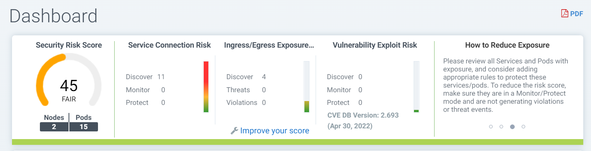
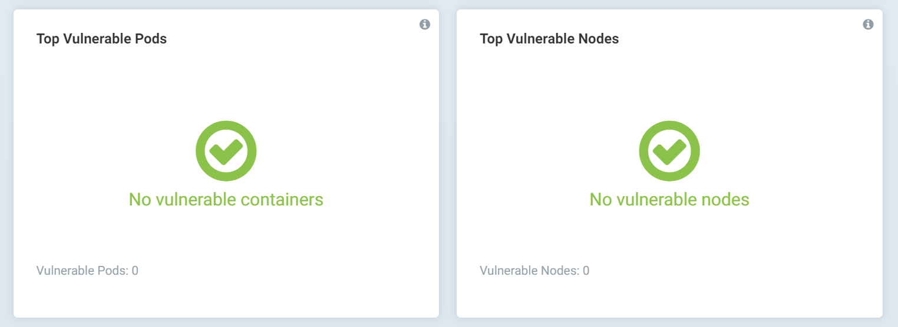
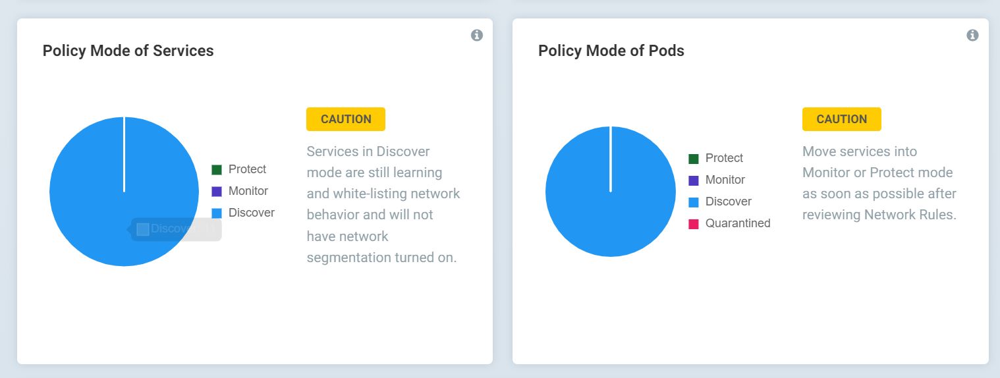
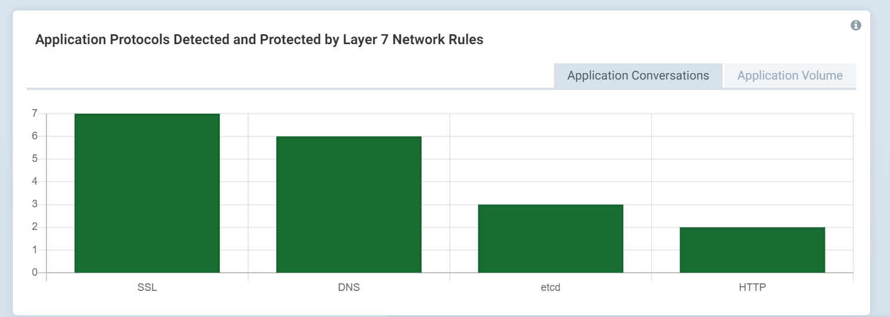
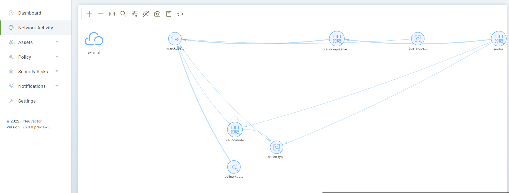

功能简介和实现原理

对来说，

# 一、Dashboard

## 1、1 统计信息

## 1、2 暴露的ingress和egress

## 1、3 Critical Run-Time Security Events

## 1、4 Top Security Events - Source and Destination

## 1、5 Top Vulnerable Pods and Nodes

## 1、6 Policy Mode of Services and Pods

## 1、7 Application Protocols Detected and Protected by Layer 7 Network Rules

# 二、网络连接

可以看到不同实体（node或虚机）之间的连接关系

点击后还会出现不同的

# 三、资产

## 3、1 Platform平台

## 3、2 Nodes节点

## 3、3 Container容器

## 3、4 Registries仓库

添加仓库

## 3、5 System Components系统组件

# 四、Policy策略

## 4、1 DLP sensor

## 4、2 waf sensor

值得关注的是添加waf规则的方式

编写好的Pattern可以点击右侧的"TEST"按钮进行测试。

context上下文支持packet、url、header、body。

## 4、3 Response Rules

右侧按钮分别是Edit Rule，Add Rule，Enable Rule，Delete Rule。

添加规则：

**Category**：策略，支持的类型有Security Event，Event，CVE-Report，Compliance，Admission

**Group**：分组

**Criteria Type**:标准类型

Criteria Type根据Category策略的变化而变化。

Security Event策略

Event策略

CVE-Report策略

Compliance策略

Admission策略

**Action**: 操作

**Status**：启用或禁用状态

## 4、4 Network Rules

From:源组

TO:目的Group组

Application：应用名称

Ports：端口，如tcp/6443代表tcp协议的6443端口

Action：动作，Allow表示允许

Type：类型，Learned表示学习

Update at：更新时间

## 4、5 Groups组

对于nv.calico-apiserver.calico-apiserver组而言，点击后查看下面的Members成员（2个）

Group命名 = nv + 命名空间 + 服务名

### 1） 进程规则

Process Name：进程名称

Path：进程路径

### 2）文件规则

**Recursive**：是否递归

**Action**：监控文件变化 或者 阻断未授权的访问

**Allowed Applications Type**:允许的应用类型

### 3）网络规则

### 4） 响应规则

## 4、6 Admission Control访问控制

添加规则

**Criterion**：标准，支持以下条目：

Allow Privilege Escalation

Count of high severity CVE

Count of high severity CVE with fix

Count of medium severity CVE

CVE names

CVE score

Environment variables with secrets

Environment variables

Image

Image compliance violations

Image without OS information

Image registry

Image scanned

Labels

Mount Volumes

Namespace

PSP Best Practice

Resource Limit Configuration

Run as privileged

Run as root

Share host ipc namespaces

Share host's Network

Share host's PID namespaces

User

User groups

# 五、原理篇

**使用 NeuVector 实现容器安全的出口控制**

https://blog.neuvector.com/article/enforce-egress-control-containers

备注：以下文字只是翻译了部分文字。

​	一旦在容器主机上部署 NeuVector Enforcer 容器后，它使用 DPI 技术（深度数据包检测）自动开始监视该主机上的容器网络连接。NeuVector使用DPI技术 能够发现网络中的攻击。它还可用于识别应用程序并在应用程序级别执行网络策略。

​	一旦将拥有DNS白名单的网络策略推送到 Enforcer，Enforcer 的data path进程开始默默地检查容器发出的 DNS 请求。Enforcer 不会主动发送任何 DNS 请求，因此 NeuVector 不会引入额外的网络开销。它解析 DNS 请求和响应，并将解析的 IP 与指定容器建立的网络连接相关联。根据定义的策略，Enforcer 可以允许、警告或拒绝网络连接。

这种方法适用于未加密和加密的连接，并且不会被任何伪造的标头欺骗。它可用于对任何协议强制执行策略，而不仅仅是 HTTP 或 HTTPS协议。更重要的是，由于 DPI 技术，Enforcer 可以检查连接并确保仅使用正确的 PostgreSQL 协议来访问 PostgreSQL 数据库。

使用 DPI/DLP 通过传统代理执行出口控制

另一个更高级的用例是通过代理（例如在集群外运行的 squid 代理）路由流量。

这带来了挑战，即如何根据连接的目的地区分,连接是应该被允许或应该被阻止，但在源容器或pod 上执行策略。

在下面的示例中，允许连接访问morningstart.com 上的外部资源，而 对于oracle.com 的连接应该被阻止。但是，所有连接都必须通过在集群外运行的 squid 代理。

挑战在于我们希望在集群内、在源容器或pod 上强制执行出口控制，定义allow允许哪些容器源访问哪些出口目的地将更加灵活。

为了实现这一点，我们可以使用 NeuVector 深度数据包检测 (DPI)功能和数据丢失防护 (DLP) 功能来检查出站连接中的 http 标头，并在阻止 oracle.com 的同时允许 morninstar.com。