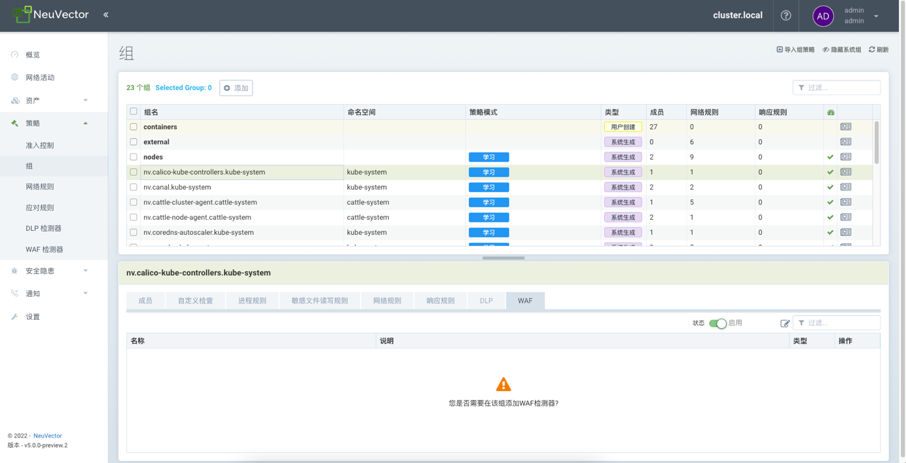

Neuvector源代码分析

2022年5月10号 今天的任务是把Neuvector的官网文档看完。


侧重点：

微隔离 

流量侧引擎

应用防护


OpenShift 学习


How to Enforce Egress Container Security Policies in Kubernetes, OpenShift, and Istio

https://blog.neuvector.com/article/enforce-egress-control-containers


1、学习模式、监控模式、保护模式三种模式的区别是什么，分别是如何实现的？

子问题：学习模式是如何建立基线的？在三种不同模式之间切换，满满的都是工作量啊。


2、Neuvector支持哪些协议的解析？ok,协议识别可以加

NeuVector 深度了解应用程序行为，并将分析有效负载，以确定应用程序协议。协议包括：HTTP，HTTPS，SSL，SSH，DNS，DNCP，NTP，TFTP，ECHO，RTSP，SIP，MySQL，Redis，Zookeeper，Cassandra，MongoDB，PostgresSQL，Kafka，Couchbase，ActiveMQ，ElasticSearch，RabbitMQ，Radius，VoltDB，Consul，Syslog，Etcd，Spark，Apache，Nginx，Jetty，NodeJS，Oracle，MSSQL 和 GRPC。

3、DDOS防护是如何做到的？位图

4、waf和dlp数据防泄露是如何实现的？（补）

5、使用正则表达式和hyperscan来进行匹配的数据包

6、协议解析器的注册和使用

7、policy策略管理相关的内容

8、Neuvector的会话表是如何进行管理的？

9、基于epoll的事件通知机制是贯穿于整个源代码中的，这块找一个稍微分析下。

10、tcp重组 要看看。


统一接口 实现->netfilter calico，cilium，xdp，ebpf，cni

calico

kube-ovn

xdp cilium


xxxxxx

tcp seg1  xxx\oxxxx\0xxx 

tcp seg2 

tcp seg3 

totoal

grpc 长连接


snort

suricata


gzip

chunk


# 零、基础概念

一、组 Groups


## 二、网络策略

NeuVector 的组支持 3 种模式：学习模式、监控模式和保护模式；各个模式实现作用如下：

- 学习模式（TODO 学习了什么，什么算法）
    学习和记录容器、主机间网络连接情况和进程执行信息。
    自动构建网络规则白名单，保护应用网络正常行为。
    为每个服务的容器中运行的进程设定安全基线，并创建进程配置文件规则白名单。（TODO）
- 监控模式
    NeuVector 监视容器和主机的网络和进程运行情况，遇到非学习模式下记录的行为将在 NeuVector 中进行告警。
- 保护模式
    NeuVector 监视容器和主机的网络和进程运行情况，遇到非学习模式下记录的行为直接拒绝。

新建的容器业务被自动发现默认为学习模式，也可以通过设置将默认模式设置为监控模式或保护模式。


**生产环境最佳实践使用路径可以是：**

- 上新业务时，先学习模式运行一段时间，进行完整的功能测试和调用测试（TODO），得到实际业务环境的网络连接情况和进程执行情况的信息。
- 监控模式运行一段时间，看看有没有额外的特殊情况，进行判断，添加规则。
- 最后全部容器都切换到保护模式，确定最终形态。


# 一、dp项目简介

1、1 dp目录结构介绍

|      |      |      |
| ---- | ---- | ---- |
|      |      |      |
|      |      |      |
|      |      |      |

third-party目录：

utils目录

apis.h

ctrl.c

debug.c

debug.h

nfq.c netfilter文件

pkt.c

ring.c

main.h

main.c

Makefile


dp目录结构之外的文件

defs.h 重要定义都在此处 TODO：重视此文件


基础组件

正则表达式

hyperscan

rcu map 用户态的rcu

时间轮，超时机制，以前写过，大概看看api就行


## 1、2 核心数据结构

会话结构体dpi_session_t

```go
typedef struct dpi_session_ {
    struct cds_lfht_node node;//Lock-Free RCU Hash Table 无锁哈希表
    timer_entry_t ts_entry; //时间轮
    timer_entry_t tick_entry;//时间轮

    uint32_t id;
    uint32_t created_at; //会话创建的时间
    uint32_t last_report;//最近上报时间

    dpi_wing_t client, server;
    void *parser_data[DPI_PARSER_MAX];

    uint16_t flags;
    uint8_t tick_flags :4,
            meter_flags:4;
    uint8_t only_parser;

    uint32_t small_window_tick; // small window size start tick

    BITMASK_DEFINE(parser_bits, DPI_PARSER_MAX);

    uint16_t app, base_app;
    uint8_t ip_proto;
    uint8_t action:      3,
            severity:    3,
            term_reason: 2;
    uint32_t threat_id;
    dpi_policy_desc_t policy_desc;
    dpi_policy_desc_t xff_desc;
    BITOP tags;
    uint32_t xff_client_ip;
    uint16_t xff_app;
    uint16_t xff_port;
} dpi_session_t;
```


## 1、3 线程模型剖析

从线程模型来剖析大局的话，netfilter_queue 0 1

```
static int net_run(const char *in_iface)
{
    pthread_t timer_thr;
    pthread_t bld_dlp_thr;
    pthread_t dp_thr[MAX_DP_THREADS];
    int i, timer_thr_id, bld_dlp_thr_id, thr_id[MAX_DP_THREADS];
    
    ......

    dp_ctrl_init_thread_data();

    pthread_create(&timer_thr, NULL, dp_timer_thr, &timer_thr_id);

    pthread_create(&bld_dlp_thr, NULL, dp_bld_dlp_thr, &bld_dlp_thr_id);

    for (i = 0; i < g_dp_threads; i ++) {
        thr_id[i] = i;
        pthread_create(&dp_thr[i], NULL, dp_data_thr, &thr_id[i]);
    }

    dp_ctrl_loop();

    pthread_join(timer_thr, NULL);
    pthread_join(bld_dlp_thr, NULL);
    for (i = 0; i < g_dp_threads; i ++) {
        pthread_join(dp_thr[i], NULL);
    }

    return 0;
}
```

timer_thr线程：用于更新全局时间g_seconds

bld_dlp_thr线程：

dp_thr[i]线程：创建了多个dp_thr线程


# 二、DPI功能

## 2、0 数据源

DPI分析的网络流量从何而来？主要有三种方式

1、pcap包 -p

2、netfilter_queue

3、ring环 TODO： 重点看了前两者，此处没细看。

切换到容器的命名空间，设置netfilter_queue相关的设置

好处：同一个pod上不同的container上的操作。 TODO


## 2、1 网络协议解析

dpi_parse_ethernet()

dpi_parse_packet() 解析以太网，判断下一层是否是ip协议

dpi_parse_ipv4() 解析ip协议，判断下一层是否是tcp协议

dpi_parse_tcp()解析tcp协议

**1）以太网协议解析**

```c
static int dpi_parse_packet(dpi_packet_t *p)
{
    struct ethhdr *eth;
    eth = (struct ethhdr *)(p->pkt + p->l2);

    // Start L3 parsing
    p->eth_type = ntohs(eth->h_proto);
    switch (p->eth_type) {
    case ETH_P_IP:
        th_counter.ipv4_pkts ++;
        if (dpi_parse_ipv4(p) < 0) { //解析ip协议数据
            return -1;
        }
        break;
    case ETH_P_IPV6:
     	.....
        break;
    }

    return 0;
}
```

**2）ip协议解析dpi_parse_ipv4函数**

```
static int dpi_parse_ipv4(dpi_packet_t *p)
{
    struct iphdr *iph = (struct iphdr *)(p->pkt + p->l3);

    // IP fragment分片处理
    p->ip_proto = iph->protocol;
    
    // Start L4 parsing
    switch (p->ip_proto) {
    case IPPROTO_TCP:
        return dpi_parse_tcp(p);
    case IPPROTO_UDP:
        return dpi_parse_udp(p);
    case IPPROTO_ICMP:
        return dpi_parse_icmp(p);
    }

    return 0;
}
```

**3）tcp协议解析dpi_parse_tcp()函数**

```
static int dpi_parse_tcp(dpi_packet_t *p)
{
    struct tcphdr *tcph = (struct tcphdr *)(p->pkt + p->l4);
    uint16_t tcp_len = p->len - p->l4;

	//校验tcp flag标志位 重点，重点，重点
    if (BITMASK_TEST(tcp_bad_flag_mask, tcph->th_flags & TCP_FLAG_MASK)) {
        LOG_BAD_PKT(p, "Bad tcp flags %s", get_tcp_flag_string(tcph, flags));
        return -1;
    }

    // Checksum 校验和
    if (unlikely(g_io_config->enable_cksum)) {
        cksum = get_l4v4_cksum((struct iphdr *)(p->pkt + p->l3), tcph, tcp_len);
    }

	//tcp的option字段解析
    if (tcph_len > sizeof(*tcph)) {
        if (dpi_parse_tcp_options(p) < 0) {
            return -1;
        }
    }

    return 0;
}
```


## 2、2 应用层协议解析

解析器代码都位于dpi/parser目录中

调用栈为：dpi_setup() -> dpi_parser_setup()


### 2、2、1 注册流程

```
void dpi_parser_setup(void)
{
    register_parser(dpi_dhcp_parser());
    ......注册其他协议的解析器
}

static void register_parser(dpi_parser_t *parser)
{
    dpi_parser_t **list = get_parser_list(parser->ip_proto);
    list[parser->type] = parser; 
    //相当于一个二维数组，第一层是proto,第二层是应用层的type类型
}

static dpi_parser_t **get_parser_list(int ip_proto)
{
    switch (ip_proto) {
    case IPPROTO_TCP:
        return g_tcp_parser;
    case IPPROTO_UDP:
        return g_udp_parser;
    default:
        return g_any_parser;
    }
}
```

解析器大致分为三类，全局tcp解析器，全局udp解析器，任意协议的解析器。

解析器的类型parser->type是何时赋值的呢？

TODO：这里画一张图，补下协议解析树的流程。


再看dpi_dhcp_parser函数

```
dpi_parser_t *dpi_dhcp_parser(void)
{
    return &dpi_parser_dhcp;
}

static dpi_parser_t dpi_parser_dhcp = {
    new_session: dhcp_new_session,
    delete_data: NULL,
    parser:      dhcp_parser,
    name:        "dhcp",
    ip_proto:    IPPROTO_UDP,
    type:        DPI_PARSER_DHCP,
};
```

其中type为DPI_PARSER_DHCP，ip_proto为IPPROTO_UDP


### 2、2、2 调用流程

由于我只关心解析数据包，所以看parser回调函数。

dpi_pkt_proto_parser

​		dpi_proto_parser

​				cp->parser(p);


## 2、3 ip分片

ip分片以ipv4版本来进行讲解

数据结构

\#define th_ip4frag_map  (g_dpi_thread_data[THREAD_ID].ip4frag_map)


```
typedef struct dpi_thread_data_ {
    dpi_packet_t packet;
    dpi_snap_t snap;
    io_counter_t counter;
	io_stats_t stats;

    rcu_map_t ip4frag_map; 			//ipv4分片表
    rcu_map_t ip6frag_map;			//ipv6分片表
    rcu_map_t session4_map;			//ipv4会话表
    rcu_map_t session4_proxymesh_map;
    rcu_map_t session6_map;			//ipv6会话表
    rcu_map_t session6_proxymesh_map;
    rcu_map_t meter_map;
    rcu_map_t log_map;
    rcu_map_t unknown_ip_map;		//未知ip的映射表
	timer_wheel_t timer;

	io_internal_subnet4_t *subnet4;
	io_spec_internal_subnet4_t *specialipsubnet4;
	io_internal_subnet4_t *policyaddr;

	void *apache_struts_re_data;

    uint8_t dp_msg[DP_MSG_SIZE];
    uint32_t hs_detect_id;
    uint8_t xff_enabled;
} dpi_thread_data_t;
```

分片表的增删改查操作相关的代码

**初始化**

```
void dpi_frag_init(void)
{
    rcu_map_init(&th_ip4frag_map, 1, offsetof(ip4frag_trac_t, node),
                 ip4frag_trac_match, ip4frag_trac_hash);
}
```

**查找和添加**

```
int dpi_ip_defrag(dpi_packet_t *p)
{
    ip4frag_trac_t *trac, key;
    struct iphdr *iph = (struct iphdr *)(p->pkt + p->l3);
    int ret = -1;

	//构造key
    memset(&key, 0, sizeof(key));
    key.src = iph->saddr;
    key.dst = iph->daddr;
    key.ipid = iph->id;
    key.ingress = !!(p->flags & DPI_PKT_FLAG_INGRESS);

	//以key为依据查找th_ip4frag_map分片表
    trac = rcu_map_lookup(&th_ip4frag_map, &key);
    if (trac == NULL) {
        trac = malloc(sizeof(*trac));
        if (trac == NULL) {
            return -1;
        }

        memcpy(trac, &key, sizeof(key));
        asm_init(&trac->frags);

		//添加到th_ip4frag_map中
        rcu_map_add(&th_ip4frag_map, trac, &key);
        timer_wheel_entry_init(&trac->ts_entry);
        timer_wheel_entry_start(&th_timer, &trac->ts_entry,
                                ipfrag_release, DPI_FRAG_TIMEOUT, th_snap.tick);
    }

    timer_wheel_entry_refresh(&th_timer, &trac->ts_entry, th_snap.tick);

    ipfrag_hold(trac, p);
    if (trac->first && trac->last) {
        ret = ipfrag_construct(trac, p);
    }

    return ret;
}
```

**删除**


## 2、4 会话管理

会话管理以ipv4版本来进行讲解

超时机制如何？

**初始化**

```
void dpi_session_init(void)
{
    rcu_map_init(&th_session4_map, 512, offsetof(dpi_session_t, node),
}
```


**查找操作**

```
dpi_session_t *dpi_session_lookup(dpi_packet_t *p)
{
    dpi_session_t *s, key;
    bool ingress = !!(p->flags & DPI_PKT_FLAG_INGRESS);
    bool isproxymesh = cmp_mac_prefix(p->ep_mac, PROXYMESH_MAC_PREFIX);

    memset(&key.client.ip, 0, sizeof(key.client.ip));
    memset(&key.server.ip, 0, sizeof(key.server.ip));

    key.ip_proto = p->ip_proto;

    // Try client side
    if (unlikely(FLAGS_TEST(p->flags, DPI_PKT_FLAG_FAKE_EP))) {
        // For pcap pcacket, session is always marked as INGRESS
        key.flags = DPI_SESS_FLAG_INGRESS | DPI_SESS_FLAG_FAKE_EP;
    } else {
        key.flags = ingress ? DPI_SESS_FLAG_INGRESS : 0;
    }
    key.client.port = p->sport;
    key.server.port = p->dport;

    if (likely(p->eth_type == ETH_P_IP)) {
        struct iphdr *iph = (struct iphdr *)(p->pkt + p->l3);
        key.client.ip.ip4 = iph->saddr;
        key.server.ip.ip4 = iph->daddr;
        if (isproxymesh) {
            s = rcu_map_lookup(&th_session4_proxymesh_map, &key);
        } else {
            s = rcu_map_lookup(&th_session4_map, &key);
        }
    }

    // Try server side
    if (unlikely(FLAGS_TEST(p->flags, DPI_PKT_FLAG_FAKE_EP))) {
        // For pcap pcacket, session is always marked as INGRESS
        key.flags = DPI_SESS_FLAG_INGRESS | DPI_SESS_FLAG_FAKE_EP;
    } else {
        key.flags = !ingress ? DPI_SESS_FLAG_INGRESS : 0;
    }
    key.client.port = p->dport;
    key.server.port = p->sport;

    if (likely(p->eth_type == ETH_P_IP)) {
        struct iphdr *iph = (struct iphdr *)(p->pkt + p->l3);
        key.client.ip.ip4 = iph->daddr;
        key.server.ip.ip4 = iph->saddr;
        if (isproxymesh) {
            s = rcu_map_lookup(&th_session4_proxymesh_map, &key);
        } else {
            s = rcu_map_lookup(&th_session4_map, &key);
        }
    } else {
        struct ip6_hdr *ip6h = (struct ip6_hdr *)(p->pkt + p->l3);
        key.client.ip.ip6 = ip6h->ip6_dst;
        key.server.ip.ip6 = ip6h->ip6_src;
        if (isproxymesh) {
            s = rcu_map_lookup(&th_session6_proxymesh_map, &key);
        } else {
            s = rcu_map_lookup(&th_session6_map, &key);
        }
    }

    return NULL;
}
```

DPI_PKT_FLAG_FAKE_EP是什么时候设置的

对于 pcap 数据包, session会话将被标记为 INGRESS


**删除操作**

dpi_session_release

rcu_map_del(&th_session4_map, s);


# 三、DDOS防护

只是简单的判断了tcp的标志位。

函数调用栈：dpi_setup -> dpi_packet_setup


定义有问题的tcp标志位合集

```
#define TCP_FLAG_MASK (TH_PUSH | TH_URG | TH_FIN | TH_ACK | TH_SYN | TH_RST)
static uint8_t tcp_bad_flag_list[] = {
    0,
    TH_URG,
    TH_FIN,
    TH_PUSH,
    TH_PUSH | TH_FIN,
    TH_PUSH | TH_URG,
    TH_SYN | TH_FIN,
    TH_PUSH | TH_URG | TH_FIN,
    TH_PUSH | TH_URG | TH_FIN | TH_ACK | TH_SYN,
    TH_PUSH | TH_URG | TH_FIN | TH_ACK | TH_SYN | TH_RST,
};
BITMASK_DEFINE(tcp_bad_flag_mask, 256);
```

判断流程在tcp数据包的解析函数中，调用BITMASK_TEST(tcp_bad_flag_mask, tcph->th_flags & TCP_FLAG_MASK)来判断tcp数据包的标志位是否合法，从而判断是否是ddos攻击。


# 四、数据防泄露DLP实现

dlp的正则表达式的库，是否好维护？

dpi_dlp_ep_policy_check


初始化

何时调用


# 五、应用层防护 WAF 实现

dpi_waf_ep_policy_check


# 六、微隔离

微隔离实现的关键函数为

dpi_pkt_policy_reeval(dpi_packet_t *p)


调用栈为：

dpi_recv_packet

dpi_inspect_ethernet

​		dpi_pkt_policy_reeval

​				

```
static void dpi_pkt_policy_reeval(dpi_packet_t *p)
{
    bool to_server = dpi_is_client_pkt(p);
    dpi_session_t *s = p->session;
    int log_violate = 0;

    if (unlikely(dpi_policy_reeval(p, to_server) >= 1)) {
      	//log violate
        if (s->policy_desc.action == DP_POLICY_ACTION_DENY ||
            s->xff_desc.action == DP_POLICY_ACTION_DENY) {
            if (p->ip_proto == IPPROTO_TCP) {
                dpi_inject_reset(p, true);
                dpi_inject_reset(p, false);
            }
            // For mid session deny, keep the session to block
            // traffic coming afterwards
            //dpi_session_delete(s, DPI_SESS_TERM_POLICY);
            //p->session = NULL;
            p->session->action = DPI_ACTION_BLOCK;
            dpi_set_action(p, DPI_ACTION_DROP);
        }
    }
}
```


dpi_inject_reset(p, true);

dpi_inject_reset(p, false);

上述代码调用dpi_inject_reset是给client和server端都发送reset包。调用reset包是中断链接，而drop数据包后对端还会进行重传。


```
void dpi_inject_reset(dpi_packet_t *p, bool to_server)
{
    if (unlikely(p->session == NULL)) return;

    dpi_inject_reset_by_session(p->session, to_server);
}
```

同时向客户端和服务器都发送reset数据包。


policy_desc和xff_desc的区别是什么？


///////////////////////////////////待解决的问题///////////////////////////////////////////////

七、策略管理

NeuVector 通过组的方式对容器和主机进行管理，对组进行合规性检查、网络规则、进程和文件访问规则、DLP/WAF 的检测配置。

NeuVector 会自动将当前集群主机加入到 nodes 组，对于集群内容器会自动创建以 nv.开头的组。




前者是策略，后者是什么东西？？？

对于中间会话的拒绝，保留会话以阻止之后的流量。（没毛病，老铁）


还未解决的问题，meter是什么东西？

所有的时间采用的基于epoll的事件驱动模型，来进行编程。

收包线程是哪个函数？锁是如何的？

netfilter_queue的链接要


cds_lsht_node介绍

cds_lfht_node：包含查找和遍历哈希表所需的下一个指针和反向哈希值。cds_lfht_node 应该以8字节内存对齐，低3位用做flag标志。

struct cds_lfht_node 可以作为字段嵌入到结构中。

caa_container_of() 可用于在查找后从 struct cds_lfht_node 获取结构。
嵌入它的结构通常保存对象的key键（或键值对）。调用者代码负责计算 cds_lfht API 的哈希值。


main函数分析

从pcap包读取数据（主要是用于测试）

从ring读取，ring是哪里来的

从netfilter_queue进行读取

proxymesh是对应什么场景？

ingress 和 egress是如何来处理的，\#define DPI_PKT_FLAG_INGRESS    0x00000100宏是如何发挥作用的


参考资料：

https://asphaltt.github.io/post/iptables-nfqueue/


动态微隔离实验

https://www.cnblogs.com/rancherlabs/p/16111452.html