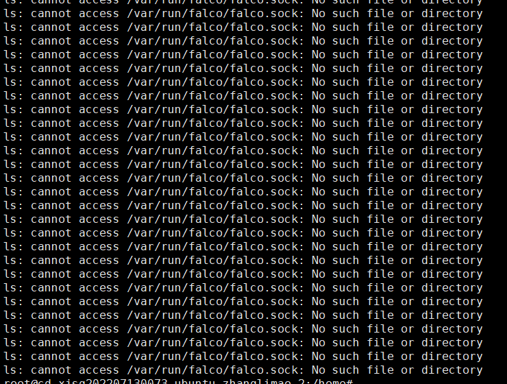
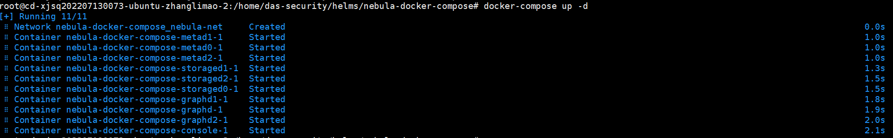
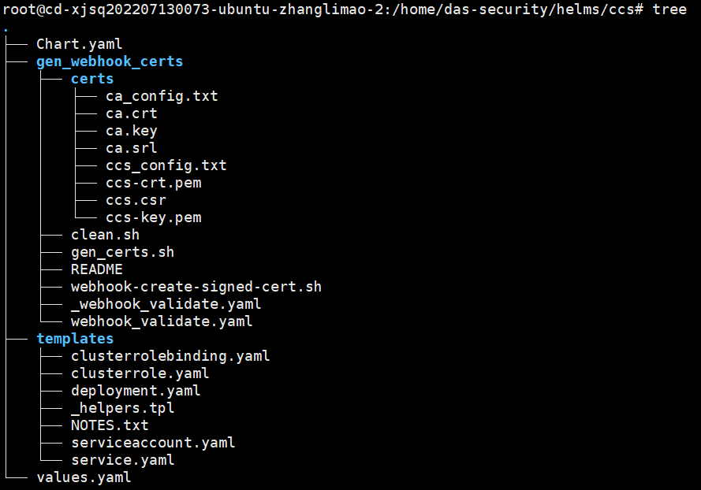

```
helm pull
```

helm pull命令

从仓库下载并（可选）在本地目录解压


```
helm upgrade --install ingress-nginx . -f ./ci/daemonset-prod.yaml --create-namespace --namespace ingress-nginx

#upgrade如果存在的话，我就迁移更新，不存在的话，我就去安装。
#这里我们耐心等待一会儿
Release "ingress-nginx" has been upgraded. Happy Helming!
NAME: ingress-nginx
LAST DEPLOYED: Tue Apr 26 21:05:04 2022
NAMESPACE: ingress-nginx
STATUS: deployed
REVISION: 2
TEST SUITE: None
NOTES:
The ingress-nginx controller has been installed.
It may take a few minutes for the LoadBalancer IP to be available.
You can watch the status by running 'kubectl --namespace ingress-nginx get services -o wide -w ingress-nginx-controller'

An example Ingress that makes use of the controller:
  apiVersion: networking.k8s.io/v1
  kind: Ingress
  metadata:
    name: example
    namespace: foo
  spec:
    ingressClassName: nginx
    rules:
      - host: www.example.com
        http:
          paths:
            - pathType: Prefix
              backend:
                service:
                  name: exampleService
                  port:
                    number: 80
              path: 
    # This section is only required if TLS is to be enabled for the Ingress
    tls:
      - hosts:
        - www.example.com
        secretName: example-tls

If TLS is enabled for the Ingress, a Secret containing the certificate and key must also be provided:

  apiVersion: v1
  kind: Secret
  metadata:
    name: example-tls
    namespace: foo
  data:
    tls.crt: <base64 encoded cert>
    tls.key: <base64 encoded key>
  type: kubernetes.io/tls
```

部署流程

创建一个cnds的命名空间。

# 1、安装falco驱动

不安装驱动的话，falco启动不开。




# 2、安装数据库 （docker-compose方式）

## 2、1 nebula图数据库



## 2、2 mysql数据库

将image/remote/mysql.tar镜像压缩包导入到机器中

```
docker run -d --name mysql -e MYSQL_ROOT_PASSWORD=123456 -p 6678:3306 
-v /usr/mydata/mysql/log:/var/log/mysql 
-v /usr/mydata/mysql/data:/var/lib/mysql 
-v /usr/mydata/mysql/conf:/etc/mysql/conf
.d mysql:8.0.28
```


## 2、3 redis数据库

```
docker run -d --name redis -p 6679:6379 redis:6.2.6 --requirepass "123456"

```

进入数据库进行验证

```
mysql -p123456
```


# 3、安装ccs

目录结构如下




helm install -n cnds ccs .


需要修改三个文件

mysql-service.yaml

nebula-service.yaml

redis-service.yaml

将address改为本机的ip地址，我的部署ip为10.254.177.30


将数据库casbin.sql导入到mysql数据库中。


修改values.yaml中的nodeName为本机域名

nodeName: cd-xjsq202207130073-ubuntu-zhanglimao-2


排查service问题

先查service是否存在

然后看endpoint是否存在

supervisorctl命令

supervisorctl status


查看日志在/var/log/ccs.log

可以查看到web的日志。


使用mysql用包里面的。

The Service "web-service" is invalid: spec.ports[0].nodePort: Invalid value: 443: provided port is not in the valid range. The range of valid ports is 30000-32767


```
暴露端口号：22，80，443，8443，7443，6443，3306，63306，9080，6379，2379，2380，30443
10.254.177.103
10.254.179.70
10.254.177.84
10.254.179.48
10.254.177.30
10.254.179.190
暴露端口号：22，80，443，8443，7443，6443，3306，63306，9080，6379，2379，2380，139，445
10.254.178.204
10.254.179.88
```


# 4、alertmanager告警


# 5、ccs-agent


# 6、web


# 7、node-exporter


排查问题命令

kubectl logs <pod name>

kubectl describe pods

实战：ingress-nginx安装-2022.4.26

https://www.modb.pro/db/399728


https://blog.csdn.net/weixin_39246554/article/details/123955289

https://helm.sh/zh/docs/helm/helm_pull/