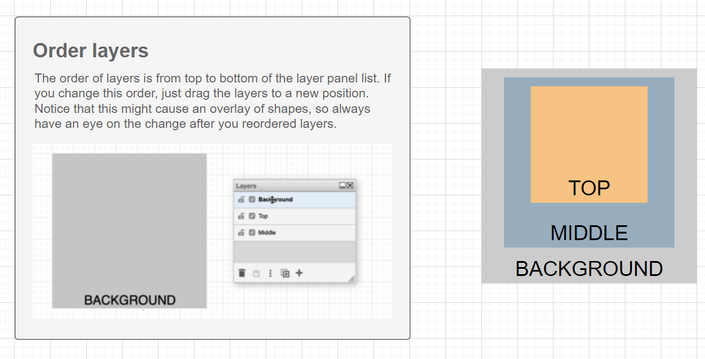
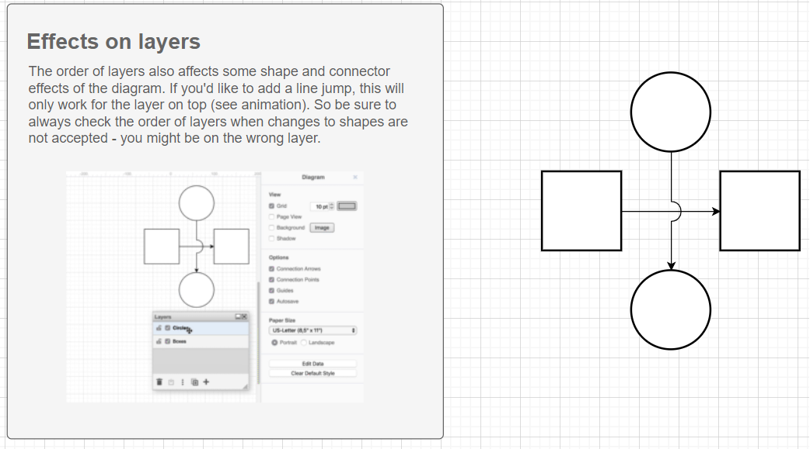
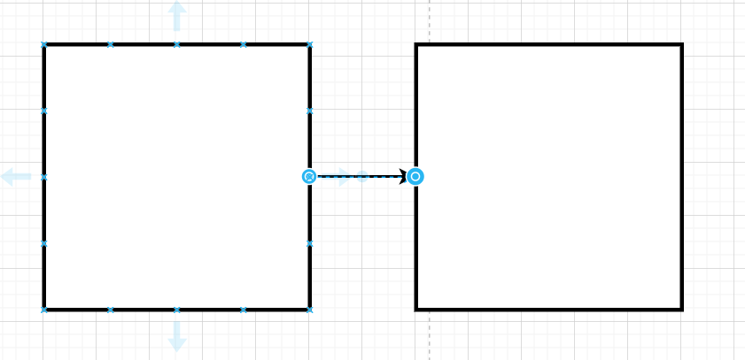

# 一、初学者教程

图形的放大和缩小

图形的拖拽和移动位置

添加图形

添加文本

添加连接线

如何调整连线的方向呢？

改变图形填充的颜色和图形线条颜色

为图形添加链接

添加image图像到drawio

# 二、layer层指南

显示layer层菜单

单击锁定符号时，将禁用该图层上所有形状的编辑。

单击隐藏按钮时，会隐藏该图层上的所有形状。

创建和命名layer层，使用菜单中的“+”符号添加新图层。双击每个图层以更改名称。

向图层中添加图形，先选中图层成蓝色，然后选中图形来添加

在图层间移动多个图形，已找到按钮

选择一个形状。您可以通过“图层”面板中的黑点查看它所在的图层。

更改图层的顺序，图层的顺序是图层面板列表从上到下的顺序。移动其位置即可。

层的顺序也会影响图表的某些形状和连接器效果。如果您想添加跳线，这仅适用于顶部的图层（参见动画）。

复制图层只需在图层菜单中单击一次。新图层将恰好位于原始图层的顶部。

编辑图层数据

# 三、连接器指南

在图形上新建连接器

使用连接器创建新形状

从边栏中选择连接的形状

基本风格  	三种基本风格：锐利、圆润和弯曲

​				 	颜色、图案和线条变化

​				 	箭头类型和航点样式

​					阴影和漫画效果

​                    跳线

在连接器上添加text文字，调整text文字

调整连接器

添加航点 您可以右键单击该线并选择添加航点，以绕过更多的障碍物。（添加航点、删除航点）

使用键盘创建多个带有连接线的新形状。单击要作为起点的形状，然后按 Alt+Shift+Cursor(键盘的上下左右) 添加新形状。

复制连接器 按住ctrl 和 连接器的末端，然后拖拽到目的位置。

连接到固定点，默认情况，连接器始终停靠在边缘。而如按住alt键即可拖拽到任意位置。

固定和悬浮

​		当您使用连接创建新形状时，此连接将始终在两侧浮动。

​		查看是否悬浮？单击连接并查看连接器起点和终点周围的蓝色圆圈是否是一个O

在现有形状之间设置浮动连接

在现有形状之间设置固定连接

四、高级

创建切换按钮

