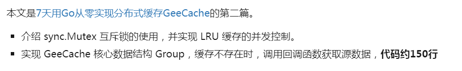
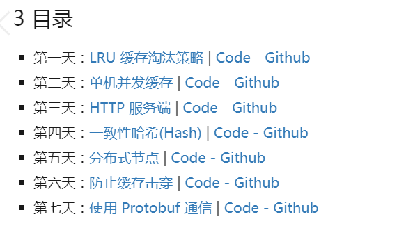
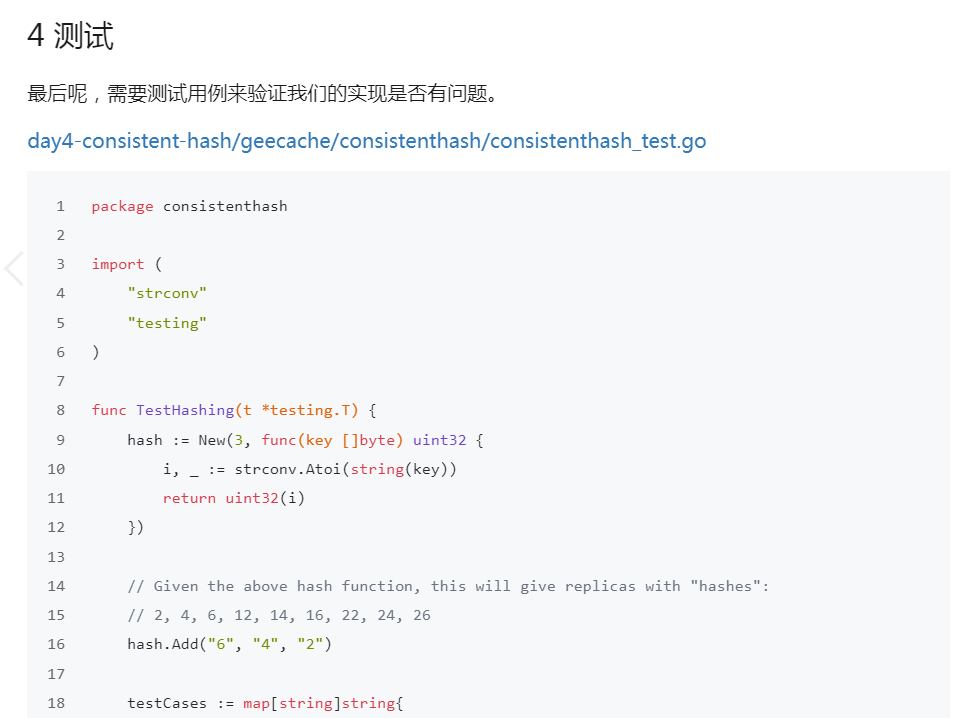
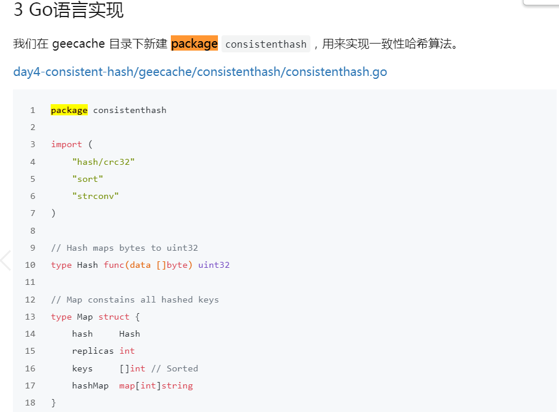
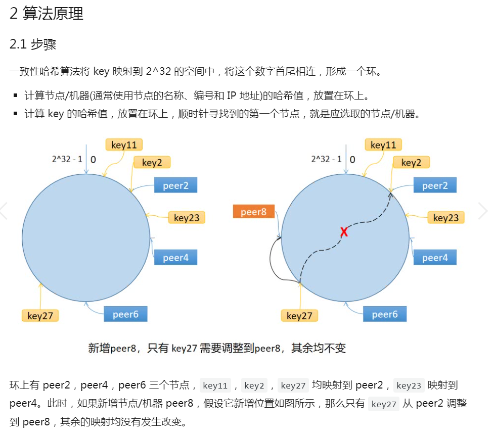

技术文章的写作技巧—— 不断更新

感谢极客兔兔博主的良言，“不断的进行技术写作，当数量超过100篇时，自然就有感觉了”，我相信他说的，我也愿意如此去做。


本篇技术写作是通过研究“极客兔兔”的《7天从零实现系列》技术博客的写作风格，取其精华以提升自己的写作水平。

# 一、谋篇布局

## 1、1 开篇点题

开篇点题，有助于读者对于全篇内容有个大致的了解，然后有侧重点的去阅读，对于熟悉的文字部分可跳跃，对于想深入了解的文字部分可深入阅读。



从零实现系列的每个专题都有个目录，也是方便读者进行阅读的。


## 1、2 合理的铺垫

### 1、2、1 技术铺垫

比如在《动手写分布式缓存 - GeeCache第二天 单击并发缓存》章节中，实现并发需要使用sync.Mutex互斥锁，所以作者举了一个简单的例子来铺垫sync.Mutex的使用，为后面实现并发缓存扫清障碍，从内容上也是层层递进的关系，降低了学习的门槛。


### 1、2、2 场景知识铺垫

比如在《动手写分布式缓存 - GeeCache第四天 一致性哈希》章节中，在开篇就讲解了为什么需要一致性哈希，以及其算法原理是什么。


## 1、3 上节流程回顾

流程回顾环节，作为承上启下的作用，让读者的思考跟上作者的思路。


## 1、4 增加内容对应链接



对于有导航性质的内容，加入对应的链接，一方面能增加曝光度，另一方面，用户点击后直达想看的内容，更加方便。


# 二、代码规范篇

## 2、1 核心代码要递增，避免对前面代码的修改

核心代码必须是递增的，读者模仿的时候才不至于乱掉。如果在代码编写的过程中，后面的功能特性的代码要删除或修改前面的代码，其操作的复杂性可能会绕晕读者。

在github代码仓库中以第一天到第七天来组织项目代码，极客兔兔的GeeCache截图如下


第一天代码：day1-lru

第二天代码：day2-single-node

第三天代码：

第四天代码：

第五天代码：

第六天代码：

第七天代码：


## 2、2 保证每天代码可运行，可测试

测试驱动开发TDD的思想，就是保证每次提交的代码可运行，可测试，如把每次代码提交算成一步的话，这就是小步快走，不断优化迭代。



让读者经历了一次编程之旅：

1、解决什么问题

2、问题的本质是什么

3、编程解决问题

4、测试、验证是否解决了问题

这样是最好的。


## 2、3 博客中代码片段 描述要详尽

方便读者在模仿的过程中，将博客中代码和github代码进行一一对照。

1） 新建package包/文件，每个package包的作用要说清楚。

2） 变量添加在哪个文件的哪行

如下图所示：




# 三、项目的代码结构  项目的流程图

只是单一的文件的话，读者并没有什么感知，所以有时需要列一下

一图胜千言，能够生动形象的表述出意思。


# 四、核心代码的描述

核心代码大致包括四个部分

- 核心数据结构
- 核心算法
- 核心struct结构体
- 核心interface接口
- 核心函数的步骤


对于核心数据结构和算法的阐述，最好是有高清图 + 通俗易懂的文字解释，这样更好理解。

## 4、1 核心数据结构描述

在《动手写分布式缓存 - GeeCache第一天 LRU 缓存淘汰策略》中使用图 + 文字来讲解LRU的核心数据结构


这张图很好的表示了LRU算法最核心的2个数据结构

- 绿色的是字典（map），存储键和值的映射关系。这样根据某个键(key)查找对应的值(value)的复杂度是O(1)，在字典中插入一条记录的复杂度也是O(1)。
- 红色的是双向链表（double linked list）实现的队列。将所有的值都放到双向链表中，这样，当访问到某个值时，将其易懂到队尾的复杂度是O(1)，在队尾新增一条记录以及删除一条记录的复杂度均为O(1)。

## 4、2 核心算法描述

下图所示，讲解的是核心算法-一致性哈希算法的原理。




## 4、3 核心struct结构体描述

```go
type Map struct {
	hash     Hash
	replicas int
	keys     []int // Sorted
	hashMap  map[int]string
}
```

Map是一致性哈希算法的主数据结构，包含4个成员变量：

Hash函数hash；

虚拟节点倍数replicas；

哈希环keys；

虚拟节点与真实节点的映射表hashMap，键是虚拟节点的哈希值，值是真实节点的名称。

## 4、4 核心interface接口描述

核心interface接口的意义在于，定义通用的接口，在后续代码编写过程中，逐一去实现接口。

抽象PeerPicker

```go
package geecache

// PeerPicker is the interface that must be implemented to locate
// the peer that owns a specific key.
type PeerPicker interface {
	PickPeer(key string) (peer PeerGetter, ok bool)
}

// PeerGetter is the interface that must be implemented by a peer.
type PeerGetter interface {
	Get(group string, key string) ([]byte, error)
}
```

- 在这里，抽象出2个接口，PeerPicker的PickPeer方法用于根据传入的key选择相应节点的PeerGetter
- 接口 PeerGetter 的 `Get()` 方法用于从对应 group 查找缓存值。PeerGetter 就对应于上述流程中的 HTTP 客户端。

## 4、5 核心函数的步骤

用“第一步”、“第二步”，“第三步”等术语来描述核心函数的N个步骤，这样更有条理性。

第一步：xxxx

第二步：yyyy

第三步：zzzz

总结的话


举例来好好理解下，在《动手写分布式缓存 - GeeCache第四天 一致性哈希(hash)》章节中：

```go
// Get gets the closest item in the hash to the provided key.
func (m *Map) Get(key string) string {
	if len(m.keys) == 0 {
		return ""
	}

	hash := int(m.hash([]byte(key)))
	// Binary search for appropriate replica.
	idx := sort.Search(len(m.keys), func(i int) bool {
		return m.keys[i] >= hash
	})

	return m.hashMap[m.keys[idx%len(m.keys)]]
}
```

- 第一步，计算 key 的哈希值。
- 第二步，顺时针找到第一个匹配的虚拟节点的下标 `idx`，从 m.keys 中获取到对应的哈希值。如果 `idx == len(m.keys)`，说明应选择 `m.keys[0]`，因为 `m.keys` 是一个环状结构，所以用取余数的方式来处理这种情况。
- 第三步，通过 `hashMap` 映射得到真实的节点。


感觉                                                                                                                                      555