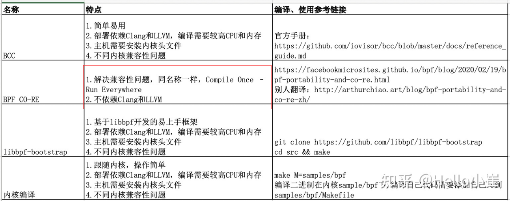

2022年计划分为三个大的部分

最重要的事！

如何权衡好工作和上班的时间规划，上班的时候好好工作，下班的时候

坚持把事情做下去！

坚持把事情做下去！

坚持把事情做下去！

减少保持每周一更的频率。

# 一、技术博客

技术博客是为视频提供辅助的，方便看视频的人结合技术博客，更好的理解内容。不同类型的技术博客，有不同种类的写法。

## 1、1 源代码分析类

**源代码分析类**的文章，应该何种方式来写？

示例：

## 1、2 代码实战类

**代码实战类**的文章，应该何种方式来写？

示例：https://geektutu.com/post/geecache.html

## 1、3 技术科普类

**技术科普类**的文章，应该何种方式来写？
示例： https://junedayday.github.io/2022/02/14/sharing-5min/2022-02/2022Week07/

# 二、视频教程

视频教程主要发在B站，或者发到知乎的视频专区。

## 2、1 做什么视频？

自己看到的值得分享的技术观点，以及平时碰到的实用的技术进行分享，并且有些功能，网上并没有相关的教程。

那么这时候为了更好的帮助初学者，我们需要把知识点对接下来。

1） 项目实战

2） 技术科普

3） 提升工作效率的工具

## 2、2 如何做好视频？

一方面是从模仿开始，看别人是如何视频讲解的；

另一方面是多锻炼，多思考，思考做的不好的地方进行改进。

### 值得学习的视频

https://www.bilibili.com/video/BV1V3411L7qu?spm_id_from=333.999.0.0

# 三、实战项目

优先级等级分为1、2、3三个等级，从小到大的依次等级升高。

| 内容                  | 优先级 | 进度 | 现在进度       |
| --------------------- | ------ | ---- | -------------- |
| 从零实现Docker        | 3      | 0%   | 等待拆解子任务 |
| 从零实现网络协议栈    | 2      | 0%   | 等待拆解子任务 |
| 处理issue和反馈的问题 |        |      |                |

## 3、1 从零实现docker

## 3、2 从零实现网络协议栈

此项目是有视频教程为参考的，但是写代码时还需自己多多debug调试。

视频已下载。

# 四、技术博客、视频、开源项目 社区建设

B站上视频，有一些错误之处有人指出，但是我却并没有去更改，其实应该积极地修复提出的问题，这样才能把事情越做越好。

# 五、ebpf学习

https://github.com/DavadDi/bpf_study

